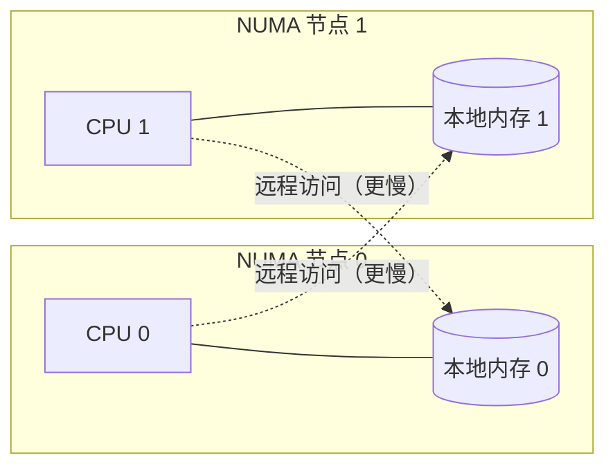

# 9.11 NUMA 感知与调度器的未来

前面各节描述的调度器有一个隐含假设：任何 M 访问内存的速度都一样快。在小规模机器上这无伤大雅，
可一旦放到大型多路服务器上，这个假设就不再成立。本节谈谈这道裂缝，以及 Go 调度器面向未来的
一处悬而未决的设计。

## 9.11.1 NUMA 带来的错配

现代多路服务器大多是 **NUMA（non-uniform memory access，非均匀访存）**架构：内存被分成若干
节点，每个 CPU 访问自己本地节点的内存很快，访问其他节点的内存则要慢上一截。从这个角度看，
一台 NUMA 机器更像一个内部就带着距离的小型分布式系统。

Go 当前的调度器对此一无所知。工作窃取（[9.2](./steal.md)）随机挑选目标 P，可能把一个 G
从它数据所在节点的核心，迁到另一个节点的核心上去运行，从此每次访存都付远程的代价；
内存分配也不保证落在运行该 G 的节点本地。也就是说，调度器是 **NUMA 无感**的。

## 9.11.2 一个没有落地的设计

针对这一点，Vyukov 在 2014 年提出过一份 NUMA 感知调度器的设计：把 P 按 NUMA 节点分组，
窃取与唤醒优先在本节点内进行，内存分配也尽量贴着本地节点，只有在本地确实无活可干时才跨节点
窃取。思路并不神秘，难的是落地。它要在调度的快路径上引入节点拓扑的概念，牵动运行队列、
窃取、内存分配器等多处，复杂度可观；而收益又高度依赖具体工作负载，并非人人受益。权衡之下，
官方判断这笔投入暂不划算，这份设计至今没有提上日程。

这件事本身很能说明 Go 的工程取向：一个理论上更优的设计，若以全局复杂度的显著上升为代价，
而收益又不普惠，那么"暂不做"也是一种负责任的决定。读者若确有 NUMA 局部性的诉求，目前更
现实的做法是在进程外解决，例如用 `numactl` / `taskset` 把进程绑定到特定节点，或在应用层做
数据与协程的分区。

## 9.11.3 未尽的课题

调度器自 GM 到 GMP 之后，骨架长期稳定，足见当初设计的功力。但核数仍在增长，超大规模并行下
全局结构（如全局队列、`sched.lock`）的争用、窃取的扩展性、以及上面说的 NUMA 局部性，都还是
活跃的关注点。它们未必会催生又一次"质变"，更可能是一系列渐进的打磨，正如 `runnext`（1.5）、
异步抢占（1.14）、容器感知的 `GOMAXPROCS`（1.25）那样，在不动骨架的前提下持续改良。

## 许可

&copy; 2018-2026 The [golang.design](https://golang.design) Initiative Authors. Licensed under [CC-BY-NC-ND 4.0](https://creativecommons.org/licenses/by-nc-nd/4.0/).
