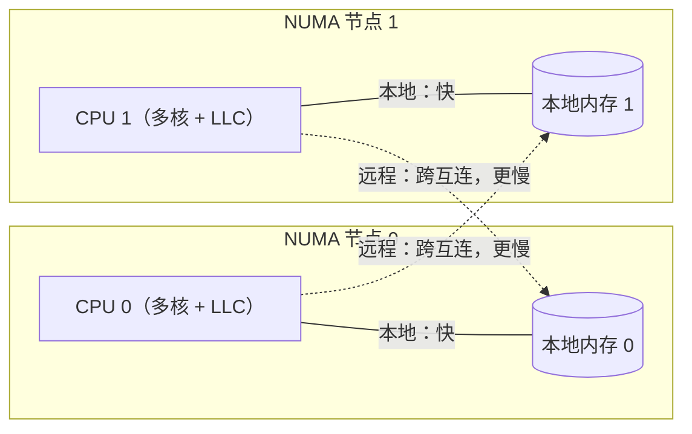

# 9.11 NUMA 感知与调度器的未来

> 本节内容对标 Go 1.26。

前面各节描述的调度器有一个从未明说的假设：任何 M 访问内存的速度都一样快，任何两个 P 之间
搬动一个 G 的代价都相同。在笔记本和单路服务器上，这个假设近乎成立。可一旦把程序放到大型
多路服务器上，它就开始失真，而且核数越多、失真越大。本节谈这道裂缝：它从何而来，Go 调度器
为何至今对它视而不见，一份曾被认真设计却没有落地的 NUMA 感知方案，以及今天的用户该如何
绕过去。

## 9.11.1 NUMA：内存不再是一块平地

早年的对称多处理（SMP）机器里，所有 CPU 经一条共享总线访问同一块内存，访存延迟与是哪个核
发起的无关。这种「一块平地」的内存模型简单，却随核数增长而失效：共享总线成了瓶颈，每多一个
核就多一分争用。**NUMA（non-uniform memory access，非均匀访存）** 是工业界给出的答案。
把机器拆成若干 **节点**（node），每个节点是一个 socket 加上直连在它身上的一片本地内存，
节点之间用片间互连（Intel 的 UPI、AMD 的 Infinity Fabric）连成一张网。CPU 访问本节点的
内存走最短路径，访问别节点的内存则要跨越互连，多一跳甚至多几跳。



代价是实打实的。本地与远程的访存延迟通常相差一到两倍，跨节点带宽也低于本地带宽，具体数字
随平台而变，可在 Linux 上用 `numactl --hardware` 读出节点拓扑与节点间的相对距离矩阵。
比延迟更隐蔽的是 **缓存一致性的开销**：当一个核要写一行被别的节点缓存着的数据时，一致性协议
（MESI 一族）要先让远端那份副本失效，这条「失效消息」也得跨互连往返。于是 NUMA 上的伪共享
（false sharing，[12.2](../../part4memory/ch12alloc/component.md)）比 SMP 上更疼：同一缓存行
被两个节点的核反复争夺，每次写都要付一次跨节点的一致性往返。

把这件事写成一个粗略的成本模型，更能看清它对调度的意义。设一个 G 在其生命周期里发起 $n$ 次
访存，其中比例 $r \in [0,1]$ 落在远程节点，本地与远程的单次延迟分别为 $t_l$ 与 $t_r$
（典型地 $t_r \approx 1.5 t_l \sim 2 t_l$），则它的访存总成本约为

$$
T(r) = n\big[(1-r)\,t_l + r\,t_r\big] = n\,t_l\Big[1 + r\big(\tfrac{t_r}{t_l} - 1\big)\Big].
$$

理想的 NUMA 局部性是 $r \to 0$，成本逼近 $n\,t_l$；最坏是数据与执行核分属两端、$r \to 1$，
成本翻到 $n\,t_r$。调度器的每一次跨节点迁移，做的正是把某个 G 的 $r$ 从近 0 推向更大的值。
对访存密集（$n$ 大）的负载，这笔账可观；对 I/O 密集、$n$ 本就小的负载，则几乎可以忽略。
这个简单的式子，已经预告了下文那份 NUMA 方案「收益高度依赖工作负载」的结论。

一句话，一台 NUMA 机器更像一个内部就带着距离的小型分布式系统。对运行其上的运行时来说，
「数据在哪个节点、执行它的核在哪个节点」不再是无关紧要的细节，而是直接写进延迟账单的一笔。

## 9.11.2 局部性：Go 运行时有它，却是无意得来的

读到这里读者或许会问：既然 NUMA 影响这么大，Go 运行时是怎么活下来的？答案是它确实享受着
相当一部分局部性，只不过这局部性是别的设计「顺手」带来的，而非冲着 NUMA 去的。

最重要的一处是 **每 P 一份的 mcache**（[9.3](./mpg.md)、[12.2](../../part4memory/ch12alloc/component.md)）。
一个 G 在某个 P 上分配的小对象，来自这个 P 的本地缓存；只要这个 G 后续仍在同一个 P（多半是
同一个核）上运行、仍碰它自己刚分配的对象，访存就大概率落在本地节点。工作窃取
（[9.2](./steal.md)）「优先跑本地运行队列、本地空了才去偷」的策略，同样隐含地倾向于让一个 G
连续在同一个 P 上推进。再加上 Linux 内核 CFS 调度器默认带的 CPU 亲和性，它不会无缘无故把一个
线程从一个核弹到另一个核，于是「G 待在原 P、原 P 待在原核、原核守着本地内存」这条链在多数
时候自然成立。

但「大概率」不是「保证」。这套局部性在三个地方会断：

- **工作窃取是拓扑无关的。** 偷 G 时，调度器在所有 P 里按一个伪随机顺序挨个试，挑中谁就偷谁，
  完全不看目标 P 在哪个节点。一旦把一个 G 从它数据所在节点的核偷到另一个节点的核上，这个 G
  接下来每次访问老数据都付远程的代价，而它新分配的对象又落到了新节点，局部性就此撕裂。
- **内存分配不绑节点。** mcache 见底时向 mcentral、mheap 补货（[12.2](../../part4memory/ch12alloc/component.md)），
  拿到的页来自全局堆，不保证落在当前 P 所在的节点。堆 arena 也没有按节点切分。
- **M、P 与节点没有绑定关系。** P 只是逻辑处理器，M 是哪个 OS 线程、跑在哪个核、属于哪个节点，
  运行时一概不记。

把这三点合起来，结论很直接：**Go 的调度器是 NUMA 无感（NUMA-oblivious）的。** 运行时源码里
找不到一处节点、socket 或互连距离的概念，工作窃取的目标选择是一个与拓扑无关的伪随机枚举：

```go
// 工作窃取的目标顺序：与 NUMA 拓扑完全无关（runtime/proc.go，速写）
//
// randomOrder 用「与 GOMAXPROCS 互质的步长」在所有 P 上做无重复的伪随机枚举：
// 若 X 与 count 互质，则 (i + X) % count 恰好遍历 0..count-1 一次。
func stealWork(now int64) (gp *g, ...) {
	pp := getg().m.p.ptr()
	const stealTries = 4
	for i := 0; i < stealTries; i++ {
		// 从一个随机位置起，按互质步长枚举全部 P。allp 里相邻的两个 P
		// 可能分属不同 NUMA 节点，这里既不知道、也不在乎。
		for enum := stealOrder.start(cheaprand()); !enum.done(); enum.next() {
			p2 := allp[enum.position()]
			if pp == p2 || idlepMask.read(enum.position()) {
				continue
			}
			if gp := runqsteal(pp, p2, /*stealRunNextG=*/...); gp != nil {
				return gp // 偷到就走，无论 p2 在近端还是远端节点
			}
		}
	}
	// ...
}
```

这是一个清醒的取舍，而非疏漏。下一节就讲，更「正确」的那条路，其实有人完整设计过。

## 9.11.3 一份设计完整却没有落地的方案

针对 NUMA，Dmitry Vyukov 在 2014 年提交过一份 NUMA 感知调度器的设计（golang/go#14406
的前身提案）。它的骨架沿用至今的 MPG（[9.3](./mpg.md)）没有推倒重来，而是在其上叠一层
节点拓扑：

- **P 按 NUMA 节点分组。** 运行时在启动时探测拓扑，把 P 划归各节点，让「同节点的 P」成为一个
  显式的集合。
- **窃取与唤醒先就近。** 一个 P 空闲找活时，先在本节点的兄弟 P 里偷；本节点确实没有可偷的，
  才升级到跨节点窃取。唤醒一个休眠的 M/P 时，同样优先唤醒本节点的，让相关的 G 尽量聚在一个
  节点里跑。
- **堆按节点本地化。** 内存分配尽量从当前 P 所在节点的本地内存出页，让 arena 与节点对齐，
  使「在哪个节点上分配、就在哪个节点上访问」成为常态而非巧合。

思路并不神秘，真正难的是落地。它要在调度的 **快路径** 上引入节点这个新维度，牵动运行队列的
组织、窃取与唤醒的策略、乃至内存分配器的出页逻辑（[12](../../part4memory/ch12alloc)），
全局复杂度的上升是显著且永久的：此后每一处碰调度或分配的改动，都要多想一层拓扑。而收益
高度依赖工作负载，访存密集、数据有清晰节点亲和性的程序受益明显，可大量 Go 服务是 I/O 密集、
G 寿命短、数据本就在节点间流动的，对它们这层机制近乎只增成本不见回报。权衡之下，官方判断
这笔投入在当时不划算，方案至今没有提上日程，也没有合并。

这件事值得和垃圾回收里的 **ROC（Request Oriented Collector，[13](../../part4memory/ch13gc)）**
并置来看。两者都是理论上更优、设计也已相当成熟、最终却选择「不做」的方案。它们共同勾出
Go 团队一以贯之的工程取向：一个更优的设计，若以全局复杂度的显著、持久上升为代价，而收益
又不普惠，那么「暂不采纳」本身就是一个负责任的决定。这条原则在本书里会反复出现，它不是
保守，而是把简单当作一种要长期偿还的资产来经营。

## 9.11.4 Go 今天靠什么，用户今天怎么办

既然运行时不管 NUMA，那这件事就被推到了它的上下两层：操作系统与用户。

运行时实际倚仗的，是这样几样「不必它操心」的机制。其一是 **OS 调度器的 CPU 亲和性**：Linux
CFS 默认不会随意迁移线程，M 多半能守在原核附近，前述的隐式局部性才得以维持。其二是
**透明大页（THP）**：运行时在 Linux 上对堆内存调用 `madvise(MADV_HUGEPAGE)`
（`runtime/mem_linux.go`），让内核尽量用大页支撑堆，减少 TLB miss，这虽不是冲着 NUMA 去的，
却顺带降低了访存的固定开销。其三就是上一节说的 **每 P 结构的隐式局部性**。三者叠加，让 Go
在没有任何 NUMA 代码的情况下，仍能在多路机器上跑出可用的性能。

需要更强 NUMA 局部性的用户，今天现实的做法是在 **进程外** 解决，而不是等运行时：

- **整进程绑定。** 用 `numactl --cpunodebind=0 --membind=0 ./server` 把整个进程钉在一个
  节点上，CPU 与内存都不出节点。代价是只用了机器的一部分，适合单进程吃不满整机的场景。
- **每节点一进程 + 分片。** 在每个 NUMA 节点上各起一个进程，各自绑定到本节点，并把
  `GOMAXPROCS` 设成该节点的核数，再在应用层按节点把数据与请求分片（sharding）。这等于
  在进程层面手工实现了「P 按节点分组」，是吃满大机器又保住局部性的常见架构。
- **线程级 pinning。** `taskset` 之类工具可把进程限定在某组核上。但要留意：Go 不暴露「把某个
  goroutine 钉在某个 OS 线程」的稳定接口，`runtime.LockOSThread` 只绑 G 与 M，不绑 M 与核，
  所以纯 goroutine 级的精细 pinning 在 Go 里并不顺手，往往得退回到「每节点一进程」的粗粒度。

换句话说，Go 把 NUMA 的责任明确交给了部署者：运行时给你一台「假装均匀」的机器，你用
`numactl` 和分片在它外面重新画出节点的边界。

## 9.11.5 未尽的课题

调度器自 GM 演进到 GMP（[9.3](./mpg.md)）之后，骨架长期稳定，足见当初设计的功力。但核数仍在
增长，单机上百核、多节点已不罕见，超大规模并行下的几处压力点始终是活跃的关注对象：全局结构
（全局队列、`sched.lock`）的争用、工作窃取的扩展性，以及本节的 NUMA 局部性。

NUMA 感知会不会回归核心？没有定论。倾向于它回归的理由是核数与节点数还在涨，隐式局部性能
兜住的工作负载比例在缩小；倾向于继续搁置的理由是云上「每节点一容器」的部署已经把问题在编排层
解决了，且容器感知的 `GOMAXPROCS`（Go 1.25）让「按 cgroup 配额跑」更顺，反而削弱了运行时
自己管拓扑的紧迫性。更可能的演进，仍是一系列不动骨架的渐进打磨，正如 `runnext`（1.5）、
异步抢占（1.14）、容器感知的 `GOMAXPROCS`（1.25）那样，在 MPG 框架内持续改良，而不是又一次
「质变」。NUMA 感知若真要回来，多半也会以「可选、就近、不破坏快路径」的克制形态回来，而非
当年那份大而全的方案。

## 延伸阅读的文献

1. Dmitry Vyukov. *NUMA-aware scheduler for Go.* Go design proposal, 2014.
   https://github.com/golang/go/issues/14406 （把 P 按节点分组、就近窃取、堆本地化的完整设计）
2. Dmitry Vyukov. *Scalable Go Scheduler Design Doc.* 2012.
   https://golang.org/s/go11sched （MPG 与工作窃取的原始设计，本节局部性讨论的起点）
3. Ulrich Drepper. *What Every Programmer Should Know About Memory.* Red Hat, 2007.
   https://www.akkadia.org/drepper/cpumemory.pdf （NUMA、缓存一致性与访存延迟的权威长文，第 5 节专讲 NUMA）
4. Christoph Lameter. *NUMA (Non-Uniform Memory Access): An Overview.* ACM Queue, 2013.
   https://queue.acm.org/detail.cfm?id=2513149 （节点拓扑、距离矩阵与 Linux NUMA 接口）
5. The Go Authors. *runtime/proc.go（`stealWork`、`randomOrder`）、runtime/mem_linux.go（`MADV_HUGEPAGE`）.*
   https://github.com/golang/go/tree/master/src/runtime （拓扑无关的工作窃取与透明大页的实现现状）
6. Linux man-pages project. *numactl(8)、numa(7)、set_mempolicy(2).*
   https://man7.org/linux/man-pages/man8/numactl.8.html （进程外做 NUMA 绑定的工具与系统调用）
7. 本书 [9.2 工作窃取式调度](./steal.md)、[9.3 MPG 模型](./mpg.md)、
   [12.2 分配器组件](../../part4memory/ch12alloc/component.md)、[13 垃圾回收（ROC 取舍）](../../part4memory/ch13gc).
