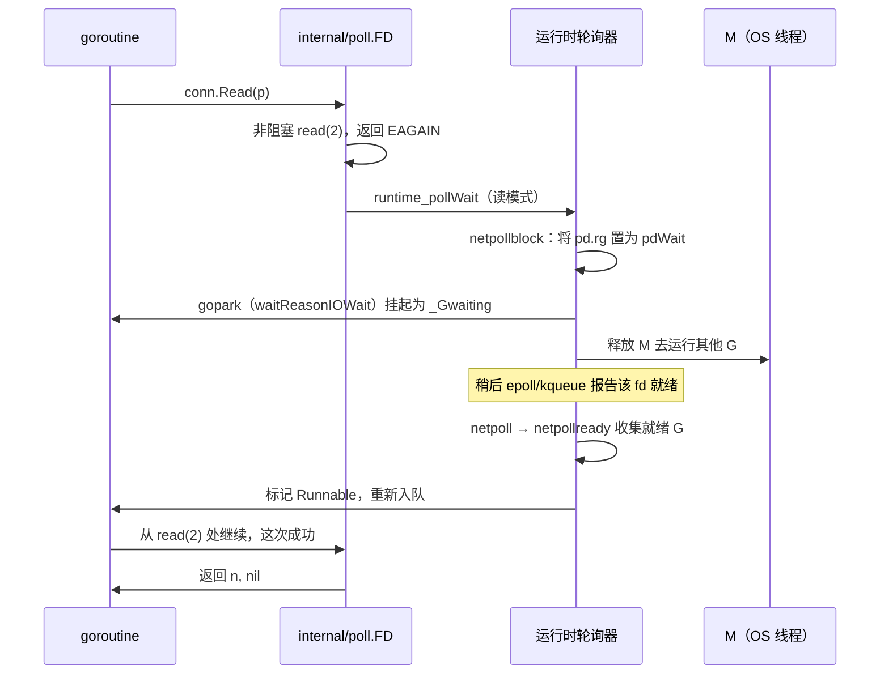
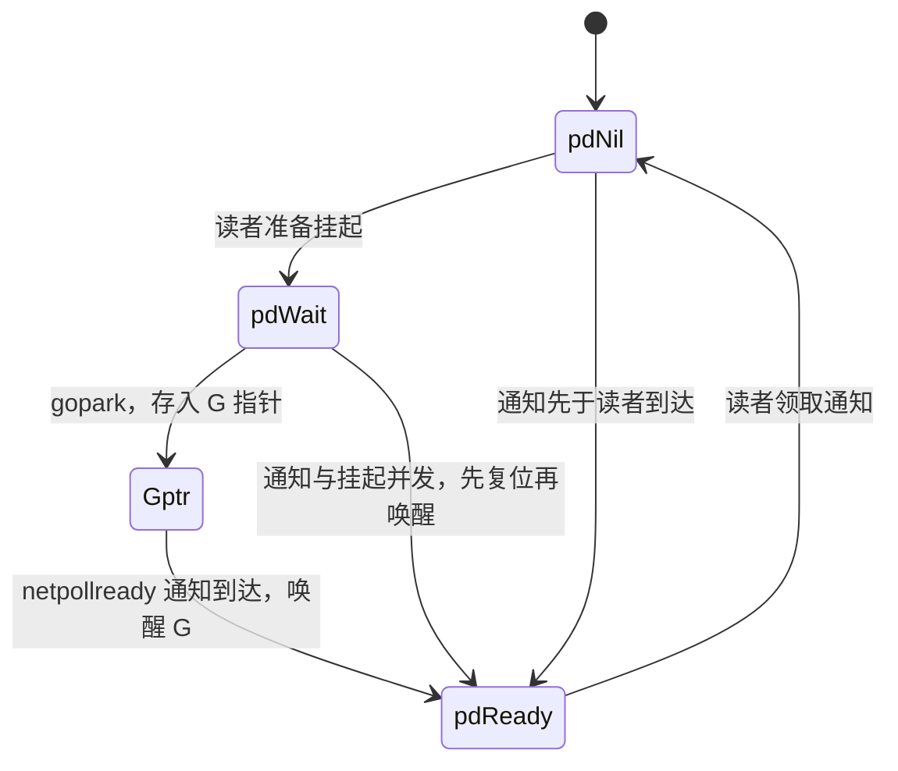

# 9.9 网络轮询器

> 源码事实核对自 `src/runtime/netpoll.go` 及各平台实现
> （`netpoll_epoll.go`、`netpoll_kqueue.go` 等）与 `src/internal/poll/fd_unix.go`。

Go 的网络代码看起来是阻塞式的：`conn.Read` 会「卡」在那里等数据。可如果它真卡住了所在的
操作系统线程，那么一万个等待网络的 goroutine 就要占用一万个线程，[9.1](./model.md) 苦心经营的
M:N 模型瞬间崩塌。让阻塞式写法仍能规模化的，是网络轮询器（netpoller）。它背后是一段关于
「如何用少数线程照看海量连接」的漫长历史，本节先把这段历史与它背后的设计轴讲清楚，
再看 Go 如何把成熟的事件机制藏进运行时，让你写同步代码、跑事件驱动的 I/O。

## 9.9.1 C10k 与就绪通知的演化

2000 年前后，Dan Kegel 提出了著名的 **C10k 问题**：一台服务器能否同时处理一万个并发连接？
他的论点是当时的硬件其实够用，瓶颈在软件的 I/O 策略。最朴素的「一连接一线程」模型撑不住：
每个线程预留以兆字节计的栈，一万个线程就是数 GB；加上内核在成千上万个线程间切换的开销，
调度器很快不堪重负。出路是**基于就绪的多路复用**：让少数线程照看大量 fd，只在某个 fd 就绪时
才去动它。

就绪通知机制本身也经历了演化。把代价写成大 O 最能看清这条主线。设并发连接数为 $n$，
某一刻就绪的连接数为 $k$（通常 $k \ll n$）：

- `select` / `poll`：**每次调用 $O(n)$**。调用方每次都要把整个 fd 集合交给内核，内核线性扫
  一遍标出就绪者，返回后调用方再扫一遍找出它们。集合本身在用户态与内核态间反复拷贝，
  连接一多，这种全量扫描与拷贝就成了瓶颈。
- `epoll`（Linux，Libenzi，开发版内核 2.5.44 / 2002，稳定版 2.6.0 / 2003）：兴趣集合通过
  `epoll_ctl` 在内核里**登记一次**并常驻，`epoll_wait` 只返回**就绪的**那些 fd，单次调用的
  代价是 $O(k)$。

> 一个常见的不精确说法是「epoll 是 $O(1)$」。更准确的表述是：登记的成本被 `epoll_ctl`
> 摊销，`epoll_wait` 的代价正比于**就绪事件数 $k$**，而非 fd 总数 $n$。正是这一点把
> `select`/`poll` 的「每调用 $O(n)$」改进成了「每调用 $O(k)$」，在 $k \ll n$ 的长连接场景里
> 是数量级的差距。

FreeBSD 的 **kqueue**（Lemon，USENIX FREENIX 2001）是同代的另一支，且更通用：不止管 socket，
还能监听文件、进程、信号、计时器，把多类事件源统一在 `kevent` 一个接口下。Windows 走的则是
另一条路线 IOCP。这里还有一对要紧的区别：

- **水平触发**（level-triggered）：只要 fd 上「还有数据可读」就**持续**报告，应用读多少都行。
- **边沿触发**（edge-triggered）：只在「由不就绪变为就绪」的跳变时报告**一次**，应用必须把
  数据一口气读干到 `EAGAIN`，否则下次就绪通知不会再来，残留的数据会被漏掉。

边沿触发减少了重复唤醒，代价是把「读干净」的责任压到应用身上。记住这对区别，下文会看到
Go 的一个反直觉选择正落在这里。

## 9.9.2 就绪还是完成：Reactor 与 Proactor

把上面这些排开，会看到一条根本的设计轴：

- **就绪模型**（`select`/`poll`、epoll、kqueue）：内核说「这个 fd 就绪了」，**由你**去做非阻塞 I/O。
- **完成模型**（Windows IOCP、Linux io_uring）：你说「把这段 I/O 做了，完成时通知我」，
  内核接管整个操作，你事先交出缓冲区、事后收割完成事件。

这正对应软件设计里的 **Reactor**（Schmidt，PLoPD 1995）与 **Proactor** 两种模式：前者在一个
同步事件解复用器（如 epoll）之上分发就绪事件、由应用做 I/O；后者在操作**完成**时才分发结果。
Linux 的 **io_uring**（Axboe，内核 5.1 / 2019）是完成模型的现代代表，用一对共享内存的环形队列
（提交队列 SQ 与完成队列 CQ）批量提交、批量收割，把系统调用次数压到极低。

| 维度 | 就绪模型（Reactor） | 完成模型（Proactor） |
| --- | --- | --- |
| 内核告诉你 | 「可以做 I/O 了」 | 「I/O 已经做完了」 |
| 缓冲区 | 就绪后才交出，临时即可 | 提交时就交出，需钉住 | 
| 代表 | epoll、kqueue | IOCP、io_uring |
| 谁来做拷贝 | 应用（一次非阻塞读写） | 内核 |

**Go 目前并不使用 io_uring**：它的 Linux 轮询器仍走 epoll（见 [9.9.5](#995-平台实现边沿触发与调度衔接)），
理由留到 [9.9.7](#997-文件为何不走轮询器以及前沿) 的前沿一节。

## 9.9.3 Go 的做法：把「阻塞」翻译成「挂起」

诀窍在于：对用户呈现阻塞语义，对底层却用非阻塞 I/O 加事件通知。当一个 goroutine 在 socket 上
读取而数据尚未到达时，运行时并不让线程干等，而是把 fd 设为非阻塞、注册到事件机制，然后
**挂起这个 goroutine**，把 M 解放出去运行别的 G；等事件机制报告该 fd 就绪，再把这个 goroutine
唤醒，让它从原地继续读。



落到运行时里，`internal/poll.FD` 是 `net`/`os` 与运行时轮询器之间的桥。`FD.Read` 的核心是
一个循环：先发非阻塞系统调用，遇 `EAGAIN` 就去等就绪，醒来再 `continue` 重试：

```go
// internal/poll/fd_unix.go：FD.Read 的设计骨架（裁剪）
func (fd *FD) Read(p []byte) (int, error) {
    // ...加读锁、准备 pollDesc...
    for {
        n, err := ignoringEINTRIO(syscall.Read, fd.Sysfd, p)
        if err != nil {
            n = 0
            // 非阻塞读没数据，且该 fd 由轮询器托管：去等就绪，醒来重试
            if err == syscall.EAGAIN && fd.pd.pollable() {
                if err = fd.pd.waitRead(fd.isFile); err == nil {
                    continue
                }
            }
        }
        return n, fd.eofError(n, err)
    }
}
```

`waitRead` 经一层 `runtime_pollWait` 进入运行时的 `netpollblock`。这里有一处值得看清的设计：
park 之前先把信号量 `pd.rg` 从 `pdNil` 抢到 `pdWait`，再在持锁复查错误状态后才真正
`gopark`，等待原因记为 `waitReasonIOWait`。这套先占位、复查、再挂起的次序，是为了不丢失与
park **并发到达**的就绪通知：

```go
// runtime/netpoll.go：netpollblock 的设计骨架（裁剪）
func netpollblock(pd *pollDesc, mode int32, waitio bool) bool {
    gpp := &pd.rg
    if mode == 'w' {
        gpp = &pd.wg
    }
    for {
        if gpp.CompareAndSwap(pdReady, pdNil) {
            return true // 通知已先到，无需挂起
        }
        if gpp.CompareAndSwap(pdNil, pdWait) {
            break       // 占位成功，准备挂起
        }
        // 否则状态被并发改动，重试
    }
    // 复查错误后才真正让出，把 G 变为 _Gwaiting，M 随即被释放
    if waitio || netpollcheckerr(pd, mode) == pollNoError {
        gopark(netpollblockcommit, unsafe.Pointer(gpp), waitReasonIOWait, traceBlockNet, 5)
    }
    // ...醒来后清理信号量、返回是否真的就绪...
}
```

fd 就绪时，平台 `netpoll` 把内核事件翻译成读/写模式，调 `netpollready` 把对应的等待者
摘出来，串进一个 `gList` 返回给调度器重新注入运行队列（[9.3](./mpg.md)、[9.4](./schedule.md)）。
于是，成千上万个「阻塞」在网络上的 goroutine，实际只消耗极少的线程，等待的成本落在了内核的
事件表上。你写的是同步代码，跑的是事件驱动的 I/O。

## 9.9.4 pollDesc：每个 fd 的就绪状态机

把读写两端的等待状态承载起来的，是 `pollDesc`：每个被轮询的 fd 对应一个，从专用的
`pollcache`（一条 `fixalloc` 风格的自由表）里分配，不在 GC 堆上。它的设计相关字段是两组对称的
读 / 写状态：

```go
// runtime/netpoll.go：pollDesc 的设计相关字段（裁剪）
type pollDesc struct {
    fd  uintptr        // 关联的文件描述符，生命周期内恒定

    // rg、wg 是两个二值信号量，分别 park 读者与写者 goroutine。
    // 取值：pdReady（就绪通知待领取）/ pdWait（准备挂起）/ G 指针（已挂起）/ pdNil
    rg  atomic.Uintptr
    wg  atomic.Uintptr

    lock mutex          // 保护以下字段
    rt   timer          // 读截止计时器
    rd   int64          // 读截止时间（未来某个 nanotime，过期为 -1）
    wt   timer          // 写截止计时器
    wd   int64          // 写截止时间
}
```

`rg`/`wg` 是整套机制的枢纽，它们既是「谁在等」的记录（存 G 指针），也是「是否已就绪」的标志
（`pdReady`），还是 park 前的占位（`pdWait`）。四个状态在读者、I/O 通知、超时、关闭四方之间
靠原子操作流转：



`rt`/`wt` 这对计时器服务于截止时间。`SetReadDeadline` 把 `rd` 设到未来某刻并装好 `rt`；
到点时计时器回调走 `netpollunblock` 把等待者以「超时」错误唤醒。这正是
`SetDeadline`（[9.10](./timer.md)）与轮询器的接缝：超时不是另起一套机制，而是复用同一个
`pollDesc` 上内嵌的读、写计时器。

## 9.9.5 平台实现、边沿触发与调度衔接

轮询器对每个操作系统采用其原生机制，封装在一组统一的、由各平台文件实现的函数之后：

```go
// runtime/netpoll.go：每个平台需实现的接口（注释摘要）
//   netpollinit()                              // 初始化轮询器
//   netpollopen(fd uintptr, pd *pollDesc) int32 // 注册 fd，为其装上边沿触发通知
//   netpoll(delta int64) (gList, int32)        // 取就绪事件，经 netpollready 收集 G
//   netpollclose(fd uintptr) int32             // 注销 fd
```

Linux 是 `netpoll_epoll.go`（epoll），BSD 与 macOS 是 `netpoll_kqueue.go`（kqueue），
Windows 是 `netpoll_windows.go`（IOCP），另有 solaris、aix、wasip1 等。

一个值得澄清的源码事实：**Go 的 epoll 与 kqueue 都用边沿触发**。`netpoll_epoll.go` 注册时
事件掩码带 `EPOLLET`，`netpoll_kqueue.go` 注册时带 `EV_CLEAR`，平台无关层接口注释也明写着
「为 fd 装上边沿触发通知」（Arm edge-triggered notifications for fd）：

```go
// runtime/netpoll_epoll.go：注册一个 fd（裁剪）
ev.Events = linux.EPOLLIN | linux.EPOLLOUT | linux.EPOLLRDHUP | linux.EPOLLET
//                                                              ^^^^^^^^^ 边沿触发

// runtime/netpoll_kqueue.go：以 EV_CLEAR 装上读写两个过滤器（裁剪）
ev[0].flags = _EV_ADD | _EV_CLEAR // EV_CLEAR 即 kqueue 的边沿触发语义
```

这与「Go 用水平触发 epoll」的常见臆测相反。选边沿触发是为了减少重复唤醒：一次就绪只通知
一次，避免 fd 一直可读时反复把 G 唤醒。代价是必须把数据读干到 `EAGAIN`，而这个易错的负担
恰好被 [9.9.3](#993-go-的做法把阻塞翻译成挂起) 那个「`EAGAIN` 才 park、醒来 `continue` 重试」
的循环天然承担了，对用户透明。

就绪的 goroutine 通过三条途径回到运行队列：

- **调度循环主动轮询**：`findRunnable`（[9.4](./schedule.md)）找不到本地与全局工作时会
  `netpoll`，既有非阻塞的顺手一查，也有在确实没活时**阻塞式** `netpoll(delay)` 直到有事件或
  计时器到期，由它代替 M 空转。
- **系统监控补查**：`sysmon`（[9.8](./sysmon.md)）发现网络超过约 **10ms**（源码即
  `lastpoll+10*1000*1000 < now`）没被轮询，就非阻塞 `netpoll(0)` 补一次，把就绪 G 注入，
  兜住所有 P 都在忙、没人轮询的窗口。
- **计时器到期**：带截止时间的读写靠 `pollDesc` 的 `rt`/`wt` 在到点时唤醒等待者
  （[9.10](./timer.md)）。

## 9.9.6 别家怎么做

把 Go 放进异步 I/O 的谱系，它的特别之处就清楚了。

- **Node.js / libuv**：单线程的 Reactor 事件循环，网络 I/O 用 epoll/kqueue/IOCP 多路复用；
  而文件没有可移植的就绪原语，于是 libuv 把阻塞式文件操作丢到一个线程池（默认 4 个）。
  这与 Go「socket 走轮询器、文件走线程」的结构惊人地相似。
- **Java NIO / Netty**：`Selector` 是 Reactor，按平台选 epoll/kqueue/IOCP 提供者；Netty 在其上
  叠了一层显式 handler 的 Reactor（`NioEventLoop`），其原生 Linux 传输 `EpollEventLoop` 则是
  边沿触发，与 Go 的选择一致。
- **Rust tokio**：I/O 驱动建立在 `mio`（epoll/kqueue/IOCP 的跨平台抽象）之上，把 OS 事件翻译成
  对 `Future` 任务的唤醒，由 `async/await` 串起调用栈。
- **Erlang/BEAM**：同样把 I/O 轮询融入运行时，但需澄清：OTP 21（2018）起 BEAM 默认改用
  **专门的 I/O 轮询线程**，而非由调度器线程亲自送达事件，「像 Go 那样调度器集成轮询」是其
  历史形态而非如今的默认。

它们的共性是把 Reactor **暴露给用户**：回调（Node）、Future（Rust）、handler（Netty）。
Go 的独到之处，是把 Reactor 藏在运行时底下，对用户只呈现同步阻塞的代码：你既不写回调，
也不写 `async/await`。这是用一点点事件循环的原始效率，换取「一连接一 goroutine」的书写顺手。

## 9.9.7 文件为何不走轮询器，以及前沿

并非所有 I/O 都能走轮询器。普通磁盘文件在多数平台上**不能**被 epoll 监听：对普通文件
`epoll_ctl` 会失败，而且它几乎「永远就绪」，就绪通知对它没有意义（注意 [9.9.3](#993-go-的做法把阻塞翻译成挂起)
那段 `FD.Read` 里的 `fd.pd.pollable()` 判断，正是在此分流）。所以 Go 对文件的「阻塞」读写
仍用阻塞系统调用，并通过另设线程兜底：当这类调用长时间卡住一个 M，`sysmon` 会把 P 摘下交给
别的 M（[9.5](./thread.md)）。这也解释了一个常见现象：大量并发网络连接几乎不增加线程数，
而大量并发的阻塞式文件 I/O 却可能让线程数上涨。

前沿仍有张力。epoll 自身有惊群（多个等待者抢同一个 fd）等老问题，需 `EPOLLEXCLUSIVE`、
`SO_REUSEPORT` 等缓解；它的接口语义与边沿/水平的微妙之处也长期为人诟病。io_uring 的完成模型
在吞吐与延迟上很诱人，但它要求应用预先交出并钉住缓冲区、管理在途操作的所有权，这与 Go
「缓冲区随手在栈/堆上、每个 goroutine 一次一操作」的同步模型并不契合，这正是把 io_uring 直接
塞进 Go 轮询器并不容易的根本原因。社区早有提案（golang/go#31908，「透明支持 io_uring」，
仍处 open/调查中），第三方库也存在，但标准库至今没有替换 epoll 的计划。

性能的提升从不白来。归根到底，Go 选择了「一连接一 goroutine」的人体工学，宁可在原始性能上
让出一点，也要让网络代码读起来像顺序程序，这与本章一以贯之的取向一致。

## 延伸阅读的文献

1. Dan Kegel. *The C10K problem.* 1999-2014. http://www.kegel.com/c10k.html
2. Jonathan Lemon. "Kqueue: A Generic and Scalable Event Notification Facility."
   *USENIX ATC (FREENIX track) 2001*, pp. 141-153.
   https://people.freebsd.org/~jlemon/papers/kqueue.pdf
3. Davide Libenzi. *Improving (network) I/O performance ... (epoll).* 2002.
   http://www.xmailserver.org/linux-patches/nio-improve.html
4. Douglas C. Schmidt. "Reactor: An Object Behavioral Pattern for Concurrent Event
   Demultiplexing and Event Handler Dispatching." *PLoPD vol. 1*, 1995.
   https://www.dre.vanderbilt.edu/~schmidt/PDF/Reactor.pdf
5. Jens Axboe. *Efficient IO with io_uring*（Linux 5.1）, 2019. https://kernel.dk/io_uring.pdf
6. libuv. *Design overview / Thread pool.* https://docs.libuv.org/en/v1.x/design.html
7. Erlang/OTP. *I/O Polling options in OTP 21*, 2018. https://blog.erlang.org/IO-Polling/
8. golang/go#31908. *internal/poll: transparently support new linux io_uring interface.*
   https://github.com/golang/go/issues/31908
9. The Go Authors. *runtime/netpoll.go、netpoll_epoll.go、netpoll_kqueue.go、
   internal/poll/fd_unix.go.* https://github.com/golang/go/tree/master/src/runtime
