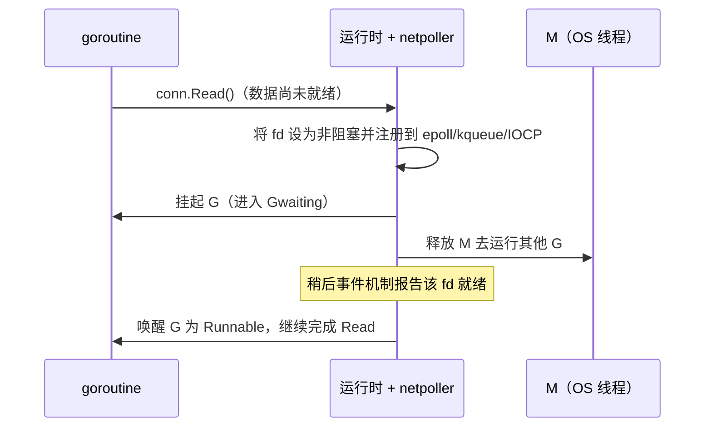

# 9.9 网络轮询器

Go 的网络代码看起来是阻塞式的：`conn.Read` 会"卡"在那里等数据。可如果它真卡住了所在的
操作系统线程，那么一万个等待网络的 goroutine 就要占用一万个线程，[9.1](./model.md) 苦心经营的
M:N 模型瞬间崩塌。让阻塞式写法仍能规模化的，是网络轮询器（netpoller）。它背后是一段关于
"如何用少数线程照看海量连接"的漫长历史。

## 9.9.1 C10k 与就绪通知的演化

2000 年前后，Dan Kegel 提出了著名的 **C10k 问题**：一台服务器能否同时处理一万个并发连接？
他的论点是当时的硬件其实够用，瓶颈在软件的 I/O 策略。最朴素的"一连接一线程"模型撑不住:
每个线程预留以兆字节计的栈，一万个线程就是数 GB，加上内核调度成千上万个线程的切换开销，
很快不堪重负。出路是**基于就绪的多路复用**：让少数线程照看大量 fd，只在某个 fd 就绪时才动它。

就绪通知机制本身也经历了演化。早期的 `select` 与 `poll` 是 **每次调用 $O(n)$**:调用方每次都要
把整个 fd 集合交给内核，内核线性扫一遍，返回后调用方再扫一遍找出就绪的。连接一多，这种
反复全量扫描就成了瓶颈。Linux 的 **epoll**（Libenzi，开发版内核 2.5.44 / 2002，稳定版 2.6.0 /
2003）改变了游戏：兴趣集合通过 `epoll_ctl` 在内核里**登记一次**，`epoll_wait` 只返回**就绪的**
那些 fd。

> 一个常见的不精确说法是"epoll 是 $O(1)$"。更准确的表述是：登记被 `epoll_ctl` 摊销，
> `epoll_wait` 的代价正比于**就绪事件数**，而非 fd 总数,这才是它相对 `select`/`poll` 的
> $O(n)$ 每调用的根本改进。

FreeBSD 的 **kqueue**（Lemon，USENIX FREENIX 2001）是同代的另一支，且更通用,不止管 socket，
还能监听文件、进程、信号、计时器。Windows 走的则是另一条路线 IOCP。这里还有一对要紧的
区别：**水平触发**（level-triggered，只要还有数据就持续报告）与**边沿触发**（edge-triggered，
只在"变为就绪"的跳变时报告一次，应用必须把数据读干到 `EAGAIN`，否则可能漏掉）。

## 9.9.2 就绪还是完成

把上面这些排开，会看到一条根本的设计轴：

- **就绪模型**（`select`/`poll`、epoll、kqueue）：内核说"这个 fd 就绪了"，**由你**去做非阻塞 I/O。
- **完成模型**（Windows IOCP、Linux io_uring）：你说"把这段 I/O 做了，完成时通知我"，
  内核接管整个操作，你事先交出缓冲区、事后收割完成事件。

这正对应软件设计里的 **Reactor**（Schmidt，PLoPD 1995）与 **Proactor** 两种模式：前者在同步
解复用器（如 epoll）之上分发、由应用做 I/O；后者在操作**完成**时分发。Linux 的 **io_uring**
（Axboe，内核 5.1 / 2019）是完成模型的现代代表，用一对共享内存环形队列（提交队列与完成队列）
批量提交、批量收割，大幅减少系统调用。**Go 目前并不使用 io_uring**:它的 Linux 轮询器仍走
epoll（见下文），原因留到前沿一节。

## 9.9.3 Go 的做法：把"阻塞"翻译成"挂起"

诀窍在于：对用户呈现阻塞语义，对底层却用非阻塞 I/O 加事件通知。当一个 goroutine 在 socket 上
读取而数据尚未到达时，运行时并不让线程干等，而是把 fd 设为非阻塞、注册到事件机制，然后
**挂起这个 goroutine**，把 M 解放出去运行别的 G;等事件机制报告该 fd 就绪，再把这个 goroutine
唤醒，让它从原地继续读。

落到运行时里：`internal/poll.FD` 是 `net`/`os` 与运行时轮询器之间的桥。`FD.Read` 先发非阻塞
系统调用，遇 `EAGAIN` 就调 `runtime_pollWait`,后者经 `netpollblock` 把当前 goroutine 用
`gopark`（等待原因 `waitReasonIOWait`）挂起为 **`_Gwaiting`**（[9.3](./mpg.md)），M 随即被释放。
fd 就绪时，平台 `netpoll` 把事件翻译成读/写模式，经 `netpollready` 返回一串现在可运行的
goroutine 列表，重新注入运行队列。于是，成千上万个"阻塞"在网络上的 goroutine，实际只消耗
极少的线程，等待的成本落在了内核的事件表上。你写的是同步代码，跑的是事件驱动的 I/O。

## 9.9.4 平台实现、边沿触发与调度衔接

轮询器对每个操作系统采用其原生机制，封装在统一接口之后（`netpollinit` / `netpollopen` /
`netpoll` 等）：Linux 是 `netpoll_epoll.go`（epoll），BSD 与 macOS 是 `netpoll_kqueue.go`
（kqueue），Windows 是 `netpoll_windows.go`（IOCP），另有 solaris、aix、wasip1 等。

一个值得澄清的源码事实：**Go 的 epoll 与 kqueue 都用边沿触发**,`netpoll_epoll.go` 注册时带
`EPOLLET`，`netpoll_kqueue.go` 用 `EV_CLEAR`，平台无关层的注释也写着"为 fd 装上边沿触发
通知"。这与"Go 用水平触发 epoll"的常见臆测相反。选边沿触发是为了减少重复唤醒，代价是必须
把数据读干到 `EAGAIN`,而这个易错的负担由运行时内部承担，对用户透明。

就绪的 goroutine 通过三条途径回到运行队列：调度循环 `findRunnable` 每轮顺手 `netpoll`
（[9.4](./schedule.md)）；系统监控在网络超过约 **10ms** 没被轮询时补查一次（[9.8](./sysmon.md)）；
以及计时器到期,带截止时间的读写（`SetDeadline`）正是靠 `pollDesc` 里内嵌的读、写两个计时器
（[9.10](./timer.md)）实现超时唤醒。

## 9.9.5 别家怎么做

把 Go 放进异步 I/O 的谱系，它的特别之处就清楚了。

- **Node.js / libuv**：单线程的 Reactor 事件循环，网络 I/O 用 epoll/kqueue/IOCP 多路复用;
  而文件没有可移植的就绪原语，于是 libuv 把阻塞式文件操作丢到一个线程池（默认 4 个）。
  这与 Go"socket 走轮询器、文件走线程"的结构惊人地相似。
- **Java NIO / Netty**：`Selector` 是 Reactor，按平台选 epoll/kqueue/IOCP 提供者;Netty 在其上
  叠了一层显式 handler 的 Reactor（`NioEventLoop`），其原生 Linux 传输 `EpollEventLoop` 则是
  边沿触发。
- **Rust tokio**：I/O 驱动建立在 `mio`（epoll/kqueue/IOCP 的跨平台抽象）之上，把 OS 事件翻译成
  对 `Future` 任务的唤醒。
- **Erlang/BEAM**：同样把 I/O 轮询融入运行时,但需澄清，OTP 21（2018）起 BEAM 默认改用
  **专门的 I/O 轮询线程**，而非由调度器线程亲自送达事件，"像 Go 那样调度器集成轮询"是其历史
  形态而非如今的默认。

它们的共性是把 Reactor **暴露给用户**:回调（Node）、Future（Rust）、handler（Netty）。
Go 的独到之处，是把 Reactor 藏在运行时底下，对用户只呈现同步阻塞的代码,你既不写回调，
也不写 `async/await`。这是用一点点事件循环的原始效率，换取"一连接一 goroutine"的书写顺手。

## 9.9.6 文件为何不走轮询器，以及前沿

并非所有 I/O 都能走轮询器。普通磁盘文件在多数平台上**不能**被 epoll 监听（对普通文件
`epoll_ctl` 会失败，且它几乎"永远就绪"，就绪通知对它没有意义）。所以 Go 对文件的"阻塞"读写
仍用阻塞系统调用，并通过另设线程兜底:当这类调用长时间卡住一个 M，`sysmon` 会把 P 摘下交给
别的 M（[9.5](./thread.md)）。这也解释了一个常见现象,大量并发网络连接几乎不增加线程数，
而大量并发的阻塞式文件 I/O 却可能让线程数上涨。

前沿仍有张力。epoll 自身有惊群（多个等待者抢同一个 fd）等老问题，需 `EPOLLEXCLUSIVE`、
`SO_REUSEPORT` 等缓解。io_uring 的完成模型在吞吐与延迟上很诱人，但它需要应用预先交出并钉住
缓冲区、管理在途操作的所有权,这与 Go"缓冲区随手在栈/堆上、每个 goroutine 一次一操作"的
同步模型并不契合，这正是把 io_uring 直接塞进 Go 轮询器并不容易的根本原因。社区早有提案
（golang/go#31908，"透明支持 io_uring"，仍处 open/调查中），第三方库也存在，但标准库至今没有
替换 epoll 的计划。归根到底，Go 选择了"一连接一 goroutine"的人体工学，宁可在原始性能上让出
一点，也要让网络代码读起来像顺序程序,这与本章一以贯之的取向一致。

## 延伸阅读的文献

1. Dan Kegel. *The C10K problem.* 1999-2014. http://www.kegel.com/c10k.html
2. Jonathan Lemon. "Kqueue: A Generic and Scalable Event Notification Facility."
   *USENIX ATC (FREENIX track) 2001*, pp. 141-153.
   https://people.freebsd.org/~jlemon/papers/kqueue.pdf
3. Douglas C. Schmidt. "Reactor: An Object Behavioral Pattern for Concurrent Event
   Demultiplexing and Event Handler Dispatching." *PLoPD vol. 1*, 1995.
   https://www.dre.vanderbilt.edu/~schmidt/PDF/Reactor.pdf
4. Jens Axboe. *Efficient IO with io_uring*（Linux 5.1）, 2019. https://kernel.dk/io_uring.pdf
5. libuv. *Design overview / Thread pool.* https://docs.libuv.org/en/v1.x/design.html
6. Erlang/OTP. *I/O Polling options in OTP 21*, 2018. https://blog.erlang.org/IO-Polling/
7. golang/go#31908. *internal/poll: transparently support new linux io_uring interface.*
   https://github.com/golang/go/issues/31908

## 许可

&copy; 2018-2026 The [golang.design](https://golang.design) Initiative Authors. Licensed under [CC-BY-NC-ND 4.0](https://creativecommons.org/licenses/by-nc-nd/4.0/).
