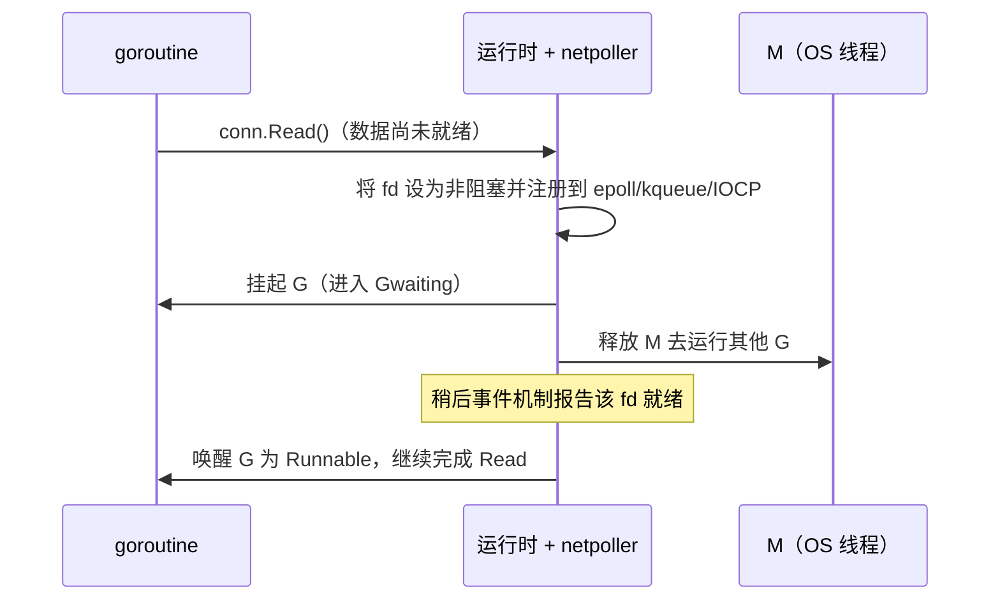

# 9.9 网络轮询器

Go 的网络代码看起来是阻塞式的：`conn.Read` 会"卡"在那里等数据。可如果它真的卡住了所在的
操作系统线程，那么一万个等待网络的 goroutine 就要占用一万个线程，[9.1](./model.md) 苦心经营的
M:N 模型瞬间崩塌。让阻塞式写法仍能规模化的，是网络轮询器（netpoller）。

## 9.9.1 把"阻塞"翻译成"挂起"

诀窍在于：对用户呈现阻塞语义，对底层却用非阻塞 I/O 加事件通知。当一个 goroutine 在 socket 上
读取而数据尚未到达时，运行时并不让线程干等，而是把这个 fd 设为非阻塞、注册到操作系统的事件
机制里，然后**挂起这个 goroutine**（转入 Gwaiting，[9.3](./mpg.md)），把 M 解放出来去运行别的 G。
等事件机制报告该 fd 就绪，运行时再把这个 goroutine 唤醒为 Runnable，让它从原地继续读下去。

于是，成千上万个"阻塞"在网络上的 goroutine，实际只消耗极少的线程，等待的成本落在了内核的
事件表上，而非线程上。你写的是同步代码，跑的是事件驱动的 I/O，两者的鸿沟被运行时悄悄填平。

## 9.9.2 与平台和调度器的衔接

轮询器对每个操作系统采用其原生的高效事件机制：Linux 上是 `epoll`，BSD 与 macOS 上是 `kqueue`，
Windows 上是 IOCP，各自封装在运行时的 `netpoll_*` 实现里，对上提供统一的接口。就绪的
goroutine 通过两条途径回到运行队列：调度循环每轮顺手调用 `netpoll`（[9.4](./schedule.md)），
以及系统监控在网络长时间无人轮询时补查一次（[9.8](./sysmon.md)）。轮询器还与计时器协作，
为带截止时间的读写（`SetDeadline`）提供超时唤醒，这部分见 [9.10 计时器](./timer.md)。

需要说明的是，这套机制服务于实现了 `internal/poll` 的可轮询对象，网络连接是最典型的一类；
普通磁盘文件在多数平台上并不走轮询器，对它们的"阻塞"读写仍可能占住线程，运行时通过另设
线程来兜底。这也解释了一个常见现象：大量并发网络连接几乎不增加线程数，而大量并发的阻塞式
文件 I/O 却可能让线程数上涨。

## 许可

&copy; 2018-2026 The [golang.design](https://golang.design) Initiative Authors. Licensed under [CC-BY-NC-ND 4.0](https://creativecommons.org/licenses/by-nc-nd/4.0/).
