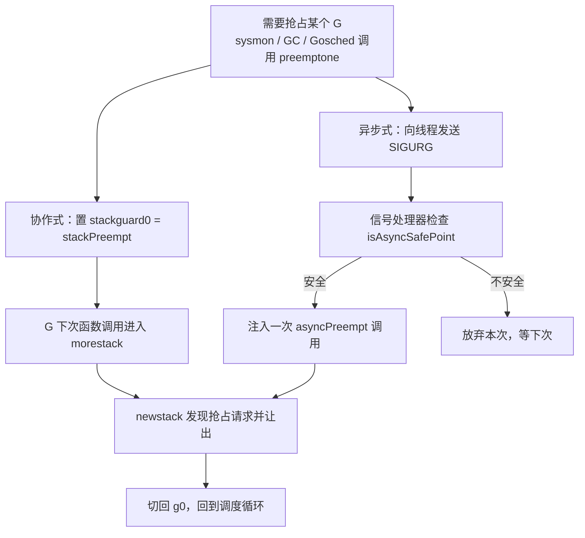

# 9.7 协作与抢占

我们在 [9.4 调度循环](./schedule.md) 留下一个问题：如果某个 G 迟迟不让出 CPU，别的 G 怎么办？
更尖锐的是垃圾回收：它的某些阶段需要让**所有** goroutine 都停到一个安全的位置（stop-the-world），
只要有一个 G 赖着不停，整个程序就卡住了。让出 CPU 这件事，于是有了两种思路。

**协作式**调度依靠被调度方主动弃权，**抢占式**调度则由调度器强行中断。两者在调度理论里早有
充分研究。Go 运行时并不具备内核那样的硬件中断能力，它的工作窃取调度本质上是协作式的；
为了不让协作式的「赖着不走」拖垮响应时间与 GC，Go 一路演进出了从协作到（准）抢占的一整套机制。

## 9.7.1 协作式：在函数调用处让权

Go 协作式抢占的巧妙之处，在于它搭了个现成的便车：**栈增长检查**。编译器会在几乎每个函数的
开头插入一小段序言，比较当前栈指针与 `g.stackguard0`，以判断栈是否需要扩张。运行时想抢占
某个 G 时，并不直接打断它，而是把它的 `stackguard0` 改写成一个特殊哨兵值 `stackPreempt`。
这样，该 G **下一次发生函数调用**时，序言里的检查就会"失败"，陷入运行时的 `morestack` →
`newstack`；`newstack` 一看是抢占请求（而非真要扩栈），就让这个 G 让出，切回 `g0` 重新调度。

主动让权也走类似的路。`runtime.Gosched` 让当前 G 把自己放回全局队列并立即让出，是用户显式
说一声"我先歇歇，让别人跑"。

这套机制省事，却有一个致命的盲区：**它只在函数调用处生效**。一段不含任何函数调用的紧致循环
（典型如纯数值计算的 `for` 循环，乃至 `for {}`），序言检查永远没有机会执行，`stackPreempt`
哨兵便永远不被看到，这个 G 就成了打不断的钉子户。在 Go 1.14 之前，这正是一类经典故障：
一个忙等的循环能让 GC 的 stop-the-world 无限期挂起，把本应几毫秒的停顿拖成几秒甚至卡死。

## 9.7.2 异步抢占：给循环装上刹车（Go 1.14）

要打断一个不调用任何函数的循环，只能从外部强行中断它，这就需要操作系统信号。Go 1.14 引入了
**异步抢占**：运行时向目标线程发送一个信号（选用 `SIGURG`，因为调试器会放行它、libc 极少用它、
程序本就该容忍偶发的 `SIGURG`），信号处理器在被打断的位置注入一次对 `asyncPreempt` 的调用，
从而把控制权夺回运行时。这样，哪怕循环里一个函数都不调，也能被抢占。

真正困难的不是发信号，而是**在任意一条指令处停下后，垃圾回收还能不能看懂这个 G 的栈与寄存器**。
协作式抢占之所以容易，是因为它只在函数调用这种"安全点"停下，编译器为这些点备好了精确的
指针位置图（栈映射）。而异步抢占可能停在任意指令上，那里未必有精确的映射。Austin Clements
为此提出过两套方案：一套是**到处都设安全点**，即让编译器为几乎每条指令都生成精确映射，
代价是二进制显著变大；另一套是**保守地扫描内层栈帧**。最终落地的是后者。

> 这是关于异步抢占最容易被讲错的一点：Go 1.14 采用的并不是"为每条指令生成精确寄存器映射"。
> 它的做法是，被异步打断的那一个最内层栈帧，按**保守**方式扫描（凡是看起来像指针的都当作
> 指针，宁可多留不可错放），而外层那些停在真正调用点上的栈帧，仍用精确映射。保守扫描的
> 不精确被牢牢限制在一个栈帧之内，而最内层帧变化极快，残留的"假指针"几乎活不过一个 GC
> 周期。正是这个取舍，让异步抢占既能落地，又不必付出"处处精确映射"的体积代价。运行时还会
> 通过 `isAsyncSafePoint` 拒绝在不安全处停下（写屏障序列中、持有运行时锁时、栈空间不足以
> 注入调用时等）。

## 9.7.3 两条路并存

今天的 go1.26 里，协作式与异步式抢占是并存的。当 `sysmon`、GC 或 `Gosched` 决定抢占某个 G，
运行时的 `preemptone` 会**同时**做两件事：置 `stackguard0 = stackPreempt`（协作路径，下次调用
时生效），并发送 `SIGURG`（异步路径）。哪条先命中就由哪条来抢占。是 `sysmon` 在背后定时巡查
（[9.8 系统监控](./sysmon.md)），把运行超过约 10ms（`forcePreemptNS`）的 G 标记为可抢占，
从而保证时间片的大致公平。

异步抢占也不是没有代价。它的副作用之一是程序会收到更多信号，一些慢速系统调用因此更容易以
`EINTR` 返回，需要调用方重试。若要排查由它引发的问题，可用 `GODEBUG=asyncpreemptoff=1`
退回到纯协作式抢占。

## 9.7.4 一段漫长的演进

让紧致循环可被抢占，是 Go 团队追了近五年的目标。问题最早记录于 2015 年的 issue #10958
（"tight loops should be preemptible"，由 Austin Clements 提出），当时正值 Go 1.5 并发 GC
落地，~10ms 的 STW 目标常被一个忙等的 goroutine 打破。中间尝试过编译器在循环回边插入检查
等方案，最终在提案 #24543 下，于 **Go 1.14（2020）** 以信号驱动的非协作式抢占收尾，采用了
上文那套保守内层帧扫描。这段历史是本书反复强调的那个主题的又一例证：一个看似简单的需求
（"打断一个死循环"），背后是栈扫描精度、二进制体积、信号语义之间的反复权衡。

## 延伸阅读的文献

1. Austin Clements. *Proposal: Non-cooperative goroutine preemption.*
   golang/go#24543, 2018-2019. https://go.dev/issue/24543 ；设计文档：
   https://go.googlesource.com/proposal/+/master/design/24543-non-cooperative-preemption.md
2. Austin Clements. *Proposal: Conservative inner-frame scanning for non-cooperative
   goroutine preemption*（采纳方案）, 2019.
   https://go.googlesource.com/proposal/+/master/design/24543/conservative-inner-frame.md
3. golang/go#10958. *runtime: tight loops should be preemptible*, 2015.
   https://go.dev/issue/10958
4. Go 1.14 Release Notes（异步抢占）, 2020. https://go.dev/doc/go1.14

## 许可

&copy; 2018-2026 The [golang.design](https://golang.design) Initiative Authors. Licensed under [CC-BY-NC-ND 4.0](https://creativecommons.org/licenses/by-nc-nd/4.0/).
