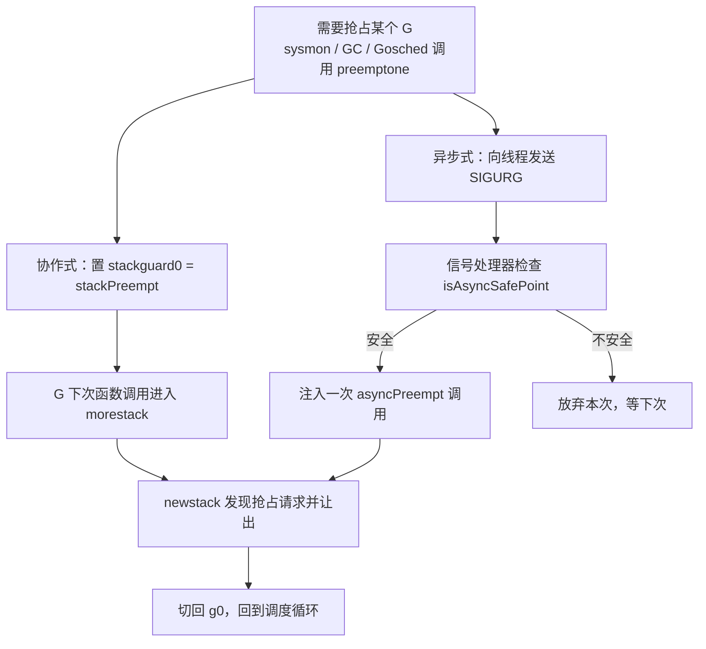

# 9.7 协作与抢占

我们在 [9.4 调度循环](./schedule.md) 留下一个问题：如果某个 G 迟迟不让出 CPU，别的 G 怎么办？
更尖锐的是垃圾回收：它的某些阶段需要让**所有** goroutine 都停到一个"安全"的位置
（stop-the-world），只要有一个 G 赖着不停，整个程序就卡住了。让出 CPU 这件事，于是有了
两种思路：**协作式**（被调度方主动弃权）与**抢占式**（调度器强行中断）。Go 运行时没有内核那样的
硬件中断能力，它的工作窃取调度本质上是协作式的；为了不让协作式的"赖着不走"拖垮延迟与 GC，
Go 一路演进出了从协作到准抢占的一整套机制。要讲清楚它，得先讲清"安全点"这个跨越所有
托管运行时的共同概念。

## 9.7.1 安全点：为什么运行时不能随处停

操作系统可以在任意指令处用时钟中断停下任意线程,因为它只需保存原始的寄存器与 PC，从不需要
"理解"这些字节的含义。垃圾回收却恰恰需要理解：要扫描甚至**移动**对象，运行时必须确切知道
栈上和寄存器里哪些字是活的指针、哪些只是恰好长得像地址的整数。这份信息（指针图 / 栈图）
只在特定的程序点上才保证有效,这些点就叫**安全点**（safepoint）。一个线程只有停在安全点上，
GC 才能安全地检视、改写、搬移它的状态。

到达安全点有两条路。**轮询式（协作式）**：编译器在代码里插入检查点，线程周期性地"问一句"
运行时要不要停，要停就在这个（天然安全的）点上把自己停下。**抢占式（异步式）**：运行时用信号
或线程挂起强行在**任意 PC** 打断线程,但任意 PC 未必是描述完备的安全点，于是要么为每条指令都
备好精确的指针图，要么退而用保守的办法。

这里有一个贯穿全章的延迟概念：**到达安全点的时间**（time-to-safepoint, TTSP）,即从运行时
请求停止，到某个线程真正停到安全点之间的间隔。stop-the-world 要等**所有**线程都停下，于是
整体停顿被**最慢**到达安全点的那个线程拖住,一个迟迟不轮询、甚至永不轮询的线程，能把本应
几毫秒的停顿拖成灾难。这正是抢占机制要解决的核心问题。

## 9.7.2 Go 的协作式抢占：在函数调用处让权

Go 协作式抢占的巧妙，在于它搭了个现成的便车：**栈增长检查**。编译器在几乎每个函数序言里
插入一小段代码，比较栈指针与 `g.stackguard0`，以判断是否需要扩栈。运行时想抢占某个 G 时，
并不直接打断它，而是把它的 `stackguard0` 改写成哨兵值 `stackPreempt`。于是该 G **下一次函数
调用**时序言检查"失败"，陷入 `morestack` → `newstack`；`newstack` 一看是抢占请求（而非真要
扩栈），就让它让出。`runtime.Gosched` 是同一条路上的显式版本：主动说一声"我先歇歇"。

这套机制本质上就是 **9.7.1 说的轮询**：检查点就是函数序言。它省事，却有一个致命盲区:
**只在函数调用处生效**。一段不含任何函数调用的紧致循环（典型如纯数值计算的 `for`，乃至
`for {}`），序言检查永远没机会执行，哨兵永远不被看到。在 Go 1.14 之前，这正是一类经典故障：
一个忙等的循环能让 GC 的 stop-the-world 无限期挂起,这就是 TTSP 退化到无穷大的情形。

## 9.7.3 Go 的异步抢占：给循环装上刹车（Go 1.14）

要打断一个不调用任何函数的循环，只能从外部强行中断,这就需要操作系统信号。Go 1.14 引入
**异步抢占**：运行时向目标线程发送 `SIGURG`（选它是因为调试器会放行、libc 极少用、程序本就
该容忍偶发的 `SIGURG`），信号处理器在被打断处注入一次对 `asyncPreempt` 的调用，把控制权
夺回运行时。这样，哪怕循环里一个函数都不调，也能被抢占。

真正困难的不是发信号，而是 9.7.1 那个老问题：在任意指令处停下后，GC 还能不能看懂这个 G 的
栈与寄存器。Austin Clements 为此提出过两套方案：一套是**到处都设安全点**（为几乎每条指令都
生成精确指针图，代价是二进制显著变大）；另一套是**保守地扫描内层栈帧**。最终落地的是后者。

> 关于异步抢占最容易被讲错的一点：Go 1.14 采用的并不是"为每条指令生成精确寄存器图"。它的
> 做法是，被异步打断的那一个最内层栈帧按**保守**方式扫描（凡是看起来像指针的都当作指针，
> 宁可多留不可错放），而外层那些停在真正调用点上的栈帧仍用精确图。保守扫描的不精确被牢牢
> 限制在一个栈帧内，而最内层帧变化极快，残留的"假指针"几乎活不过一个 GC 周期。正是这个取舍，
> 让异步抢占既能落地，又不必付出"处处精确图"的体积代价。运行时还会通过 `isAsyncSafePoint`
> 拒绝在不安全处停下（写屏障序列中、持有运行时锁时、栈空间不足以注入调用时等）。

今天的 go1.26 里，两条路并存。`preemptone` 会**同时**置 `stackguard0 = stackPreempt`（协作路径）
并发送 `SIGURG`（异步路径），哪条先命中就由哪条抢占。背后是 `sysmon`（[9.8](./sysmon.md)）
定时把运行超过约 10ms 的 G 标记为可抢占，保证时间片的大致公平。异步抢占也有代价:程序会
收到更多信号，一些慢速系统调用更容易以 `EINTR` 返回；必要时可用 `GODEBUG=asyncpreemptoff=1`
退回纯协作式。

## 9.7.4 别家怎么做

把 Go 放到托管运行时的谱系里，安全点这件事的设计取舍就清楚了。

**HotSpot JVM 走的是轮询路线。** JIT 在方法入口/出口、以及非计数循环的回边插入安全点轮询，
实现上是一次对受保护内存页的廉价读：要停顿时把页设为不可读，下次轮询便触发陷入。这条路
也踩过和 Go 一样的坑:HotSpot 历来认为**计数循环**"很短"而**不在其中插入轮询**，于是一个
长跑的计数循环没有轮询点，能拖垮全局安全点。修复办法是**循环条带挖掘**（loop strip mining，
JDK 10，Westrelin）：把计数循环拆成"外层按条带、内层无轮询"，每条带之间放一个轮询，
既保住内层吞吐又把 TTSP 限制在一个条带之内。JDK 10 还引入了**线程局部握手**（JEP 312），
让 JVM 能只停**单个**线程而非全停。

**.NET CLR 是混合路线。** 它给每个线程标记协作 / 抢占两种模式；GC 要停顿时设全局标志，
对仍在协作模式（即正在跑托管代码）的线程，通过**改写栈顶帧的返回地址**（return-address
hijacking）把它劫持到一个桩上，迫使它离开协作模式。其 JIT 还为代码分**完全可中断**
（每条指令都是安全点、处处有 GC 信息，可在任意处经线程重定向停下）与**部分可中断**
（安全点只在调用点与显式轮询处）两类。

把它们排在一条轴上：**轮询（编译器插桩、停在已知安全点）** 对 **异步（任意处打断、需精确图
或保守回退）**。Go 落在"异步信号 + 保守内层帧扫描"这一角，JVM 落在"轮询 + 线程局部握手"
这一角并用条带挖掘补全覆盖，CLR 横跨两角。需要澄清的是，[9.1](./model.md) 提到的**调度器
激活**与这条轴**正交**:它解决的是"用户态调度器如何从内核手里收回控制"，而非"如何让 GC
看懂任意 PC 处的栈"，二者是不同的问题。

## 9.7.5 演进与前沿

让紧致循环可被抢占，是 Go 团队追了近五年的目标。问题最早记录于 2015 年的 issue #10958
（由 Austin Clements 提出），当时正值 Go 1.5 并发 GC 落地，约 10ms 的 STW 目标常被一个忙等的
goroutine 打破。中途尝试过编译器在循环回边插检查等方案，最终在提案 #24543 下，于
**Go 1.14（2020）**以信号驱动的非协作式抢占收尾，采用了上文那套保守内层帧扫描。

更长远的方向，是干脆**缩小"必须全停"的范围**。安全点轮询本身极廉价（亚纳秒级），真正的痛点是
TTSP 尾延迟与"停顿期间要干多少活"。各家低延迟 GC 的共同思路，是把工作从安全点里挪出来、
与用户代码并发执行。HotSpot 的 ZGC 在 JDK 16（JEP 376）实现了**并发的线程栈处理**：不再在
一次 STW 里扫描所有线程栈，而是用一个全局纪元 + 栈水位线屏障，让各线程的栈在并发阶段被
逐一修正，"安全点里几乎什么实质工作都不做"。Go 走在同一条轨迹上:并发标记清除把 STW
压到极短，而异步抢占的存在，正是为了在不给每个循环插桩的前提下，把线程的"停下耗时"（TTSP）
约束住。性能的提升从不白来，它总伴着复杂度的重新安置,这一章反复看到的，正是这件事。

## 延伸阅读的文献

1. Austin Clements. *Proposal: Non-cooperative goroutine preemption.* golang/go#24543,
   2018-2019. https://go.dev/issue/24543 ；采纳方案（保守内层帧扫描）：
   https://go.googlesource.com/proposal/+/master/design/24543/conservative-inner-frame.md
2. golang/go#10958. *runtime: tight loops should be preemptible*, 2015.
   https://go.dev/issue/10958
3. Go 1.14 Release Notes（异步抢占）, 2020. https://go.dev/doc/go1.14
4. Nitsan Wakart. *Safepoints: Meaning, Side Effects and Overheads*, 2015.
   https://psy-lob-saw.blogspot.com/2015/12/safepoints.html
5. Aleksey Shipilev. *JVM Anatomy Quark #22: Safepoint Polls.*
   https://shipilev.net/jvm/anatomy-quarks/22-safepoint-polls/
6. OpenJDK. *JEP 312: Thread-Local Handshakes*（JDK 10）. https://openjdk.org/jeps/312 ；
   Roland Westrelin. *Loop Strip Mining in C2*（JDK-8186027）.
   https://cr.openjdk.org/~roland/loop_strip_mining.pdf
7. dotnet/runtime. *Book of the Runtime: Threading / GC Design.*
   https://github.com/dotnet/runtime/blob/main/docs/design/coreclr/botr/threading.md
8. OpenJDK. *JEP 376: ZGC — Concurrent Thread-Stack Processing*（JDK 16）.
   https://openjdk.org/jeps/376

## 许可

&copy; 2018-2026 The [golang.design](https://golang.design) Initiative Authors. Licensed under [CC-BY-NC-ND 4.0](https://creativecommons.org/licenses/by-nc-nd/4.0/).
