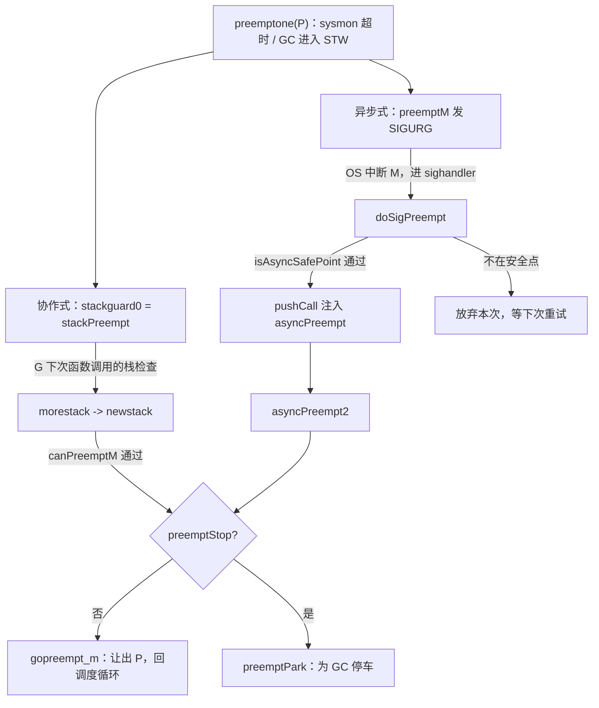

# 9.7 协作与抢占

我们在 [9.5 调度循环](./schedule.md) 里遗留了一个问题：如果某个 G 执行时间过长，
其他 G 如何还能被调度？答案绕不开调度理论里的一对老概念，协作式与抢占式。
协作式调度依靠被调度方主动弃权，抢占式调度依靠调度器把被调度方被动中断。

Go 运行时没有操作系统内核那样的硬件中断能力，基于工作窃取的调度器（[9.2](./steal.md)）
本质上是先来先服务的协作式调度。它如何在不牺牲这一前提的情况下，仍能强行打断一个不肯让权的
G，是本节要讲清的设计。这条线索从一个理论问题出发：运行时凭什么不能在任意一条指令处停下一个
Goroutine。

## 9.7.1 安全点：为何不能想停就停

抢占的难处不在「中断」，而在「中断之后还要能正确地恢复，并让垃圾回收看懂这个 G 的栈」。
Go 是精确（precise）垃圾回收的语言，GC 必须知道一个被停住的 G，它的每一个栈槽与寄存器里
装的究竟是指针还是普通整数（[13.4](../../part4memory/ch13gc/mark.md)）。这份「此刻哪些位置是
指针」的信息，称为**栈映射**（stack map）与寄存器映射，由编译器在确定的位置才生成。换言之，
程序并非在每一条机器指令处都备有完整的指针信息，能让 GC 安全扫描的位置是离散的。

这样的位置就是**安全点**（safe-point）：线程执行到此，运行时能够完整地辨认其全部对象引用。
不在安全点处贸然停下一个 G，比如恰好停在写屏障序列的中段，或停在一条把指针临时拆成整数运算的
指令之间，扫描就会漏掉或误判指针，破坏 GC 的正确性。安全点把「可以安全停车的地方」限定为一组
离散点，这是抢占一切机制的地基。

实现安全点有两条路。一条是**轮询式**（polling），编译器在安全点插入一小段检查代码，G 自己
反复询问「有没有人要我停」，看到请求便配合停下。它简单、可移植，代价是检查指令的常驻开销，
以及一个根本盲区：若一段代码长时间不经过任何安全点（比如一个不含函数调用的紧凑循环），轮询
永远不会被执行到，请求就石沉大海。另一条是**抢占式**（preemptive），由外部线程强行中断目标，
再设法把它「挪」到一个安全点上，代价是中断时机不可控，正卡在不安全的指令上时必须有办法识别
并放弃。

为何一个迟迟不到安全点的线程会拖累全局？因为许多运行时操作要求**全局停顿**（stop-the-world，
STW），典型如 GC 的某些阶段。STW 要等到**所有** G 都停在安全点才能开始，于是总耗时由最慢的那个
线程决定。这个量有个名字，**到达安全点的时间**（time-to-safepoint，TTSP）。一个 TTSP 失控的
线程，比如陷在死循环里，会把整次 STW 的延迟拖到不可接受。降低 TTSP 的尾部，正是抢占机制要解决的
工程目标。

## 9.7.2 协作式抢占：搭栈增长检查的便车

Go 最早的抢占是纯协作式的，且复用了一处现成的安全点：函数序言里的栈增长检查
（[14 执行栈管理](../../part4memory/ch14stack/readme.md)）。每个非 `nosplit` 函数在入口都会比较栈指针 SP 与
`g.stackguard0`，SP 越界就触发 `morestack`，转入 `newstack` 去扩张栈。这处检查恰好是一个同步
安全点：此刻 G 的栈是完整可扫描的。

抢占便搭了它的便车。把 `stackguard0` 设成一个比任何真实 SP 都大的哨兵值 `stackPreempt`，下一次
函数调用的栈检查必然「失败」，于是落入 `newstack`，由它分辨这并非真要扩栈，而是一次抢占请求：

```go
// 抢占哨兵：置入 g.stackguard0，使下一次栈检查必然失败而进入 newstack
// 它比任何真实 SP 都大（0xfffffade）
const stackPreempt = (1<<(8*goarch.PtrSize) - 1) & -1314

func newstack() {
    gp := getg().m.curg
    // 是抢占请求，而非真要扩栈
    preempt := gp.stackguard0 == stackPreempt
    if preempt {
        if !canPreemptM(gp.m) {
            // 运行时正处于不可抢占的状态：撤销请求，继续运行
            gp.stackguard0 = gp.stack.lo + stackGuard
            gogo(&gp.sched)
        }
        if gp.preemptStop {
            preemptPark(gp) // 转入 GC 的停车，不返回
        }
        gopreempt_m(gp) // 行为等同主动调用 Gosched，让出 P
    }
    // ... 否则才是真正的栈扩张
}
```

`canPreemptM` 把抢占限制在安全的运行时状态下，它要求 M 没有持锁、没有在分配内存、没有关闭抢占、
且其 P 正在运行：

```go
//go:nosplit
func canPreemptM(mp *m) bool {
    return mp.locks == 0 && mp.mallocing == 0 && mp.preemptoff == "" &&
        mp.p.ptr().status == _Prunning && mp.curg != nil &&
        readgstatus(mp.curg)&^_Gscan != _Gsyscall
}
```

这套设计的优雅在于零额外成本：它没有新增任何指令，抢占检查本就是栈溢出检查，运行时白白多得了一个
打断点。`gopreempt_m` 最终走的是与 `runtime.Gosched`（用户主动让权）相同的 `goschedImpl`，把 G
放回全局队列，重新进入调度循环。从「记录现场」的角度看，这种发生在函数序言的协作式抢占也最省事：
此处栈帧规整、指针信息齐备，保存 PC 与 SP 即可干净地离开。

代价是它继承了轮询式的根本盲区。考虑这段经典程序：

```go
func main() {
    runtime.GOMAXPROCS(1)
    go func() {
        for {
        } // 不含任何函数调用，永不经过栈检查
    }()
    time.Sleep(time.Millisecond)
    println("OK") // Go 1.14 之前永不打印
}
```

唯一的 P 被这个空循环占住，循环体里没有任何函数调用，栈检查这个安全点便永远不会被执行到，
`stackPreempt` 设了也白设。主 Goroutine 拿不回 P，程序卡死。这正是 9.7.1 所说轮询的盲区，
落在了 Go 身上。

## 9.7.3 异步抢占：信号、注入与保守扫描

Go 团队很早便知道这个盲区。Go 1.2 加入序言抢占标记后，问题被搁置，直到用户报告累积
（#10958）。Austin Clements 在 1.5 前后尝试由编译器在**循环回边**插入抢占检查，
David Chase 随后将其优化到只剩一条 `TESTB` 指令、无分支无寄存器压力，即便如此，
密集循环上仍有几何平均约 7.8% 的损耗。在热循环里为一件几乎不发生的事常驻指令，性价比终究不划算。

转机是 1.14 落地的**异步抢占**（proposal #24543）。思路与操作系统如出一辙：由外部线程发一个信号
强行中断目标 M，在信号处理中把它「挪」到安全点。难点也正是 9.7.1 预告过的那个：信号会打在任意
一条指令上，未必是安全点。

这里有一个常被误传的细节，值得说清。#24543 的标题虽是「非协作式抢占」，但**最终采用的方案并非
在每条指令处都生成精确的寄存器映射**，那样元数据会膨胀到不可接受。真正落地的是一个折中：信号
注入一个 `asyncPreempt` 调用，**当 GC 栈扫描遇到 `asyncPreempt` 栈帧时，对它及其父帧采取保守
扫描**（conservative scanning），即把帧内所有看起来像堆指针的字都当作活指针对待，宁可错保、
不漏标。代价是被抢占点上的少量浮动垃圾，换来的是无需为每条指令准备精确映射。理解这条「保守内层
帧」的修正，是读懂 Go 异步抢占的关键。

既然要保守扫描，停车点就不能是任意指令。`isAsyncSafePoint` 是这道闸门，它在信号到达时判断当前
PC 是否安全，拒绝一切会让保守扫描出错的位置：

```go
// 判断 gp 停在 pc 处能否被异步抢占（速写：保留判定逻辑，省去边角）
func isAsyncSafePoint(gp *g, pc, sp, lr uintptr) (bool, uintptr) {
    mp := gp.m
    if mp.curg != gp { return false, 0 }       // 只抢占用户 G
    if mp.p == 0 || !canPreemptM(mp) { return false, 0 } // 同协作式的安全条件
    if sp-gp.stack.lo < asyncPreemptStack { return false, 0 } // 栈要够注入

    f := findfunc(pc)
    if !f.valid() { return false, 0 }          // 非 Go 代码
    up, _ := pcdatavalue2(f, abi.PCDATA_UnsafePoint, pc)
    if up == abi.UnsafePointUnsafe {
        return false, 0  // 编译器标注的非安全点：写屏障、原子序列、nosplit
    }
    // 最内层（含内联）函数名属于运行时自身，一律不抢占
    name := /* 最内层 srcFunc 名 */ ""
    if hasPrefix(name, "runtime.") || hasPrefix(name, "internal/runtime/") ||
        hasPrefix(name, "reflect.") {
        return false, 0
    }
    return true, pc
}
```

被拒的情形涵盖了所有「停下来会出错」的地方：写屏障与原子序列中段、`nosplit` 函数内部、汇编代码、
以及运行时自身的代码（调度器、defer、内部原子操作等，它们的栈上常有无类型数据）。换言之，
异步抢占只敢打用户代码里规整的那部分。

发信号选的是 `SIGURG`。这个选择有讲究：它平时只用于调试器传递信号，容许被「虚假」触发而不至于
误事（不像 `SIGALRM` 那样收到就得当真），也不与用户常用的 `SIGUSR1/2` 撞车，还能照顾到没有实时
信号的平台（如 macOS）。整条注入链路是这样接起来的，关键在于信号处理函数可以**改写被中断线程的
执行上下文**：

```go
const sigPreempt = _SIGURG

// 信号到达：若 G 想被抢占且当前是安全点，则改写其恢复 PC，注入一次 asyncPreempt 调用
func doSigPreempt(gp *g, ctxt *sigctxt) {
    if wantAsyncPreempt(gp) {
        if ok, newpc := isAsyncSafePoint(gp, ctxt.sigpc(), ctxt.sigsp(), ctxt.siglr()); ok {
            ctxt.pushCall(abi.FuncPCABI0(asyncPreempt), newpc) // 把恢复地址改成 asyncPreempt
        }
    }
    gp.m.preemptGen.Add(1) // 确认已处理这次抢占
}
```

`pushCall` 把原 PC 压栈、再把恢复 PC 指向 `asyncPreempt`，于是信号处理一返回，被中断的 G 不会
回到原地，而是「凭空」执行了一次 `asyncPreempt` 调用。`asyncPreempt` 用汇编写成，职责是把所有
用户寄存器溢出到栈上保存（这也是保守扫描父帧的由来），调用 `asyncPreempt2`，返回前再原样恢复，
让被抢占的 G 浑然不觉：

```go
//go:nosplit
//go:nowritebarrierrec
func asyncPreempt2() {
    mcall(func(gp *g) {
        gp.asyncSafePoint = true
        if gp.preemptStop {
            preemptPark(gp)  // 为 GC 停车
        } else {
            gopreempt_m(gp)  // 让权，回到调度循环
        }
    })
    getg().asyncSafePoint = false
}
```

终点与协作式殊途同归：要么 `gopreempt_m` 让出 P，要么 `preemptPark` 为 GC 停车。

## 9.7.4 两条路一起武装：preemptone 与 sysmon

协作式与异步式并非二选一，一次抢占请求会把**两条路一起武装**。`preemptone` 是
请求抢占某个 P 上 G 的统一入口，它既设协作式的哨兵，又发异步式的信号，哪条先被 G 触到就走哪条：

```go
func preemptone(pp *p) bool {
    mp := pp.m.ptr()
    gp := mp.curg
    // ... 校验 mp、gp 有效且不在 syscall
    gp.preempt = true
    gp.stackguard0 = stackPreempt // 协作式：下次栈检查触发
    if preemptMSupported && debug.asyncpreemptoff == 0 {
        pp.preempt = true
        preemptM(mp)              // 异步式：发 SIGURG
    }
    return true
}
```

谁来调用 `preemptone`？主要是系统监控 `sysmon`（[9.6](./sysmon.md)）里的 `retake`。它周期性巡查
所有 P，做两件不同的「抢占」：

- **抢 P**：G 阻塞在系统调用上时，把 P 从 M 解绑（`handoffp`），交给别的 M 去跑其他 G。这无需
  打断谁，G 本来就停着，恢复时自己会重新找 P 绑定。判据是系统调用已超过约一个 sysmon tick（20µs）。
- **抢 M**：G 在用户代码里跑得太久（超过时间片 `forcePreemptNS`，即 10ms）时，调 `preemptone`
  去打断它。这才用到上面两条路。

这条 10ms 的时间片，连同 20µs 的 syscall 阈值，是 Go 给 TTSP 设的上界：再顽固的循环，最迟也会在
一个时间片后被 `SIGURG` 拽下来。垃圾回收要进入 STW 时走的也是同一套 `preemptone`，只是把
`gp.preemptStop` 置位，让落点导向 `preemptPark` 而非让权。

把两条路并成一张图，「一次请求、两道绊线」的结构便清楚了：



紧凑循环只会被异步那条绊线绊到，含调用的代码通常先撞上协作那条，开销更低。两条并行，覆盖面才完整。

## 9.7.5 别家怎么做：轮询与异步的设计轴

把 Go 放进谱系看，会发现它撞上的盲区是这一类语言的共性。HotSpot JVM 长期用**轮询式安全点**：
线程在方法返回、循环回边等处轮询一个保护页，要停顿时把该页设为不可读，触发陷阱来集合所有线程。
它同样有 Go 那样的盲区，只不过出现在**计数型循环**（counted loop）上：JIT 为优化省去了循环内的
安全点轮询，一个长计数循环便能让 TTSP 失控。JVM 的修复路线与 Go 的取向不同却同源：JDK 10 引入
**循环条带化**（loop strip mining），把大循环切成外层带轮询、内层不带的两层，既保留优化又限住
TTSP；JEP 312 进一步用**线程局部握手**（thread-local handshakes）让 VM 能单独对某个线程发起
回调，而不必整体 STW。

.NET 走的是另一条路，**线程劫持**（hijacking）：运行时挂起目标线程，把它的返回地址临时改写到一段
运行时桩代码，线程一返回就落入运行时手里，与 Go 用信号改写恢复 PC 注入 `asyncPreempt` 异曲同工，
都是「篡改控制流，把线程引到安全点」。

这些方案铺开，就是一条清晰的设计轴：**轮询 vs 异步**。轮询（早期 Go 序言检查、JVM 安全点）实现
简单、可移植，但受制于「必须执行到轮询点」的盲区；异步（Go 1.14 信号、.NET 劫持、JEP 312 握手）
能打断任意点，代价是要严格甄别停车时机、并处理保守扫描或上下文保存的复杂度。Go 1.14 的选择是
两者并用：协作式当廉价的常规路径，异步式兜住盲区。调度器激活（scheduler
activations）那类「内核与用户态协作通知阻塞」的机制与此正交，它解决的是 M 阻塞时的并行度，
而非单个 G 的 TTSP。

## 9.7.6 演进与前沿：把 STW 越缩越短

回看这条线：从 Go 1.0 前根本无法抢占，到 1.2 的序言标记（#10958 揭示其盲区），到 1.5 试探循环
回边抢占（性能受损而未全面采用），最终在 1.14 由 proposal #24543 用信号加保守内层帧扫描收口。
驱动力始终不是「调度公平」本身，而是运行时机制（尤其 GC）对可控 TTSP 的刚需。抢占之所以存在，
是为了让 GC 能及时停住每一个 G。

前沿仍在同一个方向上推进：把 STW 压得更短，乃至取消。HotSpot 的 ZGC（JEP 376）实现了**并发栈
处理**，让线程栈在 GC 并发阶段、而非 STW 中被扫描与修正，把停顿压到亚毫秒并几乎与堆大小无关。
这与 Go 持续削减 STW 的努力（[13 垃圾回收](../../part4memory/ch13gc/readme.md)）目标一致：安全点与抢占
是「何时能停」的机制，而前沿要回答的是「能不能不停」。

调试时若要排除异步抢占的干扰（例如它产生的少量浮动垃圾，或排查信号相关问题），可用
`GODEBUG=asyncpreemptoff=1` 关闭异步抢占，退回纯协作式行为，上文经典死循环程序届时又会卡死，
正可作为机制是否生效的判据。

## 延伸阅读的文献

1. Austin Clements. *Proposal: Non-cooperative goroutine preemption.* Go issue #24543, 2018.
   https://github.com/golang/go/issues/24543 （异步抢占总设计；含「保守扫描 asyncPreempt 帧及其
   父帧」而非全程精确映射这一关键折中）
2. The Go Authors. *runtime: tight loops should be preemptible.* Go issue #10958, 2015.
   https://github.com/golang/go/issues/10958 （序言抢占盲区的最初报告）
3. Austin Clements, David Chase. *Non-cooperative goroutine preemption (design doc).* 2019.
   https://github.com/golang/proposal/blob/master/design/24543-non-cooperative-preemption.md
   （循环回边抢占、`TESTB` 优化与其 7.8% 性能损耗的来龙去脉）
4. The Go Authors. *Go 1.14 Release Notes: Goroutine preemption.* 2020.
   https://go.dev/doc/go1.14#runtime （异步抢占正式可用与 `asyncpreemptoff`）
5. Nitsan Wakart. *Safepoints: Meaning, Side Effects and Overheads.* 2015.
   https://psy-lob-saw.blogspot.com/2015/12/safepoints.html （安全点与 TTSP 的系统性讨论）
6. Aleksey Shipilëv. *JVM Anatomy Quark #22: Safepoint Polls.* 2019.
   https://shipilev.net/jvm/anatomy-quarks/22-safepoint-polls/ （轮询式安全点的代价剖析）
7. *JEP 312: Thread-Local Handshakes.* OpenJDK, 2018.
   https://openjdk.org/jeps/312 （从全局 STW 到逐线程握手）
8. *JEP 376: ZGC Concurrent Thread-Stack Processing.* OpenJDK, 2020.
   https://openjdk.org/jeps/376 （并发栈处理，趋近无 STW 的前沿）
9. Dmitry Vyukov. *Go Preemptive Scheduler Design Doc.* 2013.
   https://docs.google.com/document/d/1ETuA2IOmnaQ4j81AtTGT40Y4_Jr6_IDASEKg0t0dBR8/edit
   （抢占式调度的最早设计草案，先于异步抢占的协作式方案）
10. David Chase. *cmd/compile: loop preemption with fault branch on amd64.* CL 43050, 2019.
    https://golang.org/cl/43050 （回边抢占的故障分支实现，因性能损耗而未全面采用）
11. The Go Authors. *runtime/preempt.go、signal_unix.go、proc.go（retake/preemptone）.*
   https://github.com/golang/go/tree/master/src/runtime
12. 本书 [9.5 调度循环](./schedule.md)、[9.6 系统监控](./sysmon.md)、
    [14 执行栈管理](../../part4memory/ch14stack/readme.md)、
    [13.4 扫描标记与标记辅助](../../part4memory/ch13gc/mark.md).
