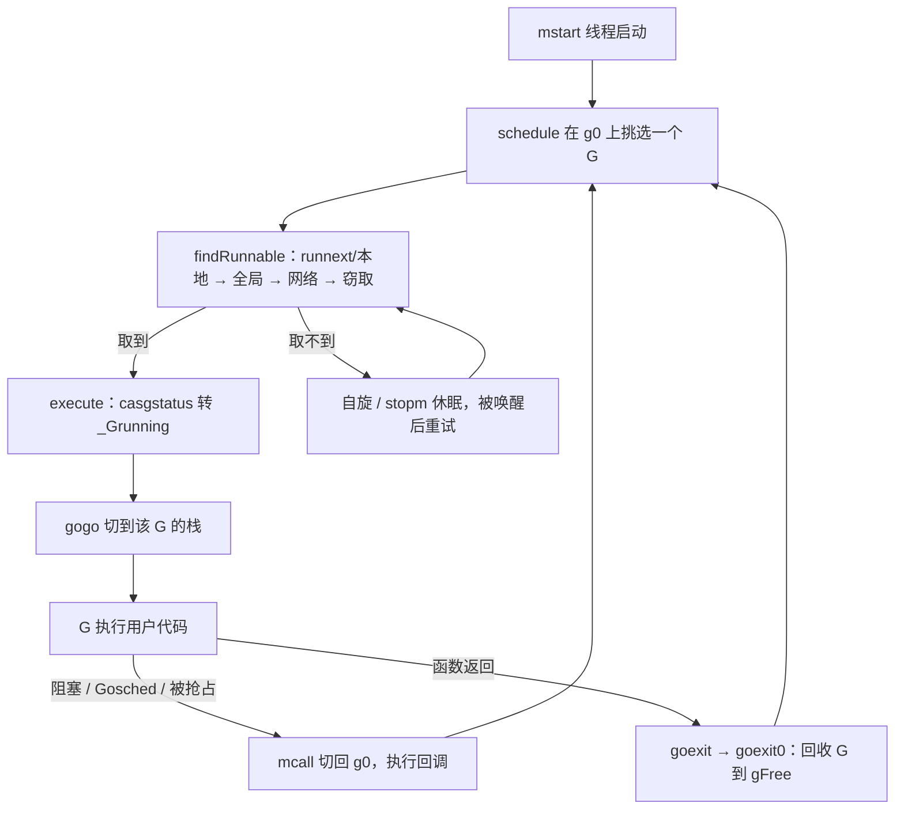
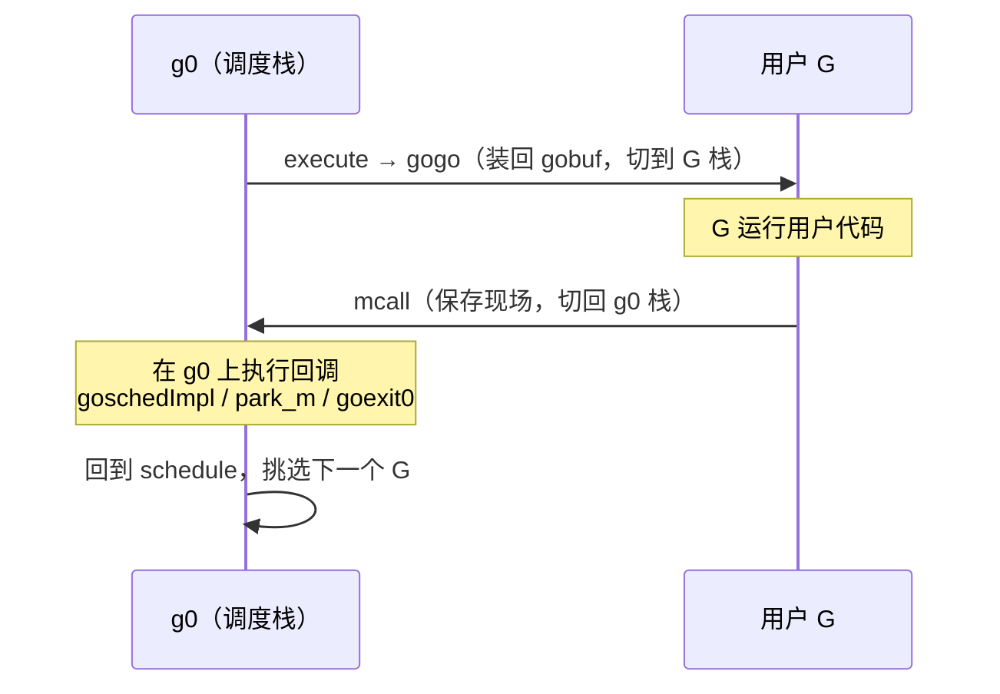

# 9.4 调度循环

前面几节备齐了材料：知道了 G、M、P 是什么（[9.3](./mpg.md)），知道了一个 M 怎样找活儿
（[9.2](./steal.md)）。这一节把它们真正转起来，看调度循环如何在一个线程上一刻不停地挑选并
运行 goroutine，以及它如何在「让单个 goroutine 跑得久一点」（吞吐与局部性）与「别让任何
goroutine 饿死」（公平）之间拿捏分寸。

下文的代码一律是**裁剪后的速写**，只保留与设计相关的骨架，去掉了 GC、tracing、profiling、
锁定线程等旁支。完整定义可对照 `runtime/proc.go`，下文涉及的版本均为 go1.26。

## 9.4.1 一个永不返回的循环

Go 的调度是**协作式、运行到让出**（run-to-yield）的：一个 goroutine 一旦被选中，就一直跑到它
主动让出、阻塞、或被抢占（[9.7](./preemption.md)）为止，而不是像内核那样被时钟中断按固定
时间片切走。每个工作线程从 `mstart` 启动后，最终进入调度循环 `schedule`，此后在其中周而复始，
直到线程退出。骨架剥到最简，就是一个两步循环：

```go
// 每个 M 的调度循环（速写）：运行在系统栈 g0 上，永不返回
func schedule() {
    // 找一个可运行的 G（见 9.2 的完整顺序）；找不到就阻塞在 findRunnable 内，直到有活儿
    gp, inheritTime, _ := findRunnable()

    // 切到 gp 的栈开始执行。控制权要再回到这里，靠的是下面的 mcall，而非函数返回
    execute(gp, inheritTime)
}
```

`findRunnable` 永不返回 `nil`：取不到活儿，它会让 M 转入自旋或休眠，阻塞在内部直到被唤醒，
因此 `schedule` 不必处理「无事可做」的分支。而 `execute` 也永不返回，它跳进用户 G 的栈，
此后 `schedule` 这一帧的栈空间就被复用了。控制权要回到调度逻辑，靠的是 9.4.2 的栈切换。



`schedule` 与 `findRunnable` 这些调度逻辑跑在 M 的专用系统栈 `g0` 上（[9.3](./mpg.md)），
不在用户 G 的栈上。这带来清晰的分工：`g0` 负责调度，用户 G 负责干活。也正因如此，`schedule`
从不真正返回，它选中一个 G、跳过去执行，控制权要再回到调度逻辑，靠的是下一节的栈切换，
而非函数返回。

## 9.4.2 两次切换：execute 与 mcall

调度循环里有两个方向相反的栈切换，它们合起来构成 [9.3](./mpg.md) 那张 goroutine 状态机的
**物理实现**：状态机说「会发生哪些迁移」，这两个例程说「迁移如何发生」。

**从 `g0` 跳到用户 G**：`schedule` 选出 G 后调用 `execute`。它先把 G 切到 `_Grunning`、
绑定到当前 M，再调用汇编例程 `gogo`，由后者把 G 保存的现场（[9.3](./mpg.md) 的 `gobuf`：
`sp`、`pc`、`bp` 等）装回寄存器，控制权便落到用户 G 的栈上，从它上次被切下处继续。

```go
// 在当前 M 上开始执行 gp（速写）
func execute(gp *g, inheritTime bool) {
    mp := getg().m

    mp.curg = gp                          // M 与 G 互相引用
    gp.m = mp
    casgstatus(gp, _Grunnable, _Grunning) // 状态机迁移：可运行 → 运行中
    gp.preempt = false
    gp.stackguard0 = gp.stack.lo + stackGuard
    if !inheritTime {
        mp.p.ptr().schedtick++            // 开新时间片才计数；继承时间片则不计（见 9.4.3）
    }

    gogo(&gp.sched)                       // 装回 gobuf，跳到 gp 的栈，永不返回
}
```

`gogo` 的精巧之处在于它「有去无回」：装回寄存器后直接 `JMP` 到 G 的 `pc`，没有任何返回调度器
的代码。第一次执行一个新 G 时，它的 `pc` 指向用户函数 `fn`，而 `fn` 的「返回地址」在
`newproc1` 建栈时被预置成了 `goexit`（见 9.4.4）。于是 `fn` 一旦 `return`，自然就落到 `goexit`，
这正是控制权回到运行时的入口。

**从用户 G 跳回 `g0`**：G 要让出时（`Gosched`、阻塞在 channel、被抢占、或函数执行完毕），
最终都调用 `mcall`。它把当前现场存进 G 的 `gobuf`，切到 `g0` 栈，在 `g0` 上执行一个回调：

```go
// mcall(fn)（语义速写）：保存当前 G 现场，切到 g0，在 g0 上执行 fn(gp)
//   1. 把调用方的 pc/sp 存入 gp.sched
//   2. 切换 SP 到 m.g0 的栈
//   3. 调用 fn(gp)，fn 必须永不返回（它最终会回到 schedule）
```

回调因让出的原因而异：主动让出走 `goschedImpl`，它把 G 重新挂回队列后继续 `schedule`；
阻塞等待走 `park_m`，把 G 置为 `_Gwaiting` 后再 `schedule`；执行完毕走 `goexit0`。
无论哪条，回调干完都回到 `schedule`，循环就此闭合。这一来一回，正是 goroutine 在「正在运行」
与其他状态之间迁移的物理实现。



## 9.4.3 公平：不让任何人饿死

协作式调度有一个内在风险：若总让本地队列「最顺手」的 G 先跑，某些 G 可能永远排不上队。
`schedule` 为此布了几道公平阀门，它们合起来才让协作式调度在实践中不至于饿死任何人。

**全局队列的周期检查。** `findRunnable` 在动用本地队列之前，每隔 **61** 次调度会先去全局队列
取一个 G：

```go
// findRunnable 中的公平阀门（速写）
if pp.schedtick%61 == 0 && !sched.runq.empty() {
    lock(&sched.lock)
    gp := globrunqget()   // 从全局队列取一个，绕过本地队列
    unlock(&sched.lock)
    // ... 取到则直接返回
}
```

它解决一个具体的饥饿场景：两个互相唤醒对方的 G 会在本地队列里你来我往，把本地队列占满，
使全局队列里的 G 迟迟得不到执行。隔固定次数强制看一眼全局队列，就打破了这种垄断。注意计数器
用的是 `schedtick`，它只在开启**新**时间片时自增（见 9.4.2 的 `execute`），继承时间片的
`runnext` 不计入，因此「61 次」量的是真正开新片的调度，而非每一次 G 切换。源码注释只解释
「为保证公平」，并未说明为何偏偏是 61，流传甚广的「61 是质数、可避免共振」之说属于民间推测，
本书只取「61」这个事实。

**`runnext` 的反饥饿约束。** 刚被唤醒、或刚被 `go` 派生的 G 会被放进 P 的 `runnext` 槽优先
运行，并**继承当前时间片的剩余时间**（`inheritTime`，见 9.4.2 中 `runqget` 返回的第二个值）。
这让「通信即运行」的一对 goroutine 能作为一个单元被紧凑调度，利于缓存局部性。但 `runnext`
也可能被滥用成两个 G 互相 `runnext` 对方、霸占 CPU。运行时依赖 `sysmon`（[9.8](./sysmon.md)）
按时间片抢占来兜底。源码里有一处耐人寻味的细节：当目标平台没有 `sysmon`（如 `wasm`），
运行时会**彻底禁用 `runnext`**：

```go
// runqput（速写）：把 gp 放进本地队列；next 为真则放进 runnext 槽
func runqput(pp *p, gp *g, next bool) {
    if !haveSysmon && next {
        // runnext 与当前 G 共享同一时间片（inheritTime）。
        // 没有 sysmon 抢占兜底时，一对互相 runnext 的 G 会饿死其他所有人，
        // 故此时必须放弃 runnext。
        next = false
    }
    // ... next 为真则 CAS 进 pp.runnext，否则入队列尾；队列满则溢出到全局队列
}
```

这是一处很说明问题的设计：公平不是单点机制，而是多处协同的结果。`runnext` 带来吞吐与局部性，
代价是潜在的乒乓饥饿；这份代价由 `sysmon` 的抢占来对冲；一旦抢占这条腿不在，带来吞吐的那条腿
也必须收回。

挑选的完整顺序仍是 [9.2](./steal.md) 给出的那条，按命中频率从高到低、同步代价从低到高排列：


只有全部落空，线程才转入自旋（短暂忙等，赌很快有活儿）或经 `stopm` 休眠。这条「先本地、
再全局、末了窃取」的顺序，本身就是吞吐与公平的折中：靠前的步骤廉价且利于局部性，靠后的步骤
保证活儿最终会被某个空闲的 M 捡走。

## 9.4.4 goroutine 的诞生与消亡

循环之外还有两端。

**诞生。** `go f()` 经编译器翻译为对 `newproc` 的调用，它在系统栈上完成建 G 的工作：

```go
// newproc（速写）：go f() 的落地
func newproc(fn *funcval) {
    gp := getg()
    pc := sys.GetCallerPC()
    systemstack(func() {
        newg := newproc1(fn, gp, pc, false, waitReasonZero) // 见下

        pp := getg().m.p.ptr()
        runqput(pp, newg, true) // next=true：放进 runnext，让新 G 优先且就近执行

        if mainStarted {
            wakep() // 若有空闲 P 且有睡着的 M，唤醒一个来增加并行度
        }
    })
}
```

`newproc1` 是真正建 G 的地方，它体现了**复用优先**的思路：先从 P 的空闲列表 `gFree` 取一个
用过的 G（连同它的栈），取不到才向堆新分配；随后清零现场，把 `sched.pc` 指向用户函数、把
`fn` 的返回地址预置为 `goexit`（这正是 9.4.2 里 `gogo` 跳进去后能「自然落到 goexit」的原因），
最后把 G 置为 `_Grunnable`。`runqput(pp, newg, true)` 让刚派生的 G 进 `runnext`，使「派生即
运行」的常见模式跑得紧凑；`wakep` 则在有富余并行度时叫醒一个 M，把新 G 尽快变成真正的并行。

**消亡。** G 的函数返回时并不直接回到调用者，而是落到运行时预置的 `goexit`，经
`goexit1 → mcall(goexit0)` 切回 `g0`，由 `goexit0` 收尾：

```go
// goexit0（速写）：在 g0 上回收一个跑完的 G
func goexit0(gp *g) {
    casgstatus(gp, _Grunning, _Gdead) // 状态机迁移：运行中 → 死亡
    // ... 清理 gp 的字段：defer、panic、label、与 M 的绑定等
    dropg()                            // 解绑 M 与 G
    gfput(pp, gp)                      // 把 G（连同栈）挂回 P 的 gFree 供复用
    schedule()                         // 回到调度循环，永不返回
}
```

G 不被释放而是回收进 `gFree`，避免了反复分配 G 结构体与初始栈。这是高频创建 goroutine 仍然
廉价的原因之一：第二次起的 `go f()` 多半是从 `gFree` 摘一个旧 G、改一改入口，而非从零构造。
诞生从 `gFree` 取、消亡往 `gFree` 还，两端对称地共用同一个每 P 的空闲池，与分配器的每 P
缓存（[12.2](../../part4memory/ch12alloc/component.md)）是同一种「分层减争」的招式。

## 9.4.5 设计的演进

今天这套循环不是一开始就长成这样的，它的几道阀门各自对应历史上的一处教训。把演进的脉络
摆出来，前面那些看似随意的常数与约束就有了来由。


最早的调度器（Go 1.0 及之前）只有一个全局运行队列，配一把全局锁。所有 M 取 G、放 G 都要争
这把锁，核数一多便成瓶颈。Vyukov 在 2012 年的设计文档里正是从这个痛点起笔，提出每 P 一个
本地队列、辅以工作窃取与自旋 M 的方案，随 Go 1.1 落地。这一步奠定了 9.2 与本节的全部基础：
本地队列让绝大多数取放无锁，窃取保证活儿不会困在某个 P 上，自旋 M 则在唤醒新线程的昂贵操作
之前先忙等一小会儿，赌很快有活儿来。

本地队列解了争用，却引出了公平问题，于是有了 9.4.3 的两道补丁：`runnext` 槽为「通信即运行」
的一对 G 争取局部性，61 次的全局队列检查则堵住互相唤醒的一对 G 垄断本地队列的漏洞。它们是
在本地队列方案站稳之后，针对其副作用逐步打上的。

最后一块拼图是抢占。早期的抢占是协作式的，只在函数序言的栈检查点发生，一个没有函数调用的
紧凑循环（如 `for {}`）会一直占着 P 不让出，连 STW 都会被它无限期拖住。Go 1.14 引入基于信号的
**异步抢占**（提案 24543），运行时给目标线程发信号，在安全点强行夺回控制权，这才补上了协作式
调度最后的窟窿，也正是 9.4.3 里 `runnext` 敢于依赖的那条兜底腿。

## 9.4.6 放到调度理论里看

把 `schedule` 的几道阀门收束起来看，Go 的调度是「运行到让出 + 协作让权 + 信号抢占兜底」的
一种**混合**。它落在调度设计谱系的中间地带。

纯**协作式**调度（早期的用户态线程、Node 的事件循环在单个任务内部）吞吐高、切换廉价，因为
让权点由程序自己掌握，无需保存完整的中断现场；代价是一个不让权的任务能拖垮全局，公平全靠
程序自觉。纯**时间片抢占**（内核线程）公平且不依赖任务配合，代价是切换昂贵，且抢占点不可控，
不利于局部性。

Go 取两者之间：默认靠协作让权（channel、`Gosched`、函数序言里的抢占检查）与工作窃取
（[9.2](./steal.md)）获取吞吐与局部性，再用 `sysmon` 驱动的、约 10ms 一次的异步抢占
（[9.7](./preemption.md)）为公平兜底，确保没有让权点的纯计算 G 也终会被切走。9.4.3 里
「没有 sysmon 就关掉 runnext」的细节，正是这套混合的内在逻辑外露：抢占这条腿一旦缺席，
依赖它兜底的协作优化也得跟着退场。

这与 Erlang/BEAM 的**归约计数**抢占异曲同工。BEAM 给每个进程一份固定的归约预算（reduction
budget），每次函数调用等操作扣一次，预算耗尽即被换下。两者都在「协作的廉价」与
「抢占的公平」之间求平衡，分野只在抢占点放在哪里：Go 把它放在函数调用的栈检查与异步信号上，
BEAM 放在归约计数上。BEAM 的计数是确定的、与时间无关的，公平粒度更均匀；Go 的信号抢占按
真实时间触发，实现更轻、对 GC 安全点的配合更自然。没有「完美」的调度（[9.1](./model.md)
谈过在线调度的竞争比下界），`schedule` 这几道阀门，就是 Go 在吞吐、延迟与实现复杂度之间
给出的一个具体而克制的答案。

## 延伸阅读的文献

1. Dmitry Vyukov. *Scalable Go Scheduler Design Doc*, 2012.
   https://go.dev/s/go11sched （work-stealing + spinning M 的设计源头）
2. The Go Authors. *runtime/proc.go*（`schedule`、`findRunnable`、`execute`、`mcall`、
   `goschedImpl`、`newproc`、`goexit0`、`runqput`）. go1.26.
   https://github.com/golang/go/blob/master/src/runtime/proc.go
3. The Go Authors. *runtime/asm_amd64.s*（`gogo`、`mcall` 的汇编实现）.
   https://github.com/golang/go/blob/master/src/runtime/asm_amd64.s
4. Robert D. Blumofe, Charles E. Leiserson. *Scheduling Multithreaded Computations by Work
   Stealing.* JACM 46(5), 1999. https://doi.org/10.1145/324133.324234 （工作窃取的理论奠基）
5. Erik Stenman. *The BEAM Book: Scheduling.*
   https://blog.stenmans.org/theBeamBook/#CH-Scheduling （归约计数抢占的对照）
6. Nimrod Aviram et al. / The Go Authors. *Goroutine preemption*（异步抢占设计）, Go 1.14.
   https://github.com/golang/proposal/blob/master/design/24543-non-cooperative-preemption.md
7. 本书 [9.2 调度策略](./steal.md)、[9.3 G、M、P 与状态机](./mpg.md)、
   [9.7 抢占](./preemption.md)、[9.8 系统监控](./sysmon.md)。
