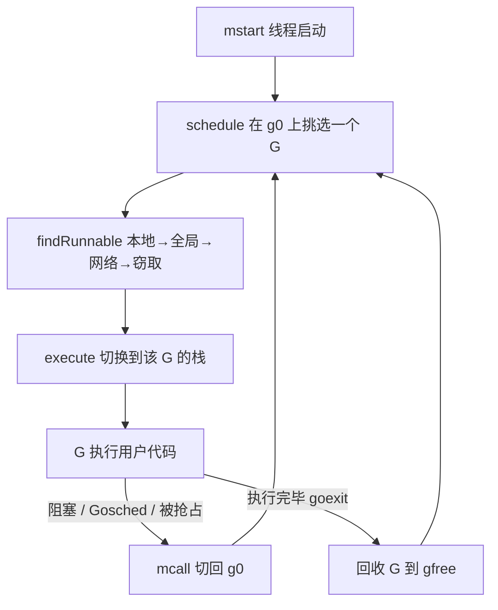

# 9.4 调度循环

前面几节备齐了材料：知道了 G、M、P 是什么，知道了一个 M 怎样找活儿（[9.2](./steal.md)）。
这一节把它们真正转起来，看调度循环如何在一个线程上一刻不停地挑选并运行 goroutine。

## 9.4.1 一个永不返回的循环

每个工作线程从 `mstart` 启动后，最终都会进入调度循环 `schedule`，此后便在其中周而复始，
直到线程退出。循环的骨架很简单：挑一个可运行的 G，切换过去执行它；这个 G 让出之后，
再挑下一个。

有一处细节值得点明：`schedule` 与 `findRunnable` 这些调度逻辑，本身并不跑在用户 G 的栈上，
而是跑在 M 那条专用的系统栈 `g0` 上（[9.3](./mpg.md)）。这带来一个清晰的分工：`g0` 负责
「调度」，用户 G 负责「干活」，两者通过栈切换往返。也正因为如此，`schedule` 从不真正返回，
它选中一个 G、跳过去执行，控制权要再回到调度逻辑，靠的是下面要讲的切回 `g0` 的动作，
而不是函数返回。

## 9.4.2 两次切换：execute 与 mcall

调度循环里有两个方向相反的栈切换，是理解它的关键。

**从 `g0` 跳到用户 G。** `schedule` 选出一个 G 后，调用 `execute`，由它把这个 G 的保存现场
（[9.3](./mpg.md) 里说的 PC、SP 等）装回寄存器，控制权就落到了用户 G 的栈上，从上次被切下的
地方继续往下跑。底层完成这一跳的是汇编例程 `gogo`。

**从用户 G 跳回 `g0`。** 运行中的 G 要让出 CPU，途径有三类：主动调用 `runtime.Gosched`、
因等待 channel 或锁等而阻塞、或被抢占（[9.7](./preemption.md)）。无论哪一种，最终都会调用
`mcall`：它切换到 `g0` 栈，并在 `g0` 上执行一个回调（如把当前 G 放回队列的 `goschedImpl`、
让 G 进入等待的 `park_m`）。回调干完，控制权又回到 `schedule`，新一轮挑选开始。

这一来一回，就是 goroutine 在「正在运行」与其他状态之间迁移的物理实现。状态机（[9.3](./mpg.md)）
描述的是「会发生哪些迁移」，`execute`/`mcall` 这对切换则是「迁移如何发生」。

## 9.4.3 一轮挑选里做了什么

`schedule` 每一轮并非只是闷头取本地队列。它还穿插了若干为公平与及时性服务的检查，
其中最常被提起的一条：每隔 61 次调度，就先去全局队列取一个 G，而不是一味地吃本地队列。

这条规则解决的是一个具体的饥饿场景：两个互相唤醒对方的 G，会在本地队列里你来我往，把本地
队列占满，使全局队列里的 G 迟迟得不到执行。隔一段固定的次数强制看一眼全局队列，就打破了
这种垄断。源码注释只解释了「为保证公平」，并未说明为何偏偏是 61，流传甚广的「61 是质数、
可避免共振」的说法属于民间推测，书中只取「61」这个事实，不为它附加未经证实的理由。

挑选的完整顺序仍是 [9.2](./steal.md) 给出的那条：`runnext` 与本地队列、全局队列、网络轮询器、
向其他 P 窃取，依次尝试，全部落空才让线程转入自旋或休眠。

## 9.4.4 goroutine 的诞生与消亡

循环之外，还有两端。**诞生**：`go f()` 经编译器翻译为对 `newproc` 的调用，它从空闲列表 `gfree`
取一个 G（取不到才新分配），设置好要执行的函数与初始栈，置为 Runnable 后放入当前 P 的队列，
通常放进 `runnext` 槽，好让刚派生的 G 优先、且就近被执行，利于局部性。**消亡**：G 的函数返回时
并不直接回到调用者，而是返回到运行时预先布置好的 `goexit`，由它做清理，把 G 置为 Dead 并挂回
`gfree` 供复用，然后回到 `schedule`。G 的复用避免了反复分配栈与结构体，是高频创建 goroutine
仍然廉价的原因之一。

到这里，单个线程上的调度循环就完整了。但真实程序里线程会因系统调用而阻塞、会因无活可干而
休眠，线程本身也需要被创建和管理，这是下一节 [9.5 线程管理](./thread.md) 的主题。

## 许可

&copy; 2018-2026 The [golang.design](https://golang.design) Initiative Authors. Licensed under [CC-BY-NC-ND 4.0](https://creativecommons.org/licenses/by-nc-nd/4.0/).
