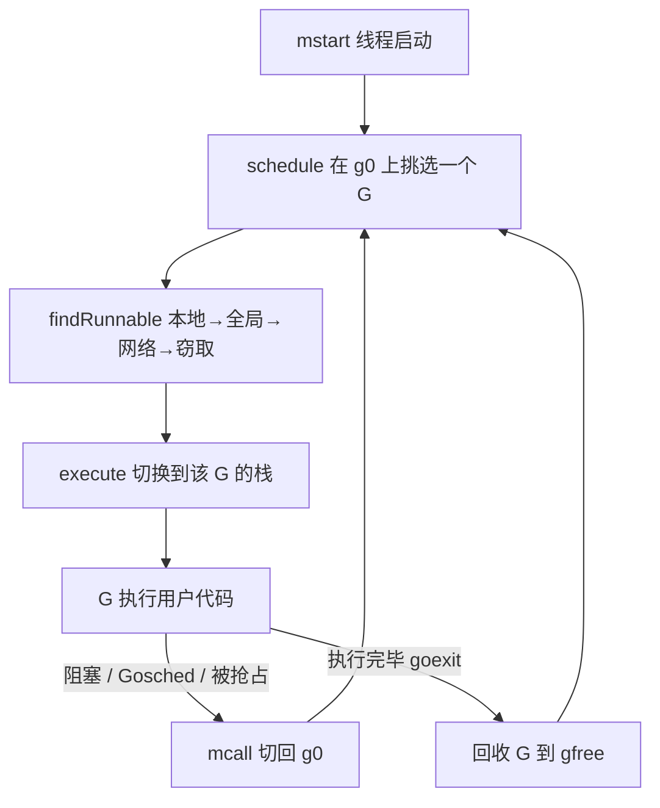

# 9.4 调度循环

前面几节备齐了材料：知道了 G、M、P 是什么，知道了一个 M 怎样找活儿（[9.2](./steal.md)）。
这一节把它们真正转起来，看调度循环如何在一个线程上一刻不停地挑选并运行 goroutine,以及它
如何在"让单个 goroutine 跑得久一点（吞吐、局部性）"与"别让任何 goroutine 饿死（公平）"之间
拿捏分寸。

## 9.4.1 一个永不返回的循环

Go 的调度是**协作式、运行到让出**（run-to-yield）的：一个 goroutine 一旦被选中，就一直跑到它
主动让出、阻塞、或被抢占（[9.7](./preemption.md)）为止,而不是像内核那样被时钟中断按固定时间片
切走。每个工作线程从 `mstart` 启动后，最终进入调度循环 `schedule`，此后在其中周而复始，
直到线程退出。骨架剥到最简，就是一个两步循环：

```go
// 每个 M 的调度循环（伪代码），运行在系统栈 g0 上，永不返回
func schedule() {
    gp := findRunnable()  // 见 9.2；找不到就阻塞在这里，直到有活儿
    execute(gp)           // gogo 切到 gp 的栈执行
    // gp 让出（阻塞/Gosched/被抢占）时经 mcall 切回 g0，并再次进入 schedule
}
```



`schedule` 与 `findRunnable` 这些调度逻辑跑在 M 的专用系统栈 `g0` 上（[9.3](./mpg.md)），
不在用户 G 的栈上。这带来清晰的分工：`g0` 负责调度，用户 G 负责干活。也正因如此，`schedule`
从不真正返回,它选中一个 G、跳过去执行，控制权要再回到调度逻辑，靠的是下面的栈切换，
而非函数返回。

## 9.4.2 两次切换：execute 与 mcall

调度循环里有两个方向相反的栈切换。**从 `g0` 跳到用户 G**：`schedule` 选出 G 后调用 `execute`，
由汇编例程 `gogo` 把这个 G 保存的现场（[9.3](./mpg.md) 的 `gobuf`）装回寄存器，控制权落到用户
G 的栈上，从上次被切下处继续。**从用户 G 跳回 `g0`**：G 要让出时（`Gosched`、阻塞、被抢占），
最终都调用 `mcall`,它切到 `g0` 栈，在 `g0` 上执行一个回调（把 G 放回队列的 `goschedImpl`、
让 G 进入等待的 `park_m` 等），回调干完就回到 `schedule`。这一来一回，正是 goroutine 在
"正在运行"与其他状态之间迁移（[9.3](./mpg.md) 的状态机）的物理实现：状态机说"会发生哪些
迁移"，`execute`/`mcall` 说"迁移如何发生"。

## 9.4.3 公平：不让任何人饿死

协作式调度有一个内在风险：若总让本地队列"最顺手"的 G 先跑，某些 G 可能永远排不上队。
`schedule` 为此布了几道公平阀门，它们合起来才让协作式调度在实践中不至于饿死任何人。

**全局队列的周期检查。** 每隔 **61** 次调度，`findRunnable` 会先去全局队列取一个 G，而不是
一味地吃本地队列。这解决一个具体的饥饿场景：两个互相唤醒对方的 G 会在本地队列里你来我往，
把本地队列占满，使全局队列里的 G 迟迟得不到执行。隔固定次数强制看一眼全局队列，就打破了
垄断。源码注释只解释"为保证公平"，并未说明为何偏偏是 61,流传甚广的"61 是质数、可避免共振"
之说属于民间推测，本书只取"61"这个事实。

**`runnext` 的反饥饿约束。** 刚被唤醒的 G 会被放进 P 的 `runnext` 槽优先运行，并**继承当前时间
片的剩余时间**（`inheritTime`），这让"通信即运行"的一对 goroutine 能作为一个单元被紧凑调度，
利于局部性。但它也可能被滥用成两个 G 互相 `runnext` 对方、霸占 CPU,所以运行时依赖 `sysmon`
（[9.8](./sysmon.md)）按时间片抢占来兜底。源码里有一处耐人寻味的细节：若编译时没有 `sysmon`
（某些受限环境），运行时会**禁用 `runnext`**，因为没有抢占兜底时，`runnext` 的乒乓会直接导致
饥饿。可见公平不是单点机制，而是多处协同的结果。

挑选的完整顺序仍是 [9.2](./steal.md) 给出的那条：`runnext` 与本地队列、全局队列、网络轮询器、
向其他 P 窃取，依次尝试，全部落空才让线程转入自旋或休眠。

## 9.4.4 goroutine 的诞生与消亡

循环之外还有两端。**诞生**：`go f()` 经编译器翻译为 `newproc`,它从 P 的空闲列表 `gFree` 取一个
G（取不到才新分配），设置好要执行的函数与初始栈，置为 Runnable 后放入当前 P 的队列（通常进
`runnext`，好让刚派生的 G 优先且就近执行）；若有空闲的 P 与睡着的 M，还会 `wakep` 唤醒一个来
增加并行度。**消亡**：G 的函数返回时并不直接回到调用者，而是返回到运行时预置的 `goexit`,
由它清理、把 G 置为 Dead 并挂回 `gFree` 供复用，然后回到 `schedule`。G 的复用避免了反复分配
栈与结构体，是高频创建 goroutine 仍然廉价的原因之一。

## 9.4.5 放到调度理论里看

Go 的"运行到让出 + 协作让权 + 信号抢占兜底"是一种混合。纯**协作式**（如早期的用户态线程、
Node 的事件循环单任务内）吞吐高、切换廉价，但一个不让权的任务能拖垮全局;纯**时间片抢占**
（内核线程）公平但切换昂贵。Go 取中间：默认靠协作让权与工作窃取获取吞吐与局部性，再用
`sysmon` 驱动的约 10ms 时间片抢占（[9.7](./preemption.md)）为公平兜底。这与 Erlang 的归约计数
抢占（每个进程跑约 2000 次归约即被切走）异曲同工,都是在协作的廉价与抢占的公平之间找平衡，
只是 Go 把抢占点放在函数调用与信号上，Erlang 放在归约计数上。没有"完美"的调度（[9.1](./model.md)
的在线/竞争比），`schedule` 这几道阀门，就是 Go 在吞吐、延迟、实现复杂度之间给出的具体答案。

## 延伸阅读的文献

1. Dmitry Vyukov. *Scalable Go Scheduler Design Doc*, 2012. https://go.dev/s/go11sched
2. The Go Authors. *runtime/proc.go*（`schedule`、`findRunnable`、`execute`、`goexit` 等）.
   https://github.com/golang/go/blob/master/src/runtime/proc.go
3. Erik Stenman. *The BEAM Book：Scheduling*（归约计数抢占的对照）.
   https://github.com/happi/theBeamBook

## 许可

&copy; 2018-2026 The [golang.design](https://golang.design) Initiative Authors. Licensed under [CC-BY-NC-ND 4.0](https://creativecommons.org/licenses/by-nc-nd/4.0/).
