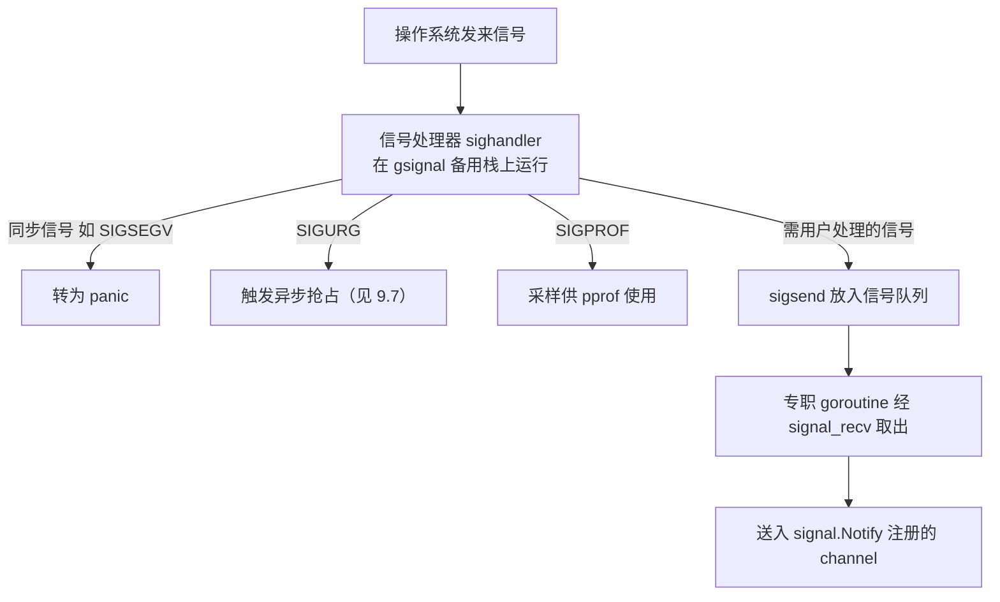

# 9.6 信号处理机制

操作系统信号是异步的、底层的：它可能在任意时刻打断任意线程，而处理器里能做的事又极其受限。
Go 用户想要的，却往往是用 `signal.Notify` 把一个 channel 接上 `SIGINT`，优雅地收尾。运行时
要做的，正是在这两者之间搭一座桥：把凶险的异步信号，转化成可被 goroutine 安然消费的事件。
这座桥的设计，处处受"信号上下文能做什么"这一硬约束支配。

## 9.6.1 异步信号安全：处理器里几乎什么都不能做

信号处理器运行在一个被打断的、不确定的上下文里:被打断的线程可能正持有 `malloc` 的锁、
正处于某个数据结构的中间状态。因此 POSIX 规定，信号处理器里只能调用**异步信号安全**
（async-signal-safe）的函数,一个很短的白名单，`malloc`、绝大多数加锁、乃至大部分标准库都
不在其列。在处理器里分配内存或获取普通锁，几乎必然踩雷（死锁或破坏状态）。

正因如此，所有支持信号的运行时都遵循同一条铁律：**在处理器里只做不得不做的最少事，把真正的
处理推迟到安全的地方。** 经典手法是 W. R. Stevens 提出的**自管道技巧**（self-pipe trick）:
处理器只往一个管道写一个字节，主事件循环在另一头读，从而把信号"降格"成一次普通的可读事件。
Linux 后来提供了 `signalfd` 把这一手法标准化。Go 走的是同一思路的变体，只是那个"管道"换成了
运行时内部的无锁队列。

## 9.6.2 处理器只入队，goroutine 再分发

Go 为它关心的信号安装统一的处理器（`sighandler`），它运行在每个 M 专门的备用信号栈
（`gsignal`）上，而非被打断的用户 G 的栈,以免在栈空间不足或状态不一致时雪上加霜。处理器
迅速判明信号种类后，按三类去向处理。

**同步信号**由当前线程自己的非法操作引发,空指针解引用的 `SIGSEGV`、除零的 `SIGFPE`。它们与
被打断的代码有直接因果关系，运行时把它们转化为 Go 的 panic,于是一次空指针解引用在 Go 里
表现为可被 `recover` 的运行时错误，而非进程默默崩溃。**运行时自用的信号**就地处理：`SIGURG`
用于异步抢占（[9.7](./preemption.md)），`SIGPROF` 用于性能分析的定时采样
（[16 工具与可观测性](../../part5toolchain/ch16tools)）。**需要交给用户的信号**（如 `SIGINT`、
`SIGTERM`）才走那座桥：处理器通过 `sigsend` 把信号放进无锁队列便立刻返回；运行时另有一个
专职 goroutine 阻塞在 `signal_recv` 上，把信号取出、投递到 `signal.Notify` 注册的 channel。
异步、受限的信号，至此变成了普通的 channel 接收，用户用熟悉的 `select` 就能优雅处理。

这套两段式与 [9.7](./preemption.md) 异步抢占"信号里只注入一次调用、真正的抢占回到运行时完成"
是同一种思路:**在受限上下文里只做最少事，把其余推回安全地带。**

## 9.6.3 与其他运行时及一个实际副作用

信号与托管运行时的关系一向微妙。JVM 也要处理 `SIGSEGV`（用于空检查与安全点轮询的页保护
陷入）等，并提供**信号链**（signal chaining，`libjsig`）以便与使用同一信号的本地库共存。
这类"运行时要用信号、用户和本地库也要用信号"的冲突，是所有托管运行时的共同难题，Go 选
`SIGURG` 做抢占信号，正是为了挑一个调试器会放行、libc 极少用、程序本就该容忍的信号来减少冲突。

一个常被忽视的实际副作用：异步抢占（Go 1.14 起）让程序收到的信号显著增多，于是更多慢速
系统调用会以 `EINTR` 中断返回。POSIX 的 `SA_RESTART` 能让部分被中断的系统调用自动重启，
但并非全部,因此正确的 Go 代码（以及它依赖的 `syscall` 封装）必须能容忍并重试 `EINTR`。这是
"为了可抢占性"付出的一处可见代价，也提醒我们：信号机制的每个选择，都会沿着系统调用一路
波及到用户可观察的行为。

## 延伸阅读的文献

1. W. Richard Stevens, Stephen A. Rago. *Advanced Programming in the UNIX Environment.*
   （异步信号安全、self-pipe 技巧；信号处理的权威论述）
2. The Go Authors. *os/signal 包文档与 runtime/signal_unix.go.*
   https://pkg.go.dev/os/signal
3. The Linux man-pages. *signal-safety(7)*（异步信号安全函数白名单）;
   *signalfd(2)*. https://man7.org/linux/man-pages/man7/signal-safety.7.html
4. OpenJDK. *Signal Chaining（libjsig）.*
   https://docs.oracle.com/en/java/javase/21/docs/specs/man/java.html

## 许可

&copy; 2018-2026 The [golang.design](https://golang.design) Initiative Authors. Licensed under [CC-BY-NC-ND 4.0](https://creativecommons.org/licenses/by-nc-nd/4.0/).
