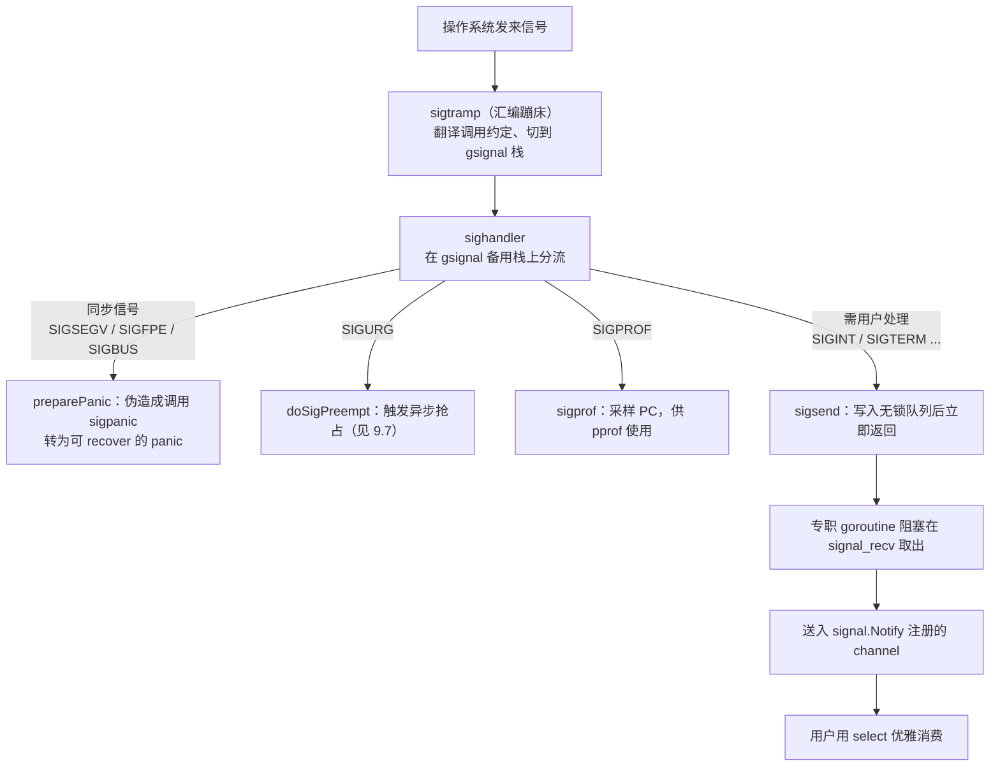

# 9.6 信号处理机制

操作系统信号是异步的、底层的：它可能在任意时刻打断任意线程，而处理器（signal handler）里
能做的事又极其受限。Go 用户想要的，却往往是用 `signal.Notify` 把一个 channel 接上 `SIGINT`，
在收到时优雅收尾。运行时要做的，正是在这两者之间搭一座桥：把凶险的异步信号，转化成可被
goroutine 安然消费的事件。这座桥的每一处设计，都受「信号上下文里能做什么」这一硬约束支配。
读懂了这条约束，本节其余的机制就都只是它的推论。

## 9.6.1 异步信号安全：处理器里几乎什么都不能做

信号处理器运行在一个被打断的、不确定的上下文里。被打断的线程此刻可能正持有 `malloc` 的锁、
正处在某个数据结构的中间状态，甚至正在分配器内部改写元数据。一旦处理器里再去调用
`malloc` 或获取同一把锁，便会自我死锁，或读到半成品状态而崩溃。POSIX 因此规定，信号处理器
里只能调用**异步信号安全**（async-signal-safe）的函数，这是一份很短的白名单（见
`signal-safety(7)`）：`write`、`_exit`、`sigaction` 这类不碰锁、不碰分配器的系统调用在列，
而 `malloc`、`printf`、绝大多数 `pthread` 加锁、乃至大部分 C 标准库都**不在**其列。

这条约束逼出了所有支持信号的运行时共同遵守的一条铁律：

> 在处理器里只做不得不做的最少事，把真正的处理推迟到一个安全的地方去做。

这正是经典手法**自管道技巧**（self-pipe trick，W. R. Stevens 在 APUE 中给出的范式）的来由：
处理器什么都不干，只往一个事先建好的管道写一个字节；主事件循环（`select`/`poll`）在管道另一头
监听，于是「收到信号」被降格成一次普通的「管道可读」事件，后续处理便回到了不受限的常规上下文里。
Linux 后来用 `signalfd(2)` 把这一手法收编进内核，让信号能直接以文件描述符的形式被 `epoll` 消费。

Go 走的是同一思路的变体，只是把那根「管道」换成了运行时内部的一个**无锁队列**（[9.6.4](#964-sigsend无锁队列与专职接收-goroutine)）。
理由也很 Go：自管道每次投递都要一次 `write` 系统调用，而 Go 的信号处理与调度器、垃圾回收
深度耦合，用一个进程内的原子状态机来「写一个 bit、唤醒一个等待者」，比反复进出内核更省，也更
可控。本节接下来的几小节，便是沿着这条铁律，看 Go 如何把它落实到处理器、备用栈、队列与
专职 goroutine 这几样零件上。

## 9.6.2 gsignal：处理器自带的一段安全栈

铁律的第一处落实，是给处理器一段**专门的栈**。信号可能在用户 goroutine 的栈快用尽时降临，
若处理器还在这段紧绷的栈上运行，极易触发栈溢出；更麻烦的是，Go 的栈是可增长的（[14.6](../../part4memory/ch14stack)），
而栈增长本身要分配、要加锁，正是处理器里碰不得的操作。解法是 POSIX 的 `sigaltstack(2)`：
为线程预先登记一段**备用信号栈**，内核在分发信号时自动切到这段栈上执行处理器。

Go 为**每个 M** 配一个名为 `gsignal` 的特殊 goroutine，它的栈就是这个 M 的备用信号栈。
`gsignal` 在 `mcommoninit` 阶段经 `mpreinit` 创建，是除 `g0`（[9.3](./mpg.md)）之外每个 M
最先拥有的 g，它不参与调度，没有用户代码意义上的 goid，存在的唯一目的就是「承载信号处理」：

```go
// 每个 M 初始化时为它创建 gsignal（速写，见 os_*.go 的 mpreinit）
func mpreinit(mp *m) {
	mp.gsignal = malg(32 * 1024) // 备用信号栈，Darwin/AIX 要求 >= 8K
	mp.gsignal.m = mp            // gsignal 永远绑定它所属的 M
}
```

M 进入 `mstart` 后，`minit` 会调用 `minitSignalStack`，通过 `sigaltstack` 把
`gsignal.stack` 登记为本线程的备用信号栈。这里有一处为 cgo 准备的细心：若该线程已被非 Go 的
C 代码设过备用信号栈（非 Go 线程回调进 Go 的情形），运行时不会粗暴覆盖，而是把现成的那段栈
接管为 `gsignal` 的栈，并在 `unminit` 时原样还回去。把「在哪段栈上处理信号」这件事每个 M
各管一份，正是让信号处理与 goroutine 调度互不干扰的前提。

## 9.6.3 处理器只入队，goroutine 再分发

栈备好了，下一步是安装处理器并在信号到来时分流。Go 在 `initsig` 阶段为它关心的每个信号
安装统一入口。值得注意，内核回调的并不是 `sighandler` 本身，而是一段汇编蹦床 `sigtramp`：
信号到来时，内核以 C 的调用约定跳进 `sigtramp`，由它保存上下文、切换到 Go 运行时世界，
再调用 `sigtrampgo`，后者把当前 g 切到本 M 的 `gsignal`，最后才进入真正的 `sighandler`。
这一层蹦床的存在，是因为内核并不知道 Go 的 g/m/p 抽象，必须有人先把执行环境「翻译」过来。

```go
// 信号到来后的入口翻译（速写，见 signal_unix.go）
func sigtrampgo(sig uint32, info *siginfo, ctx unsafe.Pointer) {
	if sigfwdgo(sig, info, ctx) {
		return // 该信号不归 Go 管：转发给 Go 之前已存在的 handler（cgo 场景）
	}
	gp := sigFetchG(&sigctxt{info, ctx})
	setg(gp.m.gsignal)            // 切到本 M 的备用信号栈所对应的 g
	// ...必要时按 sigaltstack 的实际值校正栈边界（非 Go 代码改过的情形）
	sighandler(sig, info, ctx, gp)
	setg(gp)                      // 处理完恢复被打断的 g
}
```

`sigfwdgo` 是与本地库共存的关键：并非所有信号都该由 Go 处理，若某信号原本由用户的 C 库
注册过处理器，Go 会把它转发回去，而不是据为己有。这一点在 [9.6.5](#965-与其他运行时的取舍以及一个实际副作用)
还会回到。

真正的分流发生在 `sighandler` 里。它迅速判明信号种类后，按**三类去向**处理：



**第一类，同步信号。** `SIGSEGV`（空指针解引用）、`SIGFPE`（除零）、`SIGBUS` 这些由当前线程
自己的非法操作就地引发，与被打断的代码有直接因果关系。运行时不让进程默默崩溃，而是把它们
转化为 Go 的 panic：`preparePanic` 改写被打断处的栈与 PC，伪装成「出错那一点调用了
`sigpanic`」，待处理器返回、控制流回到用户 g 时，便从 `sigpanic` 处抛出一个可被 `recover`
捕获的运行时错误。判定靠 `sigtable` 里的 `_SigPanic` 标志，且仅当信号确实来自内核（而非用户
`kill`）、被打断的又确是用户 g 时才这么做，否则只能 throw：

```go
// sighandler 的三段分流（裁剪自 signal_unix.go）
func sighandler(sig uint32, info *siginfo, ctxt unsafe.Pointer, gp *g) {
	c := &sigctxt{info, ctxt}

	if sig == _SIGPROF {          // 运行时自用：性能采样
		sigprof(c.sigpc(), c.sigsp(), c.siglr(), gp, getg().m)
		return
	}
	if sig == sigPreempt && debug.asyncpreemptoff == 0 {
		doSigPreempt(gp, c)       // 运行时自用：异步抢占（见 9.7），随后继续
	}

	flags := sigtable[sig].flags
	if !c.sigFromUser() && flags&_SigPanic != 0 {
		// 同步信号：把现场伪造成调用了 sigpanic，转为可 recover 的 panic
		gp.sig, gp.sigpc, gp.sigcode1 = sig, c.sigpc(), c.fault()
		c.preparePanic(sig, gp)
		return
	}
	if c.sigFromUser() || flags&_SigNotify != 0 {
		if sigsend(sig) {         // 用户信号：放进无锁队列，立刻返回
			return
		}
	}
	// 剩下的是 _SigKill / _SigThrow：杀死或带栈崩溃
	if flags&_SigKill != 0 {
		dieFromSignal(sig)
	}
	// ... throw，打印栈并退出
}
```

**第二类，运行时自用的信号，就地处理。** `SIGPROF` 是 pprof 的定时采样源
（[16 工具与可观测性](../../part5toolchain/ch16tools)），处理器在被打断处抓一份 PC 交给
`sigprof` 记账即返回；`SIGURG` 是异步抢占的载体（[9.7](./preemption.md)），处理器调用
`doSigPreempt` 在被打断的 g 上「注入一次抢占请求」便返回。注意抢占信号即便命中，处理器也不
独吞，而是继续往下走完分流，因为一个 `SIGURG` 可能与别的信号合并到达。

**第三类，需要交给用户的信号，才走那座桥。** `SIGINT`、`SIGTERM`、`SIGHUP` 这些带
`_SigNotify` 标志、或确由用户 `kill` 发来的信号，处理器只调用 `sigsend` 把它塞进无锁队列就
立刻返回，绝不在处理器里碰 channel、碰锁、碰分配。真正的投递交给队列另一头的专职 goroutine。

这三类的判定，全部编码在 `sigtable` 的标志位里，每个信号一行：

```go
const (
	_SigNotify   = 1 << iota // 允许 signal.Notify 收到它（哪怕来自内核）
	_SigKill                 // Notify 不接则静默退出
	_SigThrow                // Notify 不接则带栈崩溃
	_SigPanic                // 来自内核时转为 panic（SIGSEGV/SIGFPE/SIGBUS）
	_SigDefault              // 未显式请求则不监控
	// _SigGoExit / _SigSetStack / _SigUnblock / _SigIgn ...
)
// 例：SIGSEGV 标 _SigPanic，SIGINT 标 _SigNotify+_SigKill，SIGQUIT 标 _SigNotify+_SigThrow
```

## 9.6.4 sigsend：无锁队列与专职接收 goroutine

桥的两端，是 `sigsend`（生产者，跑在处理器里）与 `signal_recv`（消费者，跑在专职 goroutine 里），
中间是一个进程内全局的 `sig` 结构。因为生产端身处异步信号安全的牢笼，这个队列必须是**无锁**
且**不分配**的，整张表是固定大小的位图，状态机用原子的 CAS 驱动：

```go
// 信号队列：处理器与接收 goroutine 之间的无锁通道（速写，见 sigqueue.go）
var sig struct {
	note       note                          // 接收方睡眠/唤醒用
	mask       [(_NSIG + 31) / 32]uint32      // 已入队、待接收方取走的信号位图
	wanted     [(_NSIG + 31) / 32]uint32      // 用户经 Notify 声明关心的信号
	ignored    [(_NSIG + 31) / 32]uint32      // 被 Ignore 的信号
	recv       [(_NSIG + 31) / 32]uint32      // 接收方的本地副本
	state      atomic.Uint32                  // sigIdle / sigSending / sigReceiving
	delivering atomic.Uint32                  // 正在 sigsend 中的处理器计数
	inuse      bool
}
```

`sigsend` 做的事很克制：把信号对应的 bit 用 CAS 置进 `sig.mask`，再用一个三态状态机决定要不要
唤醒接收方。`state` 这三个状态是整套同步的核心，它让「写一个 bit」与「唤醒一个睡眠者」这两件事
不必各自加锁就能正确配合：

```go
func sigsend(s uint32) bool {
	bit := uint32(1) << (s & 31)
	if w := atomic.Load(&sig.wanted[s/32]); w&bit == 0 {
		return false                          // 没人关心这个信号，直接放行
	}
	// 把 bit 置进出队列；若已在队列里，省去重复唤醒
	for {
		mask := sig.mask[s/32]
		if mask&bit != 0 {
			return true
		}
		if atomic.Cas(&sig.mask[s/32], mask, mask|bit) {
			break
		}
	}
	// 仅当接收方正睡眠（sigReceiving）时才 notewakeup，避免无谓的系统调用
	for {
		switch sig.state.Load() {
		case sigIdle:
			if sig.state.CompareAndSwap(sigIdle, sigSending) {
				return true                   // 接收方醒着，它稍后自会来看
			}
		case sigSending:
			return true                       // 已有待处理通知
		case sigReceiving:
			if sig.state.CompareAndSwap(sigReceiving, sigIdle) {
				notewakeup(&sig.note)         // 唤醒睡眠的接收方
				return true
			}
		}
	}
}
```

队列另一端，`signal_recv` 跑在一个普通的、不受异步信号安全约束的 goroutine 里，可以自由地
睡眠与被唤醒。它先把 `sig.mask` 整体换进自己的本地副本 `recv`，逐位取出返回；本地空了就把
状态切到 `sigReceiving` 并睡到 `sig.note` 上，等下一次 `sigsend` 唤醒。这一进一出，恰好对称：

```go
func signal_recv() uint32 {
	for {
		for i := uint32(0); i < _NSIG; i++ {  // 先把本地副本里的信号逐个交出
			if sig.recv[i/32]&(1<<(i&31)) != 0 {
				sig.recv[i/32] &^= 1 << (i & 31)
				return i
			}
		}
		for {                                  // 本地空了：睡眠等 sigsend 唤醒
			switch sig.state.Load() {
			case sigIdle:
				if sig.state.CompareAndSwap(sigIdle, sigReceiving) {
					notetsleepg(&sig.note, -1) // 在普通 goroutine 上下文里安全睡眠
					noteclear(&sig.note)
				}
			case sigSending:
				if sig.state.CompareAndSwap(sigSending, sigIdle) {
				}
			}
			break
		}
		for i := range sig.mask {              // 把出队列整体搬进本地副本
			sig.recv[i] = atomic.Xchg(&sig.mask[i], 0)
		}
	}
}
```

最后一段在用户态，由 `os/signal` 包接手。它在首次 `Notify` 时懒启动一个 goroutine 跑
`loop`，循环调用 `signal_recv` 取信号，再 `process` 分发到用户注册的 channel 上：

```go
// os/signal：把运行时取出的信号投递到用户 channel（速写）
func loop() {
	for {
		process(syscall.Signal(signal_recv()))
	}
}
func process(sig os.Signal) {
	handlers.Lock()
	defer handlers.Unlock()
	for c, h := range handlers.m {            // 遍历所有经 Notify 注册的 channel
		if h.want(signum(sig)) {
			select {
			case c <- sig:                    // 非阻塞投递，满了就丢，避免拖住 loop
			default:
			}
		}
	}
}
```

到这里，那个在异步、受限上下文里诞生的信号，已经变成了一次普普通通的 channel 接收。用户
只需 `signal.Notify(ch, os.Interrupt)` 再 `<-ch`，就能用最熟悉的 `select` 优雅地处理它。
注意 `process` 的投递是**非阻塞**的：channel 满了就丢弃，这是刻意的取舍，宁可漏一个信号，
也不让分发循环被一个迟钝的消费者拖死。这也是为何 `signal.Notify` 的 channel 通常应带缓冲。

## 9.6.5 与其他运行时的取舍，以及一个实际副作用

信号与托管运行时的关系一向微妙，根子在于：运行时想用信号，用户和本地库也想用信号，而一个
进程里同一个信号的处理器只有一份。JVM 同样要接管 `SIGSEGV`（用于空检查与安全点轮询的页保护
陷入）、`SIGBUS` 等，并为此提供**信号链**（signal chaining，`libjsig`）：把它接管之前已存在的
处理器记下来，遇到不归自己管的情形再链式转发回去。Go 的 `sigfwdgo`（[9.6.3](#963-处理器只入队goroutine-再分发)）
解决的是同一个问题，只是方向相反，它在 Go 安装自己的处理器前先把旧的存进 `fwdSig`，需要时
转发。两套机制殊途同归，都是为了让运行时与本地库在同一个信号上和平共处。

正因为信号是稀缺的共享资源，Go 给异步抢占挑「哪个信号」时格外讲究。运行时源码里列了一串
启发式条件：要被调试器默认放行、不被 libc 在混合二进制里内部占用、能够无害地虚假触发、还要
在没有实时信号的平台（如 macOS）上可用。`SIGUSR1`/`SIGUSR2` 因常被应用赋予真实含义而出局，
`SIGALRM` 因无法分辨是不是真的定时器到点而出局。最终选中的是 `SIGURG`：它名义上报告
socket 的带外数据，而带外数据近乎无人使用，且它连「是哪个 socket」都不告诉你，本就近乎废弃，
应用即便用到也必须容忍它虚假到来。挑一个「无害到可以随便发」的信号，是这套设计的点睛之笔。

这套选择带来一个常被忽视的**实际副作用**。自 Go 1.14 引入异步抢占（[9.7](./preemption.md)）后，
一个忙碌的程序会频繁收到 `SIGURG`，而信号会中断阻塞中的慢速系统调用，使其以 `EINTR` 返回。
POSIX 的 `SA_RESTART` 标志能让一部分被中断的系统调用自动重启，Go 安装处理器时也确实带上了
它，但并非所有系统调用都可重启（如 `poll`、某些 `read`）。因此正确的 Go 代码以及它依赖的
`syscall` 封装，必须能识别并重试 `EINTR`。这是「为了可抢占性」付出的一处看得见的代价，也提醒
我们：信号机制里的每一个选择，都会沿着系统调用一路波及到用户可观察的行为。性能与能力的提升
从不白来，它总在别处留下需要照看的角落。

## 9.6.6 小结

把本节串起来：异步信号安全这一条硬约束（[9.6.1](#961-异步信号安全处理器里几乎什么都不能做)），
逼出了「处理器里只做最少事」的铁律；铁律落到零件上，就是每个 M 自带的 `gsignal` 备用栈
（[9.6.2](#962-gsignal处理器自带的一段安全栈)）、`sighandler` 的三类分流
（[9.6.3](#963-处理器只入队goroutine-再分发)）、以及把用户信号「降格」成 channel 事件的
无锁队列与专职 goroutine（[9.6.4](#964-sigsend无锁队列与专职接收-goroutine)）。这套两段式
与 [9.7](./preemption.md) 的异步抢占同出一辙：在受限的信号上下文里只注入最小的一步，把真正
的工作推回安全地带完成。理解了这一点，下一节的异步抢占便只是同一手法在调度上的又一次施展。

## 延伸阅读的文献

1. W. Richard Stevens, Stephen A. Rago. *Advanced Programming in the UNIX Environment*,
   3rd ed. Addison-Wesley, 2013.（异步信号安全、self-pipe 技巧，信号处理的权威论述）
2. The Linux man-pages project. *signal-safety(7)*（异步信号安全函数白名单）;
   *sigaltstack(2)*; *signalfd(2)*.
   https://man7.org/linux/man-pages/man7/signal-safety.7.html
3. The Go Authors. *runtime/signal_unix.go、runtime/sigqueue.go*（`sighandler`、`sigtramp`/
   `sigtrampgo`、`sigsend`/`signal_recv`、`sigPreempt = _SIGURG` 的选型注释）.
   https://github.com/golang/go/blob/master/src/runtime/signal_unix.go
4. The Go Authors. *os/signal 包文档与 src/os/signal/signal_unix.go*（`Notify`/`loop`/`process`）.
   https://pkg.go.dev/os/signal
5. The Go Authors. *Proposal: Non-cooperative goroutine preemption*（#24543，`SIGURG` 与
   异步抢占的设计动机）. https://go.googlesource.com/proposal/+/master/design/24543-non-cooperative-preemption.md
6. Oracle / OpenJDK. *Signal Chaining（libjsig）*（托管运行时与本地库共享信号的工业实践）.
   https://docs.oracle.com/en/java/javase/21/docs/specs/man/java.html
7. 本书 [9.3 调度器组件](./mpg.md)、[9.7 协作与抢占](./preemption.md)、
   [14.6 栈管理](../../part4memory/ch14stack).

## 许可

&copy; 2018-2026 The [golang.design](https://golang.design) Initiative Authors. Licensed under [CC-BY-NC-ND 4.0](https://creativecommons.org/licenses/by-nc-nd/4.0/).
