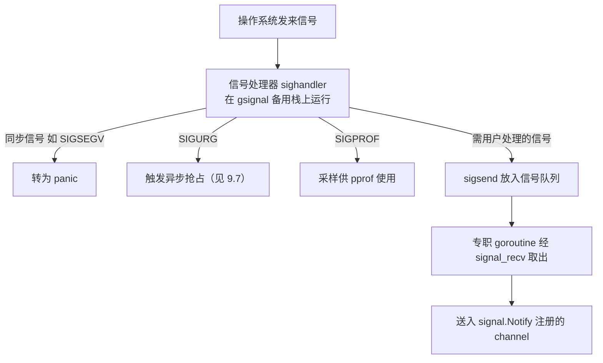

# 9.6 信号处理机制

操作系统信号是异步的、底层的：它可能在任意时刻打断任意线程，处理器能做的事又极其受限。
而 Go 用户想要的，往往是用 `signal.Notify` 把一个 channel 接上 `SIGINT`，优雅地收尾。
运行时要做的，正是在这两者之间搭一座桥：把凶险的异步信号，转化成可被 goroutine 安然消费的事件。

## 9.6.1 信号处理器能做的事很少

Go 为它关心的信号安装统一的处理器（`sighandler`）。它运行在一条专门的备用信号栈
（对应每个 M 的 `gsignal`）上，而不是被打断的那个 G 的栈上，以免在栈空间不足或状态不一致时
雪上加霜。在这个上下文里，几乎什么都不能做：不能分配内存、不能获取普通锁、不能随意调度。
因此处理器的策略是「尽快脱身」：迅速判明信号种类，做最小的动作，把真正的处理推迟到安全的
地方。

## 9.6.2 三类去向

信号按性质有三类不同的归宿。

**同步信号**由当前线程自己的非法操作引发，例如空指针解引用触发的 `SIGSEGV`、除零触发的
`SIGFPE`。它们与被打断的代码有直接因果关系，运行时把它们转化为 Go 的 panic，于是一次空指针
解引用在 Go 里表现为一个可被 `recover` 的运行时错误，而非进程默默崩溃。

**运行时自用的信号**就地处理，不打扰用户。`SIGURG` 用于异步抢占（[9.7](./preemption.md)），
`SIGPROF` 用于性能分析的定时采样（[16 工具与可观测性](../../part5toolchain/ch16tools)）。

**需要交给用户处理的信号**（如 `SIGINT`、`SIGTERM`）才走那座桥。处理器通过 `sigsend` 把信号
放进一个无锁的信号队列，便立刻返回；运行时另有一个专职 goroutine 阻塞在 `signal_recv` 上，
把信号从队列取出，再投递到 `signal.Notify` 注册的 channel 里。异步、受限的信号，至此变成了
普通的 channel 接收，用户用熟悉的 `select` 就能优雅处理。

## 9.6.3 为什么要这样绕

这套「处理器只入队、goroutine 再分发」的两段式，根源在于信号处理器上下文的极端受限。直接在
处理器里执行用户的 channel 发送，几乎必然踩中分配或加锁的雷区。把动作切成「在处理器里做最小
的入队」与「在正常 goroutine 里做完整的分发」两半，就把危险的部分压到了最小，其余都搬回到
安全的常规执行环境中。这与 [9.7](./preemption.md) 异步抢占「信号里只注入一次调用、真正的抢占
回到运行时完成」是同一种思路：**在受限上下文里只做不得不做的最少事，把其余推回安全地带。**

## 许可

&copy; 2018-2026 The [golang.design](https://golang.design) Initiative Authors. Licensed under [CC-BY-NC-ND 4.0](https://creativecommons.org/licenses/by-nc-nd/4.0/).
