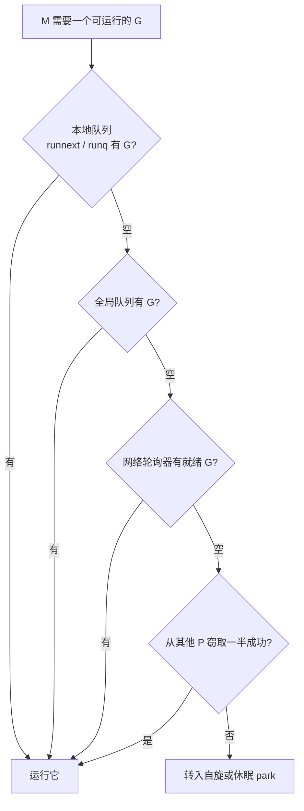

# 9.2 工作窃取式调度

[9.1](./model.md) 留下一个问题：每个 P 各有一条本地队列，活儿难免分布不均，有的 P 忙不过来，
有的 P 无所事事。如何在不引入中心瓶颈的前提下把负载摊匀，是并发调度的核心难题之一。Go 的
答案是工作窃取（work stealing）。

## 9.2.1 共享还是窃取

把任务在处理器间挪动，历史上有两种范式。一种是**工作共享**（work sharing）：谁生出了新任务，
就主动把一部分推给空闲的处理器。另一种是**工作窃取**（work stealing）：空闲的处理器自己动手，
去别人那里把任务偷过来。两者的关键差别在迁移的频率。工作共享只要有新任务就可能触发迁移；
工作窃取则只在某个处理器真的没活干时才迁移，当所有处理器都很忙时，窃取者找不到下手的机会，
迁移自然停止。负载越重，工作窃取反而越安静，这正是它被青睐的原因。

工作窃取的思路至少可追溯到 Burton 与 Sleep 1981 年对函数式程序并行执行的研究，
以及 Halstead 1984 年对 Multilisp 的实现。把它发展为有严格理论保证的调度算法，
则是 MIT 的 Cilk 项目与 Blumofe、Leiserson 的工作（见 [9.1](./model.md) 的理论一节）。

## 9.2.2 Go 的找活儿顺序

一个绑定了 P 的 M，运行完手头的 G 后要找下一个。它并不直接去窃取，而是按一条由近及远、
由廉价到昂贵的顺序搜索，这条逻辑集中在运行时的 `findRunnable`。



写成伪代码，这条顺序一目了然：

```go
// findRunnable：M 找下一个可运行的 G（伪代码）
func findRunnable() *g {
    // 1. 每 61 次调度，先瞄一眼全局队列，保证公平
    if pp.schedtick%61 == 0 && !sched.runq.empty() {
        if gp := globrunqget(); gp != nil { return gp }
    }
    if gp := runqget(pp); gp != nil { return gp }   // 2. 本地队列（含 runnext）
    if gp := globrunqget(); gp != nil { return gp }  // 3. 全局队列
    if gp := netpoll(); gp != nil { return gp }      // 4. 网络轮询器
    if gp := stealWork(); gp != nil { return gp }    // 5. 从其他 P 窃取一半
    stopm()                                          // 6. 实在没有：自旋或休眠
}
```

先看本地：`runnext` 槽里那个刚被唤醒、最该接着跑的 G 优先，然后是本地队列。本地空了，
才去看全局队列与网络轮询器（[9.9](./poller.md)）。这些都没有，才进入窃取：随机挑一个别的 P
作为目标，把它本地队列里的 G 偷走一半。一半这个比例是经验之选，既能一次拿到足够的活儿
摊薄窃取的开销，又不至于把对方掏空、引发来回拉锯。

## 9.2.3 三个让窃取高效的细节

**本地队列是有界的。** 每个 P 的本地队列是一个定长 256 的环形缓冲。定长换来的是无锁的快路径：
绝大多数入队、出队都不必去碰全局锁。队列放满时，运行时会把其中一半搬到全局队列
（`runqputslow`），全局队列由锁保护、容量不限，专门兜住溢出。廉价的常态走本地，昂贵的边界
走全局，是这一设计的取舍。

**窃取目标是随机且打散的。** 如果所有空闲的 P 都从同一个起点按固定顺序去偷，它们会一窝蜂
挤向同一个目标，彼此争抢。Go 让每个窃取者以一个随机起点、加上一个与 P 总数互质的随机步长，
走出一条覆盖所有 P 的伪随机排列。互质保证不重不漏地遍历，随机起点与步长则把窃取者岔开，
避免羊群效应。

**自旋线程避免线程颠簸。** 频繁地让线程休眠又唤醒，代价很高。Go 允许少量 M 处于自旋
（spinning）状态，主动地反复查找可运行的 G 而不立刻休眠，数量上限为 `GOMAXPROCS`。
有自旋的 M 在，新就绪的 G 能被很快接住，而不必每次都去唤醒一个睡着的线程。这是一处典型的
以一点 CPU 空转，换取调度延迟与线程管理开销的折中。

## 9.2.4 理论保证

> 本小节面向有兴趣的读者，可跳过。

工作窃取之所以可靠，不只是工程直觉。对一个总工作量为 $T_1$、关键路径长度为 $T_\infty$ 的计算，
Blumofe 与 Leiserson 证明，随机化工作窃取在 $P$ 个处理器上的期望执行时间满足

$$\mathbb{E}[T_P] \le \frac{T_1}{P} + O(T_\infty),$$

并且额外的空间与处理器间通信都有上界。其中 $T_1/P$ 是理想的线性加速项，$O(T_\infty)$ 是无法
再被并行化的串行尾巴。这条界限说明：只要计算本身有足够的并行性（$T_\infty$ 相对 $T_1$ 足够小），
工作窃取就能逼近线性加速。分析的关键，是把每次失败的窃取尝试与关键路径的推进对应起来，
从而把总开销摊到 $O(T_\infty)$ 上。Go 的实现是这套理论的工程化身，尽管它为贴合真实硬件
做了大量取舍（有界队列、全局队列兜底、自旋线程等），骨架仍是那套随机化窃取。

## 延伸阅读的文献

1. Robert D. Blumofe and Charles E. Leiserson. "Scheduling Multithreaded Computations
   by Work Stealing." *Journal of the ACM*, 46(5), 1999, pp. 720-748.
   https://doi.org/10.1145/324133.324234
2. F. Warren Burton and M. Ronan Sleep. "Executing Functional Programs on a Virtual
   Tree of Processors." *FPCA 1981*.
3. Robert H. Halstead Jr. "Implementation of Multilisp: Lisp on a Multiprocessor."
   *LFP 1984*.（Multilisp 与工作窃取的早期实践）
4. Nimar S. Arora, Robert D. Blumofe, C. Greg Plaxton. "Thread Scheduling for
   Multiprogrammed Multiprocessors." *SPAA 1998*.（非阻塞窃取双端队列）
5. Dmitry Vyukov. *Scalable Go Scheduler Design Doc*, 2012.
   https://go.dev/s/go11sched

## 许可

&copy; 2018-2026 The [golang.design](https://golang.design) Initiative Authors. Licensed under [CC-BY-NC-ND 4.0](https://creativecommons.org/licenses/by-nc-nd/4.0/).
