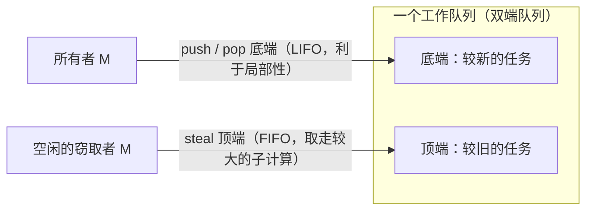

# 9.2 工作窃取式调度

[9.1](./model.md) 留下一个问题：每个 P 各有一条本地队列，活儿难免分布不均，有的 P 忙不过来，
有的 P 无所事事。如何在不引入中心瓶颈的前提下把负载摊匀，是并发调度的核心难题。Go 的答案，
是一个有着三十年理论积累、并在整个工业界反复出现的设计：工作窃取（work stealing）。

本节会比别处走得更深一些：先讲清 Go 怎么做，再追到它背后的调度理论（为什么它「可证明地好」），
然后横看它在 Cilk、Java、Rust 等系统里的不同化身，最后停在仍然开放的问题上。

## 9.2.1 共享还是窃取

把任务在处理器间挪动，历史上有两种范式。**工作共享**（work sharing）：谁生出新任务，就主动把
一部分推给空闲的处理器。**工作窃取**（work stealing）：空闲的处理器自己动手，去别人那里把任务
偷过来。差别在迁移的频率。工作共享只要有新任务就可能触发迁移；工作窃取只在某个处理器真的
没活干时才迁移，当所有处理器都忙，窃取者找不到下手的机会，迁移自然停止。**负载越重，
工作窃取反而越安静**，这是它相对工作共享的根本优势，也有严格的通信量界限支撑（见 9.2.4）。

## 9.2.2 Go 的找活儿顺序

一个绑定了 P 的 M 运行完手头的 G 后，并不直接去窃取，而是按一条由近及远、由廉价到昂贵的
顺序搜索（运行时的 `findRunnable`）：

```go
// findRunnable：M 找下一个可运行的 G（伪代码）
func findRunnable() *g {
    if pp.schedtick%61 == 0 && !sched.runq.empty() { // 1. 每 61 次先看全局，保证公平
        if gp := globrunqget(); gp != nil { return gp }
    }
    if gp := runqget(pp); gp != nil { return gp }     // 2. 本地队列（含 runnext）
    if gp := globrunqget(); gp != nil { return gp }    // 3. 全局队列
    if gp := netpoll(); gp != nil { return gp }        // 4. 网络轮询器
    if gp := stealWork(); gp != nil { return gp }      // 5. 从其他 P 窃取一半
    stopm()                                            // 6. 实在没有：自旋或休眠
}
```

三个让窃取高效的细节。**本地队列有界**：每个 P 是一个定长 256 的环形缓冲，绝大多数入队出队
无锁；放满时把一半搬到全局队列（`runqputslow`）兜底。**窃取目标随机且打散**：若所有空闲 P 都
从同一起点按固定顺序去偷，会一窝蜂挤向同一目标。Go 让每个窃取者以随机起点加上一个与 P 总数
**互质**的随机步长，走出覆盖全部 P 的伪随机排列，互质保证不重不漏，随机化避免羊群效应。
**自旋线程**：允许少量 M 处于自旋态（上限 `GOMAXPROCS`，计于 `sched.nmspinning`）主动找活儿
而不立刻休眠，新就绪的 G 能被迅速接住，免去频繁的线程休眠唤醒。

## 9.2.3 一点必要的模型

要讲清楚工作窃取「好在哪」，先要有一把尺子。把一段并行计算抽象成一张有向无环图（DAG），
每个结点是一条单位时间的指令，边是依赖关系。两个量刻画它：

- **总工作量** $T_1$：结点总数，即单处理器上的运行时间；
- **关键路径长度**（span）$T_\infty$：最长依赖链的长度，即无穷多处理器下的运行时间。

二者之比 $T_1/T_\infty$ 称为**并行度**，它是可能获得的加速比上限。任何调度器在 $P$ 个处理器上的
运行时间 $T_P$ 都不可能低于 $\max(T_1/P,\ T_\infty)$。一个好的调度器，应当让 $T_P$ 尽量贴近这个
下界。

## 9.2.4 为什么工作窃取「可证明地好」

**贪心调度的上界。** Graham（1969）证明，任何「不让处理器无故空闲」的贪心调度都不会差到哪里去：

$$T_P \le \frac{T_1 - T_\infty}{P} + T_\infty \le \frac{T_1}{P} + T_\infty.$$

这同时意味着贪心调度至多是最优解的 $2 - 1/P$ 倍。Brent（1974）对算术表达式求值给出了同型的
$t + (q-t)/p$ 形式。这条界限常被笼统称作「Brent 定理」，但更一般、更早的其实是 Graham 的
列表调度结果，值得正名。

**随机化工作窃取的界限。** 贪心上界只说「别让处理器闲着就不会太差」，没说怎么**分布式地**做到。
Blumofe 与 Leiserson（FOCS 1994；JACM 1999）证明，对**完全严格**（fully-strict，即 join 边只
指向父线程的 fork-join 计算）的计算，随机化工作窃取在期望意义上达到

$$\mathbb{E}[T_P] = \frac{T_1}{P} + O(T_\infty),$$

并且所需空间不超过 $S_1 \cdot P$（$S_1$ 为串行执行的空间），处理器间通信的期望不超过
$O(P \cdot T_\infty \cdot S_{\max})$。三个界限一起说明：只要计算本身并行度足够（$T_\infty \ll T_1$），
工作窃取就能逼近线性加速，且空间与通信代价都有上界。

> 证明的精髓（面向有兴趣的读者）：给每个就绪结点按其在 DAG 中的深度赋一个**几何递减的势能**，
> 计算推进时总势能下降。一个「balls into bins」式的引理表明，$P$ 个处理器各做一次随机窃取尝试，
> 总有常数比例命中非空队列的顶端，于是 $\Theta(P)$ 次尝试就能让势能下降一个常数因子。而势能
> 沿关键路径只能下降 $O(T_\infty)$ 次，因此**期望的成功窃取次数为 $O(P \cdot T_\infty)$**。把这些
> 窃取与空闲时间摊到 $P$ 个处理器上，正好是 $O(T_\infty)$，叠加干活的 $T_1/P$ 即得上界。空间与
> 通信界则依赖完全严格性带来的「busy-leaves」性质，每次窃取只迁移一个活动记录帧。

**窃取用的双端队列。** 这些界限要落地，靠的是一个精心设计的数据结构。经典做法里，每个处理器
维护一个**双端队列**：所有者从**底端** push/pop（LIFO，刚产生的子任务最可能仍在缓存里，
局部性好），窃取者从**顶端** steal（FIFO，偷走较早、通常较大的子计算，一次偷够本）。



Arora、Blumofe 与 Plaxton（SPAA 1998）给出了无锁（non-blocking）的窃取双端队列，并把分析推广
到了「多道程序」环境（操作系统未必持续给满 $P$ 个处理器）。Chase 与 Lev（SPAA 2005）进一步给出
可增长的循环数组版本，是今天实践中最常被采用的设计。需要澄清一个常见误传：所谓 **THE 协议**
与**工作优先原则**（work-first principle）出自 Cilk-5（Frigo、Leiserson、Randall，PLDI 1998），
**并非** ABP 的贡献，ABP 贡献的是那个无锁双端队列。

值得强调的是：**Go 的实现并不是这个经典 LIFO 双端队列**。Go 的本地队列是一个 FIFO 环形缓冲，
外加一个 LIFO 的 `runnext` 槽来照顾刚派生的 G 的局部性（[9.3](./mpg.md)）；窃取仍是「偷一半」。
这是工程对理论的一次改写。

## 9.2.5 同一个思想的众多化身

工作窃取不是 Go 的发明，它的思想最早可追溯到 Burton 与 Sleep（1981）对函数式程序并行执行的
研究、Halstead（1984）的 Multilisp，而把它发展成有严格保证、可工程化的，是 MIT 的 Cilk 项目。
此后它几乎成了并行运行时的标准件，但各家的取舍不尽相同：

- **Cilk / Cilk-5**：fork-join 的鼻祖，确立了工作优先原则与 THE 协议、两段克隆编译。
- **Intel TBB**、**Java `ForkJoinPool`**（Doug Lea，2000，自称「Cilk 工作窃取框架的变体」）、
  **.NET TPL**：都建立在 Cilk 式工作窃取之上；其中 TPL 刻意用「duplicating queue」而非 THE。
- **Rust Rayon**：以 `join(a, b)` 为核心的 fork-join 数据并行；**Tokio** 的多线程异步运行时则
  明确借鉴了 **Go 的**定长本地队列算法（带一个 LIFO 槽 + 全局队列）。

而 Go 与上面这条 Cilk 谱系有一处根本不同，必须讲清楚：**Cilk 系是 fork-join 的任务 DAG 调度器，
Go 是通用的 M:N goroutine 调度器**。goroutine 是任意的、会因 channel/系统调用/网络 I/O 而阻塞、
还会被异步抢占（[9.7](./preemption.md)）的执行单元，它们**不构成完全严格的 fork-join DAG**。
因此，9.2.4 那条漂亮的 $T_1/P + O(T_\infty)$ 保证，**对 Go 并不成立**。Go 的工作窃取是一个借鉴了
这套理论的**负载均衡启发式**，而非可证明最优的调度器。理解这一点，才不会把理论的结论错套到
goroutine 上。

## 9.2.6 演进与开放问题

Go 自己的工作窃取也在演进：Go 1.1 随 GMP 引入工作窃取（Vyukov 2012 设计文档），Go 1.5
为每个 P 增设 `runnext` 槽以照顾新派生 G 的局部性与延迟，自旋线程的管理也几经打磨。

这套机制远未「完工」，前沿仍有不少开放问题。**NUMA 感知**：随机窃取对内存局部性视而不见，
把任务偷到另一个 NUMA 节点会付远程访存的代价（[9.11](./numa.md)），如何在保留随机窃取的
负载均衡最优性的同时引入局部性偏好，仍是活跃课题。**延迟与吞吐的张力**：LIFO 本地 + FIFO 窃取
对吞吐与缓存友好，却可能饿死延迟敏感的任务，各家都在用 FIFO 槽、公平计数、抢占等手段打补丁。
**高核数扩展性**：全局队列与无协调的随机窃取在核数很高时会产生争用与无效窃取，缓解手段
（空闲线程 park、自旋阈值、分层队列）多是启发式的。**理论与实践的鸿沟**：干净的 $T_1/P+O(T_\infty)$
只对 fork-join DAG 成立，如何为「会阻塞、有 I/O、可抢占」的通用调度给出可证明的界限，
基本仍是开放的。

## 延伸阅读的文献

1. R. L. Graham. "Bounds on Multiprocessing Timing Anomalies." *SIAM J. Applied Math.*,
   17(2), 1969. https://doi.org/10.1137/0117039 （贪心/列表调度的 2-近似界）
2. Richard P. Brent. "The Parallel Evaluation of General Arithmetic Expressions."
   *Journal of the ACM*, 21(2), 1974. https://doi.org/10.1145/321812.321815
3. Robert D. Blumofe and Charles E. Leiserson. "Scheduling Multithreaded Computations
   by Work Stealing." *FOCS 1994*；*Journal of the ACM*, 46(5), 1999.
   https://doi.org/10.1145/324133.324234 （时间/空间/通信三大界限）
4. Nimar S. Arora, Robert D. Blumofe, C. Greg Plaxton. "Thread Scheduling for
   Multiprogrammed Multiprocessors." *SPAA 1998*. https://doi.org/10.1145/277651.277678
   （无锁窃取双端队列）
5. David Chase and Yossi Lev. "Dynamic Circular Work-Stealing Deque." *SPAA 2005*.
   https://doi.org/10.1145/1073970.1073974
6. Matteo Frigo, Charles E. Leiserson, Keith H. Randall. "The Implementation of the
   Cilk-5 Multithreaded Language." *PLDI 1998*. https://doi.org/10.1145/277650.277725
   （工作优先原则、THE 协议、两段克隆）
7. Doug Lea. "A Java Fork/Join Framework." *ACM Java Grande 2000*.
   https://doi.org/10.1145/337449.337465
8. Daan Leijen, Wolfram Schulte, Sebastian Burckhardt. "The Design of a Task Parallel
   Library." *OOPSLA 2009*. https://doi.org/10.1145/1640089.1640106
9. F. Warren Burton and M. Ronan Sleep. "Executing Functional Programs on a Virtual
   Tree of Processors." *FPCA 1981*. （工作窃取思想的早期源头）
10. Carl Lerche. *Making the Tokio scheduler 10x faster*, 2019.
    https://tokio.rs/blog/2019-10-scheduler （Tokio 借鉴 Go 的本地队列算法）
11. Dmitry Vyukov. *Scalable Go Scheduler Design Doc*, 2012. https://go.dev/s/go11sched
