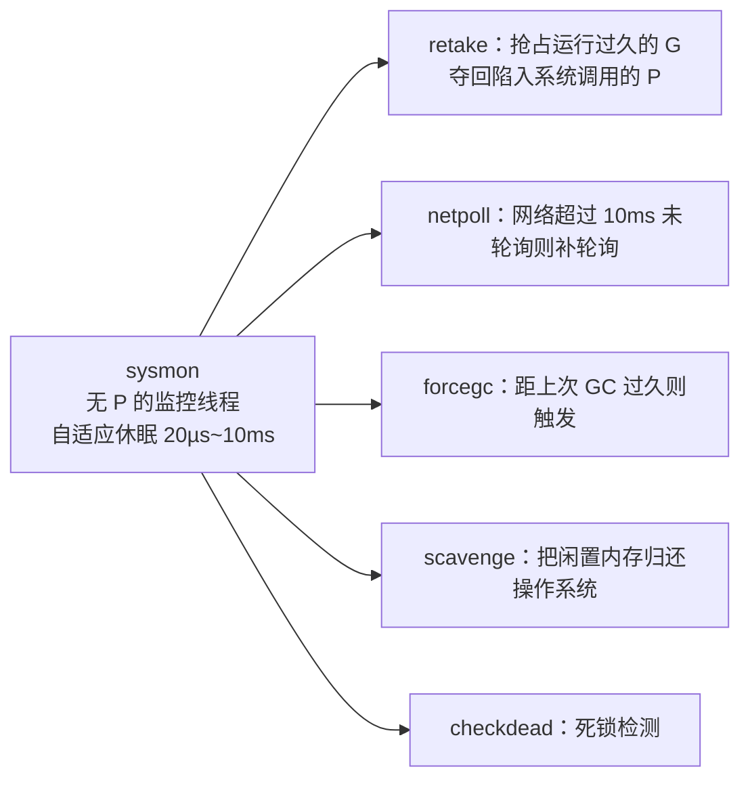

# 9.8 系统监控

协作式调度有一个内在的脆弱点：它依赖 goroutine 自觉让权。可万一某个环节不自觉，谁来兜底？
答案是 `sysmon`，一个独立于普通调度之外的系统监控线程。它是整台调度机器的"守夜人"。

## 9.8.1 一个站在调度之外的观察者

`sysmon` 是一个特殊的 M：它**不绑定 P**，也不参与 [9.4](./schedule.md) 的调度循环，而是在自己的
循环里独立运转。这一点至关重要，正因为它不依赖普通调度，当普通调度被某个赖着不走的 G 拖住时，
它依然在外面照常巡查。它是那个"无论里面发生什么，都还醒着"的角色。

为了既灵敏又不浪费 CPU，`sysmon` 的巡查节奏是自适应的：空闲时睡得久一些，最长约 10ms；
一旦发现有事可做，就把睡眠间隔缩短，快速响应。

## 9.8.2 它都看着什么

**retake 是它最核心的职责，分两种。** 其一，抢占运行过久的 G：`sysmon` 检查每个 P 上的 G 已经
连续运行了多久，一旦超过约 10ms（`forcePreemptNS`），就调用 `preemptone` 把它标记为可抢占，
这正是 [9.7](./preemption.md) 里那两条抢占路径的触发者，时间片的大致公平由此而来。其二，
夺回陷入系统调用的 P：当某个 M 陷在系统调用里太久，它手里那个 P 就被白白占着，`sysmon` 会把
这个 P 收回，转交给别的 M 去运行其他 G（[9.5 线程管理](./thread.md)）。

**netpoll 兜底。** 正常情况下调度循环每轮都会顺手看一眼网络轮询器（[9.9](./poller.md)），
但万一长时间没有轮询，`sysmon` 会在网络超过约 10ms 没被轮询时主动补一次，把就绪的网络
goroutine 注入回运行队列，避免 I/O 事件被无限期耽搁。

**还有几件后台杂务。** 距上次垃圾回收太久（约 2 分钟）则强制触发一轮（`forcegc`）；
把长期闲置的内存归还操作系统（`scavenge`，见 [12 内存分配器](../../part4memory/ch12alloc)）；
以及在所有 goroutine 都无法推进时报告死锁（`checkdead`，见 [16.1 运行时死锁检查](../../part5toolchain/ch16tools/deadlock.md)）。

## 9.8.3 设计上的意义

把这些职责单独交给一个站在调度之外的线程，是一处典型的"安全网"设计。抢占、I/O 就绪、
GC 节奏，这些都不能假设用户 goroutine 会配合，于是 `sysmon` 提供了一个不依赖配合的后备保障。
协作式调度之所以能在 Go 里既简单又可靠，很大程度上正因为背后有这位守夜人盯着。

## 许可

&copy; 2018-2026 The [golang.design](https://golang.design) Initiative Authors. Licensed under [CC-BY-NC-ND 4.0](https://creativecommons.org/licenses/by-nc-nd/4.0/).
