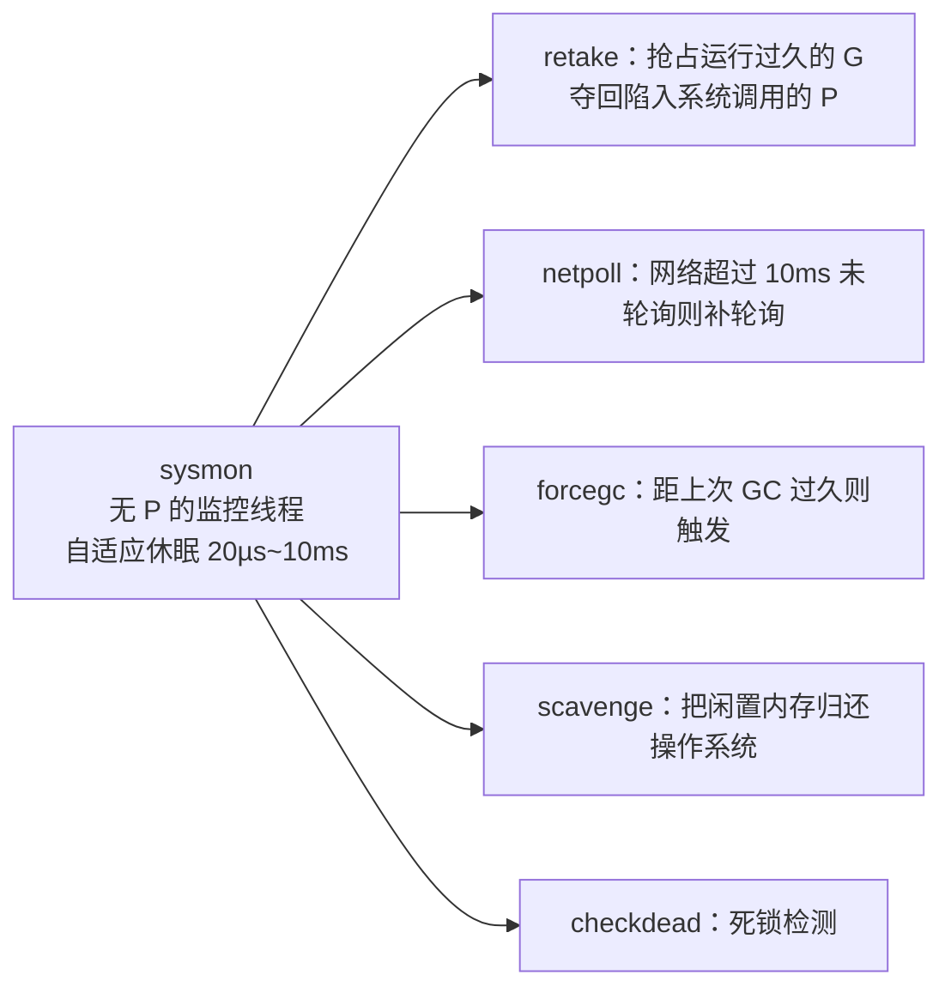

# 9.8 系统监控

协作式调度有一个内在的脆弱点：它依赖 goroutine 自觉让权。可万一某个环节不自觉,一个死循环
不肯抢占、一个系统调用迟迟不归、网络长时间无人轮询,谁来兜底？答案是 `sysmon`，一个独立于
普通调度之外的系统监控线程。它是整台调度机器的"守夜人"，也是许多托管运行时共有的一类角色。

## 9.8.1 一个站在调度之外的观察者

`sysmon` 是一个特殊的 M：它**不绑定 P**，也不参与 [9.4](./schedule.md) 的调度循环，而在自己的
循环里独立运转。这一点至关重要,正因为它不依赖普通调度，当普通调度被某个赖着不走的 G 拖住
时，它依然在外面照常巡查。它是那个"无论里面发生什么都还醒着"的角色。

为了既灵敏又不浪费 CPU，`sysmon` 的巡查节奏是自适应的：空闲时睡得久些，最长约 10ms;
一旦发现有事可做，就缩短睡眠间隔以快速响应。这种"平时低频心跳、有事则加快"的退避策略，
是监控线程的常见设计。

## 9.8.2 它都看着什么

**retake 是它最核心的职责，分两种。** 其一，**抢占运行过久的 G**：`sysmon` 检查每个 P 上的 G
已连续运行多久，一旦超过约 10ms（`forcePreemptNS`），就调用 `preemptone` 把它标记为可抢占,
这正是 [9.7](./preemption.md) 两条抢占路径的触发者，时间片的大致公平由此而来。其二，
**夺回陷入系统调用的 P**：当某个 M 陷在系统调用里太久，它手里的 P 被白白占着，`sysmon` 通过
`handoffp` 把 P 收回转交别的 M，让这份并行度立刻投入到别的 G 上（[9.5](./thread.md)）。

**netpoll 兜底。** 正常情况下调度循环每轮都会顺手轮询网络（[9.9](./poller.md)），但万一长时间
没有轮询，`sysmon` 会在网络超过约 10ms 没被轮询时主动补一次，把就绪的网络 goroutine 注入回
运行队列，避免 I/O 事件被无限期耽搁。**后台杂务**还有：距上次 GC 太久（约 2 分钟）则强制触发
一轮（`forcegc`）；把长期闲置的内存归还操作系统（`scavenge`，[12 内存分配器](../../part4memory/ch12alloc)）；
以及在所有 goroutine 都无法推进时报告**死锁**（`checkdead`，
[16.1 运行时死锁检查](../../part5toolchain/ch16tools/deadlock.md)）。

## 9.8.3 监控线程：一个跨系统的共同角色

把关键的"看护"职责交给一个独立于业务执行之外的线程，是系统软件里反复出现的模式。
HotSpot JVM 有一组专职线程在应用线程之外运转,如执行 GC、安全点、偏向锁撤销等 VM 操作的
`VMThread`，以及各类 Service Thread。操作系统内核里有 **soft-lockup / hung-task 看门狗**，
周期性检查是否有 CPU 或任务长时间不推进并告警。它们与 `sysmon` 的共性是：**用一个不参与
正常工作流、不会被正常工作流阻塞的观察者，来保证整个系统的活性与公平。** 区别在于职责边界,
内核看门狗只告警不干预，JVM 的 VMThread 主要服务于 VM 操作，而 Go 的 `sysmon` 兼具抢占、
I/O 兜底、GC 节奏、内存归还、死锁检测等多重身份，是一个相当"全能"的守夜人。

## 9.8.4 设计上的意义

把这些职责单独交给一个站在调度之外的线程，是一处典型的"安全网"设计。抢占、I/O 就绪、
GC 节奏，这些都不能假设用户 goroutine 会配合，于是 `sysmon` 提供了一个不依赖配合的后备保障。
协作式调度之所以能在 Go 里既简单又可靠，很大程度上正因为背后有这位守夜人盯着,它把"协作式
的廉价"与"抢占式的兜底"缝合在了一起。这也呼应本章的主线：简洁的用户态语义（一个 `go`
关键字）背后，是运行时承担了大量不可见的复杂度。

## 延伸阅读的文献

1. The Go Authors. *runtime/proc.go*（`sysmon`、`retake`、`forcePreemptNS`、`handoffp`）.
   https://github.com/golang/go/blob/master/src/runtime/proc.go
2. The Linux Kernel. *Softlockup / hung task detector.*
   https://www.kernel.org/doc/html/latest/admin-guide/lockup-watchdogs.html
3. OpenJDK HotSpot. *The VMThread and VM operations.*
   https://wiki.openjdk.org/display/HotSpot/Runtime+Overview

## 许可

&copy; 2018-2026 The [golang.design](https://golang.design) Initiative Authors. Licensed under [CC-BY-NC-ND 4.0](https://creativecommons.org/licenses/by-nc-nd/4.0/).
