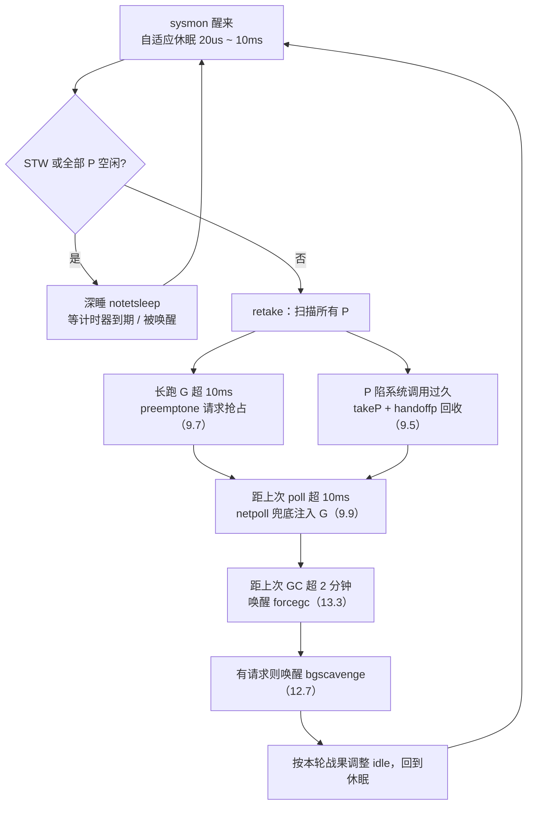

# 9.8 系统监控

> 本节内容对标 Go 1.26。

调度器的常规路径已在 [9.4 调度循环](./schedule.md) 讲清：一个 M 绑定一个 P，
从队列里取 Goroutine，运行，再取下一个。这条路径有一个前提，它本身得有机会跑起来。
可一旦所有 P 都陷进长时间的系统调用，或某个 Goroutine 死循环占着 P 不放，常规调度便
卡住了，没有谁来抢回 P，也没有谁来 poll 网络。换句话说，协作式的、跑在 P 上的逻辑，
管不了「P 本身都动不了」这种局面。

Go 的答案是在调度循环之外另设一条命脉。运行时启动时，`main` 用 `newm` 拉起一个特殊的 M，
专门运行 `sysmon`：

```go
func main() {
	// ...
	if haveSysmon {
		systemstack(func() {
			newm(sysmon, nil, -1) // 一个不绑定 P 的特殊 M
		})
	}
	// ...
}
```

这个 M 的特殊之处在于它**不持有 P，也永不进入常规调度**。它靠运行时自带的通知机制
（Linux 上是 futex）睡眠与唤醒，不依赖调度器，因此即便所有 P 都被卡住，它照样醒来巡视一圈。
这正是 watchdog（看门狗）的设计：把监督者放在被监督系统之外，它才看得见系统的停摆。

## 9.8.1 心跳：自适应的休眠节律

sysmon 是一个永不退出的循环，每一轮醒来巡查各项职责，做完继续睡。它的难处在于睡多久。
睡太久，抢占与网络轮询的响应就迟钝；睡太频，又在系统空闲时白白烧 CPU。sysmon 用一套
**自适应退避**调和这对矛盾：忙时勤勉，闲时疏懒。

```go
//go:nowritebarrierrec
func sysmon() {
	lock(&sched.lock)
	sched.nmsys++ // 计入「不参与死锁判定」的系统 M
	checkdead()   // 启动时先做一次死锁检查，见 9.8.5
	unlock(&sched.lock)

	idle := 0       // 连续多少轮没能「叫醒某人」（抢占 / 注入 G 均落空）
	delay := uint32(0)
	for {
		if idle == 0 {        // 起步先睡 20us
			delay = 20
		} else if idle > 50 { // 空转超过 1ms 后，睡眠时间翻倍
			delay *= 2
		}
		if delay > 10*1000 {  // 封顶 10ms
			delay = 10 * 1000
		}
		usleep(delay)
		// ... 巡查各项职责（见下文）...
	}
}
```

休眠从 $20\,\mu s$ 起步。只要每轮都有活干（抢占成功、或往队列注入了 G），`idle` 归零，
sysmon 就维持在最小间隔，保持灵敏。若连续 50 余轮无所事事，它判定系统进入空闲，
便让休眠时间成倍增长，直到 $10\,ms$ 封顶。区间 $[20\,\mu s, 10\,ms]$ 的两端各有讲究：
下界要小到足以及时抢占（抢占阈值正是 $10\,ms$，见 [9.8.2](#982-retake抢占与回收)），
上界要大到空闲时几乎不耗电。

退避之上还有一层深睡。当正在 STW、或所有 P 都空闲（`sched.npidle == gomaxprocs`）时，
没有什么可监督的，sysmon 索性 `notetsleep` 睡到下一个计时器到期或被显式唤醒为止，
彻底让出 CPU。唤醒若来自系统调用返回，意味着应用又开始干活，于是把 `idle` 与 `delay`
复位回最灵敏的状态，赌一把「刚从系统调用抢回过 P，很可能马上还要再抢」。

## 9.8.2 retake：抢占与回收

醒来后的头等大事是 `retake`，它扫一遍所有 P，对两类「赖着不走」的情形动手。这是 sysmon
作为抢占式调度兜底的核心，把 [9.7](./preemption.md) 协作式抢占管不到的死角补上。

第一类是**长时间独占 P 的 Goroutine**。若某个 P 在同一个 `schedtick` 上停留超过
`forcePreemptNS`（$10\,ms$），说明它运行的 Goroutine 一直没让出，sysmon 便对它发出抢占请求：

```go
const forcePreemptNS = 10 * 1000 * 1000 // 10ms，一个 G 在被抢占前可独占的时间片

func retake(now int64) uint32 {
	// ... 遍历 allp ...
	if int64(pd.schedtick) != schedt {
		pd.schedtick = uint32(schedt) // schedtick 变了：说明发生过调度，重新计时
		pd.schedwhen = now
	} else if pd.schedwhen+forcePreemptNS <= now {
		preemptone(pp) // 同一 schedtick 上停留超 10ms：请求抢占
		sysretake = true
	}
	// ...
}
```

`preemptone`（见 [9.7](./preemption.md)）只是「请求」，真正的让出靠目标 Goroutine 自己
配合，Go 1.14 起则可由信号触发异步抢占。但若该 P 正卡在系统调用里，`preemptone`
鞭长莫及，因为执行流根本不在 Go 代码中，无人响应抢占。这就引出第二类。

第二类是**陷在系统调用里的 P**。一个 M 进入系统调用后，它持有的 P 处于运行态却无人推进，
若长期如此，这个 P 上排队的 Goroutine 与可窃取的任务就被白白冻结。sysmon 把这块 P 夺回来，
交给别的 M 去跑：

```go
	// retake 中处理陷于系统调用的 P（裁剪）
	thread, ok := setBlockOnExitSyscall(pp) // 拦住该线程，使其暂时无法退出系统调用
	if !ok {
		goto done // 已不在系统调用中，或状态变了
	}
	// 队列空、且系统里尚有自旋或空闲的 M 能兜底时，暂不夺取
	if runqempty(pp) && sched.nmspinning.Load()+sched.npidle.Load() > 0 &&
		pd.syscallwhen+10*1000*1000 > now {
		thread.resume()
		goto done
	}
	thread.takeP() // 摘走 P
	thread.resume()
	handoffp(pp)   // 把 P 转交给另一个 M（见 9.5）
```

`handoffp`（见 [9.5 线程管理](./thread.md)）会为这块 P 找一个新 M，或在确无活可干时
让它进入空闲。这里有处微妙的并发顾虑：动手前要先 `incidlelocked(-1)`，假装多了一个
运行中的 M，否则被夺取的那个 M 一旦从系统调用返回、发现无事可做又无其他运行的 M，
会误报死锁。回收并非来者不拒：若 P 的本地队列为空、且系统里尚有自旋或空闲的 M 可以兜底，
sysmon 宁可放它一马，避免无谓的线程切换。

`retake` 当轮有所斩获，便把 `idle` 归零，让 sysmon 保持灵敏；颗粒无收则 `idle++`，
向深睡靠拢。这一计数正是 [9.8.1](#981-心跳自适应的休眠节律) 那套退避的输入。

## 9.8.3 网络轮询的兜底

常规情况下，网络就绪事件由调度循环在找活时顺手 `netpoll` 收取（见 [9.9 网络轮询器](./poller.md)）。
可如果所有 P 都忙于计算、长时间没人去 poll，已经就绪的网络 Goroutine 就会饿着。sysmon 是
这条路径的兜底：

```go
	// 超过 10ms 没有 poll 过网络，就由 sysmon 兜底 poll 一次
	lastpoll := sched.lastpoll.Load()
	if netpollinited() && lastpoll != 0 && lastpoll+10*1000*1000 < now {
		sched.lastpoll.CompareAndSwap(lastpoll, now)
		list, delta := netpoll(0) // 非阻塞，返回就绪的 G 列表
		if !list.empty() {
			incidlelocked(-1)
			injectglist(&list) // 把就绪的 G 注入全局队列
			incidlelocked(1)
			netpollAdjustWaiters(delta)
		}
	}
```

阈值同样是 $10\,ms$：距上次轮询超过这个间隔，sysmon 便非阻塞地 poll 一次，把就绪的
Goroutine 注入队列。这保证了即便整个程序陷在计算密集的循环里，网络 I/O 的响应延迟也有
一个上界，不至于无限拖延。

## 9.8.4 强制 GC 与归还内存

两项与内存相关的职责也搭在 sysmon 这趟班车上。其一是**强制 GC**。即便程序分配缓慢、
迟迟够不到按堆增长触发 GC 的阈值，运行时也不愿让上一轮 GC 后的垃圾无限期滞留。sysmon
每轮检查距上次 GC 是否已超过 `forcegcperiod`（默认 $2$ 分钟），是则唤醒那个常驻的
`forcegc` Goroutine 去发起一轮回收（触发逻辑见 [13.3](../../part4memory/ch13gc/pacing.md)）：

```go
	if t := (gcTrigger{kind: gcTriggerTime, now: now}); t.test() && forcegc.idle.Load() {
		lock(&forcegc.lock)
		forcegc.idle.Store(false)
		var list gList
		list.push(forcegc.g)
		injectglist(&list) // 唤醒 forcegc goroutine，由它发起 GC
		unlock(&forcegc.lock)
	}
```

注意 sysmon 自己**并不执行** GC，它只是把 `forcegc.g` 注入队列，由常规调度去运行。原因正是
本节开头那条铁律：sysmon 不持有 P、不能有写屏障（`//go:nowritebarrierrec`），跑不了
需要写屏障配合的 GC 代码。它扮演的只是定时闹钟。

其二是**向操作系统归还空闲内存**（scavenge，见 [12.7 页分配器](../../part4memory/ch12alloc/pagealloc.md)）。
这里有一处值得一讲的演进。早期版本里，sysmon 会在循环内**直接**清理一段时间未用的堆页。
后来运行时把这项工作拆给一个专门的后台 Goroutine `bgscavenge`，按内存压力自行调步，sysmon
退到只在收到请求时把它**唤醒**：

```go
	if scavenger.sysmonWake.Load() != 0 {
		scavenger.wake() // 仅唤醒专职的 bgscavenge goroutine
	}
```

这条「从内联执行到只管唤醒」的迁移，是 Go 运行时反复出现的一个模式：把耗时且需要精细
调步的活儿从 sysmon 这条公共命脉上剥离，交给独立 Goroutine，sysmon 只保留「踢一脚」的
轻量职责。它让 sysmon 这趟班车始终跑得快，不被任何单项任务拖慢。同期还出现了一项
`sysmonUpdateGOMAXPROCS`，每秒至多一次，按容器的 CPU 配额动态调整 `GOMAXPROCS`，同样
只是「探一下、调一下」的轻活。

## 9.8.5 死锁检测

`checkdead` 回答一个尖锐的问题：如果所有 Goroutine 都阻塞了，谁也无法推进，程序就该报
`fatal error: all goroutines are asleep - deadlock!` 而非静静挂死。它清点系统里运行与
阻塞的 M、以及待处理的计时器与网络等待，若发现无人可以再被唤醒，便判定死锁。

值得澄清一个常见的误解：死锁检测并非 sysmon 每轮轮询的职责。`checkdead` 主要在 M
**停泊进入空闲**等状态迁移点被调用，由「最后一个睡下去的人」顺手清点全场。sysmon 只在
**启动时**调用一次 `checkdead`，作为整套机制的一环参与其中（见 [16.1 运行时死锁检查](../../part5toolchain/ch16tools/deadlock.md)）。
把它列在 sysmon 这一节，是因为 sysmon 这个「系统 M」恰好要在 `nmsys` 里登记自己，
声明「我不算进死锁判定的活口」，否则它自身的存在就会让 `checkdead` 永远判不出死锁。

## 9.8.6 一张职责图与设计的归结

把上述职责汇到一张图上，sysmon 一轮巡查的全貌如下：



放进工业界的谱系看，「在系统之外另设一根监督线程」并非 Go 独创。HotSpot JVM 有一条
**WatcherThread**，周期性地驱动各类定时任务（采样、统计、超时回调），与 sysmon 的心跳
最为神似；而它的 **VMThread** 则专司安全点与 STW 协调，更接近 Go 里发起 STW 的那部分逻辑，
而非 sysmon。Linux 内核也有两套看门狗：soft-lockup（`watchdog/N`，借高精度计时器探测某个
CPU 是否长时间不响应调度）与 hung-task（`khungtaskd`，探测长期处于 D 状态的任务）。

sysmon 与这些内核看门狗有一个关键分野：内核的 lockup 与 hung-task 看门狗**只检测、只告警**
（打印栈、按配置 panic），它们诊断问题，却不修复问题。sysmon 则**既检测又动手**：它发现
长跑的 G 就抢占，发现冻结的 P 就回收转交，发现网络饿着就 poll。这使它不只是一个被动的
健康探针，而是一个主动的兜底调度器，一个比典型监督线程更全面的变体。

这便是 sysmon 在整套调度设计里的位置。常规调度走的是协作式的、低开销的快路径：让 Goroutine
在函数调用、channel 操作等自然的让出点交还 P，几乎不花额外代价。可纯协作有它够不到的死角，
死循环、阻塞的系统调用、被忽略的网络、不再增长的堆。sysmon 用一根独立的、不被任何 P
绑架的命脉，把这些死角逐一兜住，给协作式的廉价补上一层抢占式的保底。性能的好处从不白来：
快路径之所以能做得这样轻，正因为有 sysmon 在慢路径上替它守住下限。

## 延伸阅读的文献

1. The Go Authors. *runtime/proc.go*（`sysmon`、`retake`、`handoffp`、`preemptone`、
   `checkdead`、`forcePreemptNS`、`forcegcperiod`）.
   https://github.com/golang/go/blob/master/src/runtime/proc.go
2. The Go Authors. *runtime/mgcscavenge.go*（`bgscavenge`、`scavenger.wake`、`sysmonWake`，
   归还空闲内存的专职 goroutine）.
   https://github.com/golang/go/blob/master/src/runtime/mgcscavenge.go
3. Dmitry Vyukov, Austin Clements 等. *Non-cooperative goroutine preemption*（proposal #24543，
   sysmon 抢占与信号抢占的协作）.
   https://go.googlesource.com/proposal/+/master/design/24543-non-cooperative-preemption.md
4. The Linux Kernel. *Software and Hardware Lockup Detector*（soft-lockup / hard-lockup
   看门狗）. https://www.kernel.org/doc/html/latest/admin-guide/lockup-watchdogs.html
5. The Linux Kernel. *Detecting Hung Tasks*（`khungtaskd`，`hung_task_panic`）.
   https://www.kernel.org/doc/html/latest/admin-guide/sysctl/kernel.html
6. OpenJDK / HotSpot. *WatcherThread 与 VMThread* 源码（`src/hotspot/share/runtime/`，
   `watcherThread.cpp`、`vmThread.cpp`）.
   https://github.com/openjdk/jdk/tree/master/src/hotspot/share/runtime
7. 本书 [9.7 协作与抢占](./preemption.md)、[9.5 线程管理](./thread.md)、
   [9.9 网络轮询器](./poller.md)、[16.1 运行时死锁检查](../../part5toolchain/ch16tools/deadlock.md).
