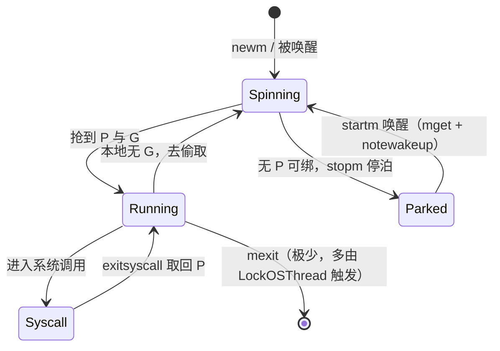
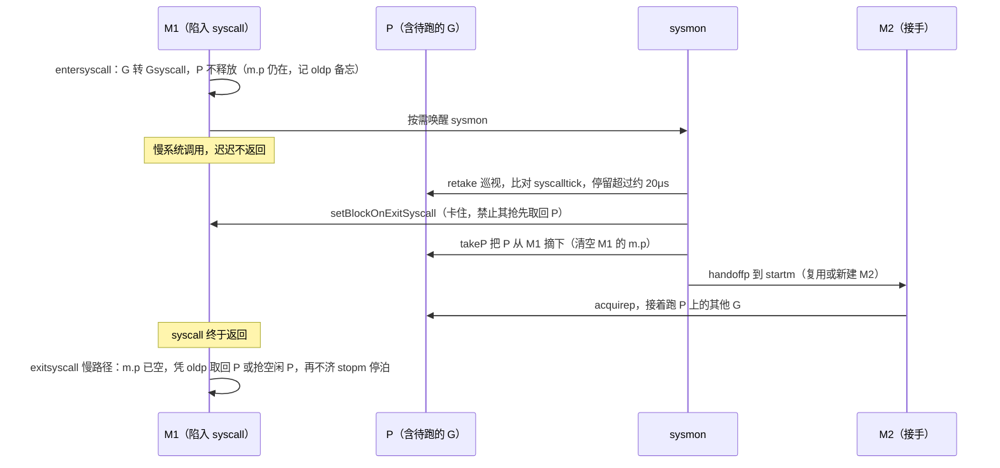

# 9.5 线程管理

[9.1](./model.md) 立下 GMP 的三层结构：G 是用户态的执行单元，P 是调度的许可证与本地资源，
M 才是真正向操作系统借来的那条腿。前几节谈 G 与 P 居多，这一节把目光落到 M 上，回答几个被
一直搁置的问题：M 到底是什么、它从哪里来、为什么 GOMAXPROCS 限的是 P 而线程数常常多于它、
一次阻塞的系统调用为何不会把别的 G 一同拖死，以及用户想把一个 Goroutine 钉死在某条线程上时
（`LockOSThread`），运行时要为此付出什么代价。

贯穿全节的一个判断是：**线程是昂贵的资源**。创建它要陷入内核、要分配栈、要登记信号掩码；
销毁它同样不便宜。Go 调度器的许多设计，从复用空闲 M、到把系统调用中的 P 交接出去、再到给
线程数量设一道一万的保险丝，都是围绕「尽量少创建、尽量多复用」这一条主线展开的。

## 9.5.1 M 即操作系统线程

M（machine）是对一条操作系统线程的抽象。进程启动时，引导线程被包装成 `m0`，它是全局变量，
随进程一同存在，不经堆分配；此后每一个 M 都对应一条由运行时显式创建的内核线程。M 与 G 的关系
是「线程跑 Goroutine」：M 持有一个 P 后，从 P 的本地队列里取 G 来执行。裁剪后的速写只看与
线程管理相关的字段：

```go
// m：一条操作系统线程的运行时抽象（速写）
type m struct {
    g0   *g       // 调度用的系统栈 goroutine：跑调度器代码、处理信号
    curg *g       // 当前正在此 M 上执行的用户 goroutine
    p    puintptr // 当前持有的 P；进入系统调用时可能被剥离
    nextp puintptr // 被唤醒后将要绑定的 P（stopm 醒来时用）
    oldp  puintptr // 进入系统调用前持有的 P，留待 exitsyscall 快速取回

    park     note  // 线程在此「信号量」上睡眠/唤醒，复用 M 的核心机制
    schedlink muintptr // 串入空闲 M 链表 / newmHandoff 链表

    lockedg  guintptr // 与某个 G 互锁（LockOSThread），见 9.5.6
    lockedExt int32   // 外部（用户）锁定计数
    lockedInt int32   // 内部（运行时）锁定计数
    incgo    bool     // 是否正执行 cgo 调用
    isextra  bool     // 是否为 cgo 回调而生的 extra-M，见 9.5.5
}
```

新线程经由 `newm` → `newm1` → `newosproc` 创建。在 Linux 上，`newosproc` 最终落到一次
`clone(2)` 系统调用，所用的标志位说明了「线程」与「进程」的分野：

```go
// Linux 上创建一条新内核线程所用的 clone 标志（runtime/os_linux.go）
cloneFlags = _CLONE_VM |     // 共享地址空间
    _CLONE_FS |              // 共享文件系统信息（cwd 等）
    _CLONE_FILES |           // 共享文件描述符表
    _CLONE_SIGHAND |         // 共享信号处理表
    _CLONE_SYSVSEM |         // 共享 SysV 信号量 undo 列表
    _CLONE_THREAD            // 属于同一线程组（共享 PID）
```

这些「共享」正是线程区别于进程之处：地址空间、文件描述符、信号处理一概共用，只有寄存器与栈
各自独立。即便如此，创建一条线程仍不便宜：要陷入内核走一遭 `clone`，要为 `g0` 准备系统栈，
要设置信号掩码（`newosproc` 在 clone 前后用 `sigprocmask` 关闭再恢复信号，使新线程从一个干净
状态起步），新线程进入 `mstart` 后还要做一轮 `minit` 初始化。这一串开销，是后文「宁可复用也
不轻易新建」的根由。`newosproc` 里那段对 `EAGAIN` 的重试与「may need to increase max user
processes」的提示，也印证了线程是一种会被操作系统限额的稀缺资源。

## 9.5.2 复用：在信号量上停泊的空闲 M

既然创建昂贵，运行时就不会用完即弃。一个 M 跑完手头的活、暂时无 P 可绑时，并不退出，而是
**停泊**起来等待下一次差遣。这套停与起，由 `stopm` 与 `startm` 一对函数完成。

`stopm` 把当前 M 放回全局空闲链表，然后让它在自己的 `park` 上睡去：

```go
func stopm() {
    gp := getg()
    // 前置条件：此刻 M 不持有锁、不持有 P、不处于自旋
    lock(&sched.lock)
    mput(gp.m)        // 放入 sched.midle 空闲 M 链表
    unlock(&sched.lock)
    mPark()           // 在 m.park 这个 note 上睡眠，等待唤醒
    acquirep(gp.m.nextp.ptr()) // 醒来时唤醒者已把要绑的 P 放进 nextp
    gp.m.nextp = 0
}
```

`mPark` 的核心是 `notesleep(&gp.m.park)`，`note` 是运行时内部的一次性事件原语，底层在各平台上
落到 futex 或信号量一类的内核休眠机制。换言之，停泊的 M 不占 CPU，它睡在内核里，等一记
`notewakeup` 把它叫醒。

唤醒走的是 `startm`：当有 P 需要一条线程来驱动时（新 G 就绪、系统调用交接出 P 等），
`startm` 先用 `mget` 从空闲链表里捞一个停泊的 M，把目标 P 记入它的 `nextp`，再 `notewakeup`
它的 `park`；只有当空闲链表为空时，才退而 `newm` 真正创建一条新线程。这条「先复用，捞不到才
新建」的次序，是把线程创建挡在冷路径上的关键。



值得点出的是，正常路径上 M 几乎从不退出。`mexit` 只在少数情形被触发，最典型的就是
[9.5.6](#956-lockosthread) 要讲的「锁住线程的 G 退出却没有解锁」。M 的常态是「停泊、唤醒、再
停泊」的循环，像一支随时待命的常备队，而非用一次裁一次的临时工。

## 9.5.3 GOMAXPROCS 限的是 P，不是 M

读者常有一个误解：`GOMAXPROCS` 设为 8，就只有 8 条线程。其实它限定的是 **P 的数量**，即同时
执行 Go 代码的并行度上限，而非 M 的数量。M 的数量由「有多少线程当下确有事可做」动态决定，
完全可能超过 GOMAXPROCS。

最常见的越界来自系统调用。当一个 M 陷在阻塞的系统调用里（[9.5.4](#954-系统调用与-p-的交接)），
它名下的 P 会被交接给另一条 M 去跑别的 G，于是同一时刻便有「陷在 syscall 里的 M」与「接手 P
的 M」并存，线程数超过 P 数。`LockOSThread`、cgo 回调的 extra-M 也都会让 M 多于 P。换个角度
看，P 是「执行 Go 代码的许可证」，全程总数受限；M 只是借来跑代码的腿，一条腿被 syscall 绊住，
就再借一条来用 P，绊住的那条不占许可证。

线程数不设上限是危险的：失控的系统调用或 cgo 回调可能让运行时无节制地创建线程，最终拖垮整个
进程。Go 为此设了一道保险丝，`sched.maxmcount`，默认 **10000**：

```go
// 校验 M 的总数未超过上限，超过则 fatal（runtime/proc.go）
func checkmcount() {
    // extra-M 不计入此限（它们服务于 cgo 回调，数量另算）
    count := mcount() - int32(extraMInUse.Load()) - int32(extraMLength.Load())
    if count > sched.maxmcount {
        print("runtime: program exceeds ", sched.maxmcount, "-thread limit\n")
        throw("thread exhaustion")
    }
}
```

一旦线程数撞上这条线，程序直接以 `thread exhaustion` 崩溃。它不是为正常程序设的，而是一道
「出事了早点炸、别把机器拖死」的护栏。用户可经 `debug.SetMaxThreads` 调整它（对应
`setmaxthreads`，传 -1 即查询当前值）。注意 `checkmcount` 把 extra-M 排除在外：它们的存在与
否取决于有多少外部线程要回调进 Go，与「Go 代码自己造了多少线程」是两笔账。

## 9.5.4 系统调用与 P 的交接

这是全节的关键。[9.1](./model.md) 许下过一个承诺：一个 Goroutine 卡在阻塞的系统调用里，不会
连累同一 P 上的其他 Goroutine 一同饿死。兑现它的，正是「系统调用期间把 P 交接出去」这套机制。

直觉是这样的：M 即将进入一个可能长时间不返回的系统调用，期间它没法跑 Go 代码，那么它名下的 P
就闲置了。与其让 P 跟着干等，不如把 P 解下来，交给另一条 M 去驱动 P 上排队的其他 G。系统调用
返回后，原 M 再设法要回一个 P 继续。围绕这个直觉，运行时区分了快慢两条路。

进入系统调用走 `entersyscall`（底层 `reentersyscall`）。它把 G 置为 `_Gsyscall`、记下栈与
PC 以备 GC 回溯，并把当前 P 的指针记入 `m.oldp`，同时拷贝一份 `p.syscalltick` 用于事后判断
「P 是否被夺走过」。关键之处在于：**entersyscall 既不释放 P，也不更动 P 的状态**。`m.p` 仍指着
原来的 P，P 也仍是 `_Prunning`，唯一改变的是 G 进了 `_Gsyscall`。运行时只是乐观地认为这次系统
调用会很快返回，于是把 P 原封留在 M 身上，等返回时大概率能径直接着用。`oldp` 只是留下一个
「我进系统调用前用的是哪枚 P」的备忘，供万一 P 被夺走后的慢路径凭它去尝试取回。

```go
func reentersyscall(pc, sp, bp uintptr) {
    gp := getg()
    gp.m.locks++              // 期间禁止抢占：g 处于 Gsyscall 但 sched 信息可能不一致
    gp.throwsplit = true      // 期间禁止栈分裂
    gp.m.syscalltick = gp.m.p.ptr().syscalltick // 记录 tick，事后据此判断 P 是否被夺
    pp := gp.m.p.ptr()
    gp.m.oldp.set(pp)         // 仅备忘进系统调用前用的 P；m.p 不清、P 状态不改
    save(pc, sp, bp)          // 为 GC 与回溯留下栈信息
    casgstatus(gp, _Grunning, _Gsyscall) // 「此后随时可能丢掉 P，不得再碰它」
    // ... 仅按需唤醒 sysmon（entersyscallWakeSysmon），不 release P
}
```

返回时走 `exitsyscall`，它先乐观地把 G 切回 `_Grunning`，再看 P 还在不在（`pp := gp.m.p.ptr()`）：

- **快路径**：若 `m.p` 仍非空（这次系统调用太快，sysmon 还没来得及把 P 夺走），直接接着用，
  连一次锁都不必碰。P 从未离身，自然没有重绑的开销。
- **慢路径**：若 P 已被 sysmon 夺走（`m.p == nil`），就调用 `exitsyscallTryGetP(oldp)` 试着
  取回当初那枚 `oldp`，取不回则去抢一个空闲 P；再抢不到，便把 G 挂回全局队列，自己 `stopm` 停泊。

那么 P 究竟是谁、何时夺走的？答案是**监控线程 sysmon**（[9.8](./sysmon.md)）。sysmon 周期性
巡视所有 P，在 `retake` 里对每个 `_Prunning` 的 P 比对它的 `syscalltick`：若发现某枚 P 名下的
M 已陷在系统调用里超过约一个 sysmon tick（至少 20μs），就动手把它夺走。这里用到一个较新的
机制 `setBlockOnExitSyscall`：它先卡住那条线程，确保它不会在 exitsyscall 里抢先把 P 取回，
随后 `takeP` 把 P 从该 M 上摘下，再 `handoffp` 把这枚 P 交给另一条 M。这道门槛把交接的代价只
花在「真的阻塞了一会儿」的系统调用上，短系统调用根本等不到 sysmon 出手就已从快路径返回。

> 这套「P 不变状态、sysmon 强制夺取」的设计是近年的一次演进。早期实现里 P 进入系统调用时会被
> 置为一个专门的 `_Psyscall` 状态，由返回的 M 或 sysmon 通过对该状态做 CAS 来争夺归属。Go 1.26
> 删除了 `_Psyscall`（它在源码里降级为 `_Psyscall_unused`），改由 sysmon 经
> `setBlockOnExitSyscall`/`takeP` 主动、明确地夺取，不再依赖 M 自己「发现」P 已不归它。语义未变，
> 但状态机更简单、竞争窗口更清晰。

```go
// handoffp：把一枚 P 交给（或新建）一条 M 去运行（runtime/proc.go，节选逻辑）
func handoffp(pp *p) {
    // P 上还有本地或全局可运行的 G，立刻起一条 M 接手
    if !runqempty(pp) || !sched.runq.empty() {
        startm(pp, false, false)
        return
    }
    // 有 GC / trace 工作，同样立刻起 M
    // ...
    // 已有自旋或空闲的 M 在候命，无须再添；否则起一条自旋 M
    if sched.nmspinning.Load()+sched.npidle.Load() == 0 &&
        sched.nmspinning.CompareAndSwap(0, 1) {
        startm(pp, true, false)
        return
    }
    // 实在无事可做，把 P 放回空闲池
    pidleput(pp, 0)
}
```

把整条链路画成时序，「一个 syscall 阻塞而其他 G 照跑」就一目了然：



若把时间轴换成「短系统调用」，sysmon 那几步根本不会发生，M1 的 `m.p` 始终未被清空，exitsyscall
一看 P 还在便径直接着用，整条快路径不碰锁。一快一慢两条路，把常见情形做到了几乎零开销，又保证
了罕见的长阻塞不会拖垮并行度。这就是 [9.1](./model.md) 那句承诺的兑现机制。

> 需要区分的是另一类阻塞。网络 I/O 与定时器并不走上面这条「占着 M 阻塞」的路，而是交给网络
> 轮询器 netpoll（[9.9](./poller.md)）：G 被挂起、M 与 P 立刻去跑别的 G，待 I/O 就绪由
> netpoll 把 G 重新置为可运行。真正会绊住 M 的，是文件 I/O、`fork`/`exec` 一类无法异步化的
> 同步系统调用，以及 cgo 调用，这些才需要 P 交接来兜底。

## 9.5.5 cgo 回调与 extra-M

前面创建的 M 都由 Go 运行时主动 `clone` 而来，运行时清楚它们的来历与状态。可还有一种线程不是
Go 造的：当 C 代码在一条**非 Go 创建**的线程上回调进 Go（cgo callback），这条线程没有
`g0`、没有 P、运行时对它一无所知，却要在它上面执行 Go 代码。

运行时的应对是预备一批 **extra-M**。它们由 `oneNewExtraM` 预先分配，挂在一条专门的 extra 链表
上，每个 extra-M 自带一个处于 `_Gdeadextra` 状态的占位 G，并被 `lockedg`/`lockedm` 互锁。
外部线程回调进来时，`needm` 从这条链表借一个 extra-M 套在自己身上，借此获得跑 Go 代码所需的
`g0` 与上下文；回调结束 `dropm` 再把 extra-M 归还。`mstartm0` 在运行时启动早期就会
`newextram` 备好至少一个，保证回调到来时链表不至于空着而死锁。

```go
// oneNewExtraM：为 cgo 回调预备一个 extra-M（节选）
func oneNewExtraM() {
    mp := allocm(nil, nil, -1) // 不绑 P 地分配一个 M
    gp := malg(4096)           // 配一个占位 goroutine
    casgstatus(gp, _Gidle, _Gdeadextra) // 对回溯与栈扫描隐身
    mp.isextra = true
    mp.lockedInt++             // extra-M 天然与其 g 互锁
    mp.lockedg.set(gp)
    gp.lockedm.set(mp)
    allgadd(gp)
    sched.ngsys.Add(1)         // 计入系统 goroutine，不计入 gcount
    addExtraM(mp)              // 挂上 extra 链表
}
```

extra-M 不计入 [9.5.3](#953-gomaxprocs-限的是-p不是-m) 的 `maxmcount`，因为它们的多寡由外部
回调的并发度决定，不属于「Go 代码自己造的线程」。当宿主进程通过 pthread key 复用同一条 C 线程
反复回调时，`cgoBindM` 还会把 extra-M 与该 C 线程绑定，省去每次回调都借还的开销。这套机制是
Go 与 C 世界互通的必要黏合层，也是线程数会超出 GOMAXPROCS 的另一来源。

## 9.5.6 LockOSThread

到此，M 都是可以自由互换的：哪条 M 跑哪个 G 无关紧要。但有些场景要求一个 Goroutine 始终在
**同一条** OS 线程上执行，`runtime.LockOSThread` 就是为此而设。需求来自两类：其一，某些 C 库
（典型如 OpenGL、GLib 等图形库）把状态存在线程局部存储（TLS）里，必须在固定线程上调用；其二，
程序通过系统调用修改了线程的内核态（例如用 `unshare` 配 `CLONE_NEWNS` 把线程放进独立的
Linux namespace），此后这条线程已被「私有化」，不再适合让别的 Goroutine 借用。

运行时私有的 `lockOSThread` 很简单，计数加一，再调 `dolockOSThread` 把 g 与 m 互指：

```go
//go:nosplit
func lockOSThread() {
    getg().m.lockedInt++
    dolockOSThread()
}

//go:nosplit
func dolockOSThread() {
    gp := getg()
    gp.m.lockedg.set(gp) // m 记住它锁定的 g
    gp.lockedm.set(gp.m) // g 记住它锁定的 m
}
```

用户态的公开 `LockOSThread` 多一步：它会按需懒启动一个**模板线程**（template thread）。这是
锁住线程带来的隐患的对策。一旦某条线程被用户私有化（改了 namespace、信号掩码等），它的内核态
就「奇怪」了，再从它身上 `clone` 出新线程会把这份奇怪一并复制过去。模板线程是一条始终处于
「已知良好状态」、不跑用户 G、只负责安全地造新线程的备用线程。`newm` 因此有一段判断：若发现
自己正处在被锁定的 M 或 cgo 线程上，就不自行 clone，而是把建线程的请求挂到 `newmHandoff`
链表，交由模板线程代劳。

那么仅仅设置 `lockedg`/`lockedm` 两个字段，凭什么就保证 g 只在这条 m 上跑？答案藏在调度循环
（[9.4](./schedule.md)）里。`schedule` 一开头就检查当前 M 是否有锁定的 g：

```go
func schedule() {
    gp := getg()
    // m.lockedg 在 LockOSThread 后变为非零
    if gp.m.lockedg != 0 {
        stoplockedm()                 // 把 P 交出去，自己停泊
        execute(gp.m.lockedg.ptr(), false) // 醒来后直接执行那个锁定的 g，永不返回
    }
    // ... 否则正常找 G
}
```

反过来，当锁定的 g 因某种原因不能立刻跑（比如它正阻塞），`stoplockedm` 会把这条 M 的 P 经
`handoffp` 交给别人，自己停泊等待，直到那个 g 重新可运行时再被唤醒、`acquirep` 拿回一个 P 来
专门伺候它。代价由此显形：这条 M 被一个 g 独占，无法服务别的 g；P 在 g 阻塞期间要来回交接；
若锁定的 g 退出时忘了 `UnlockOSThread`，运行时索性让这条 M 随 g 一起退出（`mexit`），这也是
正常路径上 M 会退出的少数情形之一。`UnlockOSThread` 则只是计数减一、到零时清空那两个字段，
并无特别处理。

正因这些副作用，`LockOSThread` 称不上一项优秀的特性。它给调度器添了不少管理上的麻烦，存在的
理由仅仅是要为上个世纪用 C 写就、依赖线程局部状态的诸多遗产库提供支持。倘若生态足够丰富到
无须再调那些库，这项特性大可不必存在。

## 9.5.7 谁来管理线程：一份谱系

把 Go 的做法放进谱系里，更容易看清它的取舍。「用户代码与内核线程如何对应」，历史上有几种典型
安排：

- **1:1（每个用户线程对应一条内核线程）**：POSIX threads、Java 早期的线程模型属此。简单直接，
  但线程的创建、切换、内存（每线程一个较大的栈）都按内核线程计价，并发量一上去就吃不消。
- **N:1（多个用户线程挤在一条内核线程上）**：早期的绿色线程（green threads）如此。切换极廉，
  却有一个致命缺陷：任何一个用户线程发起阻塞系统调用，整条内核线程连同其上所有用户线程一并
  卡死，无法利用多核。
- **线程池**：不解决映射模型，只摊薄创建成本，把线程攒起来复用。它回答不了「一个任务阻塞了
  怎么办」，阻塞的任务会一直占着池里的线程。
- **M:N 动态管理（Go 的做法）**：M 个 Goroutine 复用到 N 条内核线程上，由运行时调度器在二者
  之间斡旋。它兼得 N:1 的廉价切换与 1:1 的多核与抗阻塞：用户态切换不进内核，省下了 1:1 的开销；
  而靠本节的 P 交接与 [9.5.2](#952-复用在信号量上停泊的空闲-m) 的 M 复用，又躲开了 N:1 那个
  「一阻塞全卡死」的死穴。代价是运行时复杂度的显著上升，本章前后各节正是这份复杂度的展开。

这套思路并非 Go 独有。Erlang/BEAM 早有调度器把轻量进程映射到少数 OS 线程；Google 内部的纤程
（fiber）实践亦同源。最值得一提的是 Java：它长期是 1:1 模型，2023 年随 JDK 21 正式交付的
**虚拟线程**（Project Loom，JEP 444），本质上正是向 Go 这一侧的靠拢，把大量虚拟线程多路复用到
少数载体线程（carrier thread）上，并在虚拟线程发起阻塞调用时把它从载体线程上卸下，让载体线程
转去跑别的虚拟线程。这与本节的 P 交接、Goroutine 在 syscall 时让出 M 是同一种工程直觉。
两条独立演化的路线收敛到相近的设计，本身就说明：在「既要海量并发、又要廉价切换、还要扛住阻塞」
这组约束下，M:N 动态管理几乎是绕不开的答案。

性能的好处从不白来。Go 把线程管理的全部复杂度收进了运行时：停泊与唤醒、P 的交接、sysmon 的
巡视、extra-M 与模板线程的种种特例。用户因此得以几乎不感知线程的存在，写下成千上万个
Goroutine 而不必操心它们落在哪条线程上。这份「让用户看不见线程」的便利，背后是运行时替你扛下
的那一摞机制。

## 延伸阅读的文献

1. The Go Authors. *runtime/proc.go*（`newm`/`newm1`/`mstart`、`stopm`/`startm`/`mPark`、
   `entersyscall`/`exitsyscall`/`reentersyscall`、`handoffp`/`retake`、`acquirep`/`releasep`、
   `checkmcount`、extra-M 相关的 `newextram`/`oneNewExtraM`/`needm`/`dropm`）。
   https://github.com/golang/go/blob/master/src/runtime/proc.go
2. The Go Authors. *runtime/os_linux.go*（`newosproc` 与 `cloneFlags`，线程创建落到 `clone`）。
   https://github.com/golang/go/blob/master/src/runtime/os_linux.go
3. Linux man-pages. *clone(2)*. https://man7.org/linux/man-pages/man2/clone.2.html
   （`CLONE_VM`/`CLONE_THREAD` 等标志位的语义，线程与进程的分野）
4. The Go Authors. *runtime.LockOSThread / UnlockOSThread 文档*.
   https://pkg.go.dev/runtime#LockOSThread
5. Go issue 跟踪：#20458（`LockOSThread` 语义澄清）、#21827（模板线程的由来）、
   #22227（plan9 上禁用 newmHandoff）。https://github.com/golang/go/issues
6. Ron Pressler, Alan Bateman. *JEP 444: Virtual Threads.* OpenJDK, 2023.
   https://openjdk.org/jeps/444 （Project Loom：Java 向 M:N 模型的收敛）
7. 本书 [9.1 调度问题与 GMP 模型](./model.md)、[9.4 调度循环](./schedule.md)、
   [9.8 系统监控](./sysmon.md)、[9.9 网络轮询器](./poller.md)。

## 许可

&copy; 2018-2026 The [golang.design](https://golang.design) Initiative Authors. Licensed under [CC-BY-NC-ND 4.0](https://creativecommons.org/licenses/by-nc-nd/4.0/).
