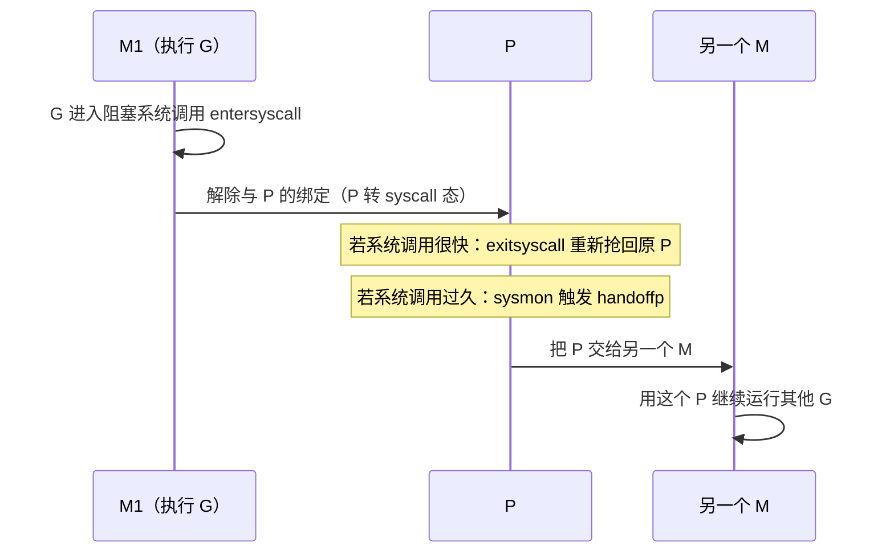

# 9.5 线程管理

M 是操作系统线程在运行时中的代身（[9.3](./mpg.md)）。线程的创建不便宜，阻塞又会牵连一连串
goroutine，所以运行时如何管理 M，直接关系到调度的效率。这一节看 M 的生灭与复用、最关键的
系统调用移交，以及 Go 在"线程是稀缺资源"这件事上与其他运行时的异同。

## 9.5.1 M 的生与复用

第一个 M 叫 `m0`，由程序启动时的引导代码静态准备。此后，当有可运行的 G 却没有足够的 M 来跑
时，运行时通过 `newm` 创建新线程,底层在 Linux 上是 `clone`（带 `CLONE_VM` 等标志共享地址
空间），其他平台用相应的线程创建调用。线程创建要陷入内核、分配内核栈与调度结构，并不廉价，
所以 Go 讲究**复用**：空闲下来的 M 不立刻销毁，而是 `stopm` 让它休眠（park 在一个信号量上），
`startm` 再唤醒，避免反复创建。

要辨析 M 的数量与 `GOMAXPROCS` 的关系：`GOMAXPROCS` 限的是 **P**,即并行执行 Go 代码的
上限，而非线程总数。陷入系统调用、被运行时占用的 M 并不计入这个上限，因此一个程序的线程数
常常多于 `GOMAXPROCS`。M 自身另有一个上限 `sched.maxmcount`（默认 **10000**），触及它程序会
崩溃,这通常意味着出现了大量阻塞式调用导致线程失控，是一个有意设置的"保险丝"。此外，
为支持 cgo 回调（外部 C 线程回调进 Go），运行时还会维护一组**额外的 M**（extra M），让没有
对应 G 的外部线程也能临时进入 Go 世界。

## 9.5.2 系统调用：P 的移交

一个 M 要运行 Go 代码必须持有 P（`acquirep` 取得、`releasep` 释放）。麻烦出在系统调用：线程
一旦陷进去，可能在内核里待很久，这段时间它手里的 P 若一直被占着，就白白浪费了一份并行度。
Go 的处理是让 P 在这种时候能被移交出去。

进入系统调用前，`entersyscall` 把 M 与 P 的强绑定松开，P 转入 syscall 态。接下来分两种情形:
若系统调用很快返回，`exitsyscall` 尝试重新抢回原来的 P，省去一切交接,这是最常见、最廉价的
路径，运行时为它做了乐观的快路径。若系统调用迟迟不返回，[9.8](./sysmon.md) 的 `sysmon` 会
发现这个 P 闲置太久，通过 `handoffp` 把它交给另一个 M（必要时新建），让这份并行度立刻投入到
别的 G 上。一个线程卡在 `read` 上，不影响其余 goroutine 继续奔跑，靠的正是这套移交。这也
正是 [9.1](./model.md) 所说的、Go 能避开 N:1 模型"一个阻塞卡死全部"死穴的关键之一。

## 9.5.3 把 goroutine 钉在线程上

有时我们恰恰需要相反的东西：让某个 goroutine 始终在同一个 OS 线程上运行。典型场景是 cgo 调用
依赖线程局部状态的 C 库（如 OpenGL 上下文、某些图形或 GUI 框架要求所有调用在同一线程），
或需要操作线程级的系统状态（如 Linux 的某些 `setns`/凭证调用）。`runtime.LockOSThread` 用于此:
它把当前 G 与它的 M 绑定，在解锁前这个 G 只在这个 M 上跑，这个 M 也不再运行别的 G。被锁定的
G 退出时，与之绑定的 M 也随之退出而非复用。这是一处为互操作性保留的"逃生舱口"，代价是
牺牲该线程的调度灵活性，应当节制使用。

## 9.5.4 谁来管理线程：几种分工

"线程由谁创建与回收"这件事，各运行时分工不同。最朴素的 **1:1**（如 Java 平台线程、C++
`std::thread`）把每个并发单元直接交给一个 OS 线程，由内核全权调度,简单，但线程昂贵、数量
受限。**线程池**（Java `ThreadPoolExecutor`、各类 web 服务器）则预先创建一批线程反复复用，
摊薄创建成本，但池大小要手工调、且一个阻塞任务会占住一个池线程。Go 走的是更动态的路:
运行时**按需创建、按需休眠、按需移交** M，并把"该有多少线程在跑"这个决策（[9.3](./mpg.md) 的
暂止与复始）从用户手里接管过来。其代价是运行时复杂度显著上升,本节这些 `newm`/`stopm`/
`handoffp`/extra-M/LockOSThread 的机制，正是这份复杂度的明细。Java 的虚拟线程（Loom，
[9.1](./model.md)）近年也转向类似的"运行时管理少量载体线程 + 海量轻量单元"的分工,可以说，
工业界又向 Go 这一侧靠拢了一步。

## 延伸阅读的文献

1. The Go Authors. *runtime/proc.go*（`newm`、`stopm`/`startm`、`entersyscall`/`exitsyscall`、
   `handoffp`、`LockOSThread`、`maxmcount`）.
   https://github.com/golang/go/blob/master/src/runtime/proc.go
2. The Linux man-pages. *clone(2).* https://man7.org/linux/man-pages/man2/clone.2.html
3. The Go Authors. *runtime.LockOSThread 文档.*
   https://pkg.go.dev/runtime#LockOSThread
4. OpenJDK. *JEP 444: Virtual Threads*（运行时管理载体线程的对照）.
   https://openjdk.org/jeps/444

## 许可

&copy; 2018-2026 The [golang.design](https://golang.design) Initiative Authors. Licensed under [CC-BY-NC-ND 4.0](https://creativecommons.org/licenses/by-nc-nd/4.0/).
