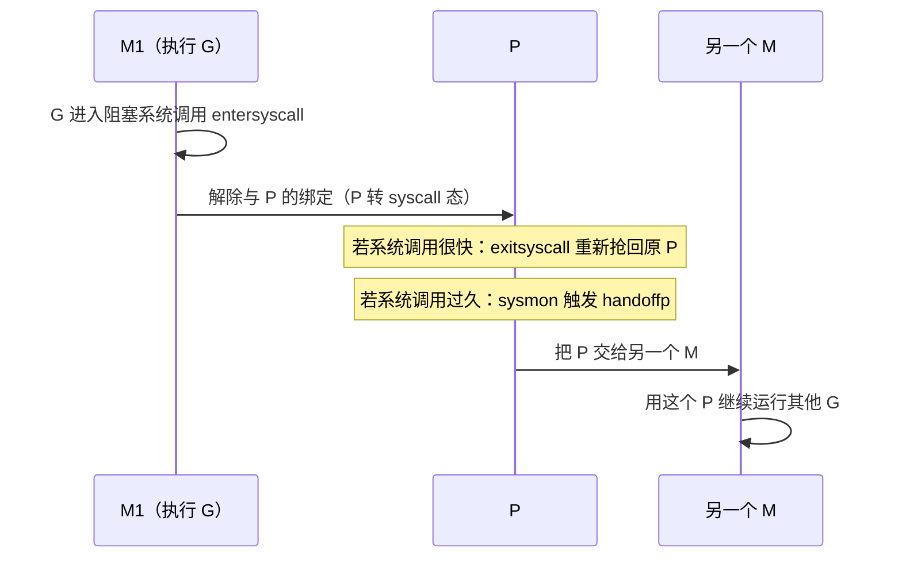

# 9.5 线程管理

M 是操作系统线程在运行时中的代身（[9.3](./mpg.md)）。线程的创建不便宜，阻塞又会牵连一连串
goroutine，所以运行时如何管理 M，直接关系到调度的效率。这一节看 M 的生灭、复用，以及最关键的
一幕：系统调用时如何不让一个线程的阻塞拖住整台机器。

## 9.5.1 M 的生与复用

第一个 M 叫 `m0`，由程序启动时的引导代码准备好。此后，当有可运行的 G 却没有足够的 M 来跑时，
运行时通过 `newm` 创建新线程（底层在 Linux 上是 `clone`，其他平台用相应的线程创建调用）。
线程同样讲究复用：空闲下来的 M 不一定立刻销毁，而是挂到空闲列表上（`stopm` 让它休眠，
`startm` 再唤醒），避免反复创建。

值得辨析的是 M 的数量与 `GOMAXPROCS` 的关系：`GOMAXPROCS` 限的是 **P**，也就是并行执行
Go 代码的上限，而不是线程总数。陷入系统调用、被运行时占用的 M 并不计入这个上限，因此一个
程序的线程数常常多于 `GOMAXPROCS`。M 自身另有一个上限 `sched.maxmcount`（默认 10000），
触及它程序会崩溃，这通常意味着出现了大量阻塞式调用导致线程失控。

## 9.5.2 系统调用：P 的移交

一个 M 要运行 Go 代码必须持有 P（`acquirep` 取得、`releasep` 释放）。麻烦出在系统调用：
线程一旦陷进去，就可能在内核里待很久，这段时间它手里的 P 若一直被占着，就白白浪费了一份
并行度。Go 的处理是让 P 在这种时候能被移交出去。

进入系统调用前，`entersyscall` 把 M 与 P 的强绑定松开，P 转入 syscall 态。接下来分两种情形：
若系统调用很快返回，`exitsyscall` 会尝试重新抢回原来的 P，省去一切交接，这是最常见、最廉价的
路径；若系统调用迟迟不返回，[9.8](./sysmon.md) 里的 `sysmon` 会发现这个 P 闲置太久，通过
`handoffp` 把它交给另一个 M（必要时新建一个），让这份并行度立刻投入到别的 G 上。一个线程
卡在 `read` 上，不影响其余 goroutine 继续奔跑，靠的正是这套移交。

## 9.5.3 把 goroutine 钉在线程上

有时我们恰恰需要相反的东西：让某个 goroutine 始终在同一个 OS 线程上运行。典型场景是 cgo 调用
依赖线程局部状态的 C 库（如 OpenGL 上下文），或需要操作线程级的系统状态。`runtime.LockOSThread`
便用于此，它把当前 G 与它的 M 绑定，在解锁前这个 G 只在这个 M 上跑，而这个 M 也不再去运行
别的 G。被锁定的 G 退出时，与之绑定的 M 也会随之退出，而非回收复用。这是一处为互操作性
而保留的"逃生舱口"，代价是牺牲了该线程的调度灵活性，应当节制使用。

## 许可

&copy; 2018-2026 The [golang.design](https://golang.design) Initiative Authors. Licensed under [CC-BY-NC-ND 4.0](https://creativecommons.org/licenses/by-nc-nd/4.0/).
