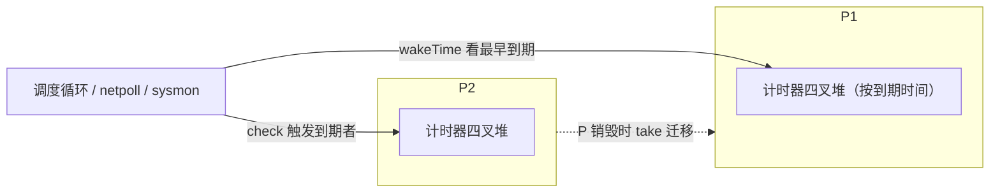

# 9.10 计时器

`time.Sleep`、`time.After`、`time.Timer`、`time.Ticker`，乃至网络读写的 `SetDeadline`，背后都是
同一套计时器机制。它要回答一个看似简单、实则微妙的数据结构问题：成千上万个计时器同时存在时，
如何高效地知道"下一个该在什么时候叫醒谁"，又不为此空耗一个线程。这一节从这个抽象问题讲起，
看清各种解法的取舍，再落到 Go 的选择与它的演进。

## 9.10.1 计时器的数据结构问题

一套计时器要支持三种操作：**START**（登记一个超时）、**STOP**（到期前取消）、**到期检查 / EXPIRY**
（时钟前进，触发所有到点的）。难点在于时钟中断可能每秒触发成千上万次，无论是否真有计时器
到期，所以"每次 tick"的代价必须低，同时 START/STOP 也要快。几种朴素方案的复杂度对比，
正是 Varghese 与 Lauck 1987 年那篇经典论文的出发点：

| 方案 | START | STOP | 每 tick 检查 | 取出到期 |
| --- | --- | --- | --- | --- |
| 无序链表 | $O(1)$ | $O(1)$ | $O(n)$ 扫描 | — |
| 有序链表 | $O(n)$ | $O(1)$ | $O(1)$ 看表头 | $O(1)$ |
| 最小堆 | $O(\log n)$ | $O(\log n)$ | $O(1)$ 看堆顶 | 每个 $O(\log n)$ |

这里有一个常被混淆的精确之处：堆的**取最小是 $O(1)$**，但每**触发**一个到期计时器要付
$O(\log n)$ 的删除与下沉。所以"每 tick 便宜"只是说**检查**便宜，真正排空 $k$ 个到期者是
$O(k \log n)$。

## 9.10.2 时间轮：用空间换时间

Varghese 与 Lauck 给出的答案是**时间轮**（timing wheel），思路像钟表的指针。

- **简单时间轮**：一个有 $N$ 个槽的环形数组，一槽一个时间单位，外加一个"当前时间"指针。
  登记一个 $j$ 个 tick 后到期的计时器（$j < N$），就 $O(1)$ 地插入第 $(now+j) \bmod N$ 个槽；
  每 tick 指针前进一格、触发该槽。START、STOP、每 tick 维护**都是 $O(1)$**,但只对**不超过轮长
  $N$** 的超时成立。这个有界范围的限制，正是另外两个变体存在的理由。
- **哈希时间轮**：超时范围很大时，把超时哈希进一个较小的轮（槽内按"还要转几圈"排序），
  在均匀分布下达到 $O(1)$ 平均复杂度。
- **分层时间轮**：多个不同粒度的轮，像时钟的时、分、秒针;长超时记在最粗的轮上，到期时
  **级联**（cascade）下沉到更细的轮精确触发。它以有界内存覆盖极大范围，代价是跨层时的级联开销。

## 9.10.3 Go 的选择：每个 P 一个四叉堆

Go 没有用时间轮，而是给**每个 P 一个最小堆**，且是**四叉堆**（4-ary，`timerHeapN = 4`）。
四叉堆比二叉堆层数更少（$\log_4 n$），下沉路径上的缓存未命中更少,这不是凭直觉，而是 2013 年
一次有基准支撑的优化（"a lot of timers present 时性能更好"）。



```go
type timers struct {        // 每个 P 一个（pp.timers）
    heap     []timerWhen     // 按 when 排序的四叉最小堆
    zombies  atomic.Int32    // 已标记删除、尚未清理的计时器数
    // ...
}
```

到期检查**不需要专门的线程**轮询，而是顺路完成的：`wakeTime` 算出最近的到期时间，用来限定
调度器与网络轮询器（[9.9](./poller.md)）阻塞多久；`check` 在调度循环（包括 `findRunnable` 的
工作窃取过程中,一个没活干的 P 可以顺手触发别的 P 的到期计时器）、`sysmon`（[9.8](./sysmon.md)）
等处被调用，看一眼堆顶、触发到点的。网络读写的截止时间复用同一套机制：`pollDesc` 内嵌了读、
写两个 `timer`，`SetDeadline` 本质就是改写它们。STOP 采用**惰性删除**:先把计时器标记为
"僵尸"，真正的移除留到后续 `adjust` / `cleanHead` 时批量进行，避免每次取消都重整堆。当某个 P
被销毁时，它堆里的计时器由 `take` 迁移到别的 P，不会丢失。

## 9.10.4 一条被重写多次的演进线

计时器是 Go 运行时里被重写次数最多的部分之一，主线是"越来越融入调度器、越来越分散"。
这段历史也是厘清若干流传讹误的好机会。

- **四叉堆本身**早在 **Go 1.2（2013）**就引入，是一次独立的性能优化,它**先于**后来的分片，
  并非随分片一起出现（一个常见误解）。
- **Go 1.10** 把单一全局堆改成了**固定 64 个桶的数组**（`timersLen = 64`），按 P 编号取模分配。
  注意：它**不是**按 `GOMAXPROCS` 缩放、也**不是**真正的每 P 一堆（另一个常见误传）,当时的
  提交说明明确写道，按 GOMAXPROCS 缩放需要动态重分配，64 是内存与性能的折中。
- **Go 1.14** 才把计时器拆成**真正的每 P 堆**、融入调度器与网络轮询器，并**移除了专职的
  `timerproc` goroutine**（Ian Lance Taylor 主导的一系列改动）。动因是一个具体的性能 bug：
  一个 1ms 的 `Ticker` 因 `timerproc` 唤醒与全局锁争用，竟耗掉 20%~25% 的 CPU（issue #27707）。
- **Go 1.23** 又对内部做了一轮整理（Russ Cox），把每 P 计时器状态收进 `timers` 类型，并修了一个
  长期的语义坑：计时器 channel 改为**无缓冲**（容量 0），从而保证 `Stop`/`Reset` 返回后不会再
  收到一个陈旧的值；未被引用的 `Timer`/`Ticker` 现在也能被立即垃圾回收。旧的异步行为保留在
  `GODEBUG=asynctimerchan=1` 之后。

## 9.10.5 别家怎么做

计时器的实现是观察"数据结构选择如何随场景而变"的好窗口。

- **Linux 内核**同时用两套。粗粒度、多用于"大概率会被取消"的 I/O 超时，走**时间轮**
  （`kernel/time/timer.c`）；2016 年 Gleixner 的大改（4.8）干脆**取消了级联**，用 8 层、
  位图 $O(1)$ 找下一个到期者，代价是接受最坏约 12.5% 的精度损失,理由正是"多数超时在触发前
  就被取消了"。高精度定时器则另走 `hrtimer`，用**红黑树**按时间排序（`kernel/time/hrtimer.c`）。
- **Netty 的 `HashedWheelTimer`** 直接以 Varghese-Lauck 为名，是哈希时间轮的工程实现。
- **libevent** 用二叉最小堆，**nginx** 用红黑树，**Java 的 `ScheduledThreadPoolExecutor`** 用一个
  数组实现的二叉最小堆（`DelayedWorkQueue`）。**Erlang/BEAM** 则用时间轮。

可以看到一条规律：以"会被取消的超时"为主、且能接受精度量化的系统（内核基础轮、Netty）偏爱
时间轮的 $O(1)$；要求精确、范围不定的场景（libevent、nginx、Java、Go）偏爱堆或树。

## 9.10.6 为何 Go 选堆，以及尚存的张力

Go 选每 P 堆而非时间轮，是工程权衡而非定理：堆按绝对 `int64` 时间排序，**范围不限**
（从微秒级 `Sleep` 到小时级 `context` 截止时间一视同仁），没有轮的有界范围与级联负担；
它**简单**，精度只受"多久检查一次"限制；它能**贴着调度器**living，复用既有的唤醒点而无须专职
线程；**按 P 分片**则消除了单一全局轮/堆的锁瓶颈，这正是 1.10→1.14 演进与 #27707 基准所证。

张力依然存在。堆的软肋是 STOP 为 $O(\log n)$、且朴素删除会让数组碎片化，Go 用"僵尸标记 +
周期清理"来缓解,而时间轮的 $O(1)$ 取消在连接池频繁设置/清除截止时间这类高churn场景下，
理论上更优。此外，精度与开销的取舍（内核轮的量化 vs 堆的精确）、为省电而做的计时器合并
（timer coalescing / slack）、高频 ticker 对唤醒路径的压力，都是这一领域持续的课题。性能的提升
从不白来，它总伴着复杂度的重新安置,这一章反复看到的，正是这件事。

## 延伸阅读的文献

1. George Varghese, Anthony Lauck. "Hashed and Hierarchical Timing Wheels: Data
   Structures for the Efficient Implementation of a Timer Facility." *SOSP 1987*；
   *IEEE/ACM Trans. Networking* 5(6), 1997. https://doi.org/10.1145/41457.37504
2. Sokolov Yura. *time: make timers heap 4-ary*（Go 1.2）, 2013.
   https://golang.org/cl/13094043
3. Aliaksandr Valialkin. *runtime: improve timers scalability on multi-CPU systems*
   （Go 1.10，64 桶）, 2017. https://go-review.googlesource.com/34784
4. golang/go#27707. *time: excessive CPU usage when using Ticker and Sleep*（驱动 1.14
   每 P 计时器）. https://github.com/golang/go/issues/27707
5. Go 1.23 Release Notes（计时器无缓冲 channel、可被立即 GC）. https://go.dev/doc/go1.23
6. Thomas Gleixner. *timers: Switch to a non-cascading wheel*（Linux 4.8）, 2016.
   https://git.kernel.org/torvalds/c/500462a9de65 ；LWN: https://lwn.net/Articles/646950/
7. The Linux Kernel. *hrtimers — high-resolution kernel timers.*
   https://www.kernel.org/doc/html/latest/timers/hrtimers.html
8. Netty. *HashedWheelTimer*（基于 Varghese-Lauck）.
   https://netty.io/4.1/api/io/netty/util/HashedWheelTimer.html

## 许可

&copy; 2018-2026 The [golang.design](https://golang.design) Initiative Authors. Licensed under [CC-BY-NC-ND 4.0](https://creativecommons.org/licenses/by-nc-nd/4.0/).
