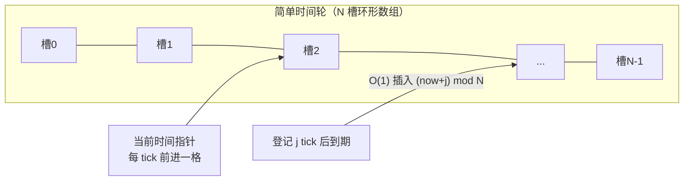
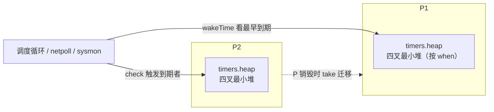
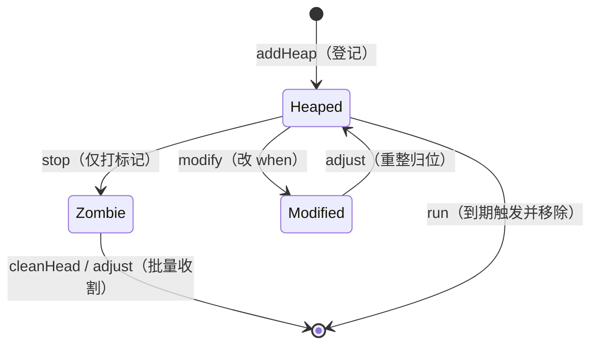
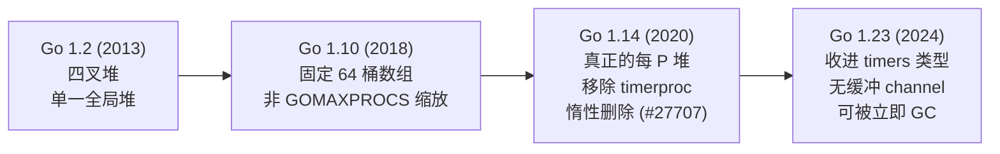

# 9.10 计时器

> 本节内容对标 Go 1.26。

`time.Sleep`、`time.After`、`time.Timer`、`time.Ticker`，乃至网络读写的 `SetDeadline`，背后都是
同一套计时器机制。它要回答一个看似简单、实则微妙的数据结构问题：成千上万个计时器同时存在时，
如何高效地知道「下一个该在什么时候叫醒谁」，又不为此空耗一个线程。这一节从这个抽象问题讲起，
看清各种解法的取舍，再落到 Go 的选择与它的演进。

## 9.10.1 计时器的数据结构问题

一套计时器要支持三种操作：START（登记一个超时）、STOP（到期前取消）、到期检查 / EXPIRY
（时钟前进，触发所有到点的）。难点在于时钟可能每秒被检查成千上万次，无论是否真有计时器到期，
所以「每次 tick」的代价必须低，同时 START / STOP 也要快。几种朴素方案的复杂度对比，正是
Varghese 与 Lauck 1987 年那篇经典论文的出发点：

| 方案 | START | STOP | 每 tick 检查 | 取出到期 |
| --- | --- | --- | --- | --- |
| 无序链表 | $O(1)$ | $O(1)$ | $O(n)$ 扫描 | $O(n)$ |
| 有序链表 | $O(n)$ | $O(1)$ | $O(1)$ 看表头 | $O(1)$ |
| 最小堆 | $O(\log n)$ | $O(\log n)$ | $O(1)$ 看堆顶 | 每个 $O(\log n)$ |

这里有一个常被混淆的精确之处：堆的「取最小」是 $O(1)$，但每触发一个到期计时器要付 $O(\log n)$
的删除与下沉。所以「每 tick 便宜」只是说检查便宜，真正排空 $k$ 个到期者是 $O(k \log n)$。三种
朴素方案各有所长，却没有一种在 START、STOP 与到期检查上同时取胜，时间轮正是为打破这个僵局
而生。

## 9.10.2 时间轮：用空间换时间

Varghese 与 Lauck 给出的答案是时间轮（timing wheel），思路像钟表的指针。

- 简单时间轮：一个有 $N$ 个槽的环形数组，一槽一个时间单位，外加一个「当前时间」指针。登记一个
  $j$ 个 tick 后到期的计时器（$j < N$），就 $O(1)$ 地插入第 $(now+j) \bmod N$ 个槽；每 tick 指针
  前进一格、触发该槽。START、STOP、每 tick 维护都是 $O(1)$，但只对不超过轮长 $N$ 的超时成立。
  这个有界范围的限制，正是另外两个变体存在的理由。
- 哈希时间轮：超时范围很大时，把超时哈希进一个较小的轮（槽内按「还要转几圈」排序），在均匀分布
  下达到 $O(1)$ 平均复杂度。
- 分层时间轮：多个不同粒度的轮，像时钟的时、分、秒针；长超时记在最粗的轮上，到期时级联
  （cascade）下沉到更细的轮精确触发。它以有界内存覆盖极大范围，代价是跨层时的级联开销。



时间轮把代价从「每次操作」转移到了「轮的尺寸与级联」上，是一笔典型的空间换时间，对「超时范围
有界、且多数会在触发前被取消」的场景极为划算。Go 没有走这条路，原因要到 9.10.8 才说清。

## 9.10.3 Go 的选择：每个 P 一个四叉堆

Go 给每个 P 一个最小堆，且是四叉堆（4-ary，`timerHeapN = 4`）。四叉堆比二叉堆层数更少
（$\log_4 n$），下沉一层要比较的孩子从 2 个变成 4 个，但层数减少带来的缓存友好通常更划算。这不是
凭直觉，而是 2013 年一次有基准支撑的优化（「a lot of timers present 时性能更好」）。堆以数组承载，
下标 $i$ 的父节点在 $\lfloor (i-1)/4 \rfloor$，孩子在 $4i+1$ 至 $4i+4$。



每个 P 的计时器集合收在一个 `timers` 类型里，挂在 `pp.timers`。裁剪掉锁与竞态检测细节，只看与设计
相关的字段：

```go
// timers：每个 P 一份的计时器集合（速写）
type timers struct {
    heap []timerWhen   // 按 when 排序的四叉最小堆；timerWhen 缓存了 when，省一次解引用

    len     atomic.Uint32 // len(heap) 的原子副本，供调度器无锁判空
    zombies atomic.Int32  // 已标记删除、尚未从堆中清理的计时器数（惰性删除）

    // wakeTime 用这两个下界算「下一次该醒在何时」，无需加锁遍历堆
    minWhenHeap     atomic.Int64 // heap[0].when，即堆中最早到期时间
    minWhenModified atomic.Int64 // 被改早（timerModified）但尚未在堆中归位者的 when 下界
}
```

`heap` 的元素 `timerWhen` 把 `when` 与 `*timer` 一并存下，比较时不必每次解引用计时器，这是为缓存
局部性做的小优化。`minWhenHeap` 与 `minWhenModified` 这对原子量是关键：它们让调度器在不抢
计时器锁的前提下，一眼读出「最近的到期时间」（见 9.10.5）；`zombies` 服务于惰性删除（见 9.10.4）。

单个计时器自身则是一个 `timer`，状态压进了几个位：

```go
// timer：单个计时器（速写）
type timer struct {
    when   int64  // 到期时间（绝对 nanotime）
    period int64  // > 0 表示周期触发（Ticker），每 when+period 再响一次
    f      func(arg any, seq uintptr, delay int64) // 到期回调，须不阻塞
    arg    any    // 回调参数：time 包里是 channel 或函数；netpoll 里另有含义

    ts    *timers // 它当前所在的 P 的 timers
    state uint8   // 状态位：timerHeaped / timerModified / timerZombie
}
```

`state` 只有三个位，却编码了计时器与堆之间的全部关系：`timerHeaped` 表示它在某个 P 的堆里；
`timerModified` 表示 `when` 改了但堆里的位置还没归位，留待下次重整；`timerZombie` 表示它被停掉
了、但还赖在堆里没被移走。Go 1.14 之前曾用一个有十种取值的状态机来协调并发，1.23 之后简化为
这三个位加一把 `t.mu` 锁，并把一份状态快照 `astate` 原子地发布出去，让快路径无锁判断（见 9.10.7）。

## 9.10.4 登记、停止与惰性删除

登记一个计时器（START）就是把它加进当前 P 的堆。`time.NewTimer` 经 `startTimer` 落到运行时的
`t.maybeAdd`，最终调用 `ts.addHeap`：append 到数组尾，再 `siftUp` 上浮到正确位置，并在它成为新
堆顶时更新 `minWhenHeap`：

```go
// 把计时器加入当前 P 的四叉堆（速写）
func (ts *timers) addHeap(t *timer) {
    if netpollInited.Load() == 0 {
        netpollGenericInit() // 计时器依赖网络轮询器唤醒，确保它已启动
    }
    t.ts = ts
    ts.heap = append(ts.heap, timerWhen{t, t.when})
    ts.siftUp(len(ts.heap) - 1)        // O(log n) 上浮
    if t == ts.heap[0].timer {
        ts.updateMinWhenHeap()         // 成了新的最早到期者，更新下界
    }
}
```

停止（STOP）的难处在于：计时器可能在别的 P 的堆里，而当前 goroutine 不持有那个 P。逐个去抢锁、
从别人的堆里删元素，代价高且易争用。Go 的做法是惰性删除：`t.stop` 只在计时器上打一个
`timerZombie` 标记、给所在 `timers` 的 `zombies` 计数加一，把真正的移除留给那个 P 后续重整堆时
顺手完成：

```go
// 停止计时器：只打标记，不立即删（速写）
func (t *timer) stop() bool {
    t.lock()
    if t.state&timerHeaped != 0 {
        t.state |= timerModified
        if t.state&timerZombie == 0 {
            t.state |= timerZombie
            t.ts.zombies.Add(1)   // 僵尸 +1，留待 cleanHead / adjust 清理
        }
    }
    pending := t.when > 0
    t.when = 0
    t.unlock()
    return pending
}
```

僵尸不会无限堆积。计时器堆在两处被收割：`cleanHead` 在堆顶就是僵尸时把它弹出，`adjust` 在重整堆
时一并清掉沿途的僵尸。何时触发收割是有讲究的：只有当前 P 自己的堆、且僵尸数超过堆长的四分之一
（`zombies > len/4`）时，`check` 才强制做一次清理。这条阈值是有来历的：早期版本中，像
`context.WithTimeout` 这样频繁建立又取消的代码，会让大量已停止的计时器滞留在堆里、白占内存，
1/4 阈值正是为压住这种泄漏而加（见 9.10.6 的演进）。把清理限定在本地 P，则是为了不去抢别的 P
的锁，降低争用。



## 9.10.5 内联的到期检查：没有专职线程

最值得玩味的一点是：到期检查不需要一个专门轮询的线程，它是顺路完成的。两个函数串起这件事。
`wakeTime` 不加锁，只读那对原子下界，算出「最近的到期时间」，用来限定调度器与网络轮询器
（[9.9](./poller.md)）该阻塞多久：

```go
// 下一次该醒在何时；不加锁，只读原子下界（速写）
func (ts *timers) wakeTime() int64 {
    nextWhen := ts.minWhenModified.Load()
    when := ts.minWhenHeap.Load()
    if when == 0 || (nextWhen != 0 && nextWhen < when) {
        when = nextWhen
    }
    return when   // 0 表示没有计时器
}
```

`check` 则在调度循环（`schedule` → `findRunnable`）、工作窃取、`sysmon`（[9.8](./sysmon.md)）等处被
调用。它先用 `wakeTime` 看一眼最近到期时间，没到点又无需清僵尸就立刻返回（这是绝大多数调用
的归宿，几乎零开销）；到点了才加锁，`adjust` 重整堆、再循环 `run` 触发所有到点的计时器：

```go
// 触发所有到点的计时器（速写）
func (ts *timers) check(now int64, ...) (rnow, pollUntil int64, ran bool) {
    next := ts.wakeTime()
    if next == 0 {
        return now, 0, false   // 没有计时器
    }
    if now == 0 {
        now = nanotime()
    }
    // 僵尸超过堆长 1/4，且是本地 P，才强制清理
    force := ts == &getg().m.p.ptr().timers && int(ts.zombies.Load()) > int(ts.len.Load())/4
    if now < next && !force {
        return now, next, false   // 没到点又无需清理：快路径返回
    }
    ts.lock()
    if len(ts.heap) > 0 {
        ts.adjust(now, false)             // 重整堆、顺手清僵尸
        for len(ts.heap) > 0 {
            if tw := ts.run(now, ...); tw != 0 {  // 触发堆顶到点者
                pollUntil = tw
                break
            }
            ran = true
        }
    }
    ts.unlock()
    return now, pollUntil, ran
}
```

到期触发因此分散在调度器的既有唤醒点上，而非独占一个 goroutine。一个尤其漂亮的细节在工作窃取里：
当一个 P 无活可干、进入 `findRunnable` 的 `stealWork` 去别的 P 偷 goroutine 时，会顺手对被偷的 P
调用一次 `p2.timers.check`，替它触发到点的计时器。换言之，闲着的 P 帮忙清理别人的计时器堆，把
本该由忙碌 P 承担的到期开销摊匀。当连一个可运行的 P 都没有时，`checkTimersNoP` 还会在无 P 的
状态下扫一遍所有 P 的 `wakeTime`，据此决定网络轮询该阻塞多久。

```go
// findRunnable 的工作窃取阶段（极简）
func stealWork(now int64) (gp *g, ..., pollUntil int64, ...) {
    for i := 0; i < stealTries; i++ {
        stealTimersOrRunNextG := i == stealTries-1   // 仅最后一轮顺带查计时器
        for enum := ...; !enum.done(); enum.next() {
            p2 := allp[enum.position()]
            if stealTimersOrRunNextG && timerpMask.read(enum.position()) {
                tnow, w, ran := p2.timers.check(now, nil)  // 替 p2 触发到点者
                now = tnow
                if w != 0 && (pollUntil == 0 || w < pollUntil) {
                    pollUntil = w
                }
                _ = ran
            }
            // ... 接着尝试 runqsteal 偷 goroutine
        }
    }
    return
}
```

网络读写的截止时间复用同一套机制，不另起炉灶。`pollDesc`（[9.9](./poller.md)）里内嵌了读、写两个
`timer`，外加各自的 deadline 与一个 `seq` 序号：

```go
// pollDesc：每个网络 fd 一份（截止时间相关字段，速写）
type pollDesc struct {
    rseq uintptr // 防止陈旧的读计时器误触发
    rt   timer   // 读截止时间计时器
    rd   int64   // 读截止时间（未来的 nanotime，-1 表示已过期）
    wseq uintptr // 防止陈旧的写计时器
    wt   timer   // 写截止时间计时器
    wd   int64   // 写截止时间
}
```

`conn.SetDeadline` 本质就是改写 `rd` / `wd`，并据此 `modify` 那两个内嵌计时器；`seq` 用来识别并
压制因 deadline 被重设而失效的陈旧触发。截止时间到了，计时器的回调便去把阻塞在该 fd 上的
goroutine 唤醒。一套堆，既服务 `time` 包，也服务全部网络 I/O 超时。

## 9.10.6 一条被重写多次的演进线

计时器是 Go 运行时里被重写次数最多的部分之一，主线是「越来越融入调度器、越来越分散」。这段
历史也是厘清若干流传讹误的好机会。

- 四叉堆本身早在 Go 1.2（2013）就引入，是一次独立的性能优化，它先于后来的分片，并非随分片一起
  出现（一个常见误解）。
- Go 1.10 把单一全局堆改成了固定 64 个桶的数组（`timersLen = 64`），按 P 编号取模分配。注意：它
  不是按 `GOMAXPROCS` 缩放、也不是真正的每 P 一堆（另一个常见误传）。当时的提交说明明确写道，
  按 GOMAXPROCS 缩放需要动态重分配，64 是内存与性能的折中。
- Go 1.14 才把计时器拆成真正的每 P 堆、融入调度器与网络轮询器，并移除了专职的 `timerproc`
  goroutine（Ian Lance Taylor 主导的一系列改动）。动因是一个具体的性能 bug：一个 1ms 的 `Ticker`
  因 `timerproc` 唤醒与全局锁争用，竟耗掉 20%~25% 的 CPU（issue #27707）。这一版也引入了「僵尸
  超过 1/4 即清理」的惰性删除，以堵住 `context.WithTimeout` 一类频繁建停留下的内存泄漏。
- Go 1.23 又对内部做了一轮整理（Russ Cox），把每 P 计时器状态收进上面那个 `timers` 类型，并修了
  一个长期的语义坑：计时器 channel 改为无缓冲（容量 0），从而保证 `Stop` / `Reset` 返回后不会再
  收到一个陈旧的值；未被引用的 `Timer` / `Ticker` 现在也能被立即垃圾回收。旧的异步行为保留在
  `GODEBUG=asynctimerchan=1` 之后。



当某个 P 被销毁时，它堆里的计时器不会丢失，而是由 `take` 迁移到接手的 P 上。迁移逐个搬运堆中的
计时器，并跳过那些已成僵尸或已无效的：

```go
// P 销毁时，把 src 的计时器并入本 P（速写）
func (ts *timers) take(src *timers) {
    if len(src.heap) > 0 {
        for _, tw := range src.heap {
            t := tw.timer
            t.ts = nil
            if t.updateHeap() {   // 跳过僵尸 / 失效者，否则归位
                t.ts = ts
                ts.heap = append(ts.heap, timerWhen{t, t.when})
            }
        }
        src.heap = nil
        src.zombies.Store(0)
        src.len.Store(0)
        ts.siftUpAll()           // 一次性重建堆
    }
}
```

## 9.10.7 别家怎么做

计时器的实现是观察「数据结构选择如何随场景而变」的好窗口。

- Linux 内核同时用两套。粗粒度、多用于「大概率会被取消」的 I/O 超时，走时间轮
  （`kernel/time/timer.c`）；2016 年 Gleixner 的大改（4.8）干脆取消了级联，用 8 层、位图 $O(1)$
  找下一个到期者，代价是接受最坏约 12.5% 的精度损失，理由正是「多数超时在触发前就被取消了」。
  高精度定时器则另走 `hrtimer`，用红黑树按时间排序（`kernel/time/hrtimer.c`）。
- Netty 的 `HashedWheelTimer` 直接以 Varghese-Lauck 为名，是哈希时间轮的工程实现。
- libevent 用二叉最小堆，nginx 用红黑树，Java 的 `ScheduledThreadPoolExecutor` 用一个数组实现的
  二叉最小堆（`DelayedWorkQueue`）。Erlang/BEAM 则用时间轮。

可以看到一条规律：以「会被取消的超时」为主、且能接受精度量化的系统（内核基础轮、Netty）偏爱
时间轮的 $O(1)$；要求精确、范围不定的场景（libevent、nginx、Java、Go）偏爱堆或树。

## 9.10.8 为何 Go 选堆，以及尚存的张力

Go 选每 P 堆而非时间轮，是工程权衡而非定理。堆按绝对 `int64` 时间排序，范围不限，从微秒级
`Sleep` 到小时级 `context` 截止时间一视同仁，没有轮的有界范围与级联负担；它简单，精度只受「多久
检查一次」限制；它能贴着调度器活，复用既有的唤醒点而无须专职线程；按 P 分片则消除了单一全局
轮 / 堆的锁瓶颈，这正是 1.10 → 1.14 演进与 #27707 基准所证。

张力依然存在。堆的软肋是 STOP 为 $O(\log n)$、且朴素删除会让数组碎片化，Go 用「僵尸标记 + 周期
清理」来缓解；而时间轮的 $O(1)$ 取消在连接池频繁设置 / 清除截止时间这类高 churn 场景下，理论上
更优。此外，精度与开销的取舍（内核轮的量化 vs 堆的精确）、为省电而做的计时器合并（timer
coalescing / slack）、高频 ticker 对唤醒路径的压力，都是这一领域持续的课题。性能的提升从不白来，
它总伴着复杂度的重新安置，这一章反复看到的，正是这件事。

## 延伸阅读的文献

1. George Varghese, Anthony Lauck. "Hashed and Hierarchical Timing Wheels: Data
   Structures for the Efficient Implementation of a Timer Facility." *SOSP 1987*；
   *IEEE/ACM Trans. Networking* 5(6), 1997. https://doi.org/10.1145/41457.37504
2. Sokolov Yura. *time: make timers heap 4-ary*（Go 1.2）, 2013.
   https://golang.org/cl/13094043
3. Dmitry Vyukov. *runtime: make timers faster*. Go issue #6239, 2013.
   https://golang.org/issue/6239 （单一全局计时器堆的扩展性瓶颈，后续每 P 化的动因）
4. Aliaksandr Valialkin. *runtime: improve timers scalability on multi-CPU systems*
   （Go 1.10，64 桶）, 2017. https://go-review.googlesource.com/34784
5. golang/go#27707. *time: excessive CPU usage when using Ticker and Sleep*（驱动 1.14
   每 P 计时器）. https://github.com/golang/go/issues/27707
6. Ian Lance Taylor. *runtime: add timers to P*（Go 1.14 每 P 计时器系列改动）, 2019.
   https://go-review.googlesource.com/c/go/+/171828
7. Go 1.23 Release Notes（计时器无缓冲 channel、可被立即 GC）. https://go.dev/doc/go1.23 ；
   实现见 The Go Authors. *runtime/time.go*（`type timers`、`addHeap`、`check`、`take`）.
   https://github.com/golang/go/blob/master/src/runtime/time.go
8. Thomas Gleixner. *timers: Switch to a non-cascading wheel*（Linux 4.8）, 2016.
   https://git.kernel.org/torvalds/c/500462a9de65 ；LWN: https://lwn.net/Articles/646950/
9. The Linux Kernel. *hrtimers - high-resolution kernel timers.*
   https://www.kernel.org/doc/html/latest/timers/hrtimers.html
10. Netty. *HashedWheelTimer*（基于 Varghese-Lauck）.
   https://netty.io/4.1/api/io/netty/util/HashedWheelTimer.html
