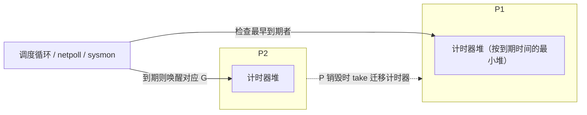

# 9.10 计时器

`time.Sleep`、`time.After`、`time.Timer`、`time.Ticker`，乃至网络读写的 `SetDeadline`，
背后都是同一套计时器机制。它要回答一个看似简单的问题：成千上万个计时器同时存在时，运行时
如何高效地知道「下一个该在什么时候叫醒谁」，又不为此空耗一个线程。

## 9.11.1 计时器长在 P 上

今天的计时器是**每个 P 一个最小堆**：堆按到期时间排序，堆顶就是最近要到期的那个。把计时器
分散到各个 P 上，而不是集中在一处，避免了全局锁的争用，与运行队列分散到各 P 是同一思路
（[9.1](./model.md)）。

到期的检查并不需要专门的线程轮询，而是顺路完成的。调度循环每一轮、网络轮询器
（[9.9](./poller.md)）的等待超时、以及系统监控（[9.8](./sysmon.md)），都会查看本地或全局最近的
到期时间：到点了就把对应的计时器函数执行掉（对 `time.Timer` 而言就是往 channel 送一个值，
唤醒等待的 G）。网络读写的截止时间也复用同一套机制，`SetDeadline` 本质上就是挂一个到期后
唤醒该连接 goroutine 的计时器。当某个 P 被销毁时（`GOMAXPROCS` 调小），它堆里的计时器会被
`take` 迁移到别的 P，不会丢失。

## 9.11.2 一段值得一提的演进

计时器的实现是 Go 运行时里被重写次数较多的部分之一，演进的主线是「越来越融入调度器」。

早期（Go 1.10 之前）所有计时器集中在少数几个全局的四叉堆里，由一个专门的 `timerproc`
goroutine 负责唤醒。这个集中式设计在高并发下成了瓶颈：全局锁争用重，那个专职 goroutine 也
容易成为单点。Go 1.14（2020）做了一次大改，把计时器拆散到每个 P 的堆上，并取消了专职
goroutine，改由调度循环与网络轮询器顺路检查到期，计时器自此真正融入了调度。此后（Go 1.23
前后）运行时又对计时器的内部结构做过一轮整理，简化了状态管理、修复了一些长期存在的竞态与
正确性问题。

这条演进线很能代表运行时组件的成长方式：从一个能用的集中式实现起步，随着规模暴露出争用与
单点问题，再逐步分散、并融入既有的调度骨架，而非另起炉灶。性能的提升，总是伴随着复杂度的
重新安置。

## 许可

&copy; 2018-2026 The [golang.design](https://golang.design) Initiative Authors. Licensed under [CC-BY-NC-ND 4.0](https://creativecommons.org/licenses/by-nc-nd/4.0/).
