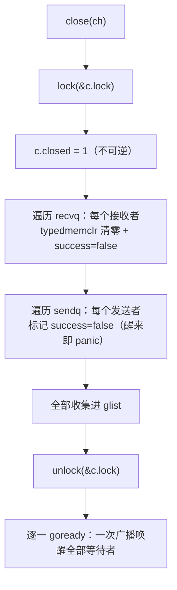
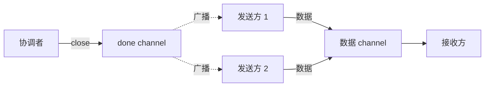

# 10.4 关闭的语义

前几节里，发送与接收都是「一对一」的会合：一次发送对上一次接收，多余的一方便阻塞等待。
关闭是 channel 上唯一的「一对多」操作。`close(ch)` 由一个 Goroutine 发出，却能在一瞬间
唤醒所有正阻塞在这条 channel 上的接收方，并让所有阻塞的发送方就地 panic。这种「一次广播、
众人皆醒」的能力，使关闭从一个看似不起眼的清理动作，变成了 Go 并发里最常用的取消与收尾
机制。done channel 模式、`context` 的取消（[11.8](../../part3concurrency/ch11sync/context.md)），
根子都在这里。

这一节回答三个问题：`close` 在运行时究竟做了什么，为什么它能成为广播原语；从一条已关闭的
channel 上接收会读到什么，`for range` 因何而终止；以及语言为关闭划下的三条 panic 红线，
为什么它们宁可让程序当场崩溃，也不肯悄悄容错。

## 10.4.1 close 做了什么：一次加锁广播

关闭的实现集中在 `runtime.closechan` 一个函数里。它的骨架可以裁剪成三段:先在锁内置位
`closed`，再把 `recvq` 与 `sendq` 上所有等待者一次性摘下、装进一个本地链表，最后解锁、
统一唤醒。下面是只保留设计要点的速写:

```go
// closechan：关闭一条 channel（速写，去掉了竞态检测与 synctest 分支）
func closechan(c *hchan) {
    if c == nil {
        panic(plainError("close of nil channel"))   // 红线一：close(nil)
    }

    lock(&c.lock)
    if c.closed != 0 {
        unlock(&c.lock)
        panic(plainError("close of closed channel")) // 红线二：重复关闭
    }
    c.closed = 1                                      // 置位，且不可逆

    var glist gList // 先收集，后唤醒：唤醒要在锁外做

    // 唤醒所有接收者：每个都将拿到零值，ok == false
    for {
        sg := c.recvq.dequeue()
        if sg == nil {
            break
        }
        if sg.elem != nil {
            typedmemclr(c.elemtype, sg.elem) // 把接收方的目标内存清零，即「零值」
            sg.elem = nil
        }
        gp := sg.g
        gp.param = unsafe.Pointer(sg)
        sg.success = false                    // 关键标志：本次接收并非来自一次真正的发送
        glist.push(gp)
    }

    // 唤醒所有发送者：它们醒来后会 panic
    for {
        sg := c.sendq.dequeue()
        if sg == nil {
            break
        }
        sg.elem = nil
        gp := sg.g
        gp.param = unsafe.Pointer(sg)
        sg.success = false
        glist.push(gp)
    }
    unlock(&c.lock)

    // 锁已释放，再把整张表逐一交还调度器
    for !glist.empty() {
        gp := glist.pop()
        goready(gp, 3)
    }
}
```

有三处设计值得点出。

其一，`closed` 是**一次性、不可逆**的状态:一旦置为 1，再无任何路径把它改回 0。
后文从已关闭 channel 接收的快路径（[10.3](./sendrecv.md)）正是建立在这个不变量之上,
观察到「已关闭」便是一个永久成立的事实，无需担心它中途又变回开放。

其二，`recvq` 与 `sendq` 上的等待者被**全部**取出，而非像发送、接收那样只唤醒队首一个。
这正是关闭的广播性所在:一条 channel 上可以同时阻塞着成百上千个接收方，`close` 一次把它们
尽数唤醒。每个接收方的目标内存被 `typedmemclr` 清零,这就是它们将读到的「零值」，
而 `sg.success = false` 标记这次唤醒并非源于一次配对的发送，接收方据此把第二返回值 `ok`
置为 `false`。

其三，**先收集进 `glist`、解锁、再统一 `goready`**。唤醒一个 Goroutine 要触及调度器，
若在持有 channel 锁时去 `goready`，被唤醒者可能立刻在另一个 P 上跑起来、回头再争这把锁，
徒增争用与持锁时长。把唤醒推到锁外，是运行时里反复出现的笔法（对照
[11.3](../../part3concurrency/ch11sync/mutex.md) 互斥锁交还等待者的处理）。



发送方被唤醒后并不会真的发送数据。它在 `chansend` 阻塞点（[10.3](./sendrecv.md)）醒来，
检查到 `c.closed != 0` 而本次又非真正的发送（`gp.param` 指示的 `sg.success` 为假），
于是执行 `panic(plainError("send on closed channel"))`。换言之，「向已关闭 channel 发送会
panic」这条规则，对**正阻塞着的**发送方，是由 `closechan` 唤醒、再由发送方自己在醒来处兑现的。

## 10.4.2 关闭作为广播：done channel 与取消

理解了 `closechan` 一次唤醒全部接收者，就理解了 Go 最惯用的取消模式。考虑一个
done channel:它从不承载有意义的数据，只承载「关闭」这一个事件。

```go
done := make(chan struct{})

// 多个 worker 同时阻塞在同一条 done 上
for i := 0; i < n; i++ {
    go func() {
        select {
        case <-done:   // 收到关闭信号，收尾退出
            return
        case task := <-tasks:
            handle(task)
        }
    }()
}

// 主 Goroutine 一次 close，n 个 worker 同时被唤醒
close(done)
```

这里 `chan struct{}` 的元素类型零宽，不占缓冲，它纯粹被当作信号线使用。`close(done)`
触发 `closechan` 的广播:所有阻塞在 `<-done` 上的 worker 被一并唤醒，各自读到零值后退出。
若改用「发送」来通知，发一次只能叫醒一个 worker，要唤醒 $n$ 个就得发 $n$ 次，且必须预先
知道 $n$。关闭把这件事变成 $O(1)$ 的一次广播，且无需知道接收方的数量。

这正是 `context` 取消（[11.8](../../part3concurrency/ch11sync/context.md)）的底层机制。
`context.WithCancel` 内部持有一个 `done` channel，`cancel()` 的核心动作就是 `close(done)`,
一次关闭，整棵 context 树上所有监听 `ctx.Done()` 的 Goroutine 同时收到取消信号。可以说，
`context` 是给 done channel 模式加上了树形传播与原因记录的一层封装，而广播的能力，
完全来自 `close` 本身。

## 10.4.3 从已关闭 channel 接收：先排空，再零值

广播之外，关闭对**接收**还有一层语义，它与缓冲数据的处理顺序密切相关:关闭并不丢弃尚未
被取走的缓冲数据。接收方从一条已关闭 channel 读取时，先把缓冲区里剩下的值依次取完，
**之后**才开始反复返回零值。

接收的处理顺序（[10.3](./sendrecv.md)）保证了这一点。`chanrecv` 在锁内的第一道判断是
「已关闭**且**缓冲为空」,只有两者同时成立才立刻返回零值；若缓冲里还有数据，控制流便落到
后面「缓冲非空则出队」的分支，照常把数据取走。于是关闭后的接收呈现两个阶段:

```go
ch := make(chan int, 3)
ch <- 1
ch <- 2
close(ch)

fmt.Println(<-ch) // 1   缓冲仍有数据，照常取出
fmt.Println(<-ch) // 2   取出第二个
v, ok := <-ch     // 0, false   缓冲排空，此后恒为零值
v, ok = <-ch      // 0, false   可反复读取，永不阻塞
```

两个语义合在一起，`for range` 的终止条件就清楚了。`for v := range ch` 由编译器
（[10.3](./sendrecv.md)）翻译为一个循环，每轮以 `v, ok := <-ch` 取值，`ok` 为 `false` 时退出。
对照上面两个阶段:channel 关闭前，循环照常取值并在无数据时阻塞；关闭后，循环先取完所有
缓冲数据，待排空后某次接收返回 `ok == false`，循环随即结束。**关闭是 `for range` 唯一
干净的终止信号**,不关闭的 channel 上的 `range` 会在数据耗尽后永久阻塞。

第二返回值 `ok` 的意义在这里也彻底明确:它回答的不是「有没有读到值」，而是「这个值是否
来自一次真正的发送」。`ok == true` 表示值来自配对的发送或缓冲；`ok == false` 表示
channel 已关闭且无更多数据，读到的是零值。

从内存模型（[11.9](../../part3concurrency/ch11sync/mem.md)）的角度，关闭还提供一条
happens-before 保证:`close(ch)` 发生在「因 channel 关闭而返回零值的接收」之前。
因此 done channel 不仅传递「取消」这一信号，还能安全地发布信号之前写入的共享数据,
关闭前的写入，对收到关闭信号后的读取可见。这是 done channel 能用作同步点的根据。

## 10.4.4 三条 panic 红线与 fail-fast

关闭是 channel 操作里 panic 最密集的一处。语言为它划下三条红线，任意一条被触碰，
程序当场崩溃:

| 误用 | 触发点 | panic 信息 |
| --- | --- | --- |
| 向已关闭 channel 发送 | `chansend` 检测到 `c.closed != 0` | `send on closed channel` |
| 重复关闭 | `closechan` 检测到 `c.closed != 0` | `close of closed channel` |
| 关闭 nil channel | `closechan` 入口 `c == nil` | `close of nil channel` |

这三条都选择了 **fail-fast**,立刻 panic，而非返回错误或静默忽略。这是一个值得说清的设计
取舍。把它们做成可恢复的错误，初看更「友好」，实则会把一个本质上的逻辑错误埋得更深。

向已关闭 channel 发送、以及重复关闭，几乎总意味着**所有权的混乱**:发送方与关闭方对
「这条 channel 此刻是否还该被写、该由谁收尾」产生了分歧。这类错误若被吞掉，数据可能悄无声息
地丢失，或留下一条已死却仍被写入的 channel，故障现场会飘移到远离根因的地方，徒增调试成本。
当场 panic 则把错误钉在第一案发地,栈回溯直指那次非法的 `close` 或 `send`。

关闭 nil channel 同理。一条 nil channel 的发送与接收都将**永久阻塞**（[10.3](./sendrecv.md)），
对它调用 `close` 多半是变量忘了初始化。这种错误没有任何合理的「容错」语义可言，
唯一正确的处置就是尽早暴露。

至于这三条为何**不能**用 `recover` 干净地兜住:`send on closed channel` 的 panic 发生在
数据已经准备好、却发现无处可送的半途，channel 的内部状态此刻并不适合让调用方假装无事发生
地继续。Go 的立场一以贯之,channel 的误用是程序员的逻辑错误，应在开发期被 `-race` 与测试
逼出来，而非在生产期靠 `recover` 续命。

## 10.4.5 所有权规则：发送方关闭，接收方不关

三条红线落到工程实践，凝结成一条朴素却极有效的约定:**由发送方关闭 channel，接收方永不
关闭**;当存在多个发送方时，没有任何一个发送方可以独自关闭。这条规则不是运行时强制的，
而是从上面的语义里自然推导出来的纪律。

为什么是发送方关闭？因为「不再有数据要发」这件事，只有发送方知道。接收方无从判断对端是否
已经发完,它若贸然关闭，正在发送的一方就会撞上 `send on closed channel` 而崩溃（红线一）。
反过来，发送方关闭则恰好向接收方广播了「到此为止」，与 `for range` 的终止语义严丝合缝。

多发送方的情形更棘手。此时无论哪个发送方来关闭，都可能在别的发送方仍在写时触发红线一，
或与另一个发送方的关闭撞上红线二。正确的做法是不让任何发送方关闭数据 channel，转而引入一条
独立的 done channel 由协调者关闭,发送方在每次发送前 `select` 检查 done 是否已关闭，
据此决定停手。这恰好回到 [10.4.2](#1042-关闭作为广播done-channel-与取消) 的广播模式:
数据 channel 负责传值，done channel 负责传「停」，两者各司其职。



把这条纪律和前几节连起来:发送（[10.3](./sendrecv.md)）、接收（[10.3](./sendrecv.md)）刻画的是
一对一的会合，`select`（[10.3](./select.md)）让一个 Goroutine 同时守望多条 channel，
而关闭，是把「我这边结束了」这个事件，一次广播给所有还在等待的人。三者合起来，
才凑齐了 Go 以 channel 编织并发的全部基本语汇。

## 延伸阅读的文献

1. The Go Authors. *runtime/chan.go*（`closechan`、`chanrecv`、`chansend` 的关闭分支）.
   https://github.com/golang/go/blob/master/src/runtime/chan.go
2. The Go Authors. *The Go Programming Language Specification: Close, Receive operator, For statements with range clause.*
   https://go.dev/ref/spec#Close
3. The Go Authors. *The Go Memory Model*（Channel communication，含 close-before-receive 的 happens-before 条款）.
   https://go.dev/ref/mem#chan
4. Sameer Ajmani. *Go Concurrency Patterns: Pipelines and cancellation.* The Go Blog, 2014.
   https://go.dev/blog/pipelines （done channel 取消模式的原始论述）
5. Sameer Ajmani. *Go Concurrency Patterns: Context.* The Go Blog, 2014.
   https://go.dev/blog/context （close 之上构建的取消传播）
6. C. A. R. Hoare. "Communicating Sequential Processes." *Communications of the ACM*, 21(8), 1978.
   https://doi.org/10.1145/359576.359585 （channel 通信的理论源头）
7. 本书 [10.3 收发与直接传递](./sendrecv.md)、[10.3 收发与直接传递](./sendrecv.md)、[10.3 select](./select.md)、
   [11.8 上下文](../../part3concurrency/ch11sync/context.md)、
   [11.9 内存一致模型](../../part3concurrency/ch11sync/mem.md).
