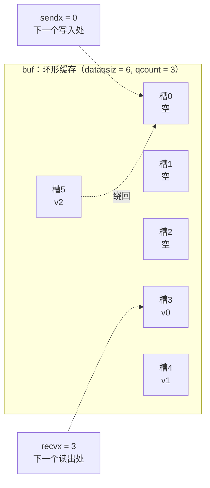

# 10.2 hchan：通道的内部结构

[10.1](./readme.md) 从 CSP 的角度交代了通道在语言里的位置：它是显式的消息信道，
把「通信」与「同步」合二为一。这一节把它拆开来看。一个 channel 在运行时里就是一个名为 `hchan`
的结构体，它的全部秘密不过是一把锁、一圈环形缓存、外加两条等待队列。结构虽小，每个字段的存在
都对应一处设计上的考量，读懂这几样东西，后面收发与 select 的全部逻辑（[10.3](./send.md)–
[10.6](./lock.md)）就只是「在这张图上搬运数据、挂起与唤醒 goroutine」。

沿用本书讲运行时数据结构的惯例，下文给出的结构体是**裁剪后的速写**，只留与设计相关的字段，
并在注释里说明它为何存在。完整定义可对照 `runtime/chan.go` 与 `runtime/runtime2.go`。

## 10.2.1 三条不变式：先看「为什么」

在逐字段拆解之前，先抄下 `chan.go` 开头那段注释立下的三条不变式，它们是整套结构的设计意图，
比任何字段说明都更能说清「为何如此」：

- `c.sendq` 与 `c.recvq` 至少有一个为空（唯一的例外是：一个无缓冲 channel 上，某个
  goroutine 用 select 同时在收和发两侧挂着）；
- 对缓冲 channel，`c.qcount > 0` 蕴含 `c.recvq` 为空；
- 对缓冲 channel，`c.qcount < c.dataqsiz` 蕴含 `c.sendq` 为空。

这三条用日常语言说就是一句话：**缓存里还有货，就不该有接收方在干等；缓存还有空位，就不该有
发送方在干等。** 一旦缓存与「干等的人」同时存在，说明本可以直接成交却没成交，那是 bug。整个
收发实现（[10.3](./send.md)、[10.4](./recv.md)）所做的，正是时刻维持这三条：能直接成交就
直接成交，实在成交不了才把自己挂进等待队列。带着这个意图回看下面的字段，就不再是枯燥的清单。

## 10.2.2 hchan 的速写

```go
// hchan：一个 channel 的运行时表示（速写）
type hchan struct {
    qcount   uint           // 缓存中现有的元素个数
    dataqsiz uint           // 环形缓存的容量（make 的第二个参数）
    buf      unsafe.Pointer // 指向一段可存 dataqsiz 个元素的连续数组
    elemsize uint16         // 单个元素的大小（由元素类型推出，缓存于此免去反复查表）
    closed   uint32         // 是否已 close
    elemtype *_type         // 元素类型：拷贝元素、写屏障、给 buf 标注 GC 信息都要用它
    sendx    uint           // 环形缓存的写游标（下一个待写入的槽）
    recvx    uint           // 环形缓存的读游标（下一个待读出的槽）
    recvq    waitq          // 阻塞的接收方队列（ <-ch ）
    sendq    waitq          // 阻塞的发送方队列（ ch<- ）

    lock mutex              // 一把锁，守护以上所有字段
}
```

字段大体分作三组。`qcount`、`dataqsiz`、`buf`、`sendx`、`recvx` 五个合起来描述那圈**环形缓存**
（10.2.3）；`recvq`、`sendq` 是两条**等待队列**（10.2.4）；`closed` 记录关闭状态，
`elemsize` 与 `elemtype` 是为搬运元素备下的元信息。其中 `dataqsiz` 在创建之后再不写入，
因此运行时可以无锁地读它来快速判断 channel 是否有缓存（`full` 等辅助函数依赖这一点）。
至于 `elemtype`，它不只用于按值拷贝元素和触发写屏障，还在创建时被交给分配器，
用来给 `buf` 标注「这段内存里哪些位置是指针」，这一点到 10.2.5 会再回来。
（go1.26 的 `hchan` 还有 `timer` 与 `bubble` 两个字段，分别服务于 `time` 定时器与
`testing/synctest`，与本节的主线无关，速写中略去。）

## 10.2.3 环形缓存：sendx 与 recvx 是头尾游标

缓冲 channel 的那段缓存是一个**环形队列**（ring buffer）。`buf` 指向一段能放 `dataqsiz` 个
元素的连续内存，`sendx` 与 `recvx` 是两个游标：发送方把元素写到 `sendx` 处再让它前进，
接收方从 `recvx` 处读出再让它前进，二者各自走到末尾就回绕到 0。`qcount` 记录当前存量，
于是「队列满」就是 `qcount == dataqsiz`，「队列空」就是 `qcount == 0`。定位第 `i` 个槽不过是
一次指针算术：

```go
// chanbuf(c, i)：取 buf 中第 i 个槽的地址
func chanbuf(c *hchan, i uint) unsafe.Pointer {
    return add(c.buf, uintptr(i)*uintptr(c.elemsize))
}
```

为什么用环形而非线性队列？因为 channel 的收发是严格的 FIFO：先发的先被收。线性数组在头部出队
后会留下空洞，要么搬移元素、要么浪费空间；环形队列让读写两端各自绕圈，出队入队都是 $O(1)$ 的
游标自增加回绕，不搬一个字节。下图是一个容量为 6、已存 3 个元素的 channel，
`recvx` 指向最早入队、即下一个被读走的元素，`sendx` 指向下一个空位：



发送时写入 `sendx`、`sendx = (sendx+1) % dataqsiz`、`qcount++`；接收时读出 `recvx`、
`recvx = (recvx+1) % dataqsiz`、`qcount--`。运行时不用取模，而是写成 `if sendx == dataqsiz { sendx = 0 }`，
省一次除法。回扣 10.2.1 的不变式：只要 `qcount` 在 $0$ 与 `dataqsiz` 之间，就说明缓存既没满也
没空，收发都能就地完成，两条等待队列此刻必定是空的。

## 10.2.4 等待队列：sudog 的 FIFO 链表

当缓存帮不上忙，比如向满了的 channel 发送、从空的 channel 接收，或者 channel 根本没有缓存，
当前 goroutine 就得挂起，等对面来人。它挂在哪里？挂进 `recvq` 或 `sendq`。这两条队列的类型是
`waitq`，一个朴素的双向链表，记着头和尾：

```go
type waitq struct {
    first *sudog // 队头：最早挂入、最先被唤醒
    last  *sudog // 队尾：最新挂入
}
```

链表的节点是 `sudog`。理解 channel，`sudog` 是绕不开的一环：它代表**一个正阻塞在某 channel 上的
goroutine，连同它想收发的那个元素槽**。裁剪后的速写：

```go
// sudog：一个挂在 channel 上的 goroutine + 它要收发的元素（速写）
type sudog struct {
    g *g                 // 被挂起的那个 goroutine

    next *sudog          // 在 waitq 中的后继
    prev *sudog          // 在 waitq 中的前驱

    elem maybeTraceablePtr // 待收发元素的地址，可能直接指向 g 自己的栈

    isSelect bool        // 该 g 是否正参与一次 select（唤醒时需 CAS 抢占）
    success  bool        // 唤醒原因：true=成功收发，false=channel 被 close
    c        maybeTraceableChan // 它阻塞在哪个 channel 上
}
```

为什么不直接把 `*g` 串进队列，而要套一层 `sudog`？因为「一个 goroutine 阻塞在一个 channel 上」
不是一对一的：同一个 goroutine 可以在一条 select 语句里同时挂在多个 channel 上，
同一个 channel 上也排着多个 goroutine。`sudog` 正是「(goroutine, channel) 这一次等待」的载体，
一个 goroutine 因此可能同时拥有多个 `sudog`。`sudog` 不为 channel 独有，`sync` 包的信号量
（[11.x](../ch11sync)）也用同一种结构排队，上面 `isSelect`、`success` 之外的若干字段就是为信号量
准备的，速写已略去。运行时用一个每 P 的缓存来复用 `sudog`，省去频繁分配。

`elem` 字段值得专门点出：它指向「这次要送出或接收的元素」，而这块内存**往往就在该 goroutine 自己
的栈上**。这正是 channel 一项关键优化的基础：当发送方遇到一个已在 `recvq` 里干等的接收方时，
可以把数据**直接拷进接收方栈上的 `elem`**，跳过环形缓存这道中转（[10.4](./recv.md) 详述）。
这也解释了为何 `sudog` 上这些字段要由 channel 的锁保护：唤醒一方、写它的栈，都得在持锁时进行。

队列本身是严格的 FIFO。入队挂到尾部，出队从头部摘下：

```go
func (q *waitq) enqueue(sgp *sudog) {
    sgp.next = nil
    x := q.last
    if x == nil {            // 空队列
        sgp.prev = nil
        q.first = sgp
        q.last = sgp
        return
    }
    sgp.prev = x             // 接到队尾
    x.next = sgp
    q.last = sgp
}

func (q *waitq) dequeue() *sudog {
    // 从队头摘；select 唤醒竞争下需跳过已被别处唤醒的节点，此处从略
    sgp := q.first
    // ... 更新 first / last，返回 sgp
    return sgp
}
```

先挂起的先被唤醒，这保证了通道收发的公平：没有哪个等待者会被无限期插队。10.2.1 那条
「至少一个队列为空」的不变式在这里也有了直观解释：若缓存有空位或有货，新来的收发方当场就成交了，
根本不会走到入队这一步，因此两条队列不会同时非空（select 双挂的特例除外）。

## 10.2.5 makechan：一次分配，noscan 优化

`make(chan T, n)` 被编译器翻译成 `makechan(t, n)`。它的本职工作是算出缓存所需内存、向堆申请、
填好元信息。channel 总是分配在堆上，由 GC 负责回收，这也是为什么不显式 `close` 也不会泄漏内存
（关闭与回收是两回事）。值得玩味的是它按元素类型分了三种分配策略：

```go
func makechan(t *chantype, size int) *hchan {
    elem := t.Elem
    mem, overflow := math.MulUintptr(elem.Size_, uintptr(size)) // 缓存总字节数
    if overflow || mem > maxAlloc-hchanSize || size < 0 {
        panic(plainError("makechan: size out of range"))
    }

    var c *hchan
    switch {
    case mem == 0:
        // 无缓存（size==0），或元素为零大小（如 struct{}）：根本不需要 buf
        c = (*hchan)(mallocgc(hchanSize, nil, true))
        c.buf = c.raceaddr()
    case !elem.Pointers():
        // 元素不含指针：hchan 与 buf 一次性分配在同一块内存里，且整块 noscan
        c = (*hchan)(mallocgc(hchanSize+mem, nil, true))
        c.buf = add(unsafe.Pointer(c), hchanSize)
    default:
        // 元素含指针：buf 必须单独分配，并带上 elemtype 让 GC 能扫描它
        c = new(hchan)
        c.buf = mallocgc(mem, elem, true)
    }

    c.elemsize = uint16(elem.Size_)
    c.elemtype = elem
    c.dataqsiz = uint(size)
    lockInit(&c.lock, lockRankHchan)
    return c
}
```

三条分支的分界，是「GC 要不要扫描这段缓存」：

- `mem == 0` 同时罩住了两种情形：无缓冲 channel（`size == 0`），以及元素是零大小类型
  （`chan struct{}`，常用作纯信号）。两者都不需要 `buf`，只分配一个 `hchan`，`buf` 指向一个
  仅供竞争检测器（`-race`）当同步地址用的占位。
- `!elem.Pointers()`，元素里没有指针：`hchan` 和 `buf` 在**一次 `mallocgc` 调用**里一并分出，
  `buf` 紧贴在 `hchan` 之后（`c.buf = add(c, hchanSize)`）。一次分配省去一次调用，更关键的是
  传入的类型是 `nil`，整块内存被标为 **noscan**，GC 扫描时直接跳过这段缓存，对元素是
  `int`、`byte` 之类的高频 channel 是实打实的开销节省。
- 元素**含指针**：`buf` 只能**单独**分配，且分配时必须把 `elemtype` 传进去。原因正在于上一条的
  反面，GC 必须扫描这段缓存里的指针，否则缓存中尚未取走的元素所引用的对象会被误回收。
  把 `elemtype` 交给分配器，就是让它给这块内存登记好「哪些字（word）是指针」的位图。
  此时 `hchan` 与 `buf` 分属两块内存，不能合并。

可见 `makechan` 不是简单地「分配一段内存」，它和 GC 是协同的：能 noscan 就 noscan，
必须扫描就如实标注。这与 [12 内存分配](../../part4memory/ch12alloc) 里分配器对含指针 / 不含指针
对象的区分是同一种思路，channel 只是它的一个使用者。

## 10.2.6 一把锁，与它撑起的同步语义

`hchan` 末尾那个 `lock mutex` 是整个结构的同步基石。它守护的不只是 `hchan` 自身的所有字段，
还包括**挂在这个 channel 上的那些 `sudog` 里的若干字段**，源码注释为此特意标明。收、发、关闭、
select，凡是要动到这些状态的操作，第一步都是 `lock(&c.lock)`，最后一步是 `unlock`。
正因有这把锁串起全程，channel 的一次发送与对应接收之间才建立起内存模型里的发生序
（happens-before，[11.9](../ch11sync/mem.md)），channel 由此既是通信手段，也是同步手段。

这把锁也带来一条微妙的纪律：**持有 `c.lock` 时不得去改变另一个 goroutine 的状态**
（尤其不得 `goready` 唤醒它）。原因是唤醒可能触发栈收缩，而栈收缩又会去抢这把锁，二者交叉就会
死锁。收发实现里那些「先在持锁时摘下 `sudog`、解锁后再 `goready`」的别扭写法，根源就在这里
（[10.6](./lock.md) 展开）。

用一把大锁守护整个 channel，是一个有意的取舍：实现简单、正确性容易论证，代价是同一 channel 上的
并发收发会在这把锁上串行化。社区与运行时作者很早就探讨过无锁 channel：Dmitry Vyukov 在 2014 年
前后提交过一份无锁 channel 的实验设计，最终因「复杂度的增长远超它换来的收益」而未被合并。
直到今天，标准 channel 仍是这把朴素的锁加环形缓存的组合。把这把锁看明白，
收发与 select 的全部细节（[10.3](./send.md)–[10.6](./lock.md)）就只是「在持锁的临界区里，
按 10.2.1 的不变式搬数据、挂起与唤醒」而已。

## 延伸阅读的文献

1. The Go Authors. *runtime/chan.go*（`hchan`、`waitq`、`makechan`、`chanbuf`，含开头的不变式注释）.
   https://github.com/golang/go/blob/master/src/runtime/chan.go
2. The Go Authors. *runtime/runtime2.go*（`sudog` 的定义与字段说明）.
   https://github.com/golang/go/blob/master/src/runtime/runtime2.go
3. Russ Cox. *Go Data Structures.* 2009.
   https://research.swtch.com/godata
4. Dmitry Vyukov. *Go channels on steroids*（无锁 channel 设计与未合并的实验）. 2014.
   https://docs.google.com/document/d/1yIAYmbvL3JxOKOjuCyon7JhW4cSv1wy5hC0ApeGMV9s
5. C. A. R. Hoare. *Communicating Sequential Processes.* Communications of the ACM, 21(8), 1978.
   https://doi.org/10.1145/359576.359585
6. 本书 [10.1 CSP 与通道](./readme.md)、[10.4 通道的接收](./recv.md)、
   [11.9 内存一致模型](../ch11sync/mem.md)、[12 内存分配](../../part4memory/ch12alloc)。

## 许可

&copy; 2018-2026 The [golang.design](https://golang.design) Initiative Authors. Licensed under [CC-BY-NC-ND 4.0](https://creativecommons.org/licenses/by-nc-nd/4.0/).
