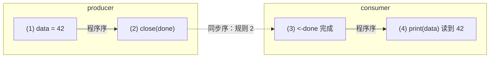

# 10.6 内存模型与无锁演进

前几节把 channel 拆到了零件：[10.3](./sendrecv.md) 的直接交付（direct handoff）让收发两端
绕过环形缓冲直接传值，[10.5](./select.md) 的 `select` 在多个就绪分支间做随机选择。这些机制
解释了 channel「怎么跑」。本节回答两个更上层的问题：channel 给并发程序提供了**什么可见性
承诺**，以及一个常被追问的工程疑案，channel 为什么至今仍是「一把锁加一个队列」，而不是
传说中更快的无锁结构。前者把 channel 接回 [11.9](../ch11sync/mem.md) 的内存模型，后者则是
一则关于「正确性与可维护性如何压过峰值性能」的真实取舍。

## 10.6.1 channel 的内存模型承诺

channel 不只是传数据的管子，它同时是建立 happens-before 的同步点。[11.9](../ch11sync/mem.md)
给出了 Go 内存模型的全貌，这里把其中与 channel 相关的四条规则单独拎出，逐条读懂它们的含义。
Go 内存模型（go.dev/ref/mem，2022 年 6 月版）对 channel 的规定如下，我们沿用 1.19 修订后的
术语 *synchronized before*（同步先于，记作 $<$）：

1. 一次发送**同步先于**对应接收的完成。对任意 channel（无论是否带缓冲）均成立。
2. `close(ch)` **同步先于**一个因 channel 关闭而返回零值的接收。
3. 对**无缓冲** channel，一次接收**同步先于**对应发送的完成。
4. 对容量为 $C$ 的缓冲 channel，第 $k$ 次接收**同步先于**第 $k+C$ 次发送的完成。

第 1 条是最朴素的直觉：把数据放进 channel 之前的所有写入，接收方在拿到这份数据之后都能看见。
这正是「不要用共享内存来通信，而要用通信来共享内存」这句格言的形式化基础。一段最小的例子：

```go
var data int
var done = make(chan struct{})

func producer() {
	data = 42       // (1) 普通写
	close(done)     // (2) 关闭即一次同步
}

func consumer() {
	<-done          // (3) 接收完成
	print(data)     // (4) 保证读到 42
}
```

(1) sequenced before (2)，由规则 2，(2) synchronized before (3)，(3) sequenced before (4)，
三段拼接的传递闭包给出 (1) $<$ (4)，于是 (4) 必然读到 42。把这条链画出来，跨 goroutine 的那
一步（`close` 同步先于接收）正是把两条程序序粘起来的关键边：



没有这条 channel 规则，(1) 与 (4) 之间就只剩数据竞争，[11.9.1](../ch11sync/mem.md) 那段会
打印 0 的程序便是反例。

## 10.6.2 无缓冲收发的「倒置」：发送即回执

第 3 条规则容易被忽略，却是无缓冲 channel 语义的精髓。注意它把方向**倒**了过来：对带缓冲
channel，是发送先于接收的完成；对无缓冲 channel，**接收**先于发送的**完成**。

这条倒置直接对应 [10.3](./sendrecv.md) 讲的直接交付。无缓冲 channel 没有缓冲槽，发送方必须等到
一个接收方就绪、把值直接交到它手上，发送操作才算完成。因此「发送返回」这一事件，恰恰证明
「已经有人收到了」。无缓冲发送由此具备了**回执**（acknowledgement）的语义：

```go
ch := make(chan struct{}) // 无缓冲

go func() {
	doWork()
	ch <- struct{}{} // 发送：要等对面收下才返回
}()

<-ch       // 接收：此刻可断定 doWork 已完成且其写入可见
useResult()
```

规则 3 保证 `<-ch`（接收）同步先于 `ch <- struct{}{}` 的完成，而后者又 sequenced after
`doWork()`。读者由此得到一个比「数据已送达」更强的结论：发送方走到了发送点之后。带缓冲
channel 给不了这个保证，发送可能只是把值塞进缓冲就返回，接收方未必已经动作。无缓冲与带缓冲
的真正分野不在「能不能缓存一个值」，而在这条可见性方向的倒置。

## 10.6.3 缓冲 channel 作为信号量

第 4 条规则,第 $k$ 次接收同步先于第 $k+C$ 次发送的完成,初看抽象，它其实是「缓冲 channel
即计数信号量」这一惯用法的形式根据。把规则反过来读：第 $k+C$ 次发送要想完成，必须等第 $k$
次接收先发生。也就是说，缓冲里最多容纳 $C$ 个未被接收的值，第 $C+1$ 个发送会阻塞，直到有人
取走一个腾出位置。容量 $C$ 恰好是「同时在途」的上限。

这正是用一个 `chan struct{}` 把并发度限制在 $C$ 的经典写法：

```go
// 把并发执行的 worker 数量限制为 C
func bounded(tasks []Task, C int) {
	sem := make(chan struct{}, C) // 容量 C 的缓冲 channel 充当信号量
	var wg sync.WaitGroup
	for _, t := range tasks {
		sem <- struct{}{} // 获取令牌：第 C+1 个发送会在此阻塞
		wg.Add(1)
		go func(t Task) {
			defer wg.Done()
			defer func() { <-sem }() // 释放令牌：一次接收，放行一个等待的发送
			t.Run()
		}(t)
	}
	wg.Wait()
}
```

`sem <- struct{}{}` 是 P 操作（acquire），`<-sem` 是 V 操作（release）。任意时刻在
`t.Run()` 中的 goroutine 数不超过 $C$：当已有 $C$ 个令牌被占用，第 $C+1$ 次 `sem <-` 阻塞，
直到某个 worker 完成后的 `<-sem` 接收腾出名额。规则 4 把这件事钉成了内存模型层面的保证，
而不只是「碰巧能跑」的经验。元素类型选 `struct{}` 是因为它零字节，缓冲只用来计数，不存数据。

## 10.6.4 为什么 channel 不是无锁的

读完 [10.1](./readme.md) 的 `hchan` 结构，细心的读者会注意到那把 `lock mutex`。在追求
高并发的 Go 运行时里，连分配器快路径（[12.2](../../part4memory/ch12alloc/component.md)）、
调度器本地队列都做成了无锁，channel 为何独独保留一把互斥锁？这不是没人尝试过。

2014 年，Dmitry Vyukov 提出提案 **golang/go#8899「runtime: lock-free channels」**，附带设计
文档与实现（CL 12544043）。提案报告：在一个曾因 channel 性能而改用其他同步原语的真实应用上，
无锁 channel 带来了约 **23%** 的端到端提速。数字可观，方向诱人。然而到 go1.26，`hchan` 依旧
是一把 `lock mutex` 保护着环形缓冲与收发等待队列，该提案长期挂在 Open / Unplanned 状态，
**并未落地**。

```go
// hchan：到 go1.26 仍由一把互斥锁保护全部字段（速写，对照 10.1）
type hchan struct {
	qcount   uint   // 缓冲中现存元素数
	dataqsiz uint   // 环形缓冲容量 C
	sendx    uint   // 发送游标
	recvx    uint   // 接收游标
	recvq    waitq  // 阻塞的接收者队列（FIFO）
	sendq    waitq  // 阻塞的发送者队列（FIFO）
	// lock 保护 hchan 全部字段，以及阻塞在本 channel 上的 sudog 的若干字段
	lock mutex
}
```

为什么一个有数据支撑的提速提案会被搁置？这里需要谨慎，官方并未给出一份「拒绝理由清单」，
下面是基于 channel 语义的、可推断的困难，而非已被确认的单一原因。channel 不是一个普通的
并发队列，它在一把锁之下同时维护着几项必须**联动**的不变量：收发等待队列的 **FIFO 次序**
（[10.6.5](#1065-fifo-公平与-select-公平的工程账)）、`select` 跨多个 channel 的**原子选择**
与公平性（[10.5](./select.md)）、以及 `close` 时对所有等待者的**广播**唤醒（一次性把 `recvq`
与 `sendq` 全部 ready）。把这三件事同时做成无锁、且仍保证线性一致，难度远高于一个纯粹的
MPMC 队列。互斥锁的代价是争用，换来的是这些不变量的实现与验证都简单得多。Go 团队在这里的
取向，与它在内存模型上只暴露顺序一致原子（[11.9.10](../ch11sync/mem.md)）是同一种性格：
**当峰值性能与正确性、可维护性相抵时，向后者倾斜**。

## 10.6.5 FIFO、公平与 select 公平的工程账

那把锁守护的两项不变量,FIFO 与公平,本身也经过演进，值得各记一笔。

**阻塞队列的 FIFO。** 提案 **golang/go#11506「runtime: make sure blocked channels run
operations in FIFO order」**（Russ Cox 提出，Go 1.6 早期修复）指出一个隐患：当多个 goroutine
阻塞在某 channel 上、该 channel 变为可用时，恰好「路过」的运行中 goroutine 有可能抢在已阻塞者
之前完成操作，使阻塞者承受任意延迟。修复的机制正是 [10.3](./sendrecv.md) 的直接交付：channel
变为可用时，唤醒动作直接把值交给 `recvq` 队头的那个等待者，而 `recvq` 是按到达顺序入队的
先进先出队列（`enqueue` 入队尾、`dequeue` 出队头）。先到先服务由此成为保证，而非概率。

**select 的公平。** `select` 面对多个同时就绪的分支时，必须随机挑一个，否则书写在前的分支会
长期饿死后面的分支。提案 **golang/go#21806「runtime: select is not fair」** 报告 Go 1.9
在某些 channel 配置下随机性失效。今天的实现（[10.5](./select.md)）用一次洗牌解决：

```go
// select 执行前打乱分支的轮询顺序（pollorder），实现公平（速写，对照 src/runtime/select.go）
for i := 1; i < ncases; i++ {
	j := cheaprandn(uint32(i + 1)) // 廉价随机数
	pollorder[i] = pollorder[j]    // Fisher-Yates 洗牌
	pollorder[j] = uint16(i)
}
```

`pollorder` 决定按什么次序检查各分支是否就绪，洗牌让每个就绪分支被选中的概率均等。注意它与
`lockorder` 是两套次序：`lockorder` 按 channel 地址排序，保证多 `select` 之间以一致次序加锁，
避免死锁；`pollorder` 才负责公平。两者都在那把锁的协议之内，这也从侧面印证了 [10.6.4](#1064-为什么-channel-不是无锁的)
的判断,FIFO 与 `select` 公平这类「跨多个等待者、跨多个 channel」的不变量，是把 channel
留在锁内的实打实的理由。

## 10.6.6 小结：一把锁背后的取舍

channel 的内存模型承诺与它的实现形态，是同一个取舍的两面。四条 synchronized-before 规则
给了用户一份强而清晰的可见性契约：发送建立 happens-before，无缓冲发送是回执，缓冲容量是
信号量。要稳妥兑现这份契约，外加 FIFO、`select` 公平、`close` 广播这些联动不变量，最直接的
办法就是一把锁。无锁 channel（#8899）在某些负载上确能更快，却要以重写这些不变量的正确性证明
为代价，这笔账 Go 团队至今没有签。性能的提升从不白来，这一处，它换来的是一份能被读懂、
能被维护、能被信任的并发语义。下一章 [11.9](../ch11sync/mem.md) 会把这份 channel 契约放回
完整的 Go 内存模型里，与 mutex、atomic 的规则并置而观。

## 延伸阅读的文献

1. The Go Authors. *The Go Memory Model* (Version of June 6, 2022). 节「Channel communication」.
   https://go.dev/ref/mem
2. Dmitry Vyukov. *runtime: lock-free channels.* Go issue #8899（含设计文档与 CL 12544043；
   报告约 23% 提速；至 go1.26 仍为 Unplanned，未合并）.
   https://github.com/golang/go/issues/8899
3. Russ Cox. *runtime: make sure blocked channels run operations in FIFO order.* Go issue #11506
   （Go 1.6 早期修复）. https://github.com/golang/go/issues/11506
4. The Go Authors. *runtime: select is not fair.* Go issue #21806.
   https://github.com/golang/go/issues/21806
5. The Go Authors. *src/runtime/chan.go、src/runtime/select.go.*（go1.26：`hchan` 仍由
   `lock mutex` 保护；`select` 以 `cheaprandn` 洗牌 `pollorder`）
   https://github.com/golang/go/tree/master/src/runtime
6. C. A. R. Hoare. "Communicating Sequential Processes." *Communications of the ACM*, 21(8), 1978.
   https://doi.org/10.1145/359576.359585
7. 本书 [10.3 收发与直接传递](./sendrecv.md)、[10.5 select 与公平](./select.md)、
   [11.9 内存一致模型](../ch11sync/mem.md).
