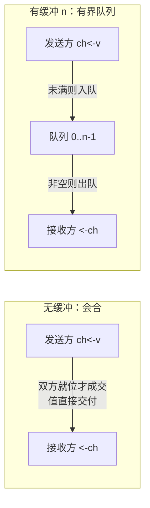

# 10.1 通道与 CSP 的工程化

> 本节内容提供一个线上演讲：[YouTube 在线](https://www.youtube.com/watch?v=d7fFCGGn0Wc)，
> [Google Slides 讲稿](https://changkun.de/s/chansrc/)。

CSP 给了 Go 一个主张：进程之间不共享状态，只靠传递消息来协调（[1.3](../../part1overview/ch01intro/csp.md)）。
这一节关心的是另一个问题：一门工程语言要把这个主张落地，需要把「通信」做成什么样子，
才能让普通程序员顺手用对。Go 的答案是 channel，一个一等的同步兼通信原语。本节先把它在
语言表层的模型讲清楚，它的类型、收发语法、有无缓冲的两种语义、方向限定与 nil 行为，
为后续各节深入运行时实现（[10.2](./impl.md)–[10.7](./pattern.md)）铺好直觉。

## 10.1.1 把通信做成一等原语

「不要以共享内存的方式通信，而要以通信的方式共享内存。」这句格言常被引用，但它在 Go 里不是
一句口号，而是由 channel 这个具体的语言构造兑现的。CSP 的渊源、它与 1978 年原始论文的异同，
已在 [1.3](../../part1overview/ch01intro/csp.md) 交代，这里不再重复，只接着说 Go 在工程上做了
什么取舍。

把 CSP 的「通信」搬进一门通用语言，至少要回答三件事：通信经由什么载体、这个载体能否像普通值
一样使用、它如何与类型系统咬合。Go 给出的载体是 channel，并且把它做成了**一等**（first-class）
的：channel 是有类型的值，可以由 `make` 创建、用变量持有、作为参数传给函数、作为返回值传出、
存进结构体字段、放进 slice 或 map。这一点与 Hoare 原始 CSP 按进程名直接通信的设计不同
（[1.3.2](../../part1overview/ch01intro/csp.md)），也正是 Go 把抽象主张变为可组合工具的关键:
既然 channel 是值，「把一个通信端口交给另一段代码」就退化成了普通的传参，无需任何特殊机制。

channel 同时承担两件常被分开的事:**同步**与**数据传递**。一次收发既搬运了一个值，又在收发
双方之间建立了一个发生序（happens-before）关系，后者保证了「发送方在发送前写下的内存，接收方
在接收后一定看得见」。换句话说，channel 不仅是一根传值的管子，它还是同步原语。这条发生序
保证是 channel 能替代显式加锁的根基，其精确条文留待 [10.6](./lockfree.md) 与
[11.9](../ch11sync/mem.md) 展开，本节只需记住:**收发自带同步**。

## 10.1.2 表层模型：从 make 到 select

先用一组最小的代码把 channel 的表层 API 过一遍，建立操作直觉，细节在后续小节展开。

创建用 `make`。无缓冲与有缓冲只差一个容量参数:

```go
ch := make(chan int)      // 无缓冲：容量为 0
buf := make(chan int, 8)  // 有缓冲：容量为 8
```

发送与接收都用箭头算符 `<-`，箭头指向数据流动的方向:

```go
ch <- 42        // 发送：把 42 送入 ch
v := <-ch       // 接收：从 ch 取一个值
```

接收还有一个双返回值形式，第二个布尔值 `ok` 用来区分「收到一个真实的值」与「channel 已关闭
且缓冲已空，收到的是零值」:

```go
v, ok := <-ch   // ok == false 表示 ch 已关闭且无更多数据
```

`close` 关闭一个 channel，宣告不会再有发送。关闭之后，已在缓冲中的值仍可被接收，缓冲取空后
继续接收则立即返回零值与 `ok == false`。关闭的完整语义（谁该关闭、向已关闭的 channel 发送或
重复关闭会 panic）留到 [10.4](./close.md)，这里只取其表层行为。

`range` 在 channel 上迭代，反复接收直到 channel 关闭并取空，是消费一条数据流的惯用写法:

```go
for v := range ch {   // 循环到 ch 关闭且缓冲取空后自动结束
    use(v)
}
```

`select` 在多路通信间择一而行。它同时盯住若干收发操作，挑一个就绪的执行；若多个同时就绪，
随机选一个；若都不就绪，则阻塞，除非写了 `default` 分支:

```go
select {
case v := <-in:        // in 可读则走这里
    handle(v)
case out <- x:         // out 可写则走这里
    x = next()
default:               // 上面都不就绪时立即返回，避免阻塞
    idle()
}
```

`select` 是把 CSP 的「守卫与选择指令」工程化的产物，它的随机择一、公平性与两轮加锁实现是
[10.5](./select.md) 的主题。至此，channel 的全部表层算符就是这几样:`make`、`<-`、`close`、
`range`、`select`。接下来的几小节，逐一把其中容易用错的语义点讲透。

## 10.1.3 无缓冲与有缓冲：会合还是排队

容量参数把 channel 分成语义迥异的两类，理解这条分界是用对 channel 的前提。

**无缓冲 channel**（容量 0）是一次**会合**（rendezvous）。发送方执行 `ch <- v` 时，若此刻
没有接收方在等，发送方就地阻塞，直到某个接收方执行 `<-ch` 与之配对；配对成功的那一刻，值
直接从发送方交到接收方，两者才各自继续。接收先到也对称地阻塞等发送。于是无缓冲 channel 的
一次成功收发，意味着**收发双方在那一刻确实碰过头**:发送返回时，你确知值已被某个接收方收走。

```go
done := make(chan struct{})
go func() {
    work()
    done <- struct{}{}   // 通知：我做完了
}()
<-done                   // 阻塞到上面那行执行，二者在此会合
```

**有缓冲 channel**（容量 $n>0$）是一个**容量为 $n$ 的有界队列**。发送方执行 `ch <- v` 时，
只要队列未满就把值放进队列、立即返回，不必等接收方到场；队列满了才阻塞。接收方从队头取值，
队列空了才阻塞。这里的关键差别在于:**有缓冲发送返回时，值可能还躺在队列里，接收方尚未取走**。
你换来了发送与接收在时间上的解耦，代价是失去了「发送返回即对方已收到」这条会合保证。



何时用哪种，可以归到几条朴素的判断上。需要「我做完、对方确认收到」这类强同步信号时，用无缓冲，
它的会合语义恰好就是握手。需要让生产者与消费者在节奏上解耦、削平突发，或想给在途数据设一个
明确的上限时，用有缓冲，队列容量就是这个上限。容量还能当一把**信号量**用:`make(chan struct{}, k)`
配合「发送占位、接收释放」，就限制了同时进行的并发数不超过 $k$（[10.7](./pattern.md)）。

需要警惕的是一种常见的误解，把缓冲当作免费的提速旋钮。缓冲解耦的是**时机**，不是计算本身;
它不会让总工作量变少，反而引入了新的问题:缓冲多大才合适、满了之后的背压如何处理、在途数据
在崩溃时如何交代。一个拍脑袋设成很大的缓冲，往往只是把「何时阻塞」推后，并把队列堆积的风险
藏了起来。容量是一个需要论证的设计参数，不是默认就该往大里调的性能开关。

## 10.1.4 方向限定：让类型替你守约

channel 类型可以带方向，把一个双向 channel 收窄为只发或只收:

```go
chan<- int   // 只能发送
<-chan int   // 只能接收
```

方向写在函数签名里，是一种廉价而有力的 API 卫生手段。考虑一个生产者函数，它只该往 channel
里写、绝不该读，把参数声明成只发，编译器就替你拦住任何误读:

```go
func produce(out chan<- int) {   // out 只能发送
    for i := 0; i < 10; i++ {
        out <- i
    }
    close(out)                   // 由生产者关闭，符合「发送方负责关闭」的约定
}

func consume(in <-chan int) {    // in 只能接收
    for v := range in {
        use(v)
    }
}
```

双向 channel 可以隐式赋给单向类型，反之不行。于是惯常的写法是:在一处用 `make` 造出双向
channel，再把它分别以只发、只收两种受限视图传给生产者与消费者。方向不改变运行时行为，它纯粹
是编译期的约束，把「这一端只该发」「那一端只该收」的意图写进类型，让违约在编译时而非运行时
暴露。这也顺手把「谁负责 `close`」这件容易出错的事钉在了类型上:只有持有发送端的一方才有资格
调用 `close`，因为对只收视图调用 `close` 根本无法通过编译。

## 10.1.5 nil channel：永久阻塞的妙用

一个尚未 `make`、值为 `nil` 的 channel，对它收或发都会**永久阻塞**:

```go
var ch chan int   // nil channel
ch <- 1           // 永久阻塞
<-ch              // 永久阻塞
```

孤立地看，这像是一个只会制造死锁的陷阱。但放进 `select`，它就成了一个干净的开关。`select`
会忽略那些永远不会就绪的分支，而一个 nil channel 的分支正是永远不就绪。于是「把某个 case 的
channel 置为 nil」就等于在运行时**动态关掉这个分支**，无需改动 `select` 的结构。

这个技巧在「读完一路输入后不再监听它」的场景里尤其顺手。下面的循环同时消费两路输入，某一路
关闭后，就把对应的 channel 变量置为 nil，从此 `select` 不再选中那条已耗尽的分支，避免了对
已关闭 channel 反复收到零值的忙转:

```go
for in1 != nil || in2 != nil {
    select {
    case v, ok := <-in1:
        if !ok {
            in1 = nil   // in1 耗尽，关掉这条分支
            continue
        }
        handle(v)
    case v, ok := <-in2:
        if !ok {
            in2 = nil   // in2 耗尽，关掉这条分支
            continue
        }
        handle(v)
    }
}
```

把 nil channel 的「永久阻塞」与 `select` 的「忽略不就绪分支」两条规则合起来，就得到了一个
表达力很强的惯用法。这也提示我们，channel 的几条表层规则并非孤立，它们彼此组合才构成真正
好用的工具，后续讲实现时会反复见到运行时如何精确兑现这些组合。

## 10.1.6 本章的路线

有了表层模型，接下来逐层深入 channel 在运行时里的实现。各节的安排如下:

- [10.2 hchan：通道的内部结构](./impl.md)：一个 channel 在内存里长什么样，环形缓冲、
  收发等待队列与那把锁。
- [10.3 收发与直接传递](./sendrecv.md)：一次收发如何在两个 goroutine 间会合，以及绕过缓冲
  把数据直接写入对方栈的优化。
- [10.4 关闭的语义](./close.md)：`close` 如何向所有等待者广播，以及那几条会 panic 的边界。
- [10.5 select 的实现](./select.md)：`selectgo` 如何在多路通信间随机、公平、无死锁地择一。
- [10.6 内存模型与无锁演进](./lockfree.md)：收发建立的发生序保证，以及 channel 为何选择
  有锁、又能否更进一步。
- [10.7 工程实践与跨语言对照](./pattern.md)：常见的 channel 模式与陷阱，以及与别家并发原语
  的对照。

读完本节，读者应已能写出正确的 channel 代码;读完本章，则能讲清这些代码为何如此运转。

## 延伸阅读的文献

1. The Go Authors. *The Go Programming Language Specification: Channel types, Send statements,
   Receive operator, Close.* https://go.dev/ref/spec#Channel_types
2. The Go Authors. *Effective Go: Channels.* https://go.dev/doc/effective_go#channels
3. Rob Pike. *Go Concurrency Patterns.* Google I/O 2012.
   https://go.dev/talks/2012/concurrency.slide
4. Sameer Ajmani. *Advanced Go Concurrency Patterns.* Google I/O 2013.
   https://go.dev/talks/2013/advconc.slide （nil channel 在 select 中关闭分支的技巧）
5. C. A. R. Hoare. "Communicating Sequential Processes." *Communications of the ACM*,
   21(8), 1978. https://doi.org/10.1145/359576.359585
6. 本书 [1.3 顺序进程通讯](../../part1overview/ch01intro/csp.md)、
   [10.6 内存模型与无锁演进](./lockfree.md)、[11.9 内存一致模型](../ch11sync/mem.md).
