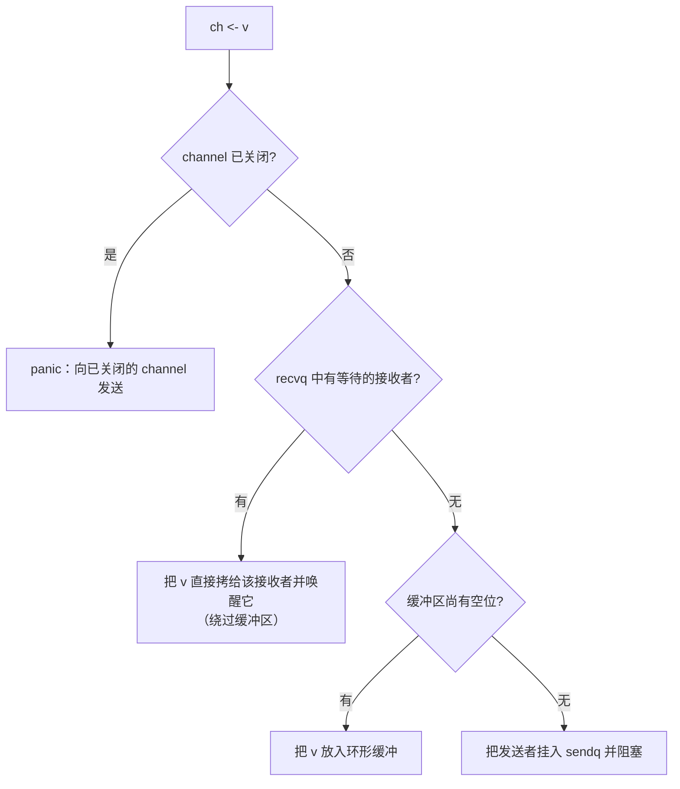

# 第 10 章 通道与 select

> 本章配有一个线上演讲：[YouTube 在线](https://www.youtube.com/watch?v=d7fFCGGn0Wc)，
> [Google Slides 讲稿](https://changkun.de/s/chansrc/)。

「不要以共享内存的方式通信，而要以通信的方式共享内存。」这句广为流传的格言，是 Go 并发哲学的
浓缩。channel 正是这句话的载体，它把同步与数据传递合二为一。本章看看这层简洁语法之下，
channel 与 select 究竟是怎样实现的。

## 10.1 channel 是什么

channel 的思想源自 Hoare 的 CSP（顺序进程通讯，见 [1.3](../../part1overview/ch01intro/csp.md)）：
进程之间不共享状态，只通过收发消息来协调。Go 没有照搬 CSP 的全部，但取了它最关键的一点，
把「通信即同步」做成了语言的一等公民。

运行时里，一个 channel 就是一个 `hchan` 结构，核心是四样东西。

一个可选的环形缓冲区（容量为 0 的无缓冲 channel 没有它）、一队等待发送的 goroutine `sendq`、
一队等待接收的 goroutine `recvq`，以及一把保护整体的锁。channel 的全部行为，都是围绕这四样
东西的状态变化。

## 10.2 发送与接收：那个优雅的直接传递

先看发送 `ch <- v` 的决策。

这里最值得玩味的是中间那条**直接传递**：如果此刻已经有接收者在 `recvq` 里等着，发送者不会
把值放进缓冲再让接收者去取，而是把值**直接拷贝到那个接收者的栈上**，然后唤醒它。一次拷贝
搞定，缓冲区根本没参与。接收 `<-ch` 是完全对称的：若有发送者在等，就直接从它那里取走值。
这个优化省掉了「先入缓冲、再出缓冲」的一进一出，是 channel 在高频收发下依然轻快的关键。

由此也能理解**无缓冲 channel**的语义：它没有缓冲区，发送与接收必须**会合**（rendezvous），
任何一方先到都得等另一方，配对成功的瞬间值被直接传递。这正是无缓冲 channel 能用作两个
goroutine 之间「同步点」的原因。**缓冲 channel**则在缓冲未满时允许发送者不等待接收者先行离开，
把同步放松成了「最多积压 C 个」。

## 10.3 关闭

`close(ch)` 会唤醒所有在 `recvq` 与 `sendq` 上等待的 goroutine。被唤醒的接收者读到的是元素类型
的零值，并可通过 `v, ok := <-ch` 的 `ok == false` 得知 channel 已关闭，这使得 close 成为向多个
接收者**广播「到此为止」**的惯用法。几条边界是语言强制的：向已关闭的 channel 发送会 panic，
重复关闭会 panic，关闭 `nil` channel 也会 panic。这些"宁可崩溃也不沉默"的设计，是为了让
误用尽早暴露，而非埋下隐患。

## 10.4 select：多路等待

`select` 让一个 goroutine 同时在多个 channel 操作上等待，哪个先就绪就走哪个分支。它的实现要
照顾两件事：公平，与正确的阻塞。

**公平**靠随机化。select 在轮询各分支前，先对分支顺序做一次随机打乱，避免书写在前的 case 总是
被优先选中而饿死后面的。**阻塞**则分两步走：先按随机顺序扫一遍，若有任一分支已就绪，立即执行
它；若全都没就绪且没有 `default`，就把当前 goroutine 同时挂到所有相关 channel 的等待队列上，
然后阻塞；任何一个 channel 就绪并唤醒它时，再把它从其余队列上摘下来。带 `default` 的 select
则在无人就绪时立刻走 `default`，从而实现非阻塞的收发。

## 10.5 happens-before 与工程取舍

channel 不只是传数据，它还建立内存可见性的次序。一次发送 happens before 对应接收的完成
（[11.9 内存一致模型](../ch11sync/mem.md)），所以「发送前写下的数据，接收后一定看得见」。
这正是把 channel 当同步原语使用的根基，也是 Go 推荐「以通信共享内存」的底气。

实现上，channel 走的是有锁路径，而非无锁。Go 团队权衡过：channel 的语义（配对、阻塞唤醒、
select 多路等待、关闭广播）相当复杂，一把每通道的细粒度锁已经足够快，且远比无锁实现易于保证
正确。这是一处「正确与可维护优先于极致性能」的典型取舍，与 [11.9](../ch11sync/mem.md) 里
Go 只暴露顺序一致原子的选择一脉相承。最后值得提醒：channel 优雅，但并非万灵药。表达
「保护一小段共享状态」时，一把 `sync.Mutex`（[11.2](../ch11sync/mutex.md)）往往比 channel
更直接也更快，该用哪个，取决于你要表达的是「通信」还是「互斥」。

## 进一步阅读的文献

1. C. A. R. Hoare. "Communicating Sequential Processes." *Communications of the ACM*,
   21(8), 1978. https://doi.org/10.1145/359576.359585
2. The Go Authors. *The Go Memory Model：Channel communication.* https://go.dev/ref/mem
3. Go 博客. *Share Memory By Communicating.* https://go.dev/blog/codelab-share

## 许可

&copy; 2018-2026 The [golang.design](https://golang.design) Initiative Authors. Licensed under [CC-BY-NC-ND 4.0](https://creativecommons.org/licenses/by-nc-nd/4.0/).
