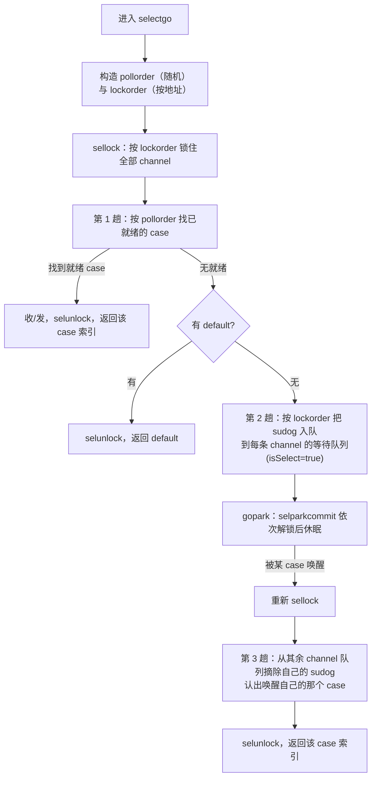

# 10.5 select 的实现

前几节把单个 channel 的收发（[10.3](./sendrecv.md)）讲清楚了。可现实里的
Goroutine 往往不只盯着一条 channel：它要在多个收发操作中，对**先就绪的那个**作出反应，
还要能在「一个都没就绪」时不被阻塞。`select` 正是为此而生。它的语义看似简单，落到实现上却要同时
解决两个棘手问题：多个就绪分支时如何**公平**地选一个，以及为执行一次 select 而锁住多条 channel
时如何**不死锁**。这两点决定了 `selectgo` 的全部结构，本节就围绕它们展开。

```go
select {
case v := <-ch1:   // ch1 可接收时执行
    use(v)
case ch2 <- x:     // ch2 可发送时执行
    sent()
default:           // 上面都未就绪时执行（可选）
    nonblocking()
}
```

约定先摆在前面。每个 case 描述一个 channel 操作（收或发），`select` 求值后**至多执行一个**
case 的通信。若有多个 case 同时就绪，从中**等概率随机**挑一个；若都未就绪，有 `default` 则执行
`default`（这使整条 select 变成非阻塞），无 `default` 则阻塞，直到某个 case 就绪。语言规范
（[Select statements](https://go.dev/ref/spec#Select_statements)）把这套语义钉死，运行时
负责兑现，编译器负责把 source 形态翻译成运行时能消化的数据。

## 10.5.1 编译器的下沉：把简单情形挑出去

并非每条 select 都值得走那套完整机制。编译器在 `walk` 阶段（`cmd/compile/internal/walk/select.go`）
先按规模把几类退化情形单独翻译，剩下的才交给通用的 `selectgo`：

- **零 case**（`select {}`）：永久阻塞。直接翻译成 `runtime.block()`，它 `gopark` 当前
  Goroutine 且永不唤醒。
- **单 case**（`select { case ... }`，无 `default`）：等价于把那个 channel 操作裸写一遍。
  直接下沉为一次普通的发送或接收，不进 `selectgo`。
- **单 case 加 default**（恰两个 case，其一为 `default`）：这是非阻塞收发的惯用法。翻译成
  一次 `if`，调用 `selectnbsend` 或 `selectnbrecv`，二者不过是把 `chansend` / `chanrecv` 的
  `block` 参数置为 `false` 的薄封装：

```go
// 编译器对 “select { case ch<-v: ...; default: ... }” 的下沉（示意）
if selectnbsend(ch, &v) { /* case 体 */ } else { /* default 体 */ }

// runtime/chan.go：非阻塞发送只是 block=false 的 chansend
func selectnbsend(c *hchan, elem unsafe.Pointer) (selected bool) {
    return chansend(c, elem, false)
}
```

这层下沉的意义在于：日常代码里出现最多的 select，恰是「单 case 加 default」这类非阻塞探测，
把它们挡在 `selectgo` 之外，省去了构造 case 数组、计算两套次序、加锁全部 channel 的开销。只有
**两个及以上真实通信分支**的 select，才真正进入下一节的机制。需要补一句：即便源码写了很多 case，
若运行时大多 channel 被置为 `nil`（`nil` channel 的 case 永不就绪，等同于不存在），通用代码也照样
正确处理，因此编译器不再为「碰巧只剩一两个有效 case」另设快路径。

## 10.5.2 两套次序：selectgo 的数据结构

进入 `selectgo` 的，是一个 `scase` 数组。go1.26 的 `scase` 已被裁到不能再瘦：

```go
// runtime/select.go：一个 case 的全部描述
type scase struct {
    c    *hchan         // 本 case 操作的 channel
    elem unsafe.Pointer // 发送的数据地址，或接收的落点地址
}
```

发送还是接收，不再用字段标记，而是用**位置**编码：编译器把所有发送 case 排在数组前段、接收 case
排在后段，`selectgo(cas0, order0, pc0, nsends, nrecvs, block)` 用 `nsends` / `nrecvs` 划界，
索引 `casi < nsends` 即发送，否则即接收。这省掉了每个 case 的一个 `kind` 字段。

真正的机关在那个 `order0` 数组，它长 `2*ncases`，被切成**两段**，承载 select 的两条核心不变量：

```go
ncases := nsends + nrecvs
scases := cas1[:ncases:ncases]
pollorder := order1[:ncases:ncases]        // 轮询次序：决定“先看哪个 case 是否就绪”
lockorder := order1[ncases:][:ncases:ncases] // 加锁次序：决定“按什么顺序锁 channel”
```

`pollorder` 服务**公平性**，`lockorder` 服务**无死锁**。它们解决的是两个正交的问题，因此用两套
独立的次序。下面分别看它们如何构造。

## 10.5.3 pollorder：随机轮询带来公平

若 `selectgo` 总按源码书写顺序检查各 case，那么当多个 case 持续就绪时，**靠前的 case 会被
长期偏袒**，靠后的可能饿死。规范要求的「等概率随机选一个」，正是为杜绝这种偏袒。实现的办法是：
在检查就绪之前，先把 case 的检查顺序随机打乱，于是「第一个被发现就绪的 case」对所有 case 是均匀的。

打乱用的是原地的 Fisher-Yates 洗牌，随机源是 `cheaprandn`（每 M 自带、无锁的廉价随机数）：

```go
// 构造 pollorder：Fisher-Yates 原地洗牌（裁剪）
norder := 0
for i := range scases {
    cas := &scases[i]
    if cas.c == nil {       // nil channel 的 case 永不就绪，剔出轮询
        cas.elem = nil
        continue
    }
    j := cheaprandn(uint32(norder + 1)) // [0, norder] 内均匀取一个位置
    pollorder[norder] = pollorder[j]
    pollorder[j] = uint16(i)
    norder++
}
pollorder = pollorder[:norder]
```

Fisher-Yates 的正确性是经典结论：它产出全部 $n!$ 种排列且每种等概率，单趟 $O(n)$，无需额外
空间。把它接在 `cheaprandn` 上，select 的公平性便有了底，**每个就绪 case 被选中的概率相等**。
这里有一处工程细节值得点出：随机源用的是 `cheaprandn` 而非加密级随机，因为此处要的是统计意义上的
均匀，不需要抗预测，廉价才是对的取舍。

> 一段历史。select 的公平性并非凭空写就，而是被一个真实的工程问题逼出来的。早年 issue
> [golang/go#21806](https://github.com/golang/go/issues/21806) 讨论过：在某些负载下，
> 用户观察到 select 的分支选择呈现出可感知的偏斜，进而推动社区把「随机化轮询」这一点既写进
> 规范叙述，也固化进实现。今天我们读到的 `cheaprandn` 加 Fisher-Yates，是这条公平性约束的落地。

## 10.5.4 lockorder：全局一致的加锁次序避免死锁

执行一次 select，运行时要同时持有**所有涉及 channel 的锁**：要逐个检查它们是否就绪，又可能要把
自己挂到每条 channel 的等待队列上，这些都要在持锁下进行。多把锁一旦涉及，死锁的幽灵就来了。设
Goroutine A 执行 `select { case <-x: ; case <-y: }`，B 执行 `select { case <-y: ; case <-x: }`，
若各自按书写顺序加锁，A 锁住 `x` 等 `y`、B 锁住 `y` 等 `x`，便是教科书式的交叉死锁。

破解之道是并发编程的老办法：**为所有锁规定一个全局统一的获取顺序，谁都按这个顺序加锁**。只要
所有 Goroutine 锁 `x`、`y` 的先后一致，环形等待就不可能成立。`selectgo` 选 channel 的**地址**
作这个全局序的键（`sortkey` 即指针值），把 case 按 channel 地址排序，得到 `lockorder`：

```go
func (c *hchan) sortkey() uintptr {
    return uintptr(unsafe.Pointer(c)) // 用 channel 的地址作全局序的键
}
```

排序用**堆排序**而非 `sort` 包，理由很实在：select 的所有数据都在 Goroutine 栈上，堆排序保证
$O(n\log n)$ 时间且**栈空间占用恒定**，不会因递归或额外分配让这条本应轻量的路径变重。排序从
`pollorder` 出发（这样同一条 channel 上的多个 case 顺带被稳定地聚到一起），堆化后落进 `lockorder`：

```go
// 以 channel 地址为键，对 case 做原地堆排序，得到全局一致的加锁次序（裁剪）
for i := range lockorder {           // 自底向上建堆，从 pollorder 取元素
    j := i
    c := scases[pollorder[i]].c
    for j > 0 && scases[lockorder[(j-1)/2]].c.sortkey() < c.sortkey() {
        k := (j - 1) / 2
        lockorder[j] = lockorder[k]
        j = k
    }
    lockorder[j] = pollorder[i]
}
for i := len(lockorder) - 1; i >= 0; i-- { // 逐个弹出堆顶，得到有序序列
    // ... 标准的堆下沉，按 sortkey 比较 ...
}
```

加锁与解锁就照着 `lockorder` 走，`sellock` 顺序加、`selunlock` 逆序解，且对同一条 channel
（多个 case 可能用同一条）只加解一次：

```go
func sellock(scases []scase, lockorder []uint16) {
    var c *hchan
    for _, o := range lockorder {
        c0 := scases[o].c
        if c0 != c { c = c0; lock(&c.lock) } // 相邻同 channel 不重复加锁
    }
}
```

至此两套次序的分工清楚了：`pollorder` 决定**看的顺序**（求公平），`lockorder` 决定**锁的顺序**
（求无死锁）。二者互不干扰，这正是用两个数组而非一个的原因。

## 10.5.5 完整流程：三趟扫描

数据备齐，`selectgo` 的主体是对 case 的三趟处理。先看全景：



**第一趟：找现成的就绪 case。** 持锁后按 `pollorder` 逐个检查。接收 case 看对端发送队列有无等待者、
缓冲区有无数据、是否已关闭；发送 case 看是否已关闭（向关闭的 channel 发送要 panic）、对端接收队列
有无等待者、缓冲区有无空位。一旦命中，跳到对应分支完成收发（直接配对、走缓冲、或读关闭的零值），
解锁返回。这一趟若命中，select 就以一次同步收发收场，没有任何阻塞。

```go
// pass 1 - 按随机的 pollorder 找一个已就绪的 case（裁剪）
for _, casei := range pollorder {
    casi = int(casei); cas = &scases[casi]; c = cas.c
    if casi >= nsends {            // 接收 case
        if sg := c.sendq.dequeue(); sg != nil { goto recv }
        if c.qcount > 0 { goto bufrecv }
        if c.closed != 0 { goto rclose }
    } else {                       // 发送 case
        if c.closed != 0 { goto sclose }
        if sg := c.recvq.dequeue(); sg != nil { goto send }
        if c.qcount < c.dataqsiz { goto bufsend }
    }
}
if !block {                        // 没有就绪、且带 default（block==false）
    selunlock(scases, lockorder)
    casi = -1; goto retc
}
```

`default` 在这里以 `block == false` 的形式出现：编译器把 `default` 的存在编码为 `block` 参数。
第一趟无人就绪时，若 `block` 为假，立刻解锁返回 `-1`（调用方据此走 `default` 体），select 由此
成为非阻塞操作。

**第二趟：挂到每一条 channel 上。** 无 case 就绪又必须阻塞，此时不能只等一条 channel，要在
**每条** channel 上都留一个「我在等」的凭据，这样任何一条先就绪都能把本 Goroutine 唤醒。做法是
为每个 case 取一个 `sudog`，置 `isSelect = true`，按 `lockorder` 串成本 Goroutine 的 `waiting`
链，并分别入队到各 channel 的收/发等待队列：

```go
// pass 2 - 在所有 channel 上入队 sudog（裁剪）
nextp = &gp.waiting
for _, casei := range lockorder {
    casi = int(casei); cas = &scases[casi]; c = cas.c
    sg := acquireSudog()
    sg.g = gp
    sg.isSelect = true             // 标记：这是 select 挂出的等待者
    sg.elem.set(cas.elem)
    sg.c.set(c)
    *nextp = sg; nextp = &sg.waitlink // 按 lockorder 串成 gp.waiting 链
    if casi < nsends { c.sendq.enqueue(sg) } else { c.recvq.enqueue(sg) }
}
gp.param = nil
gopark(selparkcommit, nil, waitReason, traceBlockSelect, 1)
```

`isSelect` 这个标记不可省。一个普通收发的 sudog 只挂在一条 channel 上，唤醒它的一方可以直接把它
摘走；而 select 的 sudog 同时挂在多条 channel 上，唤醒方必须知道「这个等待者属于一场 select，
它可能正被别的 channel 同时争取」，从而用带 CAS 的方式去认领（通过 `gp.selectDone`），保证一场
select 只被唯一一条 channel 成功唤醒。`gopark` 交出的 `selparkcommit`，会沿着已按 `lockorder`
排好的 `gp.waiting` 链把所有 channel 锁逐一解开，再让 Goroutine 真正休眠。这里顺序与 `lockorder`
一致，正是为了和别处的加锁次序对齐，不在解锁路径上引入新的环。

**第三趟：醒来后清理战场。** 某条 channel 就绪并唤醒了本 Goroutine。它重新 `sellock` 锁回全部
channel，然后沿 `lockorder` 遍历：唤醒自己的那条 channel 上，自己的 sudog 已被对方摘除（认出它，
记为命中的 case）；其余每条 channel 上，自己的 sudog 还赖着，必须用 `dequeueSudoG` 一一摘除，
否则会污染那些「安静」channel 的等待队列。逐个 `releaseSudog` 归还，解锁，返回命中的 case 索引。

```go
// pass 3 - 醒来后，从未命中的 channel 队列里摘除自己（裁剪）
sg = (*sudog)(gp.param)            // 唤醒方通过 gp.param 告知是哪个 sudog
sglist = gp.waiting; gp.waiting = nil
for _, casei := range lockorder {
    if sg == sglist {              // 这就是唤醒我的那个 case
        casi = int(casei); cas = &scases[casi]
    } else {                       // 其余 case：把残留的 sudog 摘掉
        c = scases[casei].c
        if int(casei) < nsends { c.sendq.dequeueSudoG(sglist) } else { c.recvq.dequeueSudoG(sglist) }
    }
    sgnext = sglist.waitlink; sglist.waitlink = nil
    releaseSudog(sglist); sglist = sgnext
}
```

三趟合起来，就是 select 阻塞语义的全部：第一趟抓现成的，没有就第二趟全挂上去睡，醒来第三趟把
多挂的撤干净，只认领唤醒自己的那一个。`reflect.Select`（`reflect_rselect`）走的是同一个
`selectgo`，只是在外面把反射描述的 case 翻成 `scase` 数组而已。

## 10.5.6 设计取舍与谱系

把 `selectgo` 的几处选择并排看，每一处都是一笔明账：

- **两套次序而非一套。** 公平（轮询随机）与安全（加锁有序）是正交诉求，强行合一只会互相牵制。
  用 `pollorder` 与 `lockorder` 两个数组分担，代价是多一段 `ncases` 的栈空间，换来的是两个
  问题各自最干净的解法。
- **地址作全局锁序。** 拿指针值当排序键，简单到近乎取巧，却恰好满足「全局一致」这唯一的要求。
  它不要求 channel 之间有任何语义上的先后，只要所有 Goroutine 看到的是同一个序。这与
  「按固定顺序获取多把锁」的经典防死锁手法同源，在数据库的两阶段锁、内核的锁排序里都能见到它的影子。
- **堆排序而非通用排序。** 为的是恒定栈与确定的 $O(n\log n)$，是「热路径上对分配与栈深度
  斤斤计较」的又一例，与分配器里对缓存行的计较（[12.2](../../part4memory/ch12alloc/component.md)）
  是同一种工程性格。
- **`isSelect` 加 CAS 认领。** select 的 sudog 一对多，引入了「同一等待者被多方争抢」的新竞争，
  靠 `isSelect` 标记与 `gp.selectDone` 的原子认领化解，保证一场 select 只成交一次。这点复杂度，
  是「等待多条 channel」这个能力本身的必要成本。

放进谱系看，select 是 CSP 理论里**守卫命令**（guarded command）的直系后裔。Hoare 1978 年的 CSP
（[10.1](./model.md)）里，进程用一组带守卫的通信构成选择，由「选择指令」在就绪的守卫中挑一个
推进，Dijkstra 更早的卫式命令（1975）则把这种「多个候选、择一执行」的不确定性抽象成了语言构造。
Go 的 `select` 把这套理论落进运行时：守卫即 case，「择一」即 `selectgo` 的三趟扫描，而理论中
那个语焉不详的「不确定地选一个」，被 Go 明确为「等概率随机」，并用 `cheaprandn` 加 Fisher-Yates
兑现。Occam、Newsqueak（Go 并发模型的近亲）等语言里的同类构造，选的也是这条路。可见 select
不是凭空设计，而是把一条四十余年的理论线，按工程的尺度收束成了今天这几百行 `select.go`。

## 延伸阅读的文献

1. The Go Authors. *runtime/select.go*（`selectgo`、`sellock`、`selparkcommit`、`sortkey`）.
   https://github.com/golang/go/blob/master/src/runtime/select.go
2. The Go Authors. *cmd/compile/internal/walk/select.go*（零 / 单 case 与 default 的下沉）.
   https://github.com/golang/go/blob/master/src/cmd/compile/internal/walk/select.go
3. The Go Authors. *The Go Programming Language Specification: Select statements*.
   https://go.dev/ref/spec#Select_statements
4. Go issue #21806. *runtime: select is not fair / biased case selection*.
   https://github.com/golang/go/issues/21806
5. C. A. R. Hoare. "Communicating Sequential Processes." *Communications of the ACM*,
   21(8), 1978. https://doi.org/10.1145/359576.359585
6. Edsger W. Dijkstra. "Guarded Commands, Nondeterminacy and Formal Derivation of Programs."
   *Communications of the ACM*, 18(8), 1975. https://doi.org/10.1145/360933.360975
7. 本书 [10.1 通道与 CSP 的工程化](./model.md)、[10.3 收发与直接传递](./sendrecv.md)、
   [10.4 关闭的语义](./close.md)、[10.6 内存模型与无锁演进](./lockfree.md)。
