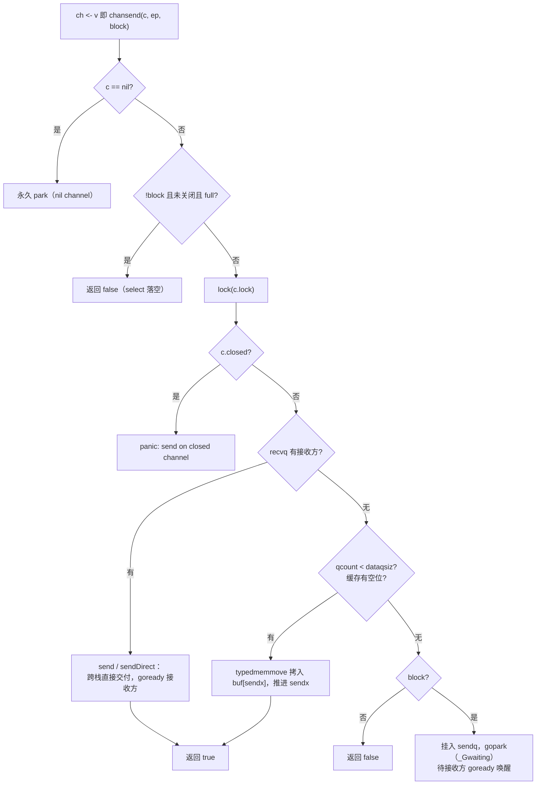

# 10.3 收发与直接传递

[10.2](./impl.md) 把 `hchan` 这副骨架摆了出来：一把锁、一个环形缓存 `buf`，外加发送方队列
`sendq` 与接收方队列 `recvq`。这一节让骨架动起来，回答一次 `ch <- v` 与 `v := <-ch` 在运行时
里究竟发生了什么。读懂这条收发路径，channel 的两条最常被追问的性质,无缓冲 channel 为何是
一次「会合」（rendezvous）、为何对它而言接收发生在发送完成之前（[11.9](../ch11sync/mem.md)），
都会落到同一处机制上：**直接传递**（direct send / receive）。

收发的设计要同时满足三个约束。其一，正确：不能丢数据，不能让已关闭的 channel 吞下新值。
其二，快：无竞争时一次收发应当只是「拿锁、拷一次、放锁」，热路径上连锁都尽量不碰。其三，
公平：多个发送方或接收方阻塞在同一个 channel 上时，唤醒次序应当可预期（[10.3.5](#1035-fifo-公平与一处历史教训)）。
下文先走通发送，再以对称的笔法带过接收，最后落到那处把二者统一起来的优化。

## 10.3.1 chansend 的三岔决策

先用一张可交互图建立直觉：有缓冲 channel 是一条定长队列，发送把值放进缓冲、接收从缓冲取走；缓冲满则发送方阻塞，缓冲空则接收方阻塞。可调 `cap`，或手动收发。

<div class="viz" data-viz="channel"></div>

编译器把 `ch <- v` 译成 `chansend1`，后者转调更通用的 `chansend`。`chansend` 的第三个参数
`block` 区分阻塞收发与 `select` 里的非阻塞分支（[10.5](./select.md)）。剥去竞态检测、`synctest`
气泡与统计代码，它的主干是一道清晰的三岔决策：

```go
// chansend：向 channel 发送 ep 指向的值（裁剪后的速写）
func chansend(c *hchan, ep unsafe.Pointer, block bool) bool {
    if c == nil {                  // 向 nil channel 发送：永久阻塞
        if !block { return false }
        gopark(nil, nil, waitReasonChanSendNilChan, ...) // 不再返回
        throw("unreachable")
    }

    // 非阻塞快路径：不加锁就能判定的失败（详见 10.3.4）
    if !block && c.closed == 0 && full(c) {
        return false
    }

    lock(&c.lock)

    if c.closed != 0 {             // 向已关闭 channel 发送：panic
        unlock(&c.lock)
        panic(plainError("send on closed channel"))
    }

    // 岔路一：recvq 里有等待的接收方 -> 直接传递，绕过 buf
    if sg := c.recvq.dequeue(); sg != nil {
        send(c, sg, ep, func() { unlock(&c.lock) })
        return true
    }

    // 岔路二：缓存还有空位 -> 把值拷进环形 buf
    if c.qcount < c.dataqsiz {
        qp := chanbuf(c, c.sendx)
        typedmemmove(c.elemtype, qp, ep) // 拷入 buf 的 sendx 槽
        c.sendx++
        if c.sendx == c.dataqsiz { c.sendx = 0 } // 环形回绕
        c.qcount++
        unlock(&c.lock)
        return true
    }

    // 岔路三：无接收方、buf 也满 -> 把自己挂进 sendq 并 park
    // ……见 10.3.3
}
```

三岔的优先级本身就是设计：**有等待的接收方时，永远优先直接交给它**，哪怕这是个带缓存且缓存
里还有空位的 channel。直觉上似乎该「先填缓存」，但只要 `recvq` 非空，就说明缓存此刻必然为空
（否则接收方早从缓存取走了，不会阻塞），于是绕过缓存直接交付不仅合法，还省下一次拷贝。
这处优先级是下一节那个优化的前提。

岔路二是带缓存 channel 的常态：缓存未满时，发送退化为「往 `buf[sendx]` 拷一份、推进
`sendx`」。`sendx` 与接收侧的 `recvx` 一同把定长数组 `buf` 用作环形队列，`sendx == dataqsiz`
时回绕到 0，这便是「环形」的全部含义。

## 10.3.2 直接传递：省掉一进一出的那次拷贝

岔路一调用的 `send`，是 channel 实现里最值得细看的一段。它的核心是 `sendDirect`:

```go
func send(c *hchan, sg *sudog, ep unsafe.Pointer, unlockf func()) {
    if sg.elem != nil {
        sendDirect(c.elemtype, sg, ep) // 直接拷到接收方栈上的槽
        sg.elem = nil
    }
    gp := sg.g
    unlockf()                          // 先解锁
    gp.param = unsafe.Pointer(sg)
    sg.success = true
    goready(gp, ...)                   // 再唤醒接收方（见 9.4）
}

func sendDirect(t *_type, sg *sudog, src unsafe.Pointer) {
    // src 在「我」的栈上，dst 是另一个 Goroutine 栈上的一个槽位
    dst := sg.elem
    typeBitsBulkBarrier(t, uintptr(dst), uintptr(src), t.Size_) // 写屏障
    memmove(dst, src, t.Size_)         // 一次 memmove，跨栈直达
}
```

阻塞在 `recvq` 里的接收方，早先在自己的 `sudog` 上记下了「请把值放到这个地址」（`sg.elem`,
指向它栈上接收变量的槽）。发送方于是不经过 `buf`，用一次 `memmove` 把数据从自己的栈槽直接搬
到接收方的栈槽。这就是 direct handoff。

它省下了什么？对照「经缓存」的笨办法：发送方先把值拷进 `buf`（**进**），接收方醒来后再从
`buf` 拷到自己的变量（**出**），一进一出两次拷贝，外加缓存槽的占用与回收。direct handoff 把
这两次合成一次跨栈 `memmove`。代价是它必须在持有 channel 锁、且接收方处于 `_Gwaiting`
（[9.3](../ch09sched/mpg.md)）尚未运行时进行,正因为接收方此刻没有在跑，没有用户态代码会与
这次跨栈写入竞争，直接写到「别人的栈」才是安全的。这里的 `typeBitsBulkBarrier` 是必须的：
跨栈写入含指针的值，要让垃圾回收器（[13](../../part4memory/ch13gc)）看见这次指针的转移。

一个容易忽略的次序：`send` 先 `unlockf()` 解锁，**再** `goready` 唤醒接收方。数据在解锁前就已
拷贝完毕，因此被唤醒的接收方一睁眼，值已经躺在它的变量里,它无需再碰 channel，直接返回即可。
注意这里只是把接收方标记为可运行并放回运行队列（[9.4](../ch09sched/schedule.md)），并不立即
切换过去。

## 10.3.3 阻塞路径：挂进队列，等人替你完成

若既无等待的接收方、缓存也满（无缓存 channel 则是「永远满」，见下节 `full`），发送方只能
阻塞。它把自己包装成一个 `sudog` 挂进 `sendq`，然后 `gopark` 让出 CPU：

```go
    // chansend 岔路三：阻塞
    gp := getg()
    mysg := acquireSudog()
    mysg.elem.set(ep)        // 记下「我要发送的值在这个地址」
    mysg.g = gp
    mysg.c.set(c)
    gp.waiting = mysg
    c.sendq.enqueue(mysg)    // 挂入发送等待队列
    gp.parkingOnChan.Store(true)
    // 让出，状态转为 _Gwaiting；chanparkcommit 会在 park 后释放 channel 锁
    gopark(chanparkcommit, unsafe.Pointer(&c.lock), waitReasonChanSend, ...)

    // == 被某个接收方唤醒后，从这里继续 ==
    KeepAlive(ep)            // 确保值活到接收方拷走为止
    closed := !mysg.success  // 醒来时若 success 为假，说明是被 close 唤醒
    gp.waiting = nil
    releaseSudog(mysg)
    if closed {
        panic(plainError("send on closed channel"))
    }
    return true
```

注意这条路径的对偶之美：阻塞的发送方在 `mysg.elem` 里留下「值在哪」，将来某个接收方走到自己
的岔路一，会调用 `recv` 从这个 `sudog` 里把值取走（`recvDirect`），再 `goready` 把发送方唤醒。
**park 与 goready 严格配对**：发送方因满而 park 在 `sendq`，由接收方 `goready`；接收方因空而
park 在 `recvq`，由发送方 `goready`。两端谁先到都行，后到的那个负责完成整桩交易并唤醒先到者。
这正是 [9.4](../ch09sched/schedule.md) 那套 park/ready 机制在 channel 上的具体落地。

`gopark` 传入的 `chanparkcommit` 是一处关键的细节。Goroutine 不能在持锁状态下 park（否则锁
永不释放），但又不能在 park 之前解锁（否则刚解锁、还没真正进入 `_Gwaiting` 时就被唤醒，会
错乱）。解法是把解锁推迟到「已经 park 成功」之后由 `chanparkcommit` 执行,这是 `gopark` 的
unlockf 回调约定（[9.4](../ch09sched/schedule.md)）。`mysg.success` 这个布尔是发送方与唤醒方
之间的暗号：正常被接收方完成时置真，被 `close` 唤醒时为假，发送方据此决定是正常返回还是
panic。

把这条阻塞路径与前两条岔路合起来，`chansend` 的全貌如下：



## 10.3.4 chanrecv 与无缓冲 channel 的会合

接收 `v := <-ch`（编译为 `chanrecv1`）与 `v, ok := <-ch`（`chanrecv2`）都转调 `chanrecv`，
它与 `chansend` 几乎是镜像的三岔，只多了「已关闭且无数据则返回零值」这一支：

```go
// chanrecv：从 channel 接收一个值（裁剪后的速写）
func chanrecv(c *hchan, ep unsafe.Pointer, block bool) (selected, received bool) {
    if c == nil { /* 同 send：nil channel 永久阻塞 */ }

    // 非阻塞快路径：未就绪且未关闭，直接落空
    if !block && empty(c) {
        if atomic.Load(&c.closed) == 0 { return }
        if empty(c) { /* 已关闭且空：返回零值 */ }
    }

    lock(&c.lock)
    if c.closed != 0 && c.qcount == 0 {        // 已关闭且无数据
        unlock(&c.lock)
        if ep != nil { typedmemclr(c.elemtype, ep) } // 写入零值
        return true, false                     // received == false
    }
    if sg := c.sendq.dequeue(); sg != nil {    // 岔路一：有等待的发送方
        recv(c, sg, ep, func() { unlock(&c.lock) })
        return true, true
    }
    if c.qcount > 0 {                          // 岔路二：缓存里有数据
        qp := chanbuf(c, c.recvx)
        typedmemmove(c.elemtype, ep, qp)       // 从 buf[recvx] 拷出
        typedmemclr(c.elemtype, qp)            // 清空该槽，便于 GC
        c.recvx++
        if c.recvx == c.dataqsiz { c.recvx = 0 }
        c.qcount--
        unlock(&c.lock)
        return true, true
    }
    // 岔路三：无数据可收 -> 挂入 recvq 并 gopark（对偶于 send 的阻塞路径）
}
```

接收侧的 `recv` 把直接传递的对称性补全了。它要区分有无缓存：

```go
func recv(c *hchan, sg *sudog, ep unsafe.Pointer, unlockf func()) {
    if c.dataqsiz == 0 {
        // 无缓冲 channel：直接从发送方栈拷到接收方
        if ep != nil { recvDirect(c.elemtype, sg, ep) }
    } else {
        // 有缓冲且缓存满：队头出给接收方，发送方的值补到队尾（同一个槽）
        qp := chanbuf(c, c.recvx)
        if ep != nil { typedmemmove(c.elemtype, ep, qp) } // buf -> 接收方
        typedmemmove(c.elemtype, qp, sg.elem.get())       // 发送方 -> buf
        c.recvx++
        if c.recvx == c.dataqsiz { c.recvx = 0 }
        c.sendx = c.recvx
    }
    sg.elem.set(nil)
    gp := sg.g
    unlockf()
    gp.param = unsafe.Pointer(sg)
    sg.success = true
    goready(gp, ...)   // 唤醒被阻塞的发送方
}
```

无缓冲 channel（`dataqsiz == 0`）走的是 `recvDirect`,从发送方的栈槽一次 `memmove` 到接收方。
它和发送侧的 `sendDirect` 是同一手法的两个方向，取决于收发双方谁先到达、谁阻塞在队列里。
带缓冲 channel 在「缓存满且有发送方排队」时则上演一处巧思：把队头的值交给接收方，腾出的那个
槽恰好用来收下排队发送方的值,一次出队顺带一次入队，环形队列严丝合缝地往前转了一格，没有
任何空转。

无缓冲 channel 的本质至此清楚了：它的 `buf` 容量为零，`full` 与 `empty` 都退化为「对面队列是
否有人」。于是一次成功的收发**必须**有收发双方同时在场,要么发送方撞见排队的接收方
（`send`/`sendDirect`），要么接收方撞见排队的发送方（`recv`/`recvDirect`），先到的一方一律
park 等待。这就是「会合」：无缓冲 channel 不存储任何东西，它只在收发双方相遇的那一刻完成一次
跨栈的值传递。

这也正面解释了内存模型（[11.9](../ch11sync/mem.md)）那条初看费解的规则：对无缓冲 channel，
**一次接收发生在对应发送完成之前**。原因就在代码里,当接收方走 `recvDirect`、或发送方走
`send`/`sendDirect` 时，值的拷贝与 `goready` 都发生在「先到的一方被唤醒、得以从 `chansend` /
`chanrecv` 返回」之前。换言之，阻塞的发送方要等接收方把值取走、并将它 `goready` 之后才能继续
往下走。代码里那个先后，正是内存模型那条 happens-before 的来源。

## 10.3.5 非阻塞快路径与一处内存序的讲究

`select` 的 `default` 分支、以及带 `ok` 的非阻塞用法，都以 `block == false` 进入收发。它们
有一条不加锁的提前退出：发送侧是 `!block && c.closed == 0 && full(c)`，接收侧是
`!block && empty(c)`。`full` 与 `empty` 各自只读一两个字：

```go
func full(c *hchan) bool {
    if c.dataqsiz == 0 {
        return c.recvq.first == nil   // 无缓冲：没有等待的接收方即为「满」
    }
    return c.qcount == c.dataqsiz     // 有缓冲：缓存填满即为「满」
}
```

这条快路径上有一处对内存序（[11.9](../ch11sync/mem.md)）的讲究，源码注释专门交代过。发送侧
先读 `c.closed`、再读 `full(c)`,**先确认未关闭，再确认未就绪**。关键论证是：一个已关闭的
channel 不可能再从「不可发送」变回「可发送」。因此即便这两次读之间 channel 恰好被关闭，也必然
存在两次读之间的某一时刻，channel 既未关闭、又不可发送,运行时就当作在那一刻观察到了
channel，据此报告「发送无法进行」。正因为有这个单调性兜底，两次普通读即便被处理器或编译器
重排，结论依旧成立，于是这里**不需要原子操作**，省下了热路径上的开销。前向进展不靠这两次读
保证，而是依赖 `chanrecv`、`closechan` 在释放锁时产生的副作用，把本线程对 `c.closed` 与
`full` 的视图刷新。这种「用一处单调性换掉一个原子操作」的推理，是无锁快路径里很典型的笔法
（对照 [11.9](../ch11sync/mem.md) 对内存序的展开）。

## 10.3.6 FIFO 公平与一处历史教训

收发队列 `sendq`/`recvq` 是 FIFO 的：阻塞者从队尾入队、从队头出队，于是多个等待者按到达
次序被唤醒。这一点并非可有可无的实现细节,Go 团队曾在 issue #11506 里就「channel 是否应当
保证 FIFO 唤醒」展开过讨论，结论是运行时实现确实维持先进先出，尽管语言规范本身并未把它写成
强制承诺。对依赖唤醒次序的程序，这是一个需要留意的边界：可观察的 FIFO 是当前实现的行为，而
非规范的保证。

把收发两侧合起来看，channel 的运行时是一套相当紧凑的对称设计：一把锁串起三岔决策，热路径上
要么命中直接传递、要么命中环形缓存，冷路径才挂队列 park；direct handoff 用「接收方未运行」
这一前提换来省掉一进一出的拷贝；无缓冲 channel 不过是缓存容量为零的退化形态，会合语义与
内存模型的那条 happens-before 都由此而来。性能的便宜从不白得：direct handoff 的快，建立在
park/ready 这套调度机制（[9.4](../ch09sched/schedule.md)）已经替它把「让谁先到的一方等待、
由后到的一方完成」安排妥当之上。[10.4](./close.md) 接着讲关闭如何叫醒所有等待者，
[10.5](./select.md) 的 `select` 则把这套单 channel 的收发，扩展到「在多个 channel 上同时
守望」的更难一层。

## 延伸阅读的文献

1. The Go Authors. *runtime/chan.go*（`chansend`、`chanrecv`、`send`、`recv`、`sendDirect`、
   `recvDirect`、`full`、`empty`）, Go 1.26.
   https://github.com/golang/go/blob/master/src/runtime/chan.go
2. The Go Authors. *runtime/proc.go*（`gopark`、`goready`、`ready`）, Go 1.26.
   https://github.com/golang/go/blob/master/src/runtime/proc.go
3. The Go Authors. *The Go Memory Model*（channel communication 一节）, Version of June 6, 2022.
   https://go.dev/ref/mem
4. Go issue #11506. *runtime: make channel FIFO ordering explicit / guaranteed?*
   https://github.com/golang/go/issues/11506
5. C. A. R. Hoare. "Communicating Sequential Processes." *Communications of the ACM*,
   21(8), 1978. https://doi.org/10.1145/359576.359585
6. 本书 [10.2 hchan：通道的内部结构](./impl.md)、[10.4 关闭的语义](./close.md)、
   [10.5 select 的实现](./select.md)、[9.4 调度循环](../ch09sched/schedule.md)、
   [11.9 内存一致模型](../ch11sync/mem.md).
