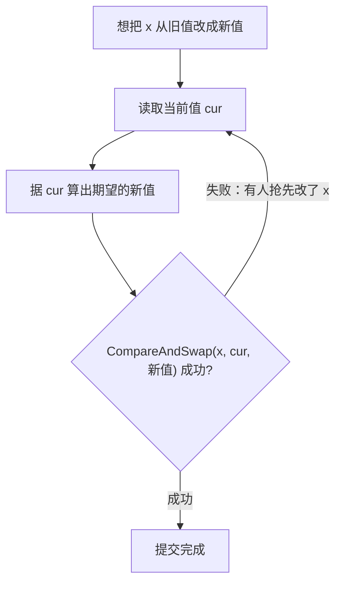
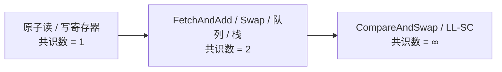
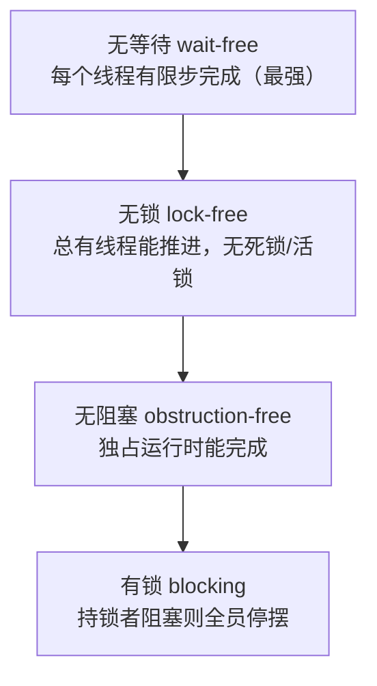
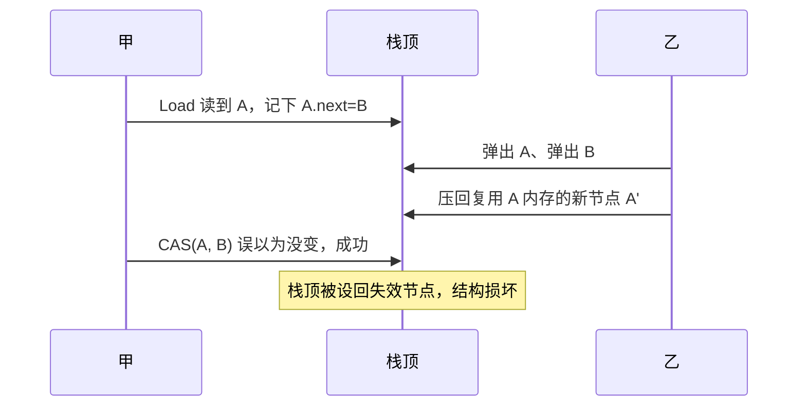

# 11.3 原子操作

`sync/atomic` 是 Go 同步原语里最贴近硬件的一层。互斥锁（[11.1](./mutex.md)）、channel
（[8](../ch08channel)）这些更高层的工具，内部都建立在原子操作之上。它提供「不可分割」的读写与
读改写：一个原子操作要么完整发生、要么没发生，中间不会被别的 goroutine 看到一半。但原子操作的
意义远不止「防撕裂」。它是无锁编程的地基，而无锁编程背后，有一套关于「哪些原语能做什么」的
深刻理论，那是本节真正想讲清的东西。

本节先把基本操作摆出来，落到 CAS 这块基石；再退后一步，借 Herlihy 的共识层级回答「为什么是
CAS」；接着进入无锁的暗礁 ABA 与内存回收，说明 Go 为何把硬的无锁结构留在运行时内部；最后回到
工程，讲 `sync/atomic` 的顺序一致承诺，以及 Go 1.19 那次把「该用原子访问」编进类型的演进。

## 11.3.1 几种基本操作

原子操作的家族不大：`Load`（原子读）、`Store`（原子写）、`Add`（原子增减）、`Swap`（原子交换）、
`CompareAndSwap`（比较并交换，CAS），以及 Go 1.23 起补齐的 `And`/`Or`（原子位运算）。它们都落到
单条带 `LOCK` 前缀的 CPU 指令上：x86 上 CAS 是 `LOCK CMPXCHG`，ARMv8 上是 `LDXR`/`STXR` 的
load-linked / store-conditional 重试对，加法是 `LOCK XADD`。换言之，原子性的最终保证来自硬件，
`sync/atomic` 只是把这些指令包装成可移植的 Go 函数。

其中 CAS 是无锁编程的基石。它原子地完成「如果当前值还是我以为的那个，就改成新值，否则什么都
不做并告诉我失败」：

```go
// CompareAndSwap 的语义（伪代码，整体不可分割地执行）
func CompareAndSwapInt64(addr *int64, old, new int64) (swapped bool) {
    if *addr == old {
        *addr = new
        return true
    }
    return false
}
```

为什么单单一个 CAS 就够撑起无锁？因为几乎所有无锁算法都能写成同一种骨架，一个**重试循环**：
读出当前值，据它算出想要的新值，再用 CAS 把它写回去；只有「这期间没人动过」时 CAS 才成功，
否则拿到的就是别人更新后的值，重来一遍即可。

```go
for {
    old := atomic.LoadInt64(&x)   // 读当前值
    new := f(old)                 // 据它算出期望的新值
    if atomic.CompareAndSwapInt64(&x, old, new) {
        break                     // 没人抢先改过，提交成功
    }
    // CAS 失败说明有别的 goroutine 抢先改了 x，拿新值再算一遍
}
```



这个循环里藏着无锁的代价。与锁不同，CAS 失败不会让 goroutine 阻塞，而是立刻重试。竞争平和时
这很划算，省去了上锁、可能的睡眠与唤醒；可一旦竞争激烈，多个 goroutine 反复读到彼此覆盖后的值、
反复 CAS 失败，CPU 全耗在空转上，吞吐反而不如一把老老实实的锁。还有一处隐患叫**活锁**：大家都
在重试，系统整体看似在动，单个 goroutine 却可能长时间提交不成。所以原子操作适合的是单字、
低竞争、或读多写少的场景，计数器、标志位、配置指针之类；把一段复杂临界区硬拆成 CAS 循环，
往往得不偿失。

## 11.3.2 共识层级：为什么是 CAS

读者或许会问，既然 `Load` 与 `Store` 也是原子的，为什么不能拿它们搭出无锁结构，偏要 CAS？
答案出自 Herlihy 1991 年的经典工作，**共识层级**（consensus hierarchy），它给「一个同步原语到底
有多强」一个精确的、可证明的度量。

考虑 $n$ 个线程要就一个值达成一致：每个线程提议一个值，最终所有线程必须读到同一个被选中的提议，
且这个值确实是某个线程提议过的。能用某种共享对象在**无等待**（每个线程有限步内完成，不依赖别人
进度）的前提下解决 $n$ 个线程共识的最大 $n$，就是该对象的**共识数**（consensus number）。



普通的原子读写寄存器，共识数只有 **1**，连两个线程都协调不了。直觉上的证明是这样：两个线程
要对「谁先到」达成共识，必有一个临界时刻，系统状态在「最终选 A」与「最终选 B」之间摇摆。用读写
寄存器，先手线程只能要么读、要么写某个单元。若它读，没留下任何痕迹，后手无从分辨它是否来过；
若它写，要么写到一个后手会立刻覆盖的单元（痕迹被抹去），要么两人写的是不同单元，而后手读的
次序又决定不了谁先。无论怎么排，总能构造出两个线程都无法区分的执行，于是无等待共识不可能。
这是一个典型的**不可能性**（impossibility）结论，与 FLP 同属一脉。

而 **CAS 的共识数是无穷**。证明却出奇地短：拿一个初值为「无人胜出」的共享单元，每个线程都用
`CompareAndSwap(&cell, 空, 我的提议)` 去抢；只有第一个成功的把自己的值写了进去，其余全部失败，
然后所有线程读出 `cell`，读到的就是那个唯一的胜者。一行 CAS 就让任意多线程达成了无等待共识。

这条 $1$ 与 $\infty$ 的鸿沟，正是各语言原子库都把 CAS 摆在中心的根本原因。Herlihy 进一步证明，
任何共识数为 $\infty$ 的原语都是**通用**（universal）的：有了它，任何顺序对象都能机械地改造成一个
等价的无等待并发实现（所谓 universal construction）。CAS 之于无锁世界，就像图灵机之于可计算性，
是那把万能钥匙。ARM、POWER 一族用的 load-linked / store-conditional（LL/SC）是 CAS 的近亲，
共识数同样是 $\infty$；而 `FetchAndAdd`、`Swap`、乃至原子队列与栈，共识数都停在 2，搭不出
对任意线程数都无等待的协调。Go 把 `Add`/`Swap`/`CAS` 都给了用户，但唯有 CAS 撑得起一般的无锁
算法，原因就在这里。

## 11.3.3 无锁的谱系：阻塞、无锁、无等待

「无锁」其实是一族保证，强弱有别。Herlihy 与 Shavit 在《多处理器编程的艺术》里给出标准的三档
**进展性**（progress）层次：

- **无阻塞**（obstruction-free）：若某个线程在某一刻独占运行（别人都暂停），它一定能在有限步内
  完成。最弱，多个线程同时推进时可能互相搅黄，谁都进不去（活锁）。
- **无锁**（lock-free）：任何时刻，只要让系统继续跑，**总有某个**线程能完成操作。它排除了死锁与
  活锁，保证整体在推进，但不保证每个线程都不挨饿。上一节的 CAS 重试循环正是典型：每次有人 CAS
  失败，必有另一人 CAS 成功了。
- **无等待**（wait-free）：**每个**线程都在与其它线程无关的有限步内完成。最强，也最难实现，
  代价通常是更复杂的算法与更高的常数开销。



值得点破一处常见误解：Go 的 channel 与 mutex 内部用 CAS，但它们本身是**有锁**的，会让 goroutine
阻塞、让出。用了原子指令不等于「无锁」；无锁是对进展性的保证，不是对实现手法的描述。真正追求
lock-free 的，是 Treiber 栈、Michael-Scott 队列这类专门的并发数据结构。以最简单的 Treiber 栈
为例，它把整个无锁压栈写成一个 CAS 循环：

```go
// 无锁栈的压栈：把 11.3.1 的重试循环套在「换栈顶指针」上
type node struct {
    val  int
    next *node
}
type Stack struct {
    top atomic.Pointer[node] // 栈顶，Go 1.19 类型化原子
}

func (s *Stack) Push(v int) {
    n := &node{val: v}
    for {
        old := s.top.Load()  // 读当前栈顶
        n.next = old         // 新节点指向它
        if s.top.CompareAndSwap(old, n) {
            return           // 栈顶没变过，挂上去成功
        }
        // 有人抢先改了栈顶，拿新栈顶重试
    }
}
```

这段代码看着无害，却恰恰是下一节那枚暗礁的引信。

## 11.3.4 ABA 与内存回收：无锁的暗礁

CAS 有一个著名的陷阱，**ABA 问题**。线程读到值 A，正打算 CAS，期间别的线程把它从 A 改成 B、
又改回 A；CAS 看到「还是 A」便以为没人动过，照旧提交，其实结构早已天翻地覆。

把它放回上面的 Treiber 栈就具体了：线程甲 `Load` 到栈顶节点 A，记下 `A.next` 指向 B，正要
`CompareAndSwap(A, B)` 弹出 A。此刻线程乙连弹两次，把 A 和 B 都弹走，又压回一个**复用了 A
那块内存**的新节点 A'；A' 的 `next` 早已指向别处。甲的 CAS 比较的是指针值，A' 与 A 地址相同，
于是 CAS 成功，栈顶被设回一个 `next` 已失效的节点，栈就此损坏。问题的根子有二：CAS 只认值不认
「这中间发生过什么」，以及被弹出的节点内存被提前回收复用了。

经典对策分两类。其一，给指针**附一个版本号/标签**（tagged pointer），每次修改连标签一起递增，
让 ABA 暴露成 $A_1 \neq A_3$，CAS 比的是「指针+标签」整体，复用同一地址也骗不过它。代价是要一条
能原子操作双字宽度的指令（x86 的 `LOCK CMPXCHG16B`），且标签终会回绕。其二，从根上解决「内存
何时能安全回收」，这是更深的一类技术：

- **危险指针**（hazard pointers，Michael 2004）：每个线程把自己正在访问的指针登记到一处公共
  数组，回收方在真正释放前先扫一遍，凡被登记的一律推迟回收。
- **纪元回收**（epoch-based reclamation）：用全局递增的「纪元」分代，只有确认所有线程都越过了某个
  纪元，那之前退休的节点才安全释放。
- **RCU**（read-copy-update）：Linux 内核里读者几乎零开销、写者复制后延迟释放的范式。



这正是 Go 选择**不**鼓励用户手写复杂无锁结构的背景。无锁的正确性极其微妙，ABA 与内存回收是反复
绊倒老手的暗礁，而 Go 又有 GC：垃圾回收恰好天然消解了一类 ABA，只要还有指针指向某节点，它就
不会被回收复用，`atomic.Pointer[T]` 因此比 C 里裸指针的 CAS 安全得多（GC 充当了一种自动的内存
回收方案）。即便如此，Go 仍把真正棘手的无锁结构留在运行时内部，调度器的工作窃取队列、内存分配
的无锁 span 集合（[12.2](../../part4memory/ch12alloc/component.md)）这些经过反复打磨的快路径，
而向用户层只提供地基原语，并建议优先用 channel 与锁。这与 [11.9](./mem.md) 只暴露顺序一致原子、
不暴露弱序原子，是同一种「把复杂度挡在外面」的取舍。

## 11.3.5 原子操作是顺序一致的

`sync/atomic` 的所有操作都是**顺序一致原子**（sequentially consistent atomics）。自 Go 1.19 的
内存模型修订起，这条成了明文承诺（[11.9](./mem.md)）：所有原子操作存在一个全局全序，若原子操作
$A$ 的效果被原子操作 $B$ 观察到，则 $A$ happens before $B$。这意味着原子操作不仅自身不可分割，
还能在 goroutine 间建立发生序，可以正经地用作同步手段，而不只是「防撕裂」。一个原子写之前的
普通写，对观察到该原子写的读者也一并可见，这正是无锁算法赖以传递数据的根据。

把它放进各语言的谱系看，Go 的取舍格外鲜明：

| 语言 | 暴露的内存序 | 设计取向 |
| --- | --- | --- |
| C / C++11 | `relaxed`/`acquire`/`release`/`acq_rel`/`seq_cst` 整套 | 榨干硬件，把弱序的难度交给开发者 |
| Java | `volatile`（SC）+ `VarHandle` 细粒度序 | 默认 SC，专家可下探 |
| Rust | `Ordering::{Relaxed,Acquire,Release,AcqRel,SeqCst}` | 同 C++ 一套档位 |
| **Go** | **仅顺序一致** | 只给一档，刻意不暴露弱序 |

C++ 那张内存序菜单能贴着硬件压榨出每一分性能，代价是把「读懂弱内存模型」这桩出了名难的事原样
丢给应用开发者，`relaxed` 原子里的 out-of-thin-air 之类问题至今是学界硬骨头（[11.9](./mem.md)）。
Go 的判断是：对绝大多数程序，SC 原子的性能已经够用，它换来的可推理性远比那一点峰值更值。于是
Go 只给顺序一致这一档。这与 Go 在调度、垃圾回收上一贯的性格一致，以可控的性能让渡，换取语义的
简单与不易出错。读者用 `atomic.AddInt64` 时无需在脑中模拟 store buffer，这本身就是一种设计上的
善意。

## 11.3.6 类型化原子：把「该用原子访问」编进类型

`sync/atomic` 早期只有函数式 API，如 `atomic.AddInt64(&x, 1)`。它能用，却有两个长期为人诟病的
陷阱。

其一，**漏用**。没有任何机制阻止你在别处对同一变量做普通（非原子）访问，`x++` 与
`atomic.AddInt64(&x, 1)` 在编译器眼里访问的是同一个普通 `int64`，一旦某处漏用原子函数，就埋下
一个数据竞争，而编译期无从察觉，只能寄望 `-race` 在运行时撞上。其二，**对齐**。32 位平台上对
64 位变量做原子操作要求 8 字节对齐，而结构体里裸 `int64` 字段的对齐取决于它前面字段的排布，
于是出现过教科书级的坑：结构体字段顺序一调，同一份代码在 amd64 上跑得好好的，到 32 位 ARM 上就
因未对齐的原子访问而崩溃。

Go 1.19 引入**类型化原子**（提案 #50860），从类型层面一举堵上这两个口子：

```go
// 裁剪后的类型速写：把 int64 包成一个只能原子访问的类型
type Int64 struct {
    _ noCopy   // go vet 据此报告「首次使用后被复制」
    _ align64  // 强制 8 字节对齐，消除 32 位平台的对齐坑
    v int64    // 私有字段，外部够不着，只能走方法
}

func (x *Int64) Load() int64            { return LoadInt64(&x.v) }
func (x *Int64) Store(val int64)        { StoreInt64(&x.v, val) }
func (x *Int64) Add(delta int64) int64  { return AddInt64(&x.v, delta) }
func (x *Int64) CompareAndSwap(old, new int64) bool {
    return CompareAndSwapInt64(&x.v, old, new)
}
```

把变量声明成 `atomic.Int64`，由于 `v` 是私有字段，访问它就**只能**通过 `Load`/`Store`/`Add`/`CompareAndSwap`
等方法，普通访问在类型层面被堵死，漏用的可能性从源头消失。`align64` 这个零宽度标记字段告诉
编译器对整个类型施加 8 字节对齐，对齐坑也随之消失。`noCopy` 则让 `go vet` 拦下「原子变量被值
复制」这个另一类隐蔽错误。整套类型化原子是 `atomic.Int32/Int64/Uint32/Uint64/Uintptr/Bool/Pointer[T]/Value`。

泛型成全了其中最有意思的一个，`atomic.Pointer[T]`。它用类型参数把「这是一个 `*T` 的原子指针」
表达出来，读写自带类型，省去满地的 `unsafe.Pointer` 转换。源码里它还藏了个巧思：

```go
type Pointer[T any] struct {
    _ [0]*T        // 提一下 *T，让不同 Pointer[T] 之间无法相互转换（issue 56603）
    _ noCopy
    v unsafe.Pointer
}
```

那个零长度数组 `[0]*T` 不占空间，存在的唯一目的是让 `atomic.Pointer[A]` 与 `atomic.Pointer[B]`
在类型上互不兼容，堵住一条本可绕过类型安全的后门。这是 API 设计与语言特性协同演进的范例：用
类型把「这个字段必须原子访问」从程序员的自觉，变成编译器可强制的契约。新代码应一律优先用类型化
原子，而非裸函数。

`atomic.Value` 是这一族里特别的一个，它用于**整体地、原子地**替换一个任意类型的值，典型用途是
配置热更新：后台准备好整份新配置，用 `Store` 一次性换上，所有读者用 `Load` 要么读到完整的旧
配置、要么读到完整的新配置，绝不会读到「改了一半」的中间态。

```go
var cfg atomic.Value           // 存 *Config
cfg.Store(loadConfig())        // 启动时放一份

func reload() { cfg.Store(loadConfig()) }          // 写者：整体替换
func handler() { c := cfg.Load().(*Config); _ = c } // 读者：无锁取一份完整快照
```

它的内部实现是一处教科书级的小心翼翼。`interface{}` 在运行时由「类型指针 + 数据指针」两段组成
（[2](../../part1prologue)），要原子地换掉整个 interface，就得避免读者撞见「类型已换、数据还没换」
的半成品。`Value` 的办法是：首次 `Store` 时先用 CAS 把类型指针置成一个特殊的进行中标记
`firstStoreInProgress`，期间 `runtime_procPin` 禁止当前 goroutine 被抢占，待数据指针、类型指针
依次落定再放行；读者一旦 `Load` 看到这个标记，就知道首次写入尚未完成，返回 nil。这是一种轻量
的写时复制：读者无锁、写者整体替换，适合读远多于写的配置类数据。Go 1.19 后，多数新代码可以用
`atomic.Pointer[Config]` 替代 `atomic.Value`，既有类型安全又免去类型断言，唯有需要存放「类型在
运行期才确定」的值时，`atomic.Value` 仍不可替代。

## 11.3.7 小结：地基与边界

原子操作是 Go 并发设施的最底层，往上托起 mutex、channel 与整个运行时的无锁快路径。本节的主线
可以收成三句：CAS 是无锁世界里共识数为 $\infty$ 的万能原语，理论上撑得起任何无锁结构；但无锁的
正确性被 ABA 与内存回收这些暗礁守着，工程上极难做对；Go 因此把硬的无锁结构关进运行时，向用户
只给顺序一致的地基原语，并用类型化原子把「该原子访问」变成编译期契约。下一节
（[11.9](./mem.md)）会把这里的「顺序一致」「happens before」放进完整的内存模型里讲透，那是理解
本节每一处承诺的来由所在。

## 延伸阅读的文献

1. Maurice Herlihy. "Wait-Free Synchronization." *ACM TOPLAS*, 13(1), 1991.
   https://doi.org/10.1145/114005.102808 （共识层级；读写共识数为 1、CAS 为 ∞；通用构造）
2. Maurice Herlihy, Nir Shavit. *The Art of Multiprocessor Programming.* Morgan Kaufmann,
   2008（修订版 2020）。（无阻塞/无锁/无等待的进展性层次；Treiber 栈与无锁数据结构）
3. Maged M. Michael. "Hazard Pointers: Safe Memory Reclamation for Lock-Free Objects."
   *IEEE TPDS*, 15(6), 2004. https://doi.org/10.1109/TPDS.2004.8 （ABA 与安全内存回收）
4. Maged M. Michael, Michael L. Scott. "Simple, Fast, and Practical Non-Blocking and
   Blocking Concurrent Queue Algorithms." *PODC 1996*.
   https://doi.org/10.1145/248052.248106 （Michael-Scott 无锁队列）
5. R. Kent Treiber. *Systems Programming: Coping with Parallelism.* IBM Research Report
   RJ 5118, 1986. （最早的无锁栈，CAS 重试循环的原型）
6. The Go Authors. *The Go Memory Model* (Version of June 6, 2022)：Atomic Values.
   https://go.dev/ref/mem （`sync/atomic` 的顺序一致承诺）
7. Go proposal #50860, *sync/atomic: add typed atomic values.*
   https://github.com/golang/go/issues/50860 （类型化原子的动机与设计；对齐与漏用陷阱）
8. The Go Authors. *src/sync/atomic/type.go、value.go.*
   https://github.com/golang/go/tree/master/src/sync/atomic （`align64`/`noCopy`/`Pointer[T]`
   的实现；issue #56603 的 `[0]*T` 防转换技巧）

## 许可

&copy; 2018-2026 The [golang.design](https://golang.design) Initiative Authors. Licensed under [CC-BY-NC-ND 4.0](https://creativecommons.org/licenses/by-nc-nd/4.0/).
