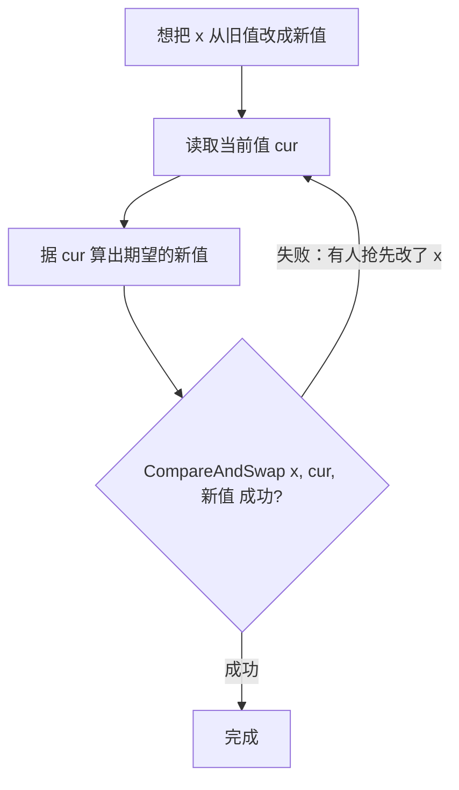

# 11.3 原子操作

`sync/atomic` 是同步原语里最贴近硬件的一层。互斥锁、channel 这些更高层的工具，内部都建立在
原子操作之上。它提供"不可分割"的读写与读改写：一个原子操作要么完整发生、要么没发生，中间
不会被别的 goroutine 看到一半。但原子操作的意义远不止"防撕裂",它是无锁编程的地基，而无锁
编程背后有一套关于"哪些原语能做什么"的深刻理论。

## 11.3.1 几种基本操作

原子操作的家族不大：`Load`（原子读）、`Store`（原子写）、`Add`（原子增减）、`Swap`（原子交换）、
以及 `CompareAndSwap`（比较并交换，CAS）。其中 CAS 是无锁编程的基石,它原子地完成"如果当前
值还是我以为的那个，就改成新值，否则什么都不做并告诉我失败"。大多数无锁算法都围绕 CAS 写成
一个**重试循环**：

```go
for {
    old := atomic.LoadInt64(&x)   // 读当前值
    new := f(old)                 // 据它算出新值
    if atomic.CompareAndSwapInt64(&x, old, new) { break } // 没人抢先改过才成功
    // 失败说明有人抢先改了 x，拿新值重试
}
```



无锁不等于无代价：竞争激烈时 CAS 循环反复失败重试，把 CPU 耗在空转上，未必比一把锁快。
原子操作适合**单字、低竞争或读多写少**的场景,计数器、标志位、配置指针之类。

## 11.3.2 一点理论：共识层级与无锁的谱系

为什么是 CAS 成了无锁编程的"主力"，而不是 `Load`/`Store`？答案出自 Herlihy 1991 年的**共识
层级**（consensus hierarchy）：一个同步原语能让多少个线程就一个值达成无等待的共识，是它表达
能力的精确度量。普通的原子读、写共识数只有 **1**（连两个线程都协调不了）;而 **CAS 的共识数
是无穷**,有了它，任意数量线程的无等待协调都能实现。这条结果解释了为什么各语言的原子库都把
CAS 摆在中心：它是无锁世界里"万能"的那个原语。

无锁也有层次（Herlihy 与 Shavit 的术语）：**无阻塞**（obstruction-free，单独运行总能完成）、
**无锁**（lock-free，总有某个线程能推进，系统整体不会卡死）、**无等待**（wait-free，每个线程都在
有限步内完成，最强也最难）。Go 的 channel/mutex 内部用 CAS 但本身是有锁的;真正的无锁数据
结构（如 Treiber 栈、Michael-Scott 队列）才追求 lock-free 保证。

## 11.3.3 ABA 与内存回收：无锁的暗礁

CAS 有一个著名的陷阱:**ABA 问题**。线程读到值 A，正打算 CAS，期间别的线程把它从 A 改成 B
又改回 A;CAS 看到"还是 A"便以为没人动过，其实结构早已变化。对指向被释放又重新分配的内存的
指针，这尤其危险。经典对策有：给指针附一个**版本号/标签**（每次修改递增，让 ABA 暴露为
A1≠A3）；或用专门的**内存回收**方案,危险指针（hazard pointers，Michael 2004）、纪元回收
（epoch-based reclamation）、以及内核里的 RCU。

这正是 Go 选择**不**鼓励用户手写复杂无锁数据结构的背景：无锁的正确性极其微妙，ABA 与内存回收
是反复绊倒老手的暗礁。Go 让 `sync/atomic` 提供地基原语，把真正棘手的无锁结构留在运行时内部
（如某些调度、内存分配的快路径），用户层面则优先用 channel 与锁,这与 [11.9](./mem.md) 只暴露
顺序一致原子、不暴露弱序原子是同一种"把复杂度挡在外面"的取舍。

## 11.3.4 原子操作是顺序一致的

`sync/atomic` 的所有操作都是**顺序一致原子**：它们共享一个全局全序，语义等同 C++ 的顺序一致
原子与 Java 的 `volatile`（[11.9](./mem.md)）。这意味着原子操作不仅自身不可分割，还能在
goroutine 间建立 happens-before 次序，可用作同步手段，而不只是"防撕裂"。与 C++ 暴露
`memory_order_relaxed/acquire/release/seq_cst` 一整套档位、Java 用 `VarHandle` 提供细粒度内存序
不同，Go **只给顺序一致**这一档,刻意的简化，理由见 [11.9](./mem.md)。

## 11.3.5 类型化原子：把"该用原子访问"编进类型

`sync/atomic` 早期只有函数式 API，如 `atomic.AddInt64(&x, 1)`，有两个长期为人诟病的陷阱。
其一，没有机制阻止你在别处对同一变量做**普通**（非原子）访问，一旦某处漏用原子函数就埋下数据
竞争，编译器无从察觉。其二，32 位平台上对 64 位变量做原子操作要求 8 字节对齐，而裸 `int64`
字段并不保证，于是出现过"结构体字段顺序一变、程序在 32 位机上就崩"的著名坑。

Go 1.19 引入**类型化原子**：`atomic.Int32/Int64/Uint32/Uint64/Bool/Uintptr/Pointer[T]/Value`。
把变量声明成 `atomic.Int64`，访问它就**只能**通过它的 `Load`/`Store`/`Add`/`CompareAndSwap` 等
方法，普通访问在类型层面被堵死;这些类型还自带正确对齐，消除了 32 位平台的对齐坑。这是 API
设计与内存模型协同演进的范例,用类型把"这个字段必须原子访问"从程序员的自觉变成编译器可强制
的契约。新代码应一律优先用类型化原子。

`atomic.Value` 则用于**整体地、原子地**替换一个较大的值，典型用途是配置热更新：后台准备好新
配置用 `Store` 一次性替换，所有读者用 `Load` 要么读到完整的旧配置、要么读到完整的新配置，
绝不会读到"改了一半"的中间态,一种轻量的写时复制，读者无锁、写者整体替换，适合读远多于写。

## 延伸阅读的文献

1. Maurice Herlihy. "Wait-Free Synchronization." *ACM TOPLAS*, 13(1), 1991.
   https://doi.org/10.1145/114005.102808 （共识层级；CAS 共识数为无穷）
2. Maurice Herlihy, Nir Shavit. *The Art of Multiprocessor Programming.* 2008/2020.
   （无阻塞/无锁/无等待的层次；无锁数据结构）
3. Maged M. Michael. "Hazard Pointers: Safe Memory Reclamation for Lock-Free Objects."
   *IEEE TPDS*, 15(6), 2004. https://doi.org/10.1109/TPDS.2004.8 （ABA 与内存回收）
4. Maged M. Michael, Michael L. Scott. "Simple, Fast, and Practical Non-Blocking and
   Blocking Concurrent Queue Algorithms." *PODC 1996*.
   https://doi.org/10.1145/248052.248106
5. The Go Authors. *The Go Memory Model：Atomic Values.* https://go.dev/ref/mem ；
   Go proposal #50860（类型化原子）. https://github.com/golang/go/issues/50860

## 许可

&copy; 2018-2026 The [golang.design](https://golang.design) Initiative Authors. Licensed under [CC-BY-NC-ND 4.0](https://creativecommons.org/licenses/by-nc-nd/4.0/).
