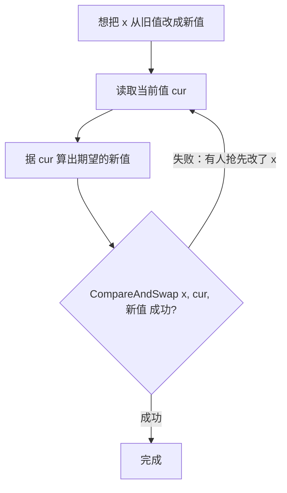

# 11.3 原子操作

`sync/atomic` 是同步原语里最贴近硬件的一层。互斥锁、channel 这些更高层的工具，内部都建立在
原子操作之上。它提供的是"不可分割"的读写与读改写：一个原子操作要么完整发生，要么没发生，
中间不会被别的 goroutine 看到一半。

## 11.3.1 几种基本操作

原子操作的家族不大：`Load`（原子读）、`Store`（原子写）、`Add`（原子增减）、`Swap`（原子交换）、
以及 `CompareAndSwap`（比较并交换，简称 CAS）。其中 CAS 是无锁编程的基石，它原子地完成
"如果当前值还是我以为的那个，就把它改成新值，否则什么都不做并告诉我失败"。

大多数无锁算法都围绕 CAS 写成一个**重试循环**：读出当前值，据它算出想要的新值，用 CAS 尝试
写回；若期间有人抢先改动了它，CAS 失败，就拿着新读到的值再试一遍。

无锁不等于无代价：竞争激烈时，CAS 循环会反复失败重试，把 CPU 耗在空转上，未必比一把锁更快。
原子操作适合的是计数器、标志位、配置指针这类**单字、低竞争或读多写少**的场景。

## 11.3.2 原子操作是顺序一致的

`sync/atomic` 的所有操作都是**顺序一致原子**：它们共享一个全局的全序，语义等同 C++ 的
顺序一致原子与 Java 的 `volatile`（[11.9 内存一致模型](./mem.md)）。这意味着原子操作不仅自身
不可分割，还能在 goroutine 之间建立 happens-before 次序，因此可以用作同步手段，而不只是
"防止撕裂"。需要强调的是，Go **没有**暴露 C++ 那样的弱序（relaxed/acquire/release）原子，
这是一处刻意的简化，理由见 [11.9](./mem.md) 的工程权衡。

## 11.3.3 类型化原子：把"该用原子访问"编进类型

`sync/atomic` 早期只有一组函数式 API，如 `atomic.AddInt64(&x, 1)`。它有两个长期为人诟病的
陷阱。其一，没有任何机制阻止你在别处对同一个变量做**普通**（非原子）访问，一旦某处漏用原子
函数，就埋下了数据竞争，编译器无从察觉。其二，在 32 位平台上，对 64 位变量做原子操作要求
8 字节对齐，而裸 `int64` 字段并不保证这一点，于是出现过"结构体字段顺序一变，程序在 32 位机上
就崩"的著名坑。

Go 1.19 引入了**类型化原子**：`atomic.Int32/Int64/Uint32/Uint64/Bool/Uintptr/Pointer[T]/Value`。
把变量声明成 `atomic.Int64`，访问它就**只能**通过它的 `Load`/`Store`/`Add`/`CompareAndSwap`
等方法，普通访问在类型层面就被堵死；同时这些类型自带正确的对齐保证，32 位平台的对齐坑也一并
消除。这是一处 API 设计与内存模型协同演进的范例：用类型把"这个字段必须原子访问"这条约定，
从程序员的自觉变成了编译器可强制的契约。新代码应一律优先使用类型化原子。

## 11.3.4 atomic.Value 与一致快照

`atomic.Value` 用于**整体地、原子地**替换一个较大的值，典型用途是配置的热更新：后台 goroutine
准备好一份新配置，用 `Store` 一次性替换，所有读者用 `Load` 要么读到完整的旧配置、要么读到
完整的新配置，绝不会读到"改了一半"的中间态。这是一种轻量的写时复制（copy-on-write）：
读者无锁、写者整体替换，适合读远多于写的共享状态。

## 延伸阅读的文献

1. The Go Authors. *The Go Memory Model：Atomic Values.* https://go.dev/ref/mem
2. Go proposal #50860. *sync/atomic: add typed atomic values*, 2022.
   https://github.com/golang/go/issues/50860
3. Maurice Herlihy. "Wait-Free Synchronization." *ACM TOPLAS*, 13(1), 1991.
   https://doi.org/10.1145/114005.102808 （CAS 等原语的同步能力层级）
4. Maged M. Michael, Michael L. Scott. "Simple, Fast, and Practical Non-Blocking and
   Blocking Concurrent Queue Algorithms." *PODC 1996*.（基于 CAS 的无锁队列经典）

## 许可

&copy; 2018-2026 The [golang.design](https://golang.design) Initiative Authors. Licensed under [CC-BY-NC-ND 4.0](https://creativecommons.org/licenses/by-nc-nd/4.0/).
