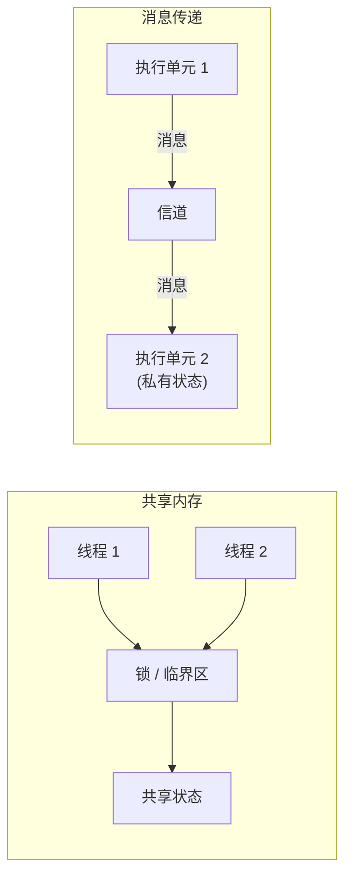

# 11.1 共享内存式同步模式

> 程序的构造可以用更简单的基础原语来表达，这一事实是一个有力的保障：这些原语所包含的内容，
> 能与程序语言的其余部分在逻辑上保持一致。
> ——  C. A. R. Hoare

并发编程的全部困难，可以浓缩成一句话：多个执行单元要在同一份状态上协作，而它们各自推进的
次序无法预知。如何让这种协作既正确又高效，半个多世纪以来分化出两条大的传统。本章讲的是其中
一条，共享内存。在拆解 Go 标准库 `sync` 与 `sync/atomic` 里那些具体原语之前，本节先把这两条
传统放在一起辨认清楚，说明它们为何是对偶的，再交代 Go 在其间所站的位置。读懂了这层取舍，
后面 [11.2](./mutex.md) 到 [11.9](./mem.md) 各节就不再是孤立的 API，而是同一种设计哲学落到
不同场景上的样子。

## 11.1.1 并发的两大传统

并发编程历史上有两条大的传统。一条是**共享内存**：线程共享地址空间，靠互斥锁、信号量、条件
变量等手段协调对共享状态的访问。Dijkstra 1965 年提出的信号量与 Hoare 1974 年提出的监管程
（monitor）是它的奠基石，它也是 C/C++、Java、以及几乎所有操作系统内核的主流路数。另一条是
**消息传递**：执行单元不共享状态，只通过收发消息协调。Hoare 的 CSP（[10.1](../ch10chan)）与
Hewitt 的 Actor 模型是它的两支，Erlang、occam 是它的代表。

两条传统的分野，落在「状态归谁所有」这一点上。共享内存里状态是公有的，谁都能碰，于是必须靠
锁划出临界区，规定同一时刻只许一个执行单元进入；消息传递里状态是私有的，别人想读写只能发一封
信请它代劳，协调由信道的收发时序天然完成。



值得一提的是，两者并非非此即彼。Dijkstra 当年用信号量解的「生产者与消费者」「哲学家就餐」
等问题，今天用 channel 同样能写；反过来，channel 的内部实现本身就是一段被互斥锁保护的共享
缓冲（[10](../ch10chan)）。这种「换一种说法就能从一边翻译到另一边」的观感并非错觉，下一小节
会看到，它早在 1979 年就被证明是一条普遍规律。

## 11.1.2 Lauer-Needham 对偶

1979 年，Hugh Lauer 与 Roger Needham 提出了一个影响深远的论断：基于消息传递的系统，与基于
共享内存（他们称之为「过程式」）的系统，在表达能力上是**对偶**的，二者可以机械地相互转换，
且转换后性能相当。他们给出了两类系统组成成分之间的一张对照表，大意如下。

| 消息传递世界 | 共享内存（过程）世界 |
| --- | --- |
| 进程、消息端口 | 受锁保护的模块、过程入口 |
| 发送请求消息并等待回复 | 调用过程并等待返回 |
| 等待某端口上的消息到达 | 在条件变量上等待 |
| 消息队列 | 一把锁加一个条件变量 |

这张表说的是：每一种用消息搭出来的协作模式，都有一个用「锁加条件变量」搭出来的等价物，反之
亦然。它的意义不在于鼓励你随意互换，而在于揭示一件更深的事：**正确性与性能并不由你选了哪条
传统决定**，两条路在原理上是同一座山的两侧。Lauer 与 Needham 由此主张，选择应当出于工程上
「何者更自然、更不易写错、更贴合手头硬件与运行时」的判断，而非某条传统天生更优的信念。

这个对偶恰是理解 Go 立场的钥匙。既然两条路等价，Go 就不必、也确实没有把消息传递当成唯一真
理，而是给了它一个语言层面的偏好位置，同时把共享内存完整地保留在标准库里。

## 11.1.3 Go 的立场

Go 的立场很鲜明：它把消息传递（[channel](../ch10chan) 与 select）作为**语言层面的核心**，凝成
那句广为人知的箴言。

> 不要以共享内存的方式通信，而要以通信的方式共享内存。
> （Do not communicate by sharing memory; instead, share memory by communicating.）

但「以此为核心」不等于「以此为唯一」。Go 并不否定共享内存。传统的互斥、原子、条件变量、
线程本地资源等，被安放在标准库 `sync` 与 `sync/atomic` 里，成为一组**同步模式**（pattern）
而非语言原语。这个安放位置本身就是一种表态：channel 是语法的一等公民，锁与原子则是按需取用
的工具。

为什么留着它们？因为对偶归对偶，工程上两条路的「自然度」并不对称。当你要保护的只是一小段
状态，比如一个计数器、一张配置表、一处一次性初始化，用一把锁把它围起来，往往比为它专设一个
goroutine、再用 channel 把读写请求绕进去，更直接也更快。channel 的每次收发都要经过调度与
内存屏障，而一次无竞争的原子加可能只是一条 CPU 指令。[10.9](../ch10chan) 专门讨论过何时
不该用 channel，本章接续那条线，回答「那时候该用什么」。

下面这段对照，是同一个并发安全计数器的两种写法。左边用 channel 串行化所有操作，右边用一把锁
保护一个整数。两者都正确，但当语义简单到只是「给一个数加一」时，右边更贴合问题本身：

```go
// 写法一：以通信共享内存（channel 串行化）
type counter struct{ ch chan int }

func (c *counter) inc()     { c.ch <- 1 }       // 把「加一」当成一条消息发出
func (c *counter) loop() {                       // 专设一个 goroutine 持有状态
    n := 0
    for delta := range c.ch {
        n += delta
    }
}

// 写法二：共享内存加一把锁（sync.Mutex）
type counter struct {
    mu sync.Mutex
    n  int
}

func (c *counter) inc() {
    c.mu.Lock()
    c.n++          // 临界区：一次自增
    c.mu.Unlock()
}
```

判断标准并不玄妙：状态的所有权要不要在多个 goroutine 之间流转、协作的逻辑是否本身就是一条
数据管线，是则倾向 channel；只是几个 goroutine 偶尔碰一碰同一小块状态，是则倾向锁或原子。
Go 把两套工具都备齐，是要让写程序的人按场景挑，而不是被语言逼着只走一条路。

## 11.1.4 本章地图

本章逐一拆解这些共享内存式同步原语的实现与取舍。每一节都既讲清它解决什么问题，也讲清它背后
的理论传统与工程演进，并点明它在「正确、简单、性能」三者间所做的那次具体权衡：

- **互斥锁**（[11.2](./mutex.md)）：最基本的临界区保护。从 Dijkstra 的互斥问题、操作系统提供
  的 futex 地基，到 Go 自己的正常模式与饥饿模式之间的权衡。
- **原子操作**（[11.3](./atomic.md)）：最贴近硬件的一层。共识层级、ABA 问题、无锁数据结构
  的谱系，以及为何 Go 只暴露顺序一致的原子。
- **条件变量**（[11.4](./cond.md)）：等待某个条件成立。Hoare 与 Mesa 两种 signal 语义的分歧，
  以及它在 Go 里为何常被 channel 取代。
- **同步组**（[11.5](./waitgroup.md)）：fork-join 式并发的计数闩与栅栏。
- **缓存池**（[11.6](./pool.md)）：对象复用与为 GC 减负。每 P 分片与 victim 缓存的演进。
- **并发安全散列表**（[11.7](./map.md)）：并发散列表的解法谱系，与 `sync.Map` 两代实现的取舍。
- **上下文**（[11.8](./context.md)）：沿任务树传播取消与截止时间。协作式取消与结构化并发。
- **内存一致模型**（[11.9](./mem.md)）：上述一切之所以成立的底层契约，也是本章的理论收尾。

读完会发现一条贯穿始终的主线：每一个原语都是在正确、简单、性能三者之间的一次具体取舍，
而 Go 的偏好始终是把简单与正确放在性能之前。互斥锁宁可让出公平性的极致也要避免饥饿，原子
只给顺序一致这一档而不暴露弱序，`sync.Map` 用空间和复杂度换读多写少时的性能，无一不是这条
偏好的注脚。这与 [9 调度器](../ch09sched)、[10 通道](../ch10chan) 一脉相承，三者共同构成 Go
并发的全貌。

## 延伸阅读的文献

1. Edsger W. Dijkstra. "Cooperating Sequential Processes." 1968（信号量与共享内存同步的奠基，
   含互斥、生产者消费者、哲学家就餐等问题）.
2. C. A. R. Hoare. "Monitors: An Operating System Structuring Concept." *CACM*, 17(10),
   1974. https://doi.org/10.1145/355620.361161
3. C. A. R. Hoare. "Communicating Sequential Processes." *CACM*, 21(8), 1978.
   https://doi.org/10.1145/359576.359585 （消息传递传统的奠基，见 [10](../ch10chan)）.
4. Hugh C. Lauer, Roger M. Needham. "On the Duality of Operating System Structures."
   *ACM SIGOPS OSR*, 13(2), 1979. https://doi.org/10.1145/850657.850658
   （消息传递与共享内存的对偶性）.
5. Carl Hewitt, Peter Bishop, Richard Steiger. "A Universal Modular ACTOR Formalism for
   Artificial Intelligence." *IJCAI 1973*（Actor 模型）.
6. The Go Authors. *The Go Memory Model.* https://go.dev/ref/mem .
7. The Go Authors. *Effective Go: Share by communicating.*
   https://go.dev/doc/effective_go#concurrency .

## 许可

&copy; 2018-2026 The [golang.design](https://golang.design) Initiative Authors. Licensed under [CC-BY-NC-ND 4.0](https://creativecommons.org/licenses/by-nc-nd/4.0/).
