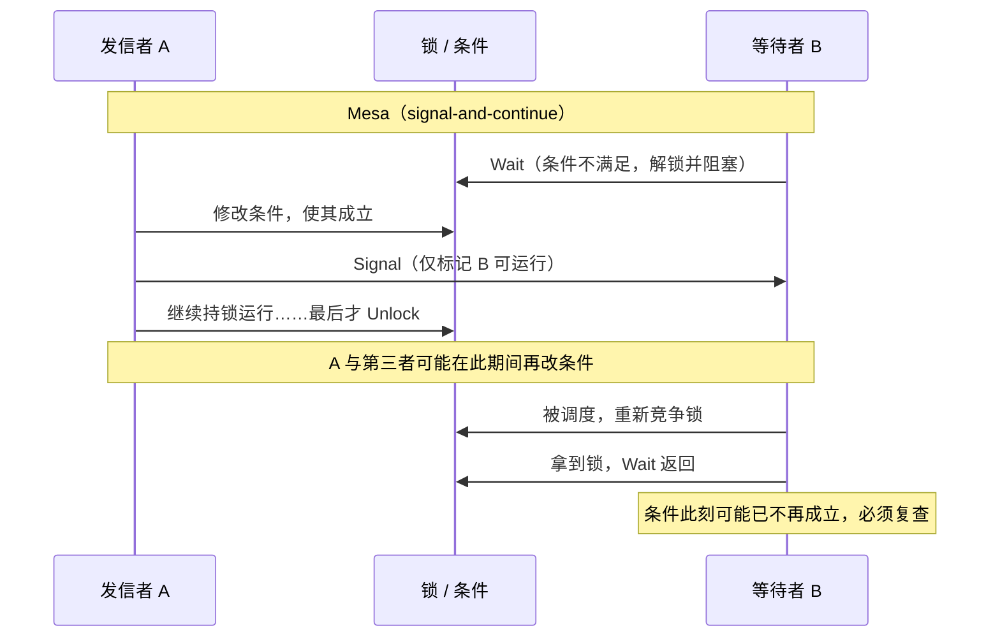

# 11.4 条件变量

互斥锁（[11.2](./mutex.md)）回答的是「谁能进临界区」，条件变量回答的则是另一个问题：
「一个 Goroutine 已经进了临界区，却发现现在还不能干活，它该如何等到能干活的那一刻，
同时把临界区让给别人」。生产者消费者是最常见的例子。队列满时，生产者既不能写入，
又不能一直攥着锁空转，否则消费者永远拿不到锁去腾空间，于是双方一起卡死。条件变量
`sync.Cond` 给出的办法是：让生产者「带锁睡去」，原子地交出锁并阻塞，等消费者腾出空间后
把它唤醒，醒来时锁又回到它手上。

这一节先把用法讲清楚，尤其是那条几乎所有教材都强调、却很少解释清楚来由的规矩：
`Wait` 必须写在 `for` 循环里。这条规矩不是 Go 的发明，它根植于 1970 年代关于「管程」
（monitor）的两种唤醒语义之争。讲清这段历史，读者就会明白为什么从 pthread 到 Java 再到 Go，
现代条件变量无一例外地要求循环复查。随后我们给出 Go 实现的速写（notifyList 的 ticket 机制、
禁止拷贝的 copyChecker），最后说明一个也许出乎意料的事实：在 Go 里 `sync.Cond` 其实很少用，
channel 与 close 广播大多把它取代了。

## 11.4.1 用法：Wait 为何要写在 for 循环里

先看一段标准的生产者消费者。`condition` 是受锁保护的共享状态，`cond` 用同一把锁构造：

```go
func main() {
	cond := sync.NewCond(new(sync.Mutex))
	condition := 0

	// 消费者
	go func() {
		for {
			cond.L.Lock()
			for condition == 0 { // 没有可消费的，带锁睡去
				cond.Wait()
			}
			condition--
			cond.Signal() // 腾出了空间，唤醒一个生产者
			cond.L.Unlock()
		}
	}()

	// 生产者
	for {
		cond.L.Lock()
		for condition == 100 { // 队列满了，带锁睡去
			cond.Wait()
		}
		condition++
		cond.Signal() // 有货了，唤醒一个消费者
		cond.L.Unlock()
	}
}
```

`Wait` 的契约是三步合一：原子地解锁 `c.L`、阻塞当前 Goroutine、被唤醒后重新锁上 `c.L`
再返回。「原子地解锁并阻塞」是关键的一步，它堵死了一个否则必然出现的丢失唤醒窗口：
若先解锁、再阻塞分作两步，解锁之后阻塞之前的那一瞬，另一方完全可能改好条件并发出
`Signal`，而此刻还没睡着的本方收不到这个信号，待它睡去便再无人来唤，于是永久错过。
`Wait` 把解锁与入队做成一体，正是为了消除这个窗口。

真正需要解释的是循环。注意上面每个 `Wait` 都裹在 `for condition == ...` 里，而不是 `if`。
直觉上，既然消费者是在「`condition == 0`」时才睡的，被唤醒后理应 `condition > 0`，用 `if`
判断一次足矣，何必循环？答案是：`Wait` 返回时，那个让你睡去的条件**不保证**仍然成立。
被唤醒只意味着「也许可以了，去复查一下」，而非「条件已满足」。要理解这个「也许」从何而来，
需要回到管程的唤醒语义。

## 11.4.2 管程的两种唤醒语义：Hoare 与 Mesa

条件变量并非凭空设计，它是 1970 年代「管程」这一并发抽象的组成部分。管程由 Hoare 在 1974 年
的论文《Monitors: An Operating System Structuring Concept》中系统提出（同期 Brinch Hansen
亦有相近构想），它把共享数据与操作这些数据的过程封装在一起，保证任一时刻至多一个进程在
管程内活动，并配以条件变量供进程在条件不满足时主动让出管程、等待被唤醒。

分歧出在唤醒的那一刻。当进程 $A$ 在管程内执行 `signal` 唤醒了正等在某条件上的进程 $B$ 时，
管程互斥的约束要求二者不能同时在内活动，于是必须有人让路。让谁、何时让，给出了两种根本
不同的语义。

**Hoare 语义，又称 signal-and-wait。** Hoare 原始论文规定：`signal` 立即把管程的控制权
移交给被唤醒的 $B$，发信者 $A$ 自己挂起，等 $B$ 离开管程后再恢复。这套语义的好处是对程序员
极友好：$A$ 在 `signal` 前刚刚令条件为真，控制权又**立即**交给 $B$，中间没有任何第三者插足
的机会，因此 $B$ 醒来时条件**一定**成立。在 Hoare 语义下，等待方写 `if` 足矣：

```go
// Hoare（signal-and-wait）语义下的伪代码，仅作对照，Go 并非如此
c.L.Lock()
if condition == 0 { // if 即可：醒来时条件保证成立
	c.Wait()
}
// 此处 condition > 0 一定成立
```

代价藏在实现里。「立即移交、发信者挂起」要求一次额外的上下文切换，还要为被挂起的发信者
维护一个特殊的优先队列，使其在被唤醒方让出后抢在普通竞争者之前重入。这套机制实现复杂、
切换频繁，性能并不讨喜。

**Mesa 语义，又称 signal-and-continue。** Lampson 与 Redell 在 1980 年的论文《Experience
with Processes and Monitors in Mesa》中，根据 Xerox PARC 用 Mesa 语言构建真实系统的经验，
选择了相反的做法：`signal` 仅仅把 $B$ 标记为可运行，发信者 $A$ **继续**持锁运行到自己
情愿退出管程为止。被唤醒的 $B$ 这时只是回到了「就绪」状态，它还得重新去竞争那把锁。问题就在
这里：从 $A$ 发出 `signal` 到 $B$ 真正重新拿到锁、`Wait` 返回，这中间隔着一段不确定的时间，
其间不仅 $A$ 可能继续修改共享状态，别的第三个进程也可能抢先拿到锁，把 $A$ 刚腾出的那点条件
重新消耗掉。等 $B$ 醒来，它睡前等待的条件很可能**又不成立了**。



结论顺理成章：在 Mesa 语义下，被唤醒**不等于**条件成立，等待方必须在返回后重新检查条件，
若仍不满足就再次 `Wait`。这正是 `for` 循环的由来。把 `if` 换成 `for`，等价于把
「我相信醒来即可用」改成「我醒来后再确认一次，不行就接着睡」：

```go
c.L.Lock()
for !condition() { // for 而非 if：醒来后复查，不成立则重新 Wait
	c.Wait()
}
// 循环退出，此刻 condition() 一定为真
c.L.Unlock()
```

## 11.4.3 为何现代条件变量一律是 Mesa 语义

既然 Hoare 语义对程序员更友好（`if` 即可），为何今天的条件变量几乎清一色选了 Mesa？
Lampson 与 Redell 在论文里给出的理由至今成立，可归为三点。

其一，**实现简单、性能更好**。Mesa 语义下 `signal` 只需把等待者标记为就绪，无需额外的
上下文切换，也无需为发信者维护抢占式的重入队列。唤醒与调度解耦，交还给通用的调度器即可。

其二，**对伪唤醒天然鲁棒**。现实系统中，等待者可能因为种种与条件无关的原因被唤醒：操作系统
信号、超时、为简化实现而允许的「spurious wakeup」（POSIX 明文允许 `pthread_cond_wait`
无故返回）。Hoare 语义对此十分脆弱，Mesa 语义因为本就要求循环复查，这些意外唤醒被同一个
`for` 顺手吸收，复查一遍发现条件不满足，接着睡就是了。

其三，**与广播语义相容**。`Broadcast` 一次唤醒全部等待者，但其中通常只有一个（或几个）能
真正继续，其余被唤醒后会发现条件已被先到者抢走。这种「唤醒多于可用」的模式只有在「醒来必须
复查」的前提下才是安全的，而这正是 Mesa 语义内建的前提。

于是我们看到一条跨越语言与平台的统一规则：

| 系统 | 唤醒语义 | 等待写法 |
| --- | --- | --- |
| Hoare 原始管程（1974） | signal-and-wait | `if` 足矣 |
| POSIX `pthread_cond_wait` | signal-and-continue（且允许 spurious wakeup） | 必须 `while` |
| Java `Object.wait` / `Condition.await` | signal-and-continue | 必须 `while`（官方文档明示） |
| Go `sync.Cond.Wait` | signal-and-continue | 必须 `for` |

Go 的文档把这一点写得很直白：「Because c.L is not locked while Wait is waiting, the caller
typically cannot assume that the condition is true when Wait returns. Instead, the caller
should Wait in a loop」。这句话翻译过来，就是 Mesa 语义的工程化忠告。

## 11.4.4 Go 的实现：notifyList 与 copyChecker

理解了语义，再看 Go 的实现就只剩机械的部分了。`sync.Cond` 的结构很薄：

```go
// sync.Cond：薄薄一层，真正的等待队列在 notifyList 里（速写）
type Cond struct {
	noCopy  noCopy      // 供 go vet -copylocks 静态检查，禁止拷贝
	L       Locker      // 观察 / 修改条件时持有的锁，可为 *Mutex 或 *RWMutex
	notify  notifyList  // 通知列表：等待队列 + ticket 计数器
	checker copyChecker // 运行时检测拷贝，拷贝则 panic
}
```

`L` 的类型是 `Locker` 接口（只需 `Lock`/`Unlock` 两个方法），故 `*Mutex` 与 `*RWMutex`
都能用。三个方法 `Wait`/`Signal`/`Broadcast` 各自先调一次 `checker.check()`，余下的活全部
转交给运行时的 notifyList：

```go
func (c *Cond) Wait() {
	c.checker.check()
	t := runtime_notifyListAdd(&c.notify) // 取一张 ticket
	c.L.Unlock()                          // 解锁
	runtime_notifyListWait(&c.notify, t)  // 凭 ticket 阻塞，等待通知
	c.L.Lock()                            // 醒来后重新上锁
}
func (c *Cond) Signal()    { c.checker.check(); runtime_notifyListNotifyOne(&c.notify) }
func (c *Cond) Broadcast() { c.checker.check(); runtime_notifyListNotifyAll(&c.notify) }
```

**ticket 机制。** notifyList 的核心是一对单调递增的计数器，用「取号排队」的方式解决一个微妙的
竞态：`Wait` 内部是先 `notifyListAdd` 取号、再 `Unlock`、最后 `notifyListWait` 真正入队
阻塞，三步并非一气呵成。若在取号与入队之间恰好来了 `Signal`，这个尚未睡着的等待者不能被漏掉。
ticket 正是为此而生：

```go
// notifyList：基于 ticket 的通知列表（速写）
type notifyList struct {
	wait   atomic.Uint32 // 下一个 waiter 的号；无锁原子自增
	notify uint32        // 下一个该被通知的号；持锁写、可无锁读
	lock   mutex
	head   *sudog // 已入队、正在阻塞的 waiter 链表
	tail   *sudog
}
```

`Wait` 先 `wait.Add(1)` 领到一个号 `t`。等它走到 `notifyListWait`，会先比较 `t` 与 `notify`：
若 `t < notify`，说明「轮到我的号」早已被叫过（`Signal` 在我入队前就发生了），于是立即返回，
不必阻塞。否则才真正构造 `sudog`、入队，并 `goparkunlock` 把自己挂起，这一步会把 G 从 M 上
解绑，置为等待状态，交还调度器（[9](../ch09sched)）。`Signal`（`notifyListNotifyOne`）则把
`notify` 加一，在链表中找到持有该号的 `sudog` 并 `goready` 它；`Broadcast`
（`notifyListNotifyAll`）把 `notify` 直接追平 `wait`，唤醒链表中全部等待者。两者都有一条
无锁快路径：若 `wait == notify`（自上次通知以来没有新等待者），直接返回，连锁都不必拿。

**copyChecker：禁止拷贝。** `Cond` 一旦使用便不可拷贝，拷贝会复制出一份独立的 notifyList，
令唤醒发往错误的队列，造成难以排查的丢失唤醒。Go 用两道防线来挡：`noCopy` 字段是给
`go vet -copylocks` 看的静态标记，编译期就能报警；`copyChecker` 则是运行期的兜底，它是一个
`uintptr`，存放「自己的地址」：

```go
// copyChecker：存一个指向自身的指针，借此发现拷贝（速写）
type copyChecker uintptr

func (c *copyChecker) check() {
	if uintptr(*c) != uintptr(unsafe.Pointer(c)) &&
		!atomic.CompareAndSwapUintptr((*uintptr)(c), 0, uintptr(unsafe.Pointer(c))) &&
		uintptr(*c) != uintptr(unsafe.Pointer(c)) {
		panic("sync.Cond is copied")
	}
}
```

它的精巧在于：未拷贝时，`*c` 存的就是 `c` 自己的地址，三步检查走最快的第一条比较即返回；
首次使用时 `*c` 还是零，由中间的 CAS 把自身地址写入。一旦发生拷贝，新对象里 `*c` 存的还是
**原对象**的地址，与新地址不符，CAS 也因非零而失败，三步走完便 `panic("sync.Cond is copied")`。
用一个 `uintptr` 就把「我有没有被搬过家」编码了进去，不占额外空间，这与
[12.2](../../part4memory/ch12alloc/component.md) 里自由表「用空闲块自身存指针」是同一路数的
省地手法。

## 11.4.5 happens-before 保证

`sync.Cond` 在 Go 内存模型（[11.9](./mem.md)）里有一条明确的发生序保证：一次能唤醒某个
`Wait` 的 `Signal` 或 `Broadcast` 调用，**synchronized before** 它所唤醒的那次 `Wait` 返回。
也就是说，发信者在 `Signal` 之前对共享状态做的写入，被唤醒方在 `Wait` 返回后一定看得见。
不过这条保证只覆盖「唤醒与被唤醒」这一对事件之间的可见性，它**不**替你保证条件本身成立，
那是 11.4.2 已经讲过的 Mesa 语义另说的事。可见性与条件成立是两码事，前者靠内存模型，
后者靠你那个 `for` 循环。这也从内存模型一侧印证了为什么裸用 `if` 不安全。

## 11.4.6 为何 Go 里很少用 sync.Cond

读到这里读者或许会问：既然条件变量这么经典，为什么在 Go 代码里却难得一见？答案是 Go 把它的
两大用途，都交给了更顺手的 channel。

`sync.Cond` 官方文档自己就写着：「For many simple use cases, users will be better off using
channels than a Cond」，并给出对应关系：`Signal` 对应「向 channel 发送一个值」，`Broadcast`
对应「`close` 一个 channel」。后者尤其常用：关闭一个 channel 会让**所有**阻塞在其接收上的
Goroutine 同时返回零值，这天然就是一次广播，而且关闭是幂等可被多次观察的，比 `cond.Broadcast`
需要配一把锁和一个 `for` 循环要省心得多。一个典型的「一次性广播」写法是：

```go
done := make(chan struct{})
// 等待方：阻塞直到 done 被关闭
go func() {
	<-done
	// 被广播唤醒，继续
}()
// 广播方：一次 close 唤醒所有等待者
close(done)
```

正因如此，连标准库自己也在「去 Cond 化」。早年的 `io.Pipe` 曾用 `sync.Cond` 协调读写两端，
后来重写成了纯 channel 的实现。如今标准库里 `sync.Cond` 的真实用例屈指可数，且都集中在
那些 channel 反而别扭的场景：`database/sql` 的 `closemu`（一把读写锁配两个 Cond，区分读等待
与写等待）、`net/http` 服务器在优雅关闭时等待在飞请求清零等。这些场景的共同点是「等待一个
随时间反复变化的谓词」，channel 的「一发一收」或「一次性关闭」语义恰好不贴合，而条件变量
「带锁等一个会变的条件」正是为此而生。

放进谱系看，`sync.Cond` 是管程传统在 Go 里的一处遗存。Go 的并发哲学偏向 CSP（Hoare 1978 年
另一篇奠基之作）「以通信共享内存」，而条件变量属于「以共享内存配同步原语」的另一脉。Go 两者
都提供，但把前者立为默认，于是条件变量退到了角落，成了为数不多「确实需要共享内存式协调」时
才请出来的工具。它仍在标准库里，文档却反过来劝你先想想 channel，这种「提供但不鼓励」的姿态，
本身就是 Go 并发取向的一个注脚。

## 延伸阅读的文献

1. C. A. R. Hoare. "Monitors: An Operating System Structuring Concept."
   *Communications of the ACM*, 17(10), 1974. https://doi.org/10.1145/355620.361161
   （管程与 signal-and-wait 语义的原始提出）
2. Butler W. Lampson and David D. Redell. "Experience with Processes and Monitors in Mesa."
   *Communications of the ACM*, 23(2), 1980. https://doi.org/10.1145/358818.358824
   （signal-and-continue 语义与「循环复查」规则的来源）
3. C. A. R. Hoare. "Communicating Sequential Processes." *Communications of the ACM*,
   21(8), 1978. https://doi.org/10.1145/359576.359585 （Go channel 取向的理论源头）
4. Per Brinch Hansen. "Structured Multiprogramming." *Communications of the ACM*, 15(7),
   1972. https://doi.org/10.1145/361454.361473 （与 Hoare 同期的管程构想）
5. The Go Authors. *sync.Cond documentation and source* (`src/sync/cond.go`).
   https://pkg.go.dev/sync#Cond
6. The Go Authors. *The Go Memory Model* (Version of June 6, 2022).
   https://go.dev/ref/mem （Cond 的 synchronized-before 保证）
7. 本书 [11.2 互斥锁](./mutex.md)、[11.9 内存一致模型](./mem.md)、
   [12.2 组件](../../part4memory/ch12alloc/component.md)。
