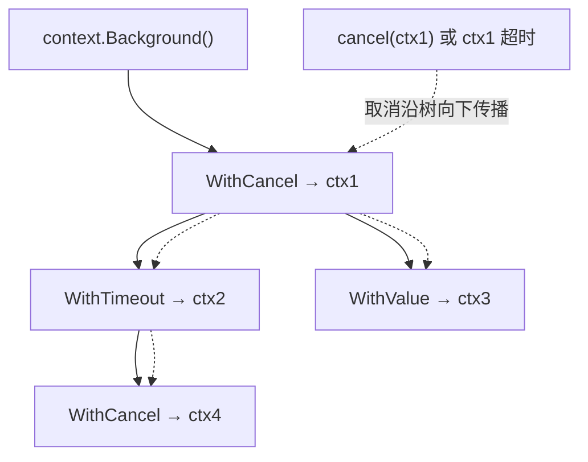

# 11.8 上下文

一个请求进来，往往扇出成一棵 goroutine 调用树：处理函数调数据库、发 RPC、查缓存，每步可能
又起若干 goroutine。当请求被取消、超时，或上游放弃等待时，这一整棵树都该尽快停下来，别再白白
占用资源。`context.Context` 就是在这棵树上**传播取消信号与截止时间**的标准方式。它背后是一个
看似简单、实则有深刻取舍的问题：如何安全地"叫停"别人。

## 11.8.1 为什么是协作式取消

最直接的"叫停"是强行杀死目标线程/协程。历史证明这是个馊主意:Java 早年提供 `Thread.stop()`，
后来**废弃**它，因为强杀会在任意时刻打断目标，使其持有的锁、改到一半的数据结构处于不一致
状态,本质上不安全。这条教训塑造了现代做法：**协作式取消**。被取消方不被强杀，而是收到一个
信号、在自己选定的安全点上主动收尾。Go 的 `context` 正是协作式取消:`ctx.Done()` 给出信号，
goroutine 自己决定何时检查它、如何清理。Go 运行时甚至**没有**杀死单个 goroutine 的 API,这是
深思熟虑的选择，而非疏漏。

## 11.8.2 一棵可被取消的树

context 通过层层派生构成一棵树：从根 `context.Background()` 出发，每次 `WithCancel`、
`WithTimeout`、`WithValue` 都生出一个子 context 挂在父之下。

```go
ctx, cancel := context.WithTimeout(parent, 2*time.Second)
defer cancel() // 务必调用，否则与之关联的计时器与子节点会泄漏
go worker(ctx)  // 子 goroutine 携带 ctx 一起向下传
```



取消**向下传播**：取消任一节点，它的整棵子树都被取消。机制上，每个 context 暴露一个 `Done()`
channel，取消时这个 channel 被**关闭**，从而**广播**给所有在 `select` 里监听它的 goroutine
（这正是 [10.4](../ch10chan)、[11.4](./cond.md) 提到的"用关闭 channel 做广播"）。下游的标准写法：

```go
select {
case <-ctx.Done():
    return ctx.Err()   // 被取消或超时
case res := <-work:
    return res
}
```

超时与定时取消，本质就是挂一个到期后自动 `cancel` 的计时器（[9.10](../ch09sched/timer.md)），
所以 `WithTimeout` 不再需要时必须 `cancel`，否则计时器与子节点不会被及时回收。Go 1.21 还新增
`context.AfterFunc`（取消时自动跑回调）、`WithoutCancel`（切断取消传播）、`WithDeadlineCause`
（附带取消原因），补齐了若干长期缺口。

## 11.8.3 结构化并发的视角

context 是 Go 对**结构化并发**这一思潮的部分回应。Nathaniel J. Smith 在 2018 年那篇影响深远的
《Notes on structured concurrency, or: Go statement considered harmful》中论证：裸的"启动一个
后台任务后就不管了"（无论是 `go` 还是别处的 `spawn`）破坏了程序的结构,任务的生命周期不再嵌套，
错误与取消难以传播。结构化并发主张：并发任务应有明确的、嵌套的作用域，父作用域等待并管理其
所有子任务。Python 的 trio 用"托儿所"（nursery）、Kotlin 用 `coroutineScope`、Java 的结构化并发
（JEP）用 `StructuredTaskScope` 实现这一点。Go 没有语言级的结构化并发构造，但
`context`（取消传播）配合 `golang.org/x/sync/errgroup`（等待一组任务、传播首个错误）是目前的
惯用近似。

横向看取消机制：**.NET 的 `CancellationToken`** 几乎是 `context` 取消部分的镜像
（`CancellationTokenSource` 对应 `cancel`，`Token` 对应 `ctx`）;**Kotlin** 把取消做进协程的 `Job`
层级与 `CoroutineContext`;**Java** 早期只有 `Thread.interrupt()`,一个容易被忽略或处理不当的
布尔标志。这些设计的共同走向，是把取消变成可沿任务树显式传播的一等概念。

## 11.8.4 值传递的争议

`WithValue` 允许把请求范围的数据（trace ID、鉴权信息）挂在 context 上随调用链传递。它方便，
但一直有争议：它实质是一个类型不安全的隐式参数通道（键值都是 `any`），用多了会让数据流向变得
隐晦、难以追踪。共识是：context 的值**只该装请求范围的元数据，不该装本应作为显式函数参数传入
的业务数据**。这是"便利"与"清晰"之间的取舍，用错了会侵蚀可读性。

## 11.8.5 设计取舍

context 把"取消、超时、请求元数据"统一进一个沿调用链显式传递的对象，代价是几乎每个涉及 I/O
或并发的函数都要多带一个 `ctx context.Context` 首参数。这种"显式但啰嗦"的设计，是 Go 一贯
偏好的:宁可让传播路径明明白白写在签名里，也不藏进隐式的线程本地存储。它与 [9 调度器](../ch09sched)
把复杂性显式化、与 [11.9](./mem.md) 拒绝未定义行为，是同一种价值观的不同侧面。批评者认为
ctx 到处传是噪声;支持者认为这种显式性正是大型代码库可维护的前提,这场争论本身，就是理解 Go
设计取向的一扇窗。

## 延伸阅读的文献

1. The Go Authors. *context 包文档.* https://pkg.go.dev/context
2. Sameer Ajmani. *Go Concurrency Patterns: Context.* Go 博客, 2014.
   https://go.dev/blog/context
3. Nathaniel J. Smith. *Notes on structured concurrency, or: Go statement considered
   harmful.* 2018. https://vorpus.org/blog/notes-on-structured-concurrency-or-go-statement-considered-harmful/
4. Oracle. *Java Thread.stop() 的废弃说明*（强制停止为何不安全）.
   https://docs.oracle.com/javase/8/docs/technotes/guides/concurrency/threadPrimitiveDeprecation.html
5. Go 1.21 Release Notes（context.AfterFunc / WithoutCancel / WithDeadlineCause）.
   https://go.dev/doc/go1.21

## 许可

&copy; 2018-2026 The [golang.design](https://golang.design) Initiative Authors. Licensed under [CC-BY-NC-ND 4.0](https://creativecommons.org/licenses/by-nc-nd/4.0/).
