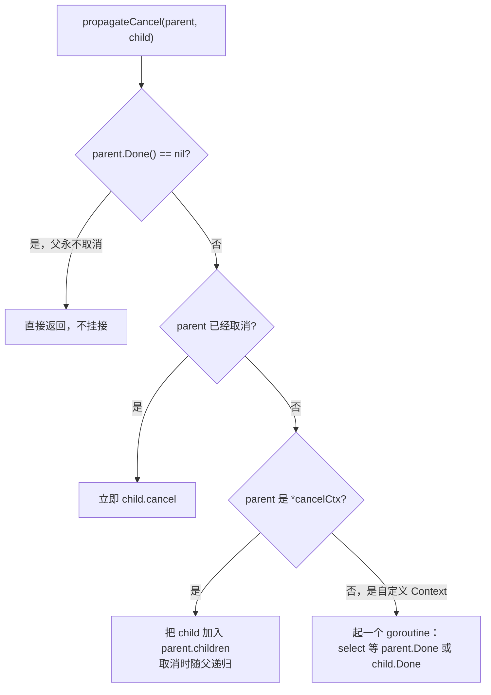
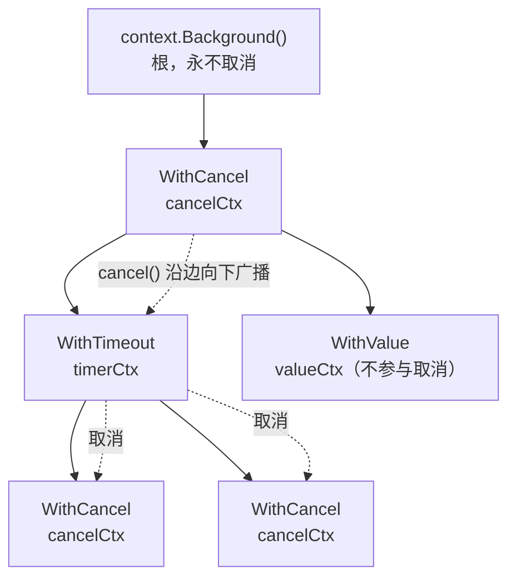

# 11.8 上下文

一个进入服务器的请求，往往不会只在一个 goroutine 里走完。它会扇出（fan-out）成一棵
goroutine 树：查数据库的、调下游 RPC 的、读缓存的，各自再派生出更小的工作。一旦请求的发起方
不再需要结果，比如客户端断开了连接，或上游已超时，这整棵树上仍在运行的工作就成了纯粹的浪费，
占着连接、锁与内存，却没有人会去读它们的产出。于是问题变成：**怎样把「到此为止」这个信号，
从树根一路传播到每一片叶子，让它们各自停下来。**

`context` 包就是 Go 对这个问题给出的标准答案。它把取消、截止时间与请求范围内的元数据，
沿着调用链显式传递，使一棵 goroutine 树可以被统一地取消。本节先说清它为什么是协作式而非
强制式的，再沿取消树的结构走一遍实现，最后把它放进结构化并发与跨语言的谱系里来看。

## 11.8.1 为什么取消是信号，而非强制

最朴素的想法，是给 goroutine 一个「杀掉它」的 API。Go 偏偏没有这样的 API，这不是疏漏，
而是从前人的教训里学来的设计。

Java 早年提供过 `Thread.stop()`，能从外部强行终止一个线程。它在 JDK 1.2 就被废弃，原因写在
官方的废弃说明里：被停止的线程会立刻抛出 `ThreadDeath`，并**释放它当时持有的所有监视器锁**。
锁是用来保护一段不变式的，持锁线程被半路打断、锁却被放开，意味着其他线程会看到一个处于
中间状态、不变式被破坏的共享对象，而且毫无征兆。后来的 JDK 干脆让 `Thread.stop()`
直接抛 `UnsupportedOperationException`，把这扇门彻底关上。强制终止之所以危险，根子在于
外部无从知道目标此刻是否正处在某个不可被打断的临界区里。

Go 由此选择了相反的路：运行时不提供「杀死一个 goroutine」的手段，取消是一个
**信号**，由 goroutine 自己在安全的检查点去查看、再自行决定如何收尾。撤销、回滚、释放资源，
这些只有代码自己知道怎么做对，于是就交还给代码自己做。

在有 `context` 之前，这个信号可以用一个 channel 手写出来。关闭一个 channel 会唤醒所有在它上面
等待的接收者（[10.4](../ch10chan/readme.md)），这正是「广播一次取消」的天然载体：

```go
cancel := make(chan struct{})

go func() {
	done := make(chan struct{}, 1)
	go func() {
		defer func() { done <- struct{}{} }()
		do() // 执行需要执行的操作
	}()
	select {
	case <-cancel:
		// 提前被取消：等已启动的工作收尾，再撤销其副作用
		<-done
		undo()
	case <-done:
		// 顺利结束
	}
}()

// 出于某些原因希望取消
close(cancel)
```

这段代码已经含着 `context` 的全部要点：取消方只负责发信号（`close(cancel)`），被取消方在
`select` 里把取消信号与正常完成并列等待，收到信号后在自己选定的安全点收尾。`context` 做的，
是把这套手写模式抽象成一个接口，并解决一个手写版没有解决的问题：当工作扇出成一棵树时，
如何让一次取消沿树**自动**传播到每一个后代。

## 11.8.2 取消树

`context` 的接口很小，取消相关的只有两个方法：

```go
type Context interface {
	Deadline() (deadline time.Time, ok bool) // 截止时间，没有则 ok==false
	Done() <-chan struct{}                    // 取消时被关闭的 channel
	Err() error                               // Done 关闭后返回取消原因
	Value(key any) any                        // 取请求范围内的值（见 11.8.6）
}
```

`Done()` 返回的 channel 是整套机制的枢纽：它**不携带数据，只用关闭这一个动作来广播取消**。
使用方的标准写法，就是把它放进 `select`，与自己的正常工作并列：

```go
select {
case <-ctx.Done():
	return ctx.Err() // 上游已取消，停下手里的活并报告原因
case res := <-work:
	// 正常拿到结果
}
```

所有 `context` 都派生自一个根。`context.Background()` 是这棵树的根，永不取消；
`WithCancel`、`WithTimeout`、`WithDeadline`、`WithValue` 各自接受一个父 `context`，
返回一个派生的子 `context`。取消能力由内部的 `cancelCtx` 承载，它的速写如下：

```go
// cancelCtx：可被取消的 context（裁剪后的速写）
type cancelCtx struct {
	Context                       // 嵌入父 context

	mu       sync.Mutex           // 保护以下字段
	done     atomic.Value         // chan struct{}，惰性创建，首次 cancel 时关闭
	children map[canceler]struct{} // 后代集合，首次 cancel 后置 nil
	err      atomic.Value         // 取消原因，首次 cancel 时写入
	cause    error                // 更细的取消原因（见 11.8.4）
}
```

几处设计值得点出。`done` 是**惰性创建**的：只有当真有人调用 `Done()` 去等待时，才分配那个
channel；从不监听取消的 context 因此一分钱 channel 都不花。`err` 与 `done` 都用 `atomic.Value`
存放，使得 `Err()` 这类高频查询可以走一次原子读、绕开互斥锁，源码注释说这「在紧凑的循环里
快约 5 倍」。

取消本身是一次自顶向下的递归。`cancel` 在锁内做三件事：关闭自己的 `done` channel
（广播给所有在此等待的 goroutine），然后遍历 `children` 逐个调用它们的 `cancel`，最后把
`children` 置 `nil`。一次根上的取消，就这样沿树扩散到每一个后代：

```go
func (c *cancelCtx) cancel(removeFromParent bool, err, cause error) {
	c.mu.Lock()
	if c.err.Load() != nil {
		c.mu.Unlock()
		return // 已被取消过，幂等返回
	}
	c.err.Store(err)
	c.cause = cause
	d, _ := c.done.Load().(chan struct{})
	if d == nil {
		c.done.Store(closedchan) // 还没人 Done()，存一个已关闭的哨兵
	} else {
		close(d)                 // 广播取消
	}
	for child := range c.children {
		child.cancel(false, err, cause) // 递归取消后代
	}
	c.children = nil
	c.mu.Unlock()
	if removeFromParent {
		removeChild(c.Context, c) // 把自己从父的 children 里摘除，防泄漏
	}
}
```

子如何挂到父上，由 `propagateCancel` 安排，它要应对父 context 的不同形态：



最值得讲的是最后那条分支。当父是用户自定义的、并非标准库 `*cancelCtx` 的 `Context` 时，
`children` 这张表挂不上，`propagateCancel` 便退而起一个 goroutine，在里面 `select` 同时等
`parent.Done()` 与 `child.Done()`：父先取消就把取消转发给子，子先结束就让这个 goroutine
自己退出。这条「监视 goroutine」的兜底，是许多讲解会漏掉的一处，却正是它让取消传播对**任意**
实现了 `Context` 接口的父都成立，而其底座，依旧是 [10.4](../ch10chan/readme.md) 那个
「关闭 channel 即广播」的惯用法。

整棵树的形态因此清楚了：



取消沿父到子的边单向向下流：取消一个节点，它与它的整棵子树都被取消，而它的父与兄弟不受影响。

## 11.8.3 截止时间：会自动取消的定时器

超时与截止时间，本质上是「到点自动触发的取消」。`WithDeadline` 返回的 `timerCtx`
在 `cancelCtx` 之上只多了一个定时器：

```go
// timerCtx：带截止时间的 context（速写）
type timerCtx struct {
	cancelCtx               // 复用 Done/Err/children 的全套取消机制
	timer    *time.Timer    // 到点触发 cancel 的定时器
	deadline time.Time
}
```

`WithDeadline` 用 `time.AfterFunc`（[9.10](../ch09sched/timer.md)）注册一个回调，到点时以
`DeadlineExceeded` 为原因调用 `cancel`。`WithTimeout(parent, d)` 不过是
`WithDeadline(parent, time.Now().Add(d))` 的薄封装。这里还藏着一处合理的优化：若父的截止时间
本就比要设的更早，`WithDeadline` 直接退化成 `WithCancel`，因为父到点会先把子一并取消，
再单独为子装一个定时器是多余的。

无论取消是手动触发还是定时触发，每个 `WithCancel` / `WithTimeout` 都返回一个 `cancel` 函数，
**调用方有义务调用它**，哪怕工作已经正常结束。原因有二：对 `cancelCtx`，`cancel` 会把自己从父的
`children` 表里摘除，不调用它，这个子节点就一直挂在父上，直到父被取消才释放，在长生命周期的
父之下这就是一处内存泄漏；对 `timerCtx`，`cancel` 还会 `Stop` 那个定时器，及时归还其资源。
惯用写法是 `defer cancel()`，`go vet` 也会在控制流的某条路径上漏掉 `cancel` 时报警。

## 11.8.4 Go 1.21 的三个补充

Go 1.21 给 `context` 添了三件长期被社区呼唤的工具，填补了原有抽象的几处缺口。

`AfterFunc(ctx, f)` 注册一个回调：当 `ctx` 被取消（或超时）时，在一个新 goroutine 里运行 `f`。
它把「监听 `Done()` 再做收尾」这件反复要手写的事收进了标准库，免去为每个清理任务都起一个
专门 `select` 的 goroutine。它返回一个 `stop` 函数，用 `sync.Once` 保证 `f` 与 `stop` 至多
生效其一，避免重复触发。

`WithoutCancel(parent)` 派生一个**切断取消链、却保留值链**的 context。它的 `Done()` 返回 `nil`、
`Err()` 恒为 `nil`，但 `Value` 仍透传给父。典型用途是：请求已结束，却要在请求范围的元数据
（如追踪 ID）之下，发起一个不应随请求一起被取消的收尾任务，比如异步写审计日志。

`WithDeadlineCause` / `WithTimeoutCause` 与配套的 `Cause(ctx)`，则解决了原有 `Err()`
只能区分「被取消」与「超时」两种笼统结果的问题。它们允许在超时发生时附上一个具体的
**原因**错误，`Cause(ctx)` 把它取回，让上层日志能说清「为什么取消」，而不止于
`context deadline exceeded`。

## 11.8.5 结构化并发：把它放进谱系

`context` 解决的是「取消如何沿一棵 goroutine 树传播」，但它并不约束这棵树的**形状**：
`go` 一出，新 goroutine 的生命周期就脱离了启动它的代码，没有谁强制它在某个范围结束前
必须终止。Nathaniel Smith 在 2018 年的文章《Notes on structured concurrency, or:
Go statement considered harmful》里把这点讲透了：裸 `go`（以及别处的 `spawn`）
之于并发，正如 `goto` 之于控制流，它让并发的生命周期不再嵌套，于是无从在词法范围上推理
「这段代码启动的所有工作，在它返回时是否都已了结」。

他给出的药方是**结构化并发**：让并发也服从词法的块结构，一个作用域内启动的所有任务，
必须在该作用域退出前全部结束。他的 Trio 库用 nursery（保育箱）实现：任务只能在一个 nursery
里派生，nursery 所在的块不退出，就一直等到箱内所有任务结束；任一任务出错，则取消箱内其余
任务并把错误向外抛。这套思路随后影响了多门语言：

| 系统 | 结构化并发 | 取消机制 |
| --- | --- | --- |
| Python Trio / asyncio | nursery / TaskGroup | `Cancelled` 异常注入 |
| Kotlin 协程 | `coroutineScope` 作用域 | `Job` 树，取消沿作用域传播 |
| Java（JDK 21+，预览） | `StructuredTaskScope` | 作用域关闭即取消未完成子任务 |
| .NET | 约定 + 编译器协助 | `CancellationToken` 显式传递 |
| Go | 无语言级原语，靠库逼近 | `context` + `errgroup` |

几处对照值得玩味。Kotlin 的 `Job` 构成一棵与 `context` 几乎同构的取消树，取消沿作用域父子
关系传播；Java 的 `StructuredTaskScope`（经多轮 JEP 预览，至 JDK 25 仍为预览特性）让
作用域关闭时自动取消未完成的子任务，把 nursery 直接做进了标准库；.NET 的
`CancellationToken` 与 Go 的 `context` 最为神似，同样是显式传一个取消令牌、由被调方协作检查，
区别在 .NET 用 `OperationCanceledException` 异常来传递取消，Go 则只给一个要你主动去 `select`
的 channel。

Go 在语言层没有引进 nursery，而是用 `golang.org/x/sync/errgroup` 在库一层逼近它：
`errgroup.WithContext` 返回一个组与一个派生 `context`，组内任一 goroutine 返回错误，便取消
这个 `context`，从而通知其余 goroutine 停下，`g.Wait()` 则阻塞到全组结束。这给了「同进同出、
一损俱损」的近似，但终究是约定而非强制，编译器不会拦住你在 `errgroup` 之外再裸 `go` 一个
逃逸出作用域的 goroutine。这正是 Go 当前的取舍：把结构化并发留在库与规范层，而非铸进语言。

## 11.8.6 值传递的争议与显式传参之辩

`Context` 的 `Value` 方法是另一处长期有争议的设计。`valueCtx` 极简：

```go
type valueCtx struct {
	Context     // 父
	key, val any
}
```

它的 `Value(key)` 命中自己这个 key 就返回，否则沿父链上溯，于是一次取值是 $O(d)$ 的链表查找，
$d$ 为派生深度。这决定了它**只适合放浅而少的请求范围数据**，如追踪 ID、认证主体，
而非当作随手可塞的全局字典。

更深的争议在于「什么该用 `Value` 传」。官方文档划下的线是：仅用于**跨越 API 与进程边界的、
请求范围内的数据**，不要拿它传函数的可选参数。Dave Cheney 在《Context isn't for cancellation》
里更进一步，主张连取消之外的值传递本身都值得怀疑，因为 `Value` 是动态类型、键值皆 `any`，
绕过了编译期检查，把本该显式声明的依赖藏进了一个不透明的口袋，调用方无从知道一个函数究竟
依赖 `context` 里的哪些键。

而 `context` 最受质疑的，是「每个函数的第一个参数都得显式带上 `ctx`」这一约定本身。
《Context should go away for Go 2》一文代表了反对的一方：取消与超时是几乎无处不在的横切
关注点，却要靠一个手动层层透传的参数来表达，污染了几乎所有函数签名，也极易在某一层被遗忘
传递而悄悄断链。支持的一方则认为，显式恰是 Go 的取舍：取消能力出现在签名里、由 `go vet`
静态检查传播，胜过藏进某个隐式的线程局部存储而无从追溯。这场争论至今没有定论，`context`
的显式传参，是 Go 在「简单可见」与「签名整洁」之间，又一次倒向了前者。

## 延伸阅读的文献

1. The Go Authors. *Package context.* https://pkg.go.dev/context ；源码见
   `src/context/context.go`（本节对照 Go 1.26）。
2. Sameer Ajmani. *Go Concurrency Patterns: Context.* The Go Blog, 2014.
   https://go.dev/blog/context
3. Nathaniel J. Smith. *Notes on structured concurrency, or: Go statement considered harmful.*
   2018. https://vorpus.org/blog/notes-on-structured-concurrency-or-go-statement-considered-harmful/
4. Oracle. *Java Thread Primitive Deprecation*（`Thread.stop` 为何被废弃）。
   https://docs.oracle.com/en/java/javase/21/docs/api/java.base/java/lang/doc-files/threadPrimitiveDeprecation.html
5. JEP 505: *Structured Concurrency*（`StructuredTaskScope`，JDK 25 第五次预览）。
   https://openjdk.org/jeps/505
6. Dave Cheney. *Context isn't for cancellation.* 2017.
   https://dave.cheney.net/2017/08/20/context-isnt-for-cancellation
7. Michael Hudson-Doyle. *Context should go away for Go 2.* faiface, 2017.
   https://faiface.github.io/post/context-should-go-away-go2/
8. Gustavo Niemeyer. *Death of goroutines under control*（tomb，协作式取消的早期实践）。
   2011. https://blog.labix.org/2011/10/09/death-of-goroutines-under-control ；
   配套库 `gopkg.in/tomb.v2`。
9. Go proposal #14660（*context: new package for standard library*，`context` 进入标准库的
   原始提案，https://github.com/golang/go/issues/14660）；proposal #56661
   （*context.AfterFunc / WithoutCancel / WithDeadlineCause*，Go 1.21）。
   本书 [10.4 关闭](../ch10chan/readme.md)、[9.10 计时器](../ch09sched/timer.md)、
   [11.9 内存一致模型](./mem.md)。
