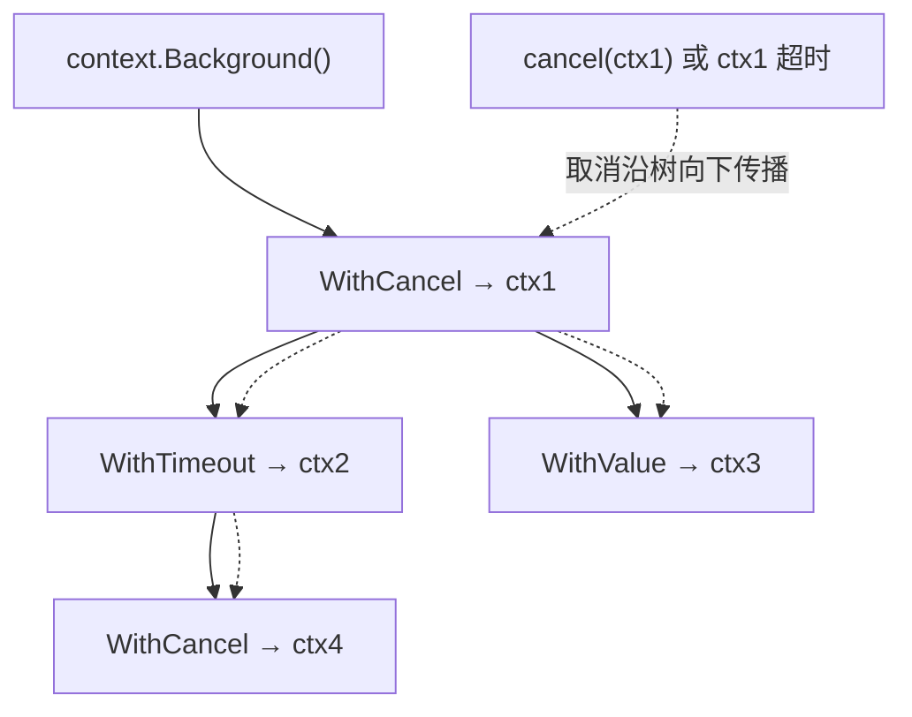

# 11.8 上下文

一个请求进来，往往会扇出成一棵 goroutine 调用树：处理函数调数据库、发 RPC、查缓存，每一步
可能又起若干 goroutine。当请求被取消、超时，或上游放弃等待时，这一整棵树都该尽快停下来，
别再白白占用资源。`context.Context` 就是在这棵树上**传播取消信号与截止时间**的标准方式。

## 11.8.1 一棵可被取消的树

context 通过包装层层派生：从根 `context.Background()` 出发，每次 `WithCancel`、`WithTimeout`、
`WithValue` 都生出一个子 context，挂在父 context 之下，形成一棵树。

```go
ctx, cancel := context.WithTimeout(parent, 2*time.Second)
defer cancel() // 务必调用，否则与之关联的计时器与子节点会泄漏

go worker(ctx) // 子 goroutine 携带 ctx 一起向下传
```



取消是**向下传播**的：取消任一节点，它的整棵子树都被取消。机制上，每个 context 暴露一个
`Done()` channel，取消时这个 channel 被关闭，从而**广播**给所有在 `select` 里监听它的 goroutine
（这正是 [11.4](./cond.md) 提到的「用关闭 channel 做广播」的典型应用）。下游代码的标准写法是：

```go
select {
case <-ctx.Done():
    return ctx.Err()   // 被取消或超时
case res := <-work:
    return res
}
```

超时与定时取消，本质上就是挂一个到期后自动调用 `cancel` 的计时器（[9.10](../ch09sched/timer.md)），
因此 `WithTimeout` 在不再需要时必须 `cancel`，否则计时器与子节点不会被及时回收。Go 1.21 还
新增了 `context.AfterFunc`，在 context 取消时自动跑一个回调，省去手写监听 `Done()` 的样板。

## 11.8.2 值传递的争议

`WithValue` 允许把请求范围的数据（如 trace ID、鉴权信息）挂在 context 上随调用链传递。它方便，
但也一直有争议：它实质上是一个类型不安全的隐式参数通道（键值都是 `any`），用多了会让数据流向
变得隐晦、难以追踪。社区与官方的共识是：context 的值**只该装请求范围的元数据，不该装本应
作为显式函数参数传入的业务数据**。这是一处「便利」与「清晰」之间的取舍，用错了会侵蚀代码的
可读性。

## 11.8.3 设计取舍

context 把「取消、超时、请求元数据」三件事统一进一个沿调用链显式传递的对象，代价是几乎每个
涉及 I/O 或并发的函数都要多带一个 `ctx context.Context` 首参数。这种「显式但啰嗦」的设计，是
Go 一贯偏好的：宁可让传播路径明明白白写在签名里，也不藏进某个隐式的线程本地存储。它与
[9 调度器](../ch09sched) 把复杂性显式化、与 [11.9](./mem.md) 拒绝未定义行为，是同一种价值观
的不同侧面。

## 延伸阅读的文献

1. The Go Authors. *context 包文档.* https://pkg.go.dev/context
2. Sameer Ajmani. *Go Concurrency Patterns: Context.* Go 博客, 2014.
   https://go.dev/blog/context
3. Go 1.21 Release Notes（context.AfterFunc / WithoutCancel / WithDeadlineCause）.
   https://go.dev/doc/go1.21

## 许可

&copy; 2018-2026 The [golang.design](https://golang.design) Initiative Authors. Licensed under [CC-BY-NC-ND 4.0](https://creativecommons.org/licenses/by-nc-nd/4.0/).
