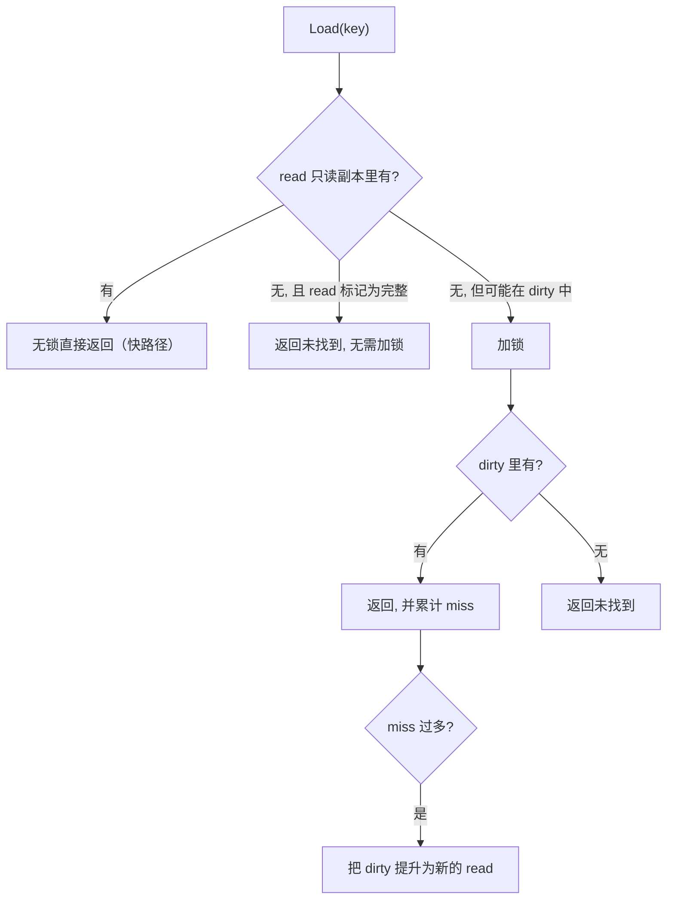

# 11.7 并发安全散列表

Go 内置的 `map` 不是并发安全的，并发读写会被运行时直接检测并 panic。最朴素的补救是 `map` 加一把
`sync.RWMutex`,多数场景已够用。但在**读极多、写极少**或**各 goroutine 访问的键基本不相交**的
场景下，那把锁会成为瓶颈。`sync.Map` 就是为这两类场景准备的。要理解它，先看看"并发散列表"
这一问题的解法谱系。

## 11.7.1 并发散列表的解法谱系

一把全局锁保护整张表，简单但所有操作串行化。第一种改进是**锁分段 / 锁条带化**（lock striping）：
把表切成若干段，每段一把锁，不同段的操作可并行,Java 早期的 `ConcurrentHashMap` 即用此法
（默认 16 段），后来（Java 8）改为按桶（bin）粒度加锁、并对长链转红黑树。第二种方向是**无锁
散列表**：Cliff Click 的 NonBlockingHashMap 用 CAS 与状态机实现无锁的开放寻址表。第三种是
**持久化 / 函数式**结构：HAMT（哈希数组映射字典树，Bagwell 2001）把键的哈希分段索引一棵浅而宽
的字典树，是 Clojure/Scala 不可变 map 的基础;其并发变体 **CTrie**（Prokopec 等人，2012）支持
无锁的、线性一致的插入删除与 $O(1)$ 快照。

记住这三条线（分段锁、无锁开放寻址、字典树），下面 `sync.Map` 的两代实现正好落在其中。

## 11.7.2 read / dirty 双副本：让读不加锁

经典 `sync.Map` 的核心思想，是把一张表拆成两份：一份**只读副本 `read`**，一份**可写副本
`dirty`**。

```go
type Map struct {
    mu     Mutex            // 只保护 dirty 相关操作
    read   atomic.Pointer   // 只读副本，读取它无需加锁
    dirty  map[any]*entry   // 可写副本，访问它需要持有 mu
    misses int              // read 未命中而落到 dirty 的次数
}
```

读取走 `read`：它通过原子指针访问，**完全无锁**。只有当某个键不在 `read`、且可能在 `dirty` 里
时，才加锁去查 `dirty`。



每次读 `read` 落空、转查 `dirty`，都累计一次 `misses`；当 `misses` 多到一定程度，说明 `read`
太旧，便把整个 `dirty` 提升为新的 `read`，让后续读重回无锁快路径。这套"无锁读 + 偶尔加锁补救 +
周期性提升"把读多写少场景下的锁争用降到最低。删除用惰性标记（把 entry 标为已删而非立刻摘除），
同样为了让读尽量无锁。它在谱系里属于"快照式只读 + 锁保护写"的混合，不是分段锁也不是真无锁。

## 11.7.3 Go 1.24 的重新实现

read/dirty 设计对"读多写少"很有效，但对写较多、或键集不断变化的场景并不友好：频繁写不断使
`read` 失效、触发昂贵的提升。Go 1.24 用一种**并发哈希字典树（HashTrieMap）**重新实现了
`sync.Map`,正是 11.7.1 那条"字典树"线（CTrie 一脉）的落地，在更广的工作负载下都保持良好
扩展性，而对外接口与语义不变。这是一次"接口不动、内里换骨"的演进：用户代码无需改动，就享受
到更好的并发表现。从分段快照到并发字典树，`sync.Map` 自身的演进，恰好走过了并发散列表谱系的
两个台阶。

## 11.7.4 该不该用

`sync.Map` 不是"更快的 map"，它有明确的适用面。官方文档建议两种情形优先考虑它：一是某个键
**写入一次、读取多次**（近似只增的缓存）;二是多个 goroutine 读写**互不相交的键集**。除此之外，
一把 `RWMutex` 配普通 `map` 往往更简单、也更快，而且普通 `map` 还有类型安全的好处
（`sync.Map` 的键值都是 `any`，需类型断言）。选择哪一个，仍回到那条老原则：先看清你的读写模式，
再挑工具。

## 延伸阅读的文献

1. Phil Bagwell. "Ideal Hash Trees." EPFL Technical Report, 2001.
   https://lampwww.epfl.ch/papers/idealhashtrees.pdf （HAMT）
2. Aleksandar Prokopec, Nathan G. Bronson, Phil Bagwell, Martin Odersky. "Concurrent
   Tries with Efficient Non-Blocking Snapshots." *PPoPP 2012*.
   https://doi.org/10.1145/2145816.2145836 （CTrie，HashTrieMap 的理论近亲）
3. Doug Lea. *Java ConcurrentHashMap*（锁分段 / 按桶加锁）.
   https://docs.oracle.com/javase/8/docs/api/java/util/concurrent/ConcurrentHashMap.html
4. The Go Authors. *sync.Map 文档.* https://pkg.go.dev/sync#Map ；
   Go 1.24 Release Notes（基于 HashTrieMap 的重新实现）. https://go.dev/doc/go1.24

## 许可

&copy; 2018-2026 The [golang.design](https://golang.design) Initiative Authors. Licensed under [CC-BY-NC-ND 4.0](https://creativecommons.org/licenses/by-nc-nd/4.0/).
