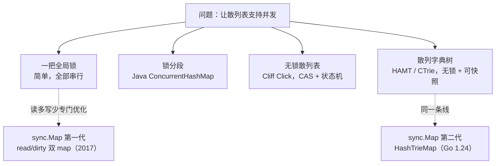
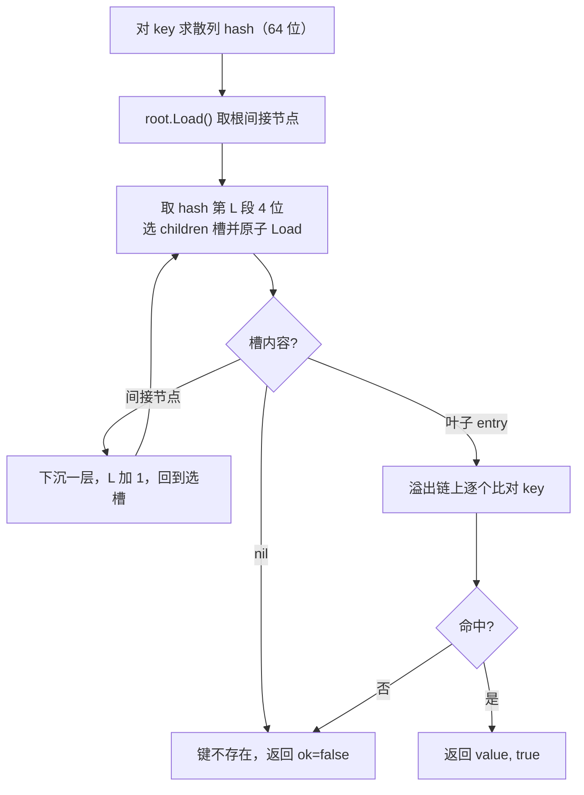

# 11.7 并发安全散列表

> `sync.Map` 在 Go 1.24 经历了一次彻底的内部重写：原先的
> read/dirty 双 map 设计被换成一个并发散列字典树（hash-trie）。本节先把这两代设计
> 各自的来由讲清楚，再把它们放回并发散列表的解法谱系里。

语言内建的 `map` 不是并发安全的。多个 Goroutine 在没有同步的前提下同时读写同一个 `map`，
运行时会主动探测到并发访问并以 `fatal error: concurrent map read and map write` 终止进程
（[5.2](../../part2lang/ch05data/map.md) 介绍过这个检测机制，它是不可恢复的，`recover`
拦不住）。对可用性有要求的服务，这是一处必须正面回答的设计问题：当多个 Goroutine 要共享
一张表，应当用什么结构。

最朴素的答案是给一张普通 `map` 套一把锁：

```go
// 一张普通 map 加一把读写锁，是最直接、也最常够用的并发安全表
type RWMutexMap struct {
	mu   sync.RWMutex
	data map[any]any
}

func (m *RWMutexMap) Load(k any) (v any, ok bool) {
	m.mu.RLock()
	v, ok = m.data[k]
	m.mu.RUnlock()
	return
}

func (m *RWMutexMap) Store(k, v any) {
	m.mu.Lock()
	m.data[k] = v
	m.mu.Unlock()
}
```

这套写法简单、类型安全（键值类型由你自己定），在多数场景下也足够快。它的瓶颈只在一处：
所有读都要竞争同一把锁。`RWMutex` 允许多个读者并发持锁，但持锁本身要更新读者计数，这是一次
对共享缓存行的原子写，核数一多就成为争用点（[11.2](./mutex.md) 讲过这件事）。`sync.Map`
要解决的，正是这个「读多到锁本身都嫌贵」的场景。在看它怎么做之前，先把整张解法地图铺开。

## 11.7.1 并发散列表的解法谱系

让一张散列表支持并发，业界积累了一条从粗到精的谱系，理解它能让我们看清 `sync.Map` 两代设计
各自站在哪里。

**一把全局锁。** 上面的 `RWMutexMap` 即是。正确、简单，但所有操作串行化在一把锁上，
是扩展性的下限。

**锁分段（lock striping）。** 把表切成若干段，每段一把锁，键按散列值落到某一段，操作只锁
所在段。$S$ 个段理论上把锁争用降低 $S$ 倍。Doug Lea 为 Java 写的 `ConcurrentHashMap`
（JDK 1.5，2004）是这一思路的经典实现，早期默认 16 段。代价是段粒度固定：段太少仍争用，
段太多则浪费内存且全表操作（如 `size`、`resize`）变复杂。JDK 8 进一步把段锁细化到桶级别，
读路径做到无锁（依赖 `volatile` 数组项），写路径在桶头上用 CAS 或 `synchronized`。

**无锁散列表。** Cliff Click 的 lock-free hash table（2007）更进一步，用一组状态机与 CAS
完成插入、扩容与迁移，读写全程不加锁，扩容期间新旧表并存、读写协助搬迁。它把扩展性推到极致，
代价是实现极其精巧、难以验证，且对内存模型的依赖很重。

**散列字典树与可快照的并发结构。** 另一条线索来自函数式数据结构。Phil Bagwell 2001 年提出
*Hash Array Mapped Trie*（HAMT）：把键的散列值按每 $b$ 位切片，逐层索引一棵分支因子为
$2^b$ 的字典树，叶子存键值。它天然支持结构共享，是 Scala、Clojure 不可变 map 的底层。
Aleksandar Prokopec 等人 2012 年在此之上提出 *CTrie*（concurrent trie），用一个间接节点
（I-node）作为 CAS 的稳定锚点，使插入、删除全程无锁，并支持 $O(1)$ 的无锁、线性一致快照
（这是它相对其他并发表最独特的能力）。`sync.Map` 在 Go 1.24 的新实现，正属于这条线。



`sync.Map` 的两代实现并不在谱系上孤立，它们分别从「读多写少的特化」与「散列字典树」两个方向
落地。下面依次拆解。

## 11.7.2 第一代：read/dirty 双 map 的设计

`sync.Map` 自 2017 年（Go 1.9）引入，文档开宗明义地圈定了它擅长的两类场景，至今未变：

1. **写一次、读多次**，键一旦写入就基本只读，类似只增不减的缓存；
2. **多个 Goroutine 读写互不相交的键集**，各自操作各自的键。

这两类场景的共同点是：稳定状态下，绝大多数操作要么是读，要么命中的键早已存在。第一代设计
据此立下一个核心赌注，把已稳定的键放进一张只读、可无锁访问的表，让热路径彻底绕开锁。

为此 `Map` 维护两张表，一张原子可读的 `read` 与一张受锁保护的 `dirty`，裁剪后的速写：

```go
// sync.Map 第一代（Go 1.9-1.23）：read/dirty 双 map（速写）
type Map struct {
	mu Mutex

	// read 是可无锁读的那一半。它是一个原子加载的只读快照，
	// load 永远不需要 mu；只有把 dirty 提升上来时才整体替换它。
	read atomic.Pointer[readOnly]

	// dirty 是受 mu 保护的那一半，持有最新的全部键，
	// 也是新键唯一的落点。
	dirty map[any]*entry

	// misses 记录 read 没命中、被迫加锁查 dirty 的次数。
	// 累积到一定阈值就把 dirty 整体提升为 read。
	misses int
}

type readOnly struct {
	m       map[any]*entry
	amended bool // dirty 里有 read 没有的键时为 true
}
```

关键不在两张 `map`，而在它们存的是 `*entry`，一个指向值的指针的指针。`read` 与 `dirty`
对同一个键持有的是**同一个 `entry` 指针**，于是「更新一个已存在键的值」退化成对 `entry` 内部
那个原子指针做一次 CAS，两张表自动看到同一份新值，无需任何同步：

```go
// entry 是键对应的槽。值通过原子指针更新，避免锁。
type entry struct {
	// p 指向实际的值。三种状态：
	//   正常指针  -> 有效值
	//   nil      -> 已删除，但 dirty 仍可能保留此 entry
	//   expunged -> 已删除，且 dirty 不再持有此 entry
	p atomic.Pointer[any]
}
```

**无锁读路径。** `Load` 先原子加载 `read`，命中就直接返回，整条路径没有锁：

```go
func (m *Map) Load(key any) (value any, ok bool) {
	read := m.loadReadOnly()      // 原子加载只读快照
	e, ok := read.m[key]
	if !ok && read.amended {      // read 没有、dirty 可能有
		m.mu.Lock()
		read = m.loadReadOnly()   // 加锁后再查一次，避免与提升竞争
		e, ok = read.m[key]
		if !ok && read.amended {
			e, ok = m.dirty[key]
			m.missLocked()        // 记一次 miss，可能触发提升
		}
		m.mu.Unlock()
	}
	if !ok {
		return nil, false
	}
	return e.load()
}
```

**misses 计数与提升。** 只有当一个键在 `read` 里查不到时，才退化到加锁查 `dirty`。
每发生一次这样的慢路径就记一次 miss；一旦 miss 累积到 `len(dirty)`，意味着「重建 read 的成本
已经被慢路径摊销掉了」，便把整张 `dirty` 原子提升为新的 `read`，并清空 `dirty`、归零计数：

```go
func (m *Map) missLocked() {
	m.misses++
	if m.misses < len(m.dirty) {
		return
	}
	m.read.Store(&readOnly{m: m.dirty}) // dirty 整体上位为新的只读快照
	m.dirty = nil
	m.misses = 0
}
```

这套提升机制把「读到一个新写入的键起初要加锁」摊平成均摊无锁。新键先只进 `dirty`，经若干次
慢路径访问后提升进 `read`，此后对它的读便都走无锁快路径。第一类场景（写一次读多次）于是收敛
到几乎全无锁读；第二类场景（互不相交的键集）则因各 Goroutine 很少互相 miss，也很少争锁。

**惰性删除。** 删除不立刻从 `read` 移除键，只把 `entry.p` 原子置为 `nil`，被置 `nil` 的
`entry` 仍留在 `read` 里。留待下一次 `dirty` 重建时，若届时 `dirty` 已新建，就把这些 `nil`
进一步 CAS 成 `expunged` 并不再复制进新 `dirty`，物理删除推迟到此刻。`nil`/`expunged` 两态
区分「删了但 read 还认得」与「删了且 dirty 已弃」，让删除也尽量留在无锁的 `entry` 操作上。

第一代的整张哲学，是用空间（两份 `map`）和一点延迟（新键要被读若干次才提升）换读路径的无锁。
它对自己声明的两类场景确实漂亮，但代价也写在设计里。

## 11.7.3 第一代的退化：为何要重写

read/dirty 的均摊无锁，前提是「键集趋于稳定」。一旦工作负载偏离声明的两类场景，它会显著退化：

- **写密集或键频繁增删（churn）。** 每写入一个 `read` 里没有的新键都要加锁，miss 累积到阈值
  又要把整张 `dirty` 复制一遍重建。键集不断变动时，$O(n)$ 的整表复制成了常态开销。
- **内存放大。** 稳定状态下同一份键在 `read` 与 `dirty` 各存一份指针，删除又靠惰性回收，
  内存占用接近两倍。
- **锁的粒度仍是全局。** 慢路径上只有一把 `mu`，churn 让慢路径变频繁后，所有写重新挤回这把锁，
  分段、无锁谱系上的扩展性收益一概享受不到。

`unique` 包（Go 1.23 引入的值规范化设施）把这些短板放大到无法接受：它的内部表是写密集、
键不断进出的，正是 read/dirty 最差的负载。社区为此先在 `internal/concurrent` 落地了一个
并发散列字典树，随后顺势用它重写了 `sync.Map`。Go 1.24（2025 年初）起，`sync.Map` 不再有
read/dirty，它的实现只剩薄薄一层，把全部工作转交给 `internal/sync.HashTrieMap`：

```go
// Go 1.24 起的 sync.Map：API 不变，实现整体换成 HashTrieMap
type Map struct {
	_ noCopy
	m isync.HashTrieMap[any, any]
}

func (m *Map) Load(key any) (any, bool) { return m.m.Load(key) }
func (m *Map) Store(key, value any)     { m.m.Store(key, value) }
```

公开 API 一字未改，这次重写对用户完全透明：换掉的只是「同一份契约如何兑现」。

## 11.7.4 第二代：HashTrieMap

`HashTrieMap` 是 CTrie 那条线的工程化落地。它把键的 64 位散列值按每 4 位一段切片，逐层索引一棵
**分支因子为 16** 的字典树。每个内部节点（间接节点）有 16 个孩子槽，第 $L$ 层用散列值的第 $L$
段（4 位）选孩子，$64 / 4 = 16$ 层即可走完所有散列位。裁剪后的结构：

```go
const (
	nChildrenLog2 = 4
	nChildren     = 1 << nChildrenLog2 // 每个内部节点 16 个孩子，经测是 load 性能的甜点
	nChildrenMask = nChildren - 1
)

// 间接节点：字典树的内部节点
type indirect[K comparable, V any] struct {
	node[K, V]
	dead     atomic.Bool                          // 节点已被摘除，读者须重试
	mu       Mutex                                // 仅保护本节点 children 的变更
	parent   *indirect[K, V]
	children [nChildren]atomic.Pointer[node[K, V]] // 16 个原子孩子槽
}

// 叶子节点：键值对，溢出链处理散列冲突
type entry[K comparable, V any] struct {
	node[K, V]
	overflow atomic.Pointer[entry[K, V]] // 同槽冲突的键串成链
	key      K
	value    V
}
```

设计的支点是 `children` 数组里每个槽都是 `atomic.Pointer`。**读路径全程无锁**，从根开始，
每层取散列值的 4 位选一个孩子槽，原子加载该槽，是叶子就在溢出链上比对键并返回，是间接节点就
下沉一层：

```go
func (ht *HashTrieMap[K, V]) Load(key K) (value V, ok bool) {
	hash := ht.keyHash(/* key */)
	i := ht.root.Load()
	hashShift := 8 * goarch.PtrSize // 64
	for hashShift != 0 {
		hashShift -= nChildrenLog2          // 每层吃掉 4 位
		n := i.children[(hash>>hashShift)&nChildrenMask].Load() // 原子加载孩子槽
		if n == nil {
			return *new(V), false           // 槽空，键不存在
		}
		if n.isEntry {
			return n.entry().lookup(key)    // 到叶子，溢出链上比对键
		}
		i = n.indirect()                    // 下沉一层
	}
	panic("ran out of hash bits")
}
```

整条读路径只有原子加载，没有任何锁、没有 CAS、没有 miss 计数。对所有键一视同仁，不存在第一代
那种「新键要被读若干次才进无锁快路径」的预热期。



**写路径的锁是局部的。** `Store`、`LoadOrStore`、删除会锁住相关那个间接节点的 `mu`，
而非一把全局锁，不同子树上的写得以真正并行。这正是锁分段思想在字典树上的自然形态：段不再是
固定切分，而是随树的形状动态生长。删除一个键后若间接节点变空，会被标记 `dead` 并从父节点
摘除，读者撞上 `dead` 节点便重试，由此保持树的紧凑。散列冲突（同槽的不同键）落在叶子的
`overflow` 链上线性处理。

把它和第一代对照：read/dirty 用「整表复制 + 提升」换读的无锁，写密集时复制成本爆炸；
`HashTrieMap` 用「不可变路径 + 局部锁」换读的无锁，写只触及一条根到叶的路径与一个节点的锁，
天然随键集生长而分散。代价是单次读要走最多 16 层指针跳转，常数因子比一次 `map` 散列查找略高，
但省掉了第一代的预热、整表复制与内存翻倍。对 `unique` 那类写密集负载，这是决定性的改善；
对第一代擅长的读多写少负载，它也不输。

## 11.7.5 何时用 sync.Map，何时用 RWMutex + map

两代实现换了内里，官方给用户的指引始终如一：**多数代码应当用普通 `map` 配一把锁，而不是
`sync.Map`**。理由有两层。

其一是适用面。`sync.Map` 的优势集中在它声明的两类场景。落在其外、尤其读写均衡或需要频繁
全表操作的负载，`RWMutex + map` 往往更简单也不更慢。

其二是类型安全的代价，常被忽略。`sync.Map` 的键值是 `any`，每次存取都伴随装箱、拆箱与接口
断言，编译器无从为你检查键值类型；`RWMutex + map` 则可以是 `map[string]*Session` 这样静态
类型化的表，类型错误在编译期就被挡下。Go 1.18 的泛型并未改变 `sync.Map` 的公开签名（它仍是
`any`），享受不到 `HashTrieMap[K, V]` 内部那套泛型，类型安全的损失依旧存在。

把 `sync.Map` 当成为特定场景打磨的专用工具：确认负载落在它的两类用例里、且锁争用经实测确为
瓶颈时再用它，其余情况普通 `map` 加一把锁是更稳妥的默认选择。性能的提升从不白来，`sync.Map`
用类型安全和适用面的收窄，换来了那两类场景下的无锁读。

## 延伸阅读的文献

1. Phil Bagwell. *Ideal Hash Trees.* EPFL Technical Report, 2001.
   https://infoscience.epfl.ch/record/64398 （HAMT，散列字典树的源头）
2. Aleksandar Prokopec, Nathan G. Bronson, Phil Bagwell, Martin Odersky.
   *Concurrent Tries with Efficient Non-Blocking Snapshots.* PPoPP 2012.
   https://doi.org/10.1145/2145816.2145836 （CTrie，HashTrieMap 的直接思想来源）
3. Doug Lea. *Overview of package util.concurrent (ConcurrentHashMap).* 及 JSR-166。
   http://gee.cs.oswego.edu/dl/classes/EDU/oswego/cs/dl/util/concurrent/intro.html
   （锁分段并发散列表的经典实现）
4. Cliff Click. *A Lock-Free Hash Table.* Stanford EE380, 2007 年 2 月 21 日。
   https://web.stanford.edu/class/ee380/Abstracts/070221.html
5. The Go Authors. *sync.Map documentation.* https://pkg.go.dev/sync#Map
   （两类适用场景与内存模型保证的官方说明）
6. The Go Authors. *internal/sync/hashtriemap.go.* Go 源码树。
   https://github.com/golang/go/blob/master/src/internal/sync/hashtriemap.go
7. Go issue golang/go#21031（sync.Map 可扩展性的讨论）、#70683（unique 推动的重写），
   及 `HashTrieMap` 引入、`sync.Map` 改用其实现的相关提交。
8. 本书 [5.2 散列表](../../part2lang/ch05data/map.md)、[11.2 互斥锁](./mutex.md)、
   [12.2 分配器组件](../../part4memory/ch12alloc/component.md)（mcentral 的「为并发而重构数据
   结构」是同一类演进）。
