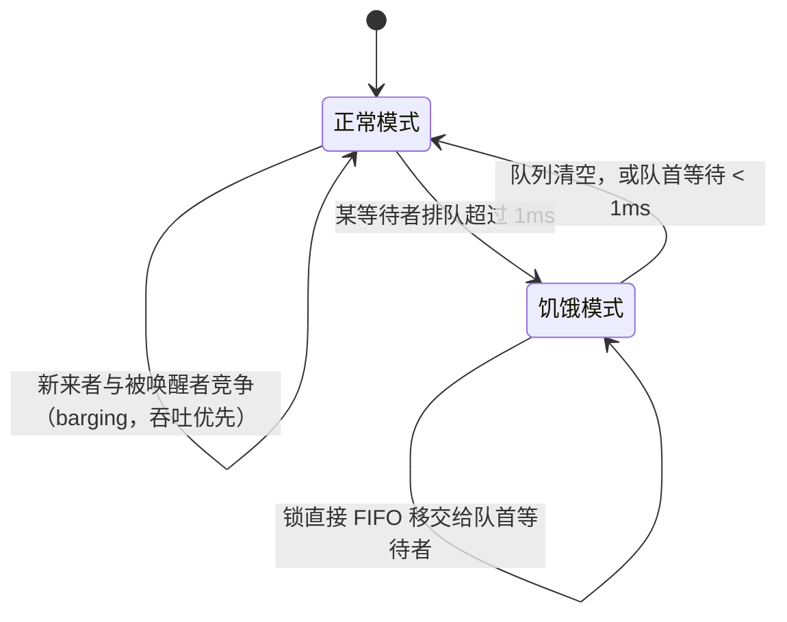

# 11.2 互斥锁

`sync.Mutex` 是最朴素的同步原语：同一时刻只让一个 goroutine 进入临界区。朴素的接口之下，
它要在两个互相拉扯的目标之间反复权衡：**吞吐**（让锁尽快被某人拿走、别让 CPU 闲着）与
**公平**（别让某个倒霉的等待者永远排不到队）。这一节就看 Go 的 mutex 如何在两者间走钢丝。

## 11.2.1 快路径：无竞争时几乎零成本

mutex 的核心是一个状态字 `state` 加一个信号量。`state` 用位域同时编码了几样信息：是否已上锁
（`mutexLocked`）、是否已有被唤醒的等待者（`mutexWoken`）、是否处于饥饿模式
（`mutexStarving`），以及等待者的数量（高位，`mutexWaiterShift`）。

```go
type Mutex struct {
    state int32  // 位域：bit0=已上锁, bit1=有被唤醒者, bit2=饥饿模式, 其余高位=等待者数
    sema  uint32 // 用于阻塞/唤醒等待者的信号量
}

const (
    mutexLocked      = 1 << 0
    mutexWoken       = 1 << 1
    mutexStarving    = 1 << 2
    mutexWaiterShift = 3
)
```

无人竞争时，上锁只是一次原子比较交换（CAS）：把 `state` 从 0 改成已上锁，成功即返回，
全程不进内核。

```go
func (m *Mutex) Lock() {
    // 快路径：未上锁时一次 CAS 拿下
    if atomic.CompareAndSwapInt32(&m.state, 0, mutexLocked) {
        return
    }
    m.lockSlow() // 失败说明有竞争，进入慢路径
}
```

这条快路径是 mutex 高频使用仍然轻快的关键，大多数加锁解锁都到此为止。只有 CAS 失败、
说明锁被占着，才落入下面复杂的慢路径 `lockSlow`。

## 11.2.2 慢路径：先自旋，再睡眠

竞争发生时，goroutine 不会立刻去睡。它先**自旋**几轮：在锁很可能马上就被释放的情况下，
空转一小会儿等它，比立刻陷入睡眠再被唤醒要划算（睡眠与唤醒都要与运行时打交道）。自旋有严格
条件（多核、自旋次数有限、锁未处于饥饿模式等），不满足就放弃自旋，把自己挂到信号量上睡去，
等待被解锁方唤醒。这是一处典型的「短等待自旋、长等待睡眠」的混合策略。

## 11.2.3 公平：正常模式与饥饿模式

mutex 最见功力的设计，是它的两种模式。



**正常模式**追求吞吐。等待者按 FIFO 排队，但一个刚被唤醒的等待者，并不能直接拿到锁，而要
和当下正在运行、也想加锁的**新来者**竞争。新来者有天然优势（它正在 CPU 上跑，无需唤醒开销），
于是常常「插队」抢到锁，这种 barging 减少了上下文切换、提升了吞吐。代价是：那个被唤醒却又
没抢过新来者的等待者，可能一次次落空，陷入饥饿。

为兜住这种尾延迟，Go 1.9 引入了**饥饿模式**。当某个等待者排队超过 **1ms**（`starvationThresholdNs`）
还没拿到锁，mutex 切换到饥饿模式：此后锁不再允许插队，而是在解锁时**直接 FIFO 移交**给队首
等待者，新来者连尝试自旋的机会都没有，老老实实排到队尾。等到队列排空、或队首等待者的等待
时间降回 1ms 以内，再切回正常模式。

这正解释了 [上一版读者提出的疑问](https://github.com/golang-design/under-the-hood/issues/80)：
解锁时唤醒的确实是 FIFO 队首的等待者，但在正常模式下「唤醒」不等于「移交锁」，被唤醒者仍要
与新来者竞争，只有饥饿模式才是真正的直接移交。两种模式合起来，让 mutex 在绝大多数时候享受
barging 的高吞吐，又用 1ms 的阈值为最坏情况兜了底，是吞吐与公平之间一处精到的折中。

## 11.2.4 读写锁与 TryLock

`sync.RWMutex` 在互斥之上区分读者与写者：多个读者可同时持有，写者独占。它适合读多写少的
场景，但要注意写者饥饿与读者优先的取舍（其 happens-before 保证见 [11.9](./mem.md)）。
`TryLock`（及 `RWMutex.TryLock`/`TryRLock`，Go 1.18 加入）尝试加锁但绝不阻塞，拿不到就返回
`false`。它的用途很窄，官方也提醒：绝大多数情况下你需要的是老老实实的 `Lock`，频繁用 `TryLock`
往往是设计有问题的信号。

> 实现位置的小注：自 Go 1.24 起，`Mutex`、`RWMutex` 等的核心实现下沉到了 `internal/sync`，
> 标准库的 `sync.Mutex` 是对它的一层包装。本节描述的状态字、两种模式等机制并未改变。

## 11.2.5 工程取舍

mutex 的设计处处是权衡：用状态字位域把多种信息压进一次原子操作，省下加锁开销；用自旋赌一把
短等待，赌输了才睡；用 barging 换吞吐，又用 1ms 阈值的饥饿模式为公平兜底。它和
[channel](../ch10chan)（[10.5](../ch10chan/#105-happens-before-与工程取舍)）代表了 Go 并发的
两种风格：mutex 直白地表达「互斥」，channel 表达「通信」。该用哪个，取决于你要表达什么，
而非哪个「更高级」。

## 延伸阅读的文献

1. Dmitry Vyukov 等. *sync: make Mutex more fair*（Go 1.9 饥饿模式）, 2016.
   https://go-review.googlesource.com/c/go/+/34310 ；issue：https://github.com/golang/go/issues/13086
2. golang/go#80（本书读者反馈，正常模式下唤醒与移交的区别）。
3. The Go Authors. *The Go Memory Model：Locks.* https://go.dev/ref/mem
4. Leslie Lamport. "A New Solution of Dijkstra's Concurrent Programming Problem."
   *CACM*, 17(8), 1974.（互斥问题的经典源流）

## 许可

&copy; 2018-2026 The [golang.design](https://golang.design) Initiative Authors. Licensed under [CC-BY-NC-ND 4.0](https://creativecommons.org/licenses/by-nc-nd/4.0/).
