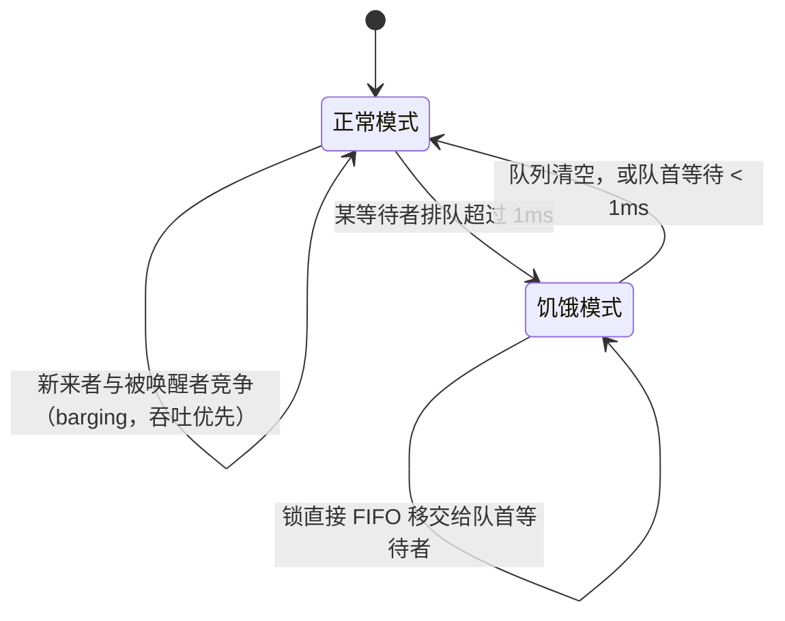

# 11.2 互斥锁

`sync.Mutex` 是最朴素的同步原语：同一时刻只让一个 goroutine 进入临界区。朴素接口之下，它要在
两个互相拉扯的目标间反复权衡:**吞吐**（让锁尽快被某人拿走、别让 CPU 闲着）与**公平**（别让某个
倒霉的等待者永远排不到队）。这一节先把互斥这个古老问题的理论与硬件基础铺开，再看 Go 的 mutex
如何在这条钢丝上行走。

## 11.2.1 互斥问题与它的硬件地基

互斥是并发理论最早的课题之一。Dijkstra 1965 年形式化了"互斥问题"并给出第一个软件解;
Lamport 1974 年的**面包店算法**（bakery algorithm）证明了不依赖底层原子性、仅靠读写也能实现
互斥与公平排队。但纯软件解代价高，现代锁都建立在硬件提供的**原子读改写**之上,
比较并交换（CAS）、取后加（fetch-and-add）等（[11.3](./atomic.md)）。

围绕这些原语，锁有一个谱系。最简单的**自旋锁**用一个 CAS 反复试，简单但在高竞争下缓存行
来回弹跳（cache-line bouncing）。**票号锁**（ticket lock）用 fetch-and-add 发号，保证 FIFO 公平，
但所有等待者仍自旋在同一变量上。**MCS 锁**（Mellor-Crummey 与 Scott，1991）让每个等待者自旋在
**自己**的本地变量上、排成显式队列，把竞争下的缓存流量降到常数,这是高扩展性锁的经典之作。
另一条线是把"睡眠等待"做廉价：Linux 的 **futex**（fast userspace mutex，Franke、Russell、
Kirkwood，2002）让无竞争时的加解锁纯在用户态用一次原子操作完成，只有真要阻塞/唤醒时才陷入
内核。几乎所有现代用户态锁，包括 Go 的，都踩在 futex（及各平台等价物）这块地基上。

## 11.2.2 快路径：无竞争时几乎零成本

mutex 的核心是一个状态字 `state` 加一个信号量。`state` 用位域同时编码几样信息：是否已上锁
（`mutexLocked`）、是否已有被唤醒的等待者（`mutexWoken`）、是否处于饥饿模式（`mutexStarving`），
以及等待者数量（高位，`mutexWaiterShift`）。

```go
type Mutex struct {
    state int32  // 位域：bit0=已上锁, bit1=有被唤醒者, bit2=饥饿模式, 其余高位=等待者数
    sema  uint32 // 用于阻塞/唤醒等待者的信号量
}
const ( mutexLocked = 1<<0; mutexWoken = 1<<1; mutexStarving = 1<<2; mutexWaiterShift = 3 )
```

无人竞争时，上锁只是一次原子比较交换:

```go
func (m *Mutex) Lock() {
    if atomic.CompareAndSwapInt32(&m.state, 0, mutexLocked) { return } // 快路径
    m.lockSlow() // 失败说明有竞争，进入慢路径
}
```

这条快路径全程不进内核，是 mutex 高频使用仍然轻快的关键，大多数加解锁到此为止。只有 CAS
失败、说明锁被占着，才落入慢路径 `lockSlow`。

## 11.2.3 慢路径：先自旋，再睡眠

竞争发生时，goroutine 不会立刻去睡，而是先**自旋**几轮:在锁很可能马上释放时空转一小会儿等它，
比立刻睡眠再被唤醒划算（睡眠唤醒都要与运行时打交道）。自旋有严格条件（多核、次数有限、锁未处于
饥饿模式等），不满足就放弃自旋，把自己挂到信号量上睡去。这种"短等自旋、长等睡眠"的混合，
也是 pthread 自适应互斥锁（`PTHREAD_MUTEX_ADAPTIVE_NP`）、Java 锁等普遍采用的策略。

## 11.2.4 公平：正常模式与饥饿模式

mutex 最见功力的设计，是它的两种模式。



**正常模式**追求吞吐。等待者按 FIFO 排队，但刚被唤醒的等待者并不直接拿到锁，而要和当下正在
运行、也想加锁的**新来者**竞争。新来者有天然优势（它正在 CPU 上跑，无需唤醒开销），于是常常
"插队"（barging）抢到锁,这减少了上下文切换、提升了吞吐，代价是那个被唤醒却没抢过的等待者
可能一次次落空，陷入饥饿。

为兜住这种尾延迟，Go 1.9 引入**饥饿模式**。当某个等待者排队超过 **1ms**（`starvationThresholdNs`）
还没拿到锁，mutex 切换到饥饿模式：此后锁不再允许插队，解锁时**直接 FIFO 移交**给队首等待者，
新来者连自旋的机会都没有，老实排到队尾。等队列排空、或队首等待降回 1ms 以内，再切回正常模式。
这正解释了[读者曾提出的疑问](https://github.com/golang-design/under-the-hood/issues/80)：解锁时
唤醒的确实是 FIFO 队首者，但正常模式下"唤醒"不等于"移交锁"。两种模式合起来，让 mutex 绝大多数
时候享受 barging 的高吞吐，又用 1ms 阈值为最坏情况兜底。

这种"吞吐优先、有界兜底"的取舍并非 Go 独有，而是工业界的共识方向。各家都在"完全公平（FIFO
直接移交，低吞吐）"与"完全不公平（自由 barging，可能饥饿）"之间找折中:Java 的
`ReentrantLock` 提供可选的公平/非公平两种锁（默认非公平，理由同样是吞吐）;Rust 的 `parking_lot`
用 eventual fairness（偶尔强制一次公平移交）。Go 的 1ms 阈值，是这条光谱上一个具体而精到的点。

## 11.2.5 读写锁与 TryLock

`sync.RWMutex` 在互斥之上区分读者与写者：多读者可同时持有，写者独占,适合读多写少，但要当心
写者饥饿与读者优先的取舍（其 happens-before 保证见 [11.9](./mem.md)）。`TryLock`
（及 `RWMutex` 的 `TryLock`/`TryRLock`，Go 1.18 加入）尝试加锁但绝不阻塞，拿不到就返回 `false`。
它的用途很窄，官方也提醒：绝大多数情况你需要的是老实的 `Lock`，频繁用 `TryLock` 往往是设计有
问题的信号。

> 实现位置的小注：自 Go 1.24 起，`Mutex`、`RWMutex` 等核心实现下沉到 `internal/sync`，
> 标准库的 `sync.Mutex` 是其薄包装。本节描述的状态字、两种模式等机制并未改变。

## 11.2.6 工程取舍

mutex 的设计处处是权衡：用状态字位域把多种信息压进一次原子操作，省下加锁开销;用自旋赌一把
短等待，赌输了才睡;用 barging 换吞吐，又用 1ms 阈值的饥饿模式为公平兜底。它和
[channel](../ch10chan/#109-何时不该用-channel) 代表了 Go 并发的两种风格：mutex 直白地表达
"互斥"，channel 表达"通信"。该用哪个，取决于你要表达什么，而非哪个"更高级"。

## 延伸阅读的文献

1. Edsger W. Dijkstra. "Solution of a Problem in Concurrent Programming Control."
   *CACM*, 8(9), 1965. https://doi.org/10.1145/365559.365617 （互斥问题的形式化）
2. Leslie Lamport. "A New Solution of Dijkstra's Concurrent Programming Problem."
   *CACM*, 17(8), 1974. https://doi.org/10.1145/361082.361093 （面包店算法）
3. John M. Mellor-Crummey, Michael L. Scott. "Algorithms for Scalable Synchronization on
   Shared-Memory Multiprocessors." *ACM TOCS*, 9(1), 1991.
   https://doi.org/10.1145/103727.103729 （MCS 锁）
4. Hubertus Franke, Rusty Russell, Matthew Kirkwood. "Fuss, Futexes and Furwocks:
   Fast Userlevel Locking in Linux." *Ottawa Linux Symposium 2002.*
5. Dmitry Vyukov 等. *sync: make Mutex more fair*（Go 1.9 饥饿模式）, 2016.
   https://go-review.googlesource.com/c/go/+/34310 ；issue #13086.
6. The Go Authors. *The Go Memory Model：Locks.* https://go.dev/ref/mem

## 许可

&copy; 2018-2026 The [golang.design](https://golang.design) Initiative Authors. Licensed under [CC-BY-NC-ND 4.0](https://creativecommons.org/licenses/by-nc-nd/4.0/).
