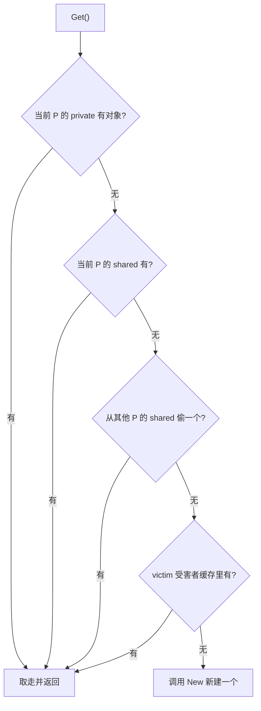

# 11.6 缓存池

频繁地分配又丢弃同一类临时对象，会给垃圾回收器（[13](../../part4memory/ch13gc)）带来沉重压力。
`sync.Pool` 提供了一条出路：把用完的对象暂存起来，下次需要时复用，而不是每次都新分配。它的
典型用法是缓冲区、序列化器这类「用完即弃、又反复要用」的临时对象。

```go
var bufPool = sync.Pool{New: func() any { return new(bytes.Buffer) }}

b := bufPool.Get().(*bytes.Buffer)
b.Reset()
// ... 使用 b ...
bufPool.Put(b)
```

## 11.6.1 每个 P 一份，避免锁

`sync.Pool` 高性能的根基，是把缓存**按 P 分片**（[9.3](../ch09sched/mpg.md)）：每个 P 有自己的
一小块本地缓存，由一个 `private` 槽（只放一个对象，最快）和一个 `shared` 双端队列组成。
本地存取走的是无锁快路径，只有跨 P 偷取时才需要同步。

```go
type poolLocal struct {
    private any        // 只能被当前 P 存取的单个对象（最快）
    shared  poolChain  // 可被本 P 推入、被其他 P 偷取的双端队列
}
```

`Get` 的查找由近及远，与调度器的找活儿顺序（[9.2](../ch09sched/steal.md)）异曲同工：



偷取时，从当前 P 的下一个开始、逐个扫过其他所有 P 的 `shared`。这里有一处易被讲错的细节：
索引按 `(pid+i+1) mod size` 取，看似「从下一个开始、绕一圈」就能不碰到自己，其实当 $i = size-1$
时它正好绕回 $pid$ 本身。也就是说，循环的前 $size-1$ 次落在其他 P 上，**最后一次才回到自己**，
这恰好是「先扫别人、最后才看自己」的预期效果，而非「永不取到自身」。

## 11.6.2 victim 缓存：与 GC 节奏和解

`sync.Pool` 里的对象不能永远留着，否则就成了内存泄漏，所以每轮 GC 都会清理 Pool。但若简单地
「一到 GC 就全清空」，则每次 GC 后第一批 `Get` 全部落空、全部走 `New`，造成周期性的分配尖峰。

Go 1.13 用 **victim（受害者）缓存**化解了这个抖动：GC 到来时，并不直接丢弃本地缓存，而是先把它
降级为 victim；下一轮 GC 才真正回收 victim。于是一个对象要连续两轮 GC 都没被用到才会被释放，
`Get` 在主缓存落空后还能从 victim 兜一道（见上图）。这把「悬崖式」的清空，平滑成了「两段式」的
衰减，缓存命中率与内存占用之间因此取得了更好的平衡。

## 11.6.3 用对它的前提

`sync.Pool` 有几条性格要记住，否则容易用错。其一，池中对象**随时可能在 GC 时消失**，所以它只
适合存放可重建、无状态依赖的临时对象，不能拿来做连接池一类需要保活的资源池。其二，它**不保证**
`Get` 一定返回此前 `Put` 进去的那个对象，也不保证容量，它是「尽力而为」的缓存，不是队列。
其三，取回的对象可能是「脏」的，使用前通常要 `Reset`。把这几点放在一起看，`sync.Pool` 的定位
非常清晰：**专为降低高频临时分配的 GC 压力而生**，不多也不少。

## 延伸阅读的文献

1. The Go Authors. *sync.Pool 文档与实现说明.* https://pkg.go.dev/sync#Pool
2. Go 1.13 Release Notes（sync.Pool 的 victim 缓存）. https://go.dev/doc/go1.13
3. golang/go#22950. *sync: avoid clearing the full Pool on every GC.*
   https://github.com/golang/go/issues/22950 （victim 缓存的提案与讨论）

## 许可

&copy; 2018-2026 The [golang.design](https://golang.design) Initiative Authors. Licensed under [CC-BY-NC-ND 4.0](https://creativecommons.org/licenses/by-nc-nd/4.0/).
