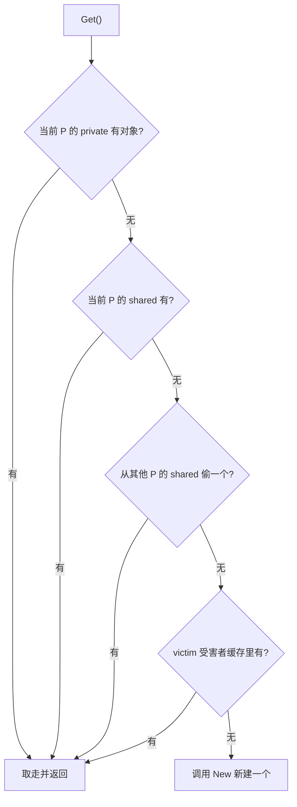

# 11.6 缓存池

频繁地分配又丢弃同一类临时对象，会给垃圾回收器（[13](../../part4memory/ch13gc)）带来沉重压力。
`sync.Pool` 提供一条出路：把用完的对象暂存起来、下次复用，而不是每次都新分配。它的典型用法是
缓冲区、序列化器这类"用完即弃、又反复要用"的临时对象。

```go
var bufPool = sync.Pool{New: func() any { return new(bytes.Buffer) }}

b := bufPool.Get().(*bytes.Buffer)
b.Reset()
// ... 使用 b ...
bufPool.Put(b)
```

## 11.6.1 对象复用：一个古老的内存技巧

"预先备好一批对象、反复借还而非频繁创建销毁"，是内存管理里很古老的思路,空闲列表
（free list）、对象池（object pool）、slab 分配器（Bonwick 1994，内核用它缓存固定类型的对象）
都是它的化身。其价值有二：省去重复的分配/初始化开销;以及,对带 GC 的语言尤其重要,减少活跃
对象的产生速率，从而降低 GC 频率与停顿。`sync.Pool` 正是把这个技巧做成了并发安全、且与 Go GC
协同的标准件。

## 11.6.2 每个 P 一份，避免锁

`sync.Pool` 高性能的根基，是把缓存**按 P 分片**（[9.3](../ch09sched/mpg.md)）：每个 P 有自己的
一小块本地缓存,一个 `private` 槽（只放一个对象，最快）加一个 `shared` 双端队列。本地存取走无锁
快路径，只有跨 P 偷取时才需同步。这与 tcmalloc/jemalloc 的**线程本地缓存**（thread cache）、
JVM 的 **TLAB**（thread-local allocation buffer）是同一种思路：把分配的快路径做成每线程/每 P
私有，消除全局锁争用,只是 `sync.Pool` 缓存的是用户对象，而非原始内存。

```go
type poolLocal struct {
    private any        // 只能被当前 P 存取的单个对象（最快）
    shared  poolChain  // 可被本 P 推入、被其他 P 偷取的双端队列
}
```

`Get` 的查找由近及远，与调度器的找活儿顺序（[9.2](../ch09sched/steal.md)）异曲同工：



偷取时从当前 P 的下一个开始、逐个扫过其他 P 的 `shared`。这里有一处易被讲错的细节：索引按
`(pid+i+1) mod size` 取，看似"从下一个开始绕一圈"就能不碰到自己，其实当 $i = size-1$ 时它正好
绕回 $pid$ 本身。也就是说，循环的前 $size-1$ 次落在其他 P 上，**最后一次才回到自己**,这恰好是
"先扫别人、最后看自己"的预期效果，而非"永不取到自身"。

## 11.6.3 victim 缓存：与 GC 节奏和解

`sync.Pool` 里的对象不能永远留着，否则就成了内存泄漏，所以每轮 GC 都会清理 Pool。但若简单地
"一到 GC 就全清空"，则每次 GC 后第一批 `Get` 全部落空、全走 `New`，造成周期性的分配尖峰。

Go 1.13 用 **victim（受害者）缓存**化解抖动：GC 到来时不直接丢弃本地缓存，而是先把它降级为
victim;下一轮 GC 才真正回收 victim。于是一个对象要连续两轮 GC 都没被用到才会被释放，`Get` 在
主缓存落空后还能从 victim 兜一道（见上图）。这把"悬崖式"的清空平滑成"两段式"衰减。"victim
缓存"本是 CPU 体系结构里的概念（Jouppi 1990，在直接映射缓存旁加一个小全相联缓存接住被踢出
的行），`sync.Pool` 借了这个名字与思想,又一次说明，运行时设计常是在复用更古老的系统思想。

## 11.6.4 用对它的前提

`sync.Pool` 有几条性格要记住，否则容易用错。其一，池中对象**随时可能在 GC 时消失**，所以它只
适合存放可重建、无状态依赖的临时对象，不能拿来做连接池一类需要保活的资源池。其二，它**不保证**
`Get` 返回此前 `Put` 进去的那个对象，也不保证容量,它是"尽力而为"的缓存，不是队列。其三，
取回的对象可能是"脏"的，使用前通常要 `Reset`。把这几点放在一起，`sync.Pool` 的定位非常清晰：
**专为降低高频临时分配的 GC 压力而生**，不多也不少。这也提醒：池化是一种以复杂度换性能的优化，
只在 profiler 确认分配确实是瓶颈时才值得引入。

## 延伸阅读的文献

1. Jeff Bonwick. "The Slab Allocator: An Object-Caching Kernel Memory Allocator."
   *USENIX Summer 1994.* （对象缓存式分配的经典）
2. Norman P. Jouppi. "Improving Direct-Mapped Cache Performance by the Addition of a
   Small Fully-Associative Cache and Prefetch Buffers." *ISCA 1990.*
   https://doi.org/10.1145/325164.325162 （victim 缓存的出处）
3. Go 1.13 Release Notes（sync.Pool 的 victim 缓存）. https://go.dev/doc/go1.13 ；
   提案与讨论 golang/go#22950. https://github.com/golang/go/issues/22950
4. The Go Authors. *sync.Pool 文档.* https://pkg.go.dev/sync#Pool

## 许可

&copy; 2018-2026 The [golang.design](https://golang.design) Initiative Authors. Licensed under [CC-BY-NC-ND 4.0](https://creativecommons.org/licenses/by-nc-nd/4.0/).
