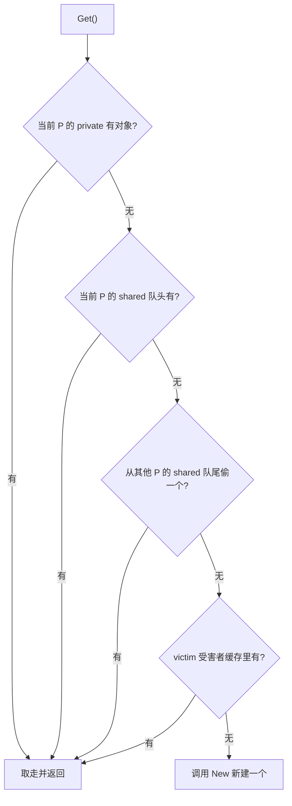

# 11.6 缓存池

频繁地分配又丢弃同一类临时对象，会给垃圾回收器（[13](../../part4memory/ch13gc)）带来沉重压力。
`sync.Pool` 提供一条出路：把用完的对象暂存起来、下次复用，而不是每次都新分配。它的典型用法是
缓冲区、序列化器这类"用完即弃、又反复要用"的临时对象。

```go
var bufPool = sync.Pool{New: func() any { return new(bytes.Buffer) }}

b := bufPool.Get().(*bytes.Buffer)
b.Reset()           // 取回的对象可能是脏的，先重置
// ... 使用 b ...
bufPool.Put(b)      // 用完放回，供他人复用
```

`New` 是唯一需要用户提供的字段：当池里取不到对象时，由它兜底造一个。于是 `Get` 拿到的，
要么是别人刚用完放回的旧对象，要么是 `New` 现造的新对象，调用方无从、也不应区分二者。
本节先讲它复用对象的古老思路，再拆开它为并发与 GC 所做的三层设计：每 P 分片、victim 缓存、
以及与运行时 GC 的协同。本节内容对标 go1.26（实现自 Go 1.13 的 victim 缓存方案稳定至今）。

## 11.6.1 对象复用：一个古老的内存技巧

"预先备好一批对象、反复借还而非频繁创建销毁"，是内存管理里很古老的思路,空闲列表
（free list，[12.2](../../part4memory/ch12alloc/component.md)）、对象池（object pool）、slab
分配器（Bonwick 1994，内核用它缓存固定类型的对象）都是它的化身。其价值有二：省去重复的
分配与初始化开销;以及,对带 GC 的语言尤其重要,减少活跃对象的产生速率，从而降低 GC 频率与停顿。

这第二点正是 `sync.Pool` 文档里写的本分,"缓存已分配但暂未使用的对象以备复用，为垃圾回收器
减压"。要看清这层减压从何而来，可把 Go 的并发标记清扫（[13](../../part4memory/ch13gc)）粗略记成
工作量与活跃对象数成正比：标记阶段要遍历可达对象、清扫阶段要回收死对象。每次 `New` 一个临时
对象、用完即弃，都是在给堆增加一个"生而即死"的对象，抬高分配速率，进而更频繁地触发 GC、
每轮 GC 要扫的对象也更多。复用把这批对象从"反复生死"变成"借了又还"，既压低了分配速率，也
让它们不再每轮都成为 GC 的扫描与回收对象。fmt 包就是教科书式的例子：它用一个 `sync.Pool`
维护临时输出缓冲，并发打印多时缓冲池自动变大，空闲时随 GC 收缩。它把这个古老技巧做成了
并发安全、且与 Go GC 协同的标准件。需要强调的是它的边界：池是
对 GC 压力的优化，不是托管对象生命周期的容器。一个只在某个短命对象内部维护的 free list 不该
用 `sync.Pool`,文档明确指出，那种场景下让对象自带 free list 更划算，因为 `Pool` 的分摊收益
建立在"被一个包的众多并发使用者静默共享"之上，单点使用摊不开它的固定开销。

## 11.6.2 每个 P 一份，避免锁

`sync.Pool` 高性能的根基，是把缓存**按 P 分片**（[9.3](../ch09sched/mpg.md)）：每个 P 有自己的
一小块本地缓存,一个 `private` 槽（只放一个对象，最快）加一个 `shared` 双端队列。本地存取走无锁
快路径，只有跨 P 偷取时才需同步。这与内存分配器的 mcache（[12.2](../../part4memory/ch12alloc/component.md)）、
tcmalloc/jemalloc 的**线程本地缓存**（thread cache）、JVM 的 **TLAB**（thread-local allocation
buffer）是同一种"分层减争"的招式：把分配的快路径做成每线程或每 P 私有，消除全局锁争用,只是
`sync.Pool` 缓存的是用户对象，而非原始内存。

```go
// 每个 P 一份的本地缓存（速写）
type poolLocal struct {
    private any        // 只能被当前 P 存取的单个对象（最快，无需同步）
    shared  poolChain  // 本 P 可 pushHead/popHead；任意 P 可 popTail（被偷）
    // pad 把结构填满 128 字节，避免相邻 P 的缓存落在同一缓存行而伪共享
}
```

为何要 `private` 与 `shared` 两级，而不是只留队列？因为绝大多数"取一个、用完放回"的访问
是即取即还的窄循环，`private` 这个单对象槽让这种最常见的情形退化成一次普通的字段读写，连
队列的入队出队都省了。`shared` 则承接溢出：当 `private` 已被占用、又有对象要放回时，才落到
队列里，也正是这条队列让对象能在 P 之间流动。一快一慢、一独占一共享，分工与分配器里
mcache 的 `alloc` 数组加 mcentral（[12.2](../../part4memory/ch12alloc/component.md)）的两级如出一辙。

`shared` 不是普通切片，而是 `poolChain`,一个无锁的链式双端队列。它的访问权限是不对称的：
**本 P** 在队头 `pushHead`/`popHead`（推入与取回都在自己这端，无竞争）；**其他 P** 只能在队尾
`popTail` 偷取。队头归主人、队尾给小偷，这样主人的常规存取与小偷的偶发偷取分处两端，把跨 P
争用降到最低。早期版本用 `Mutex` 保护这条共享队列，Go 1.13 改为 CAS 实现的无锁变长队列，是
本结构第二处"为并发而重构数据结构"的演进。

`Get` 把这套分片落成一条由近及远的查找链，与调度器的找活儿顺序（[9.2](../ch09sched/steal.md)）
异曲同工,先看自己手边，再看共享区，再向别人偷，最后才造新的：

```go
// Get 的主干（速写，省去 race 检测与 procUnpin 细节）
func (p *Pool) Get() any {
    l, pid := p.pin()          // 固定到当前 P，禁抢占，取本地 poolLocal
    x := l.private             // (1) 先看 private，最快
    l.private = nil
    if x == nil {
        x, _ = l.shared.popHead()  // (2) 再从本 P 的 shared 队头取
        if x == nil {
            x = p.getSlow(pid)     // (3) 都没有：去别人那里偷 / 翻 victim
        }
    }
    runtime_procUnpin()
    if x == nil && p.New != nil {
        x = p.New()            // (4) 还没有：现造一个
    }
    return x
}
```



`Put` 是对称而更简单的一半：能放进 `private` 就放（最快），否则 `pushHead` 进本 P 的 `shared`
队头。无论取还是放，本地路径都不碰锁。

偷取（`getSlow`）时从当前 P 的下一个开始、逐个扫过其他 P 的 `shared` 队尾。这里有一处易被讲错
的细节：索引按 `(pid+i+1) mod size` 取，`i` 从 $0$ 走到 $size-1$。看似"从下一个开始绕一圈"
就能避开自己，其实当 $i = size-1$ 时它正好绕回 $pid$ 本身。也就是说，循环的前 $size-1$ 次落在
其他 P 上，**最后一次才回到自己**,这恰好是"先扫别人、最后看自己"的预期效果，而非"永不取到
自身"。

### pin 与 per-P 索引

`Get`/`Put` 开头那句 `p.pin()` 是整套无锁快路径成立的前提。它做两件事：调用
`runtime_procPin` 把当前 goroutine 钉在 P 上、禁用抢占（于是这段临界区内不会发生 GC，也不会
被调度走，对 `private` 的读写才是真正"独占"的）；然后用 P 的 id 作下标，从 `local` 这个
per-P 数组里 `indexLocal` 出本地的 `poolLocal`。`local` 是一段连续内存，`indexLocal` 不过是
"首地址 + pid × 步长"的一次指针运算。只有当 P 的数量在 `GOMAXPROCS` 变化后被调大、当前 pid
越出数组范围时，才落入加锁的 `pinSlow` 慢路径,在 `allPoolsMu` 下重新分配数组、把本 Pool 登记
进 `allPools`（GC 时凭它找到所有 Pool）。这个慢路径只在 P 数量变动这类罕见时刻触发，常态下
`pin` 是几条原子读加一次指针计算。

## 11.6.3 victim 缓存：与 GC 节奏和解

`sync.Pool` 里的对象不能永远留着，否则就成了内存泄漏，所以每轮 GC 都会清理 Pool。但若简单地
"一到 GC 就全清空"，则每次 GC 后第一批 `Get` 全部落空、全走 `New`，造成周期性的分配尖峰,
对吞吐敏感的服务尤其难受。

Go 1.13 用 **victim（受害者）缓存**化解这种抖动：GC 到来时不直接丢弃本地缓存，而是先把它降级
为 victim;再下一轮 GC 才真正回收 victim。于是一个对象要连续两轮 GC 都没被碰过才会被释放，
`Get` 在主缓存落空后还能从 victim 兜一道（见上图 `getSlow` 的最后一步）。这把"悬崖式"的清空
平滑成"两段式"衰减。

落到代码上，这套交接由注册进运行时的 `poolCleanup` 在 STW 阶段完成,因为世界已停，所有 P 实际
上都已固定，无需加锁，也不许分配：

```go
// 注册到运行时 GC 起点（STW），见 src/runtime/mgc.go 调用 clearpools
func init() { runtime_registerPoolCleanup(poolCleanup) }

func poolCleanup() {
    // 1. 丢弃上一轮留下的 victim（它们已熬过两个 GC 周期）
    for _, p := range oldPools {
        p.victim, p.victimSize = nil, 0
    }
    // 2. 把本轮的主缓存整体降级为 victim
    for _, p := range allPools {
        p.victim, p.victimSize = p.local, p.localSize
        p.local, p.localSize = nil, 0
    }
    // 3. 名册轮换：本轮的 allPools 成为下轮的 oldPools
    oldPools, allPools = allPools, nil
}
```

三步合起来就是一条单向传送带：主缓存 → victim → 释放。`allPools` 记着有非空主缓存的池，
`oldPools` 记着有非空 victim 的池，两份名册都靠 STW（或 `pin` 期间不会触发 `poolCleanup`）
来保护。这条传送带给了对象一个明确的寿命下界：一个在第 $k$ 轮 GC 前被放回的对象，要到第
$k{+}1$ 轮才降级为 victim、第 $k{+}2$ 轮才可能被释放，期间任何一次被偷回都会重置它的寿命。
比起 Go 1.13 之前"每轮 GC 清空全部"的一周期寿命，平均存活期翻倍，正是这多出的一个周期把
GC 后的分配尖峰摊平。值得一提的是，victim 中的对象在被释放前仍可被偷回,`getSlow` 偷不到别人的 `shared`
时会翻 victim，一旦取到并 `Put` 回去，对象就重新回到主缓存、躲过了这次释放。于是在分配密集
的负载下，GC 后第一波 `Get` 很可能从上一周期的 victim 里捞到对象，而不必都走 `New`。

"victim 缓存"这个名字本是 CPU 体系结构里的概念（Jouppi 1990，在直接映射缓存旁加一个小的
全相联缓存，接住刚被踢出的缓存行，减少冲突失效）。`sync.Pool` 借了这个名字与思想：被主缓存
"驱逐"的对象不立即作废，而是退到二级缓存里再待一会儿。又一次说明，运行时设计常是在复用更
古老的系统思想。

## 11.6.4 用对它的前提

`sync.Pool` 有几条性格要记住，否则容易用错。

其一，池中对象**随时可能在 GC 时消失**。文档第一句就申明"存入的任何对象都可能在任意时刻被
自动移除，不另行通知"。所以它只适合存放可重建、无状态依赖的临时对象，不能拿来做连接池一类
需要保活的资源池,GC 一来连接就没了，这类需求该用专门的连接池库。

其二，它**不保证** `Get` 返回此前 `Put` 进去的那个对象，也不保证容量。文档明说调用方不应
假设传入 `Put` 的值与 `Get` 返回的值之间有任何关系。它是"尽力而为"的缓存，不是队列，也没有
"至少缓存 N 个"的承诺,在内存模型（[11.9](./mem.md)）的术语里，唯一被保证的是：对某个值 `x`
的 `Put(x)` "同步先于"返回同一个 `x` 的 `Get`。

其三，取回的对象可能是"脏"的,带着上一位使用者留下的状态，使用前通常要 `Reset`（如本节开头
对 `bytes.Buffer` 的处理）。

把这几点放在一起，`sync.Pool` 的定位非常清晰：**专为降低高频临时分配的 GC 压力而生**，不多
也不少。它也提醒我们一条更一般的工程纪律：池化是以复杂度换性能的优化，性能的提升从不白来，
它把"何时该清、对象是否干净、跨 P 是否争用"这些负担转嫁给了使用者。只有在 profiler 确认临时
分配确实是瓶颈时，引入它才值得。

## 延伸阅读的文献

1. Jeff Bonwick. *The Slab Allocator: An Object-Caching Kernel Memory Allocator.*
   USENIX Summer 1994. https://www.usenix.org/legacy/publications/library/proceedings/bos94/bonwick.html
   （对象缓存式分配的经典）
2. Norman P. Jouppi. *Improving Direct-Mapped Cache Performance by the Addition of a
   Small Fully-Associative Cache and Prefetch Buffers.* ISCA 1990.
   https://doi.org/10.1145/325164.325162 （victim 缓存的出处）
3. Sanjay Ghemawat, Paul Menage. *TCMalloc: Thread-Caching Malloc.*
   https://google.github.io/tcmalloc/design.html （每线程缓存的思想原型，与本节每 P 分片同构）
4. Go 1.13 Release Notes（sync.Pool 的 victim 缓存）. https://go.dev/doc/go1.13 ；
   提案与讨论 golang/go#22950. https://github.com/golang/go/issues/22950
5. The Go Authors. *sync.Pool 文档与 src/sync/pool.go.* https://pkg.go.dev/sync#Pool
6. The Go Authors. *The Go Memory Model.* https://go.dev/ref/mem
   （`Put(x)` 与 `Get` 返回同一 `x` 的"同步先于"保证）
7. `sync.Pool` 的实现演进（本节 11.6.2 / 11.6.3 所述设计的原始提交）：Brad Fitzpatrick.
   *sync: add Pool type.* golang/go#4720 ；Dmitry Vyukov. *sync: scalable Pool.* 2014
   （每 P 分片，https://github.com/golang/go/commit/f8e0057bb71cded5bb2d0b09c6292b13c59b5748）；
   Austin Clements. *sync: use lock-free structure for Pool stealing.* 2019
   （`shared` 改为 CAS 无锁队列，https://github.com/golang/go/commit/d5fd2dd6a17a816b7dfd99d4df70a85f1bf0de31）；
   *sync: smooth out Pool behavior over GC with a victim cache.* 2019
   （victim 缓存，https://github.com/golang/go/commit/2dcbf8b3691e72d1b04e9376488cef3b6f93b286）.
8. 本书 [9.2 工作窃取](../ch09sched/steal.md)、[11.9 内存一致模型](./mem.md)、
   [12.2 分配器组件](../../part4memory/ch12alloc/component.md)（每 P 缓存与偷取的同源设计）.
