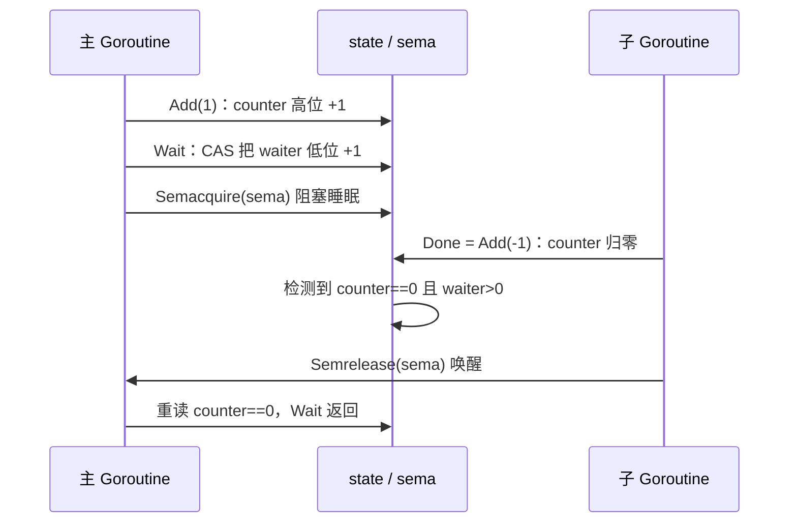

# 11.5 同步组

> 本节内容对标 Go 1.26。

前几节的互斥锁（[11.2](./mutex.md)）与条件变量（[11.4](./cond.md)）解决的是
「多个 Goroutine 争用同一份共享状态」的问题。本节要谈的 `sync.WaitGroup` 解决的是另一类
问题：一个 Goroutine 派生出若干子任务，然后等它们全部完成再继续。前者是争用，后者是汇合。
这是并发编程里最常见的一种结构，称为 fork-join，而 `WaitGroup` 正是 Go 标准库给它的答案。

## 11.5.1 屏障与闩锁的谱系

在认识 `WaitGroup` 的实现之前，先把它放进同步原语的谱系里，看清它解决的是哪一类问题。
等待「一组事件全部发生」这件事，并发文献里有一个专门的家族，叫屏障（barrier）与闩锁（latch）。
家族里的几位成员形态各异，Java 的 `java.util.concurrent` 把它们分得相当清楚，正好用来定位
`WaitGroup`：

| 原语 | 形态 | 可复用 | 计数是否可动态增减 |
| --- | --- | --- | --- |
| `CountDownLatch`（Java） | 一群等待者等计数减到 0，一次性 | 否 | 否，构造时定死 |
| `CyclicBarrier`（Java） | $N$ 个对等方互相等齐，到齐后自动重置 | 是 | 否，参与方数目固定 |
| `Phaser`（Java） | 分阶段屏障，参与方可中途注册 / 注销 | 是 | 是 |
| `sync.WaitGroup`（Go） | 一方等一组任务全部完成，fork-join | 是（Wait 返回后） | 是（Add 可正可负） |

`WaitGroup` 最接近 `CountDownLatch`：都是「计数从某个正值减到 0，等待者随之放行」。区别在两处。
其一，`CountDownLatch` 的计数在构造时定死，`WaitGroup` 的计数靠 `Add` 动态累加，这点更像
`Phaser` 的注册机制。其二，`CountDownLatch` 是一次性的，减到 0 便报废，而 `WaitGroup`
在一轮 `Wait` 返回后可以重新使用。

`CyclicBarrier` 则是另一种形态，它要求 $N$ 个对等的参与方彼此等齐，是「多对多的会合」，
而非 `WaitGroup` 的「一方等多方」。把它列在这里，是为了说清 `WaitGroup` 不是什么：
它不负责让一组 Goroutine 互相等待，只负责让一个（或几个）等待者等一组任务收尾。

## 11.5.2 用法：Add、Done、Wait

`WaitGroup` 的接口只有三个方法。`Add(delta)` 把任务计数器加上 `delta`（可正可负），
`Done()` 等价于 `Add(-1)`，`Wait()` 阻塞到计数器归零。最典型的 fork-join 写法是这样：

```go
var wg sync.WaitGroup
for _, task := range tasks {
	wg.Add(1)          // 派生前先把计数加 1
	go func() {
		defer wg.Done() // 任务结束时计数减 1
		process(task)
	}()
}
wg.Wait()              // 阻塞，直到所有任务都 Done
```

主 Goroutine 在每次派生子任务前调用 `Add(1)`，子任务用 `defer wg.Done()` 保证无论正常返回
还是中途 `return` 都会扣减计数，最后 `Wait` 把主 Goroutine 挂起到计数归零。这套写法有两条
铁律，下文 [11.5.5](#1155-两条铁律) 会从实现的角度解释它们的由来。

## 11.5.3 内部结构：把计数器与等待者塞进一个字

`WaitGroup` 的高效，关键在它把两个看似独立的量塞进了同一个 64 位字里。裁剪后的速写如下：

```go
// WaitGroup：等待一组任务完成（速写，省去 race 与 synctest 细节）
type WaitGroup struct {
	noCopy noCopy      // 触发 go vet 报告「首次使用后被复制」

	// 一个 64 位字，按位段切分（从高到低）：
	//   bits[0:32]   counter：未完成的任务数
	//   bits[32]     synctest bubble 标志（测试框架用，核心机制可忽略）
	//   bits[33:64]  waiter：阻塞在 Wait 上的 Goroutine 数
	state atomic.Uint64
	sema  uint32       // 配套的信号量，Wait 在其上睡眠
}
```

为何要把 counter 与 waiter 挤进一个字，而不是用两个独立的计数器？答案不是为了省那 4 个字节，
而是为了一次原子操作就能取得二者的**一致快照**。`Add` 与 `Wait` 都需要同时读到「还剩几个任务」
和「有几个等待者」来决定该返回、该 panic 还是该唤醒。若 counter 与 waiter 分作两个原子变量，
两次独立的原子读之间会被并发修改插入，读到一对自相矛盾的值（torn read）。打包进一个字后，
一次 `Load` 或一次 `CompareAndSwap` 就锁定了整对状态，并发判断才有据可依。

这里还埋着一处演进。早期的 `WaitGroup` 字段是 `state1 [3]uint32`，并配一个 `state()` 方法
在运行时挑出对齐到 8 字节的那 8 个字节当 64 位状态、余下 4 字节当信号量。这套别扭的对齐手法，
是为了绕开 32 位平台上 64 位原子操作要求 8 字节对齐、而结构体字段未必对齐的限制。Go 1.20
（2022 年）把 `state` 换成 `atomic.Uint64` 之后，对齐由该类型自身保证，那段手工对齐的代码
连同 `state()` 方法一并退役了（[11.3](./atomic.md) 谈过类型化原子如何顺带解决对齐问题）。

## 11.5.4 Add 与 Wait 如何协作

理解了打包，`Add` 的核心就只剩一行位运算。它把 `delta` 左移 32 位，恰好落在 counter 所在的
高 32 位上，对低位的 waiter 毫无扰动：

```go
func (wg *WaitGroup) Add(delta int) {
	state := wg.state.Add(uint64(delta) << 32) // delta 加到高 32 位（counter）
	v := int32(state >> 32)                    // 取出 counter
	w := uint32(state & 0x7fffffff)            // 取出 waiter（掩掉 bit 31 的标志）

	if v < 0 {
		panic("sync: negative WaitGroup counter")
	}
	if v > 0 || w == 0 {
		return // counter 仍 > 0，或根本没人在等，直接返回
	}
	// 走到这里：counter 刚归零，且有等待者。该把他们全部唤醒。
	wg.state.Store(0)            // 清空状态，为下一轮复用做准备
	for ; w != 0; w-- {
		runtime_Semrelease(&wg.sema, false, 0) // 逐个释放信号量
	}
}

func (wg *WaitGroup) Done() { wg.Add(-1) }
```

`Wait` 的逻辑是对称的。它先读快照，若 counter 已是 0 就无需等待直接返回；否则用一次 CAS
把 waiter 加 1（即 `state+1`，恰好作用在低位），再阻塞到信号量上：

```go
func (wg *WaitGroup) Wait() {
	for {
		state := wg.state.Load()
		v := int32(state >> 32)
		if v == 0 {
			return // counter 已归零，无需等待
		}
		// waiter 加 1：state+1 恰好落在低位。CAS 失败说明状态被并发改动，重读重试。
		if wg.state.CompareAndSwap(state, state+1) {
			runtime_SemacquireWaitGroup(&wg.sema, false) // 睡眠
			if wg.state.Load() != 0 {
				panic("sync: WaitGroup is reused before previous Wait has returned")
			}
			return
		}
	}
}
```

两边借由 `sema` 这枚运行时信号量握手：`Wait` 在其上 `Semacquire` 睡下，最后一个 `Done`
发现 counter 归零、waiter 大于 0，便按等待者数目逐次 `Semrelease`，把睡着的 Goroutine 一一唤醒。
整个交互可以画成一条时间线：



## 11.5.5 两条铁律

`WaitGroup` 用对不难，用错却各有惨烈后果。两条铁律都能从上面的实现读出来。

第一条，**`Add` 必须发生在被等待的 Goroutine 启动之前**，更准确说，那次把计数从 0 抬起来的
`Add` 必须先于 `Wait`。原因藏在 `Wait` 的快照里：它一上来就读 counter，若读到 0 便认定无事
可等、立刻返回。设想把 `Add(1)` 误放进子 Goroutine 内部：

```go
var wg sync.WaitGroup
go func() {
	wg.Add(1)        // 错位：可能在 Wait 已经读过 counter 之后才执行
	defer wg.Done()
	work()
}()
wg.Wait()            // 可能读到 counter==0，根本没等就返回了
```

主 Goroutine 的 `Wait` 与子 Goroutine 的 `Add` 形成数据竞争，`Wait` 完全可能抢先看到计数为 0
而提前放行，`work()` 还没跑完程序就往下走了。实现里那句 `if w != 0 && delta > 0 && v == delta`
的 panic（`Add called concurrently with Wait`）正是为捕捉这类并发误用而设的快速失败。

第二条，**计数器不得变负**。`Done` 的次数多于 `Add`，counter 越过 0 变负，`Add` 立刻
`panic("sync: negative WaitGroup counter")`。这是一处刻意的 fail-fast：计数变负几乎一定意味着
程序逻辑错了（某个任务被 `Done` 了两次，或 `Add` 漏掉了），与其让它悄悄滑过、留下一个时有时无
的怪异 bug，不如当场崩溃，把错误钉在第一现场。

## 11.5.6 发生序保证

`WaitGroup` 不只是一个计数器，它还携带一条内存模型层面的承诺。用 [11.9](./mem.md) 的词汇说：
**一次 `Done()` 同步先于（synchronized before）它所解除阻塞的那个 `Wait()` 的返回**。
这正是源码注释的原话。它的实际意义是，子 Goroutine 在 `Done` 之前对内存的所有写入，
在 `Wait` 返回之后对主 Goroutine 都可见。于是下面这种写法是安全的，无需额外加锁：

```go
results := make([]int, len(tasks))
var wg sync.WaitGroup
for i, task := range tasks {
	wg.Add(1)
	go func() {
		defer wg.Done()
		results[i] = process(task) // 各写各的槽位
	}()
}
wg.Wait()
total := 0
for _, r := range results { total += r } // Wait 之后，所有写入均可见
```

每个子任务只写自己那一格 `results[i]`，彼此无竞争；`Wait` 的发生序保证了这些写入在主
Goroutine 汇总时都已落定。没有这条保证，`Wait` 返回后读 `results` 便是一次数据竞争。

## 11.5.7 WaitGroup.Go 与 loopvar：两个被消除的坑

`Add(1) / go / defer Done()` 这套三件套样板写多了难免出错，最常见的是漏掉 `Add` 或漏掉
`Done`。Go 1.25 给 `WaitGroup` 添了一个 `Go` 方法，把样板折叠成一行：

```go
func (wg *WaitGroup) Go(f func()) {
	wg.Add(1)
	go func() {
		defer func() {
			if x := recover(); x != nil {
				panic(x) // f 不得 panic：若 panic，重新抛出而非 Done
			}
			wg.Done()
		}()
		f()
	}()
}
```

于是开头那段循环可以写成：

```go
var wg sync.WaitGroup
for _, task := range tasks {
	wg.Go(func() { process(task) })
}
wg.Wait()
```

`Add` 与 `Done` 被一并收进 `Go`，再也无从写错配对。一处值得留意的设计：若 `f` 发生 panic，
`Go` 选择重新抛出 panic 而非调用 `Done`，因为此时若 `Done` 唤醒了 `Wait`、主 Goroutine
可能在 panic 真正终止进程之前就先行退出，那是不可取的，故而 `f` 不得 panic。

这段简化还顺手关上了另一个历史悠久的坑。Go 1.22 之前，`for` 循环变量在每轮迭代间共享同一个
地址，上面的闭包若直接捕获循环变量 `task`，所有 Goroutine 看到的会是同一个、不断变化的值，
必须手写 `task := task` 来逐轮拷贝。Go 1.22 把循环变量改成每轮迭代各有一份（per-iteration
loop variable），这个捕获 bug 就此消失。于是 `wg.Go(func() { process(task) })` 同时免去了
样板与捕获两重隐患。

## 11.5.8 走向结构化并发

`WaitGroup` 解决了「等一组任务完成」，却留下两件事没管：子任务返回的错误如何收集，
以及一旦某个子任务出错，如何取消其余尚在运行的任务。把这两件事补齐，就走到了结构化并发的门口。

标准库之外的 `golang.org/x/sync/errgroup` 正是这一步。它的 `Group` 内部就嵌着一个
`sync.WaitGroup`，在其上叠了错误传播与 `context` 取消：`Go(func() error)` 收集第一个非空错误，
`WithContext` 派生的 `Context` 会在首个错误出现时自动取消，让兄弟任务尽早停下，`SetLimit`
还能用一个带缓冲的 channel 信号量限制并发度。`WaitGroup` 管「何时全部完成」，`context`
（[11.8](./context.md)）管「何时应当取消」，二者合流，才凑齐了结构化并发对一组任务的完整掌控。
`WaitGroup` 是这条线的起点，简单到只有三个方法，却恰好是 fork-join 这一最朴素并发结构的精确表达。

## 延伸阅读的文献

1. The Go Authors. *Package sync: type WaitGroup.*
   https://pkg.go.dev/sync#WaitGroup ；源码 `src/sync/waitgroup.go`。
2. The Go Authors. *Go 1.25 Release Notes*（新增 `WaitGroup.Go`，提案 #63796）。
   https://go.dev/doc/go1.25
3. The Go Authors. *The Go Memory Model* (Version of June 6, 2022).
   https://go.dev/ref/mem （Done 同步先于其解除阻塞的 Wait 返回）。
4. The Go Authors. *Fixing For Loops in Go 1.22.*
   https://go.dev/blog/loopvar-preview ；规范变更见 https://go.dev/wiki/LoopvarExperiment 。
5. Oracle. *java.util.concurrent: CountDownLatch、CyclicBarrier、Phaser.*
   https://docs.oracle.com/en/java/javase/21/docs/api/java.base/java/util/concurrent/package-summary.html
6. The Go Authors. *Package errgroup.*
   https://pkg.go.dev/golang.org/x/sync/errgroup ；源码 `golang.org/x/sync/errgroup`。
7. 本书 [11.3 原子操作](./atomic.md)、[11.8 上下文](./context.md)、[11.9 内存一致模型](./mem.md)。

## 许可

&copy; 2018-2026 The [golang.design](https://golang.design) Initiative Authors. Licensed under [CC-BY-NC-ND 4.0](https://creativecommons.org/licenses/by-nc-nd/4.0/).
