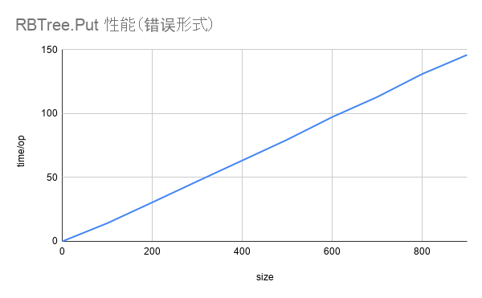
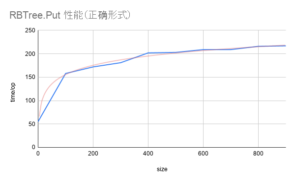

# 9.5 基准测试

> 本节内容提供一个线上演讲：[Google Slides 讲稿](https://changkun.de/s/gobench/)

TODO: 内容需要丰富描述

在《Software Testing: Printciples and Practices》一书中归纳的性能测试方法论：

- 搜集需求
- 编写测试用例
- 自动化性能测试用例
- 执行性能测试用例
- 分析性能测试结果
- 性能调优
- 性能基准测试（Performance Benchmarking）
- 向客户推荐合适的配置

## 11.5.1 可靠的测试环境

影响测试环境的软硬件因素

- 硬件：CPU 型号、温度、IO 等
- 软件：操作系统版本、当前系统调度的负载等

指导思想

- 单次测量结果毫无意义，统计意义下可对比的结果是关键
  + 分析测试的场景、多次测量、决定统计检验的类型

- 可对比的结果是在可控的环境下得到的
  + 笔记本电脑 CPU 的执行效率受电源管理等因素影响，连续测试同一段代码可能先得到短暂的性能提升，而后由于温度的上升导致性能下降
  + 虚拟机或（共享）云服务器上可能受到宿主机资源分配等因素导致测量结果不稳定

性能基准测试的两个基本目标：

- 可重复性：在其他外在条件不变的情况下，性能度量结果是稳定、可重复的（能复现的才叫 Bug）
- 可比较性：总是存在一个可以比较的基本线（有比较才有伤害）

## 11.5.2 benchstat 及其原理

benchstat 的功能非常简单，作用只是对性能测试结果进行统计分析，对测量结果进行假设检验，从而消除结果的观测误差（observational error）。

```bash
$ go get golang.org/x/perf/cmd/benchstat
$ benchstat --help
usage: benchstat [options] old.txt [new.txt] [more.txt ...]
options:
  -alpha α 
        设置显著性水平 α 的值（默认 0.05）
  -delta-test test
        设置显著性检验的类型，支持 utest/ttest/none（默认 utest）
  -geomean
        输出几何平均值
  -sort order
        对结果进行排序: [-]delta, [-]name, none (默认值 none)
```

当对一个性能基准测试 B 结果反复执行 n 次后，就能得到 b1, …, bn 个不同的结果；
在优化代码后，还能得到另外 m 个不同的结果 b1', …, bm'。

一个稳定的基准测试，结果倾向于在某个值附近波动，于是通过通用的计算 1.5 倍四分位距法则（1.5 x InterQuartile Range Rule）的方法来消除异常值。

benchstat 的本质就是在消除异常值之后的两组浮点数之间进行假设检验（Hypothesis Testing）。

```go
type Metrics struct {
   Unit    string    // 性能测试的名称
   Values  []float64 // 某个性能测试的度量值
   RValues []float64 // 移除的异常值
   Min     float64   // RValues 的最小值
   Mean    float64   // RValues 的平均值
   Max     float64   // RValues 的最大值
}
func (m *Metrics) computeStats() {
   values := stats.Sample{Xs: m.Values}
   q1, q3 := values.Percentile(0.25), values.Percentile(0.75)
   lo, hi := q1-1.5*(q3-q1), q3+1.5*(q3-q1) // 计算结果的四分位距，并移除异常值
   for _, value := range m.Values {
       if lo <= value && value <= hi { m.RValues = append(m.RValues, value) }
   }
   // 求统计量
   m.Min, m.Max = stats.Bounds(m.RValues)
   m.Mean = stats.Mean(m.RValues)
}

... // 在 benchstat.Collection.Tables() 中
pval, _ := deltaTest(old, new) // 进行假设检验
```

注意：

1. Q2 中位数，Q1 是最小值与 Q2 之间的中位数，Q3 是最大值和 Q2 之间的中位数
2. 异常值不是一个数学概念，因此四分位距法则只是一个「法则」，不是一个数学定理
3. 如果数据本身就是正态分布，那么等价于 μ ± 2.68 σ（因为 Q1 = μ + 0.67σ，Q3 = μ - 0.67σ，IQR = 1.34σ ⇒ Q3+1.5IQR = μ + 2.68 σ）

我们之后再来讨论假设检验。

## 11.5.3 性能基准测试示例

### 例 1：对 `sync.Map.Delete` 的一个优化

在 sync.Map 中存储一个值，然后再并发的删除该值：

```go
func BenchmarkDeleteCollision(b *testing.B) {
    benchMap(b, bench{
        setup: func(_ *testing.B, m mapInterface) { m.LoadOrStore(0, 0) },
        perG: func(b *testing.B, pb *testing.PB, i int, m mapInterface) {
            for ; pb.Next(); i++ { m.Delete(0) }
        },
    })
}
```

在 sync.Map 中：

```diff
275 -delete(m.dirty, key)
275 +e, ok = m.dirty[key]
276 +m.missLocked()
```

能够得到结果：

```bash
$ git stash
$ go test -run=none -bench=BenchmarkDeleteCollision -count=20 | tee old.txt
$ git stash pop
$ go test -run=none -bench=BenchmarkDeleteCollision -count=20 | tee new.txt
$ benchstat old.txt new.txt
name                                      old time/op  new time/op  delta
DeleteCollision/*sync_test.DeepCopyMap-8   104ns ± 0%   103ns ± 1%     ~     (p=0.383 n=20+20)
DeleteCollision/*sync_test.RWMutexMap-8   67.6ns ± 2%  68.2ns ± 2%   +0.89%  (p=0.009 n=20+20)
DeleteCollision/*sync.Map-8               94.2ns ± 2%   5.7ns ± 2%  -93.98%  (p=0.000 n=20+19)
```

- 可以观察到一个值被作为异常值消除了
- git stash 并不总是适用，它具有一定的局限性。

### 例 2：测试代码错误

创建一颗红黑树，并依次将 0 … n 插入到这颗红黑树中：

```go
func BenchmarkRBTree_PutWrong(b *testing.B) {
    for size := 0; size < 1000; size += 100 {
        b.Run(fmt.Sprintf("size-%d", size), func(b *testing.B) {
            tree := ds.NewRBTree(func(a, b interface{}) bool {
                if a.(int) < b.(int) { return true }
                return false
            })
            for i := 0; i < b.N; i++ {
                for n := 0; n < size; n++ { tree.Put(n, n) }
            }
        })
    }
}
```

```bash
name                    time/op
RBTree_PutWrong/size-0-8    0.65ns ± 0%
RBTree_PutWrong/size-100-8  14.2µs ± 3%
RBTree_PutWrong/size-200-8  30.5µs ± 0%
RBTree_PutWrong/size-300-8  47.0µs ± 0%
RBTree_PutWrong/size-400-8  63.3µs ± 0%
RBTree_PutWrong/size-500-8  79.6µs ± 0%
RBTree_PutWrong/size-600-8  97.3µs ± 0%
RBTree_PutWrong/size-700-8   113µs ± 0%
RBTree_PutWrong/size-800-8   131µs ± 0%
RBTree_PutWrong/size-900-8   146µs ± 0%
```

<div class="img-center" style="margin: 0 auto; max-width: 60%">

<strong>图 1: 红黑树插入性能（错误形式）</strong>
</div>

为什么插入的性能是线性的？红黑树的插入性能不是 O(log(n)) 吗？
代码写错了……吧……？

红黑树的插入性能是指当树的大小为 n-1 插入第 n 个值时的性能：

```go
func BenchmarkRBTree_Put(b *testing.B) {
   for size := 0; size < 1000; size += 100 {
       b.Run(fmt.Sprintf("size-%d", size), func(b *testing.B) {
           tree := ds.NewRBTree(func(a, b interface{}) bool {
               if a.(int) < b.(int) { return true }
               return false
           })
+          for n := 0; n < size-1; n++ { tree.Put(n, n) }
+          b.ResetTimer()
           for i := 0; i < b.N; i++ {
               for n := 0; n < size; n++ { tree.Put(n, n) }
           }
       })
   }
}
```

```
name                    time/op
RBTree_Put/size-0-8    55.2ns ± 0%
RBTree_Put/size-100-8   158ns ± 0%
RBTree_Put/size-200-8   172ns ± 0%
RBTree_Put/size-300-8   181ns ± 0%
RBTree_Put/size-400-8   202ns ± 0%
RBTree_Put/size-500-8   203ns ± 0%
RBTree_Put/size-600-8   209ns ± 0%
RBTree_Put/size-700-8   209ns ± 0%
RBTree_Put/size-800-8   216ns ± 0%
RBTree_Put/size-900-8   217ns ± 0%
```

<div class="img-center" style="margin: 0 auto; max-width: 60%">

<strong>图 2: 红黑树插入性能（正确形式）</strong>
</div>

### 例 3：编译器优化

编译器优化产生的直接影响是测量的目标不准确，这一点在 C++ 编译器中相当严重。编译器优化是一个比较大的话题，我们不在此进行深入讨论，后续章节会进一步讨论此主题。只举比较常见的一例：

TODO:

## 11.5.4 假设检验的原理

### 统计学的基本概念

- 总体：所有满足某些共同性质的值的集合（共同性质：接口）
- 样本：从总体中随机抽取的个体
- 频率：n 次试验中，某个事件发生的次数除以总的试验次数
- 大数定理：当试验次数 n → ∞ 时，频率一定收敛到某个值
- 概率：频率收敛到的值，性质之一：$0 \leq P(A) \leq 1$
- 独立：两个事件互不影响，性质之一：$P(AB) = P(A)P(B)$
- 随机变量：是一个函数，参数是所有可能的样本，返回值是这些样本的取值，例如 $P(X=2)=0.25$
- 期望：随机变量以其概率为权重的加权平均值，即 $E(X) = \sum_{i}{x_i p_i}$
- 方差：样本取值与期望之间的「距离」，距离定义为差的平方和，即 $Var(X) = \sum_{i}{(x_i - E(X))^2}$
- 概率密度函数：是一个函数，参数是随机变量取值，返回值是随机变量取得该值的概率
- 累积分布函数：随机变量取值小于某个值的概率
- 正态分布：一种特殊的概率密度函数 $N(\mu, \sigma^2)$
- 中心极限定理：无穷多个独立的随机变量的和服从正态分布

考虑读者水平可能参差不齐，所以最基础的开始回顾。
这里的定义并不是概率论中的公理化定义。所以本书重述了概念本身，目的只是为了方便理解，严谨性有较大欠缺。

比如，概率是通过非负性、规范性、可列可加性定义的一个样本空间上的可测函数，需要解释严格的样本空间的定义、可测函数是什么，进而又牵扯出为什么需要可测，不可测又有什么问题等一些很严肃的、实变函数等数学专业课才会讨论的数学概念，进而严重偏离了主题本身，所以选择了使用大数定理所阐明的概率是频率的渐进值来定义概率；

再比如，随机变量概念本身其实很好理解，但严格的数学定义是概率空间到实数集的一个可测函数，为了保留随机变量的本质是一个函数，所以选择了从样本到取值的解释方式，等等其他概念也存在不同程度上的重述 … 但总体上，符合概念理解循序渐进的原则。

最后，中心极限定理存在多种形式，最为通用的（广义上的，没有同分布假设的版本）是 Lindeberg-Feller 的版本，也叫 Lindeberg-Feller 中心极限定理，中心极限定理成立的充要条件是 Lindeberg 条件。

### 假设检验的基本框架

统计是一套在总体分布函数完全未知或者只知道形式、不知参数的情况下，为了由样本推断总体的某些未知特性，形成的一套方法论。

多次抽样：对同一个性能基准测试运行多次，根据中心极限定理，如果理论均值存在，则抽样噪声服从正态分布的。

当重复执行完某个性能基准测试后， benchstat 先帮我们剔除掉了一些异常值，我们得到了关于某段代码在可控的环境条件 E 下的性能分布的一组样本。

现在的问题是：

- 非参数方法：剩下样本是否来自同一总体？总体是什么分布？两组样本在可控的测试环境下进行吗？
- 参数方法：如果总体分布已经确定，那么样本的变化是否显著？性能的基准测试前后，是否具有统计意义下的明显变化？

假设检验：利用样本判断对总体的假设是否成立的过程

零假设 H0：想要驳回的论点

备择假设 H1：拒绝零假设后的备用项，我们想要证明的论点

p 值：零假设发生的概率

显著性水平：可靠程度

例如：在性能基准测试中，

- H0：代码修改前后，性能没有提升
- H1：代码修改前后，性能有显著提升
- p < 0.05：H0 发生的概率小于 5%，在至少 95% 的把握下，性能有显著提升

| 真实情况 | 接受零假设 | 拒绝零假设 |
|:-------:|:--------:|:---------:|
|零假设为真|正确|犯第一类错误|
|零假设为假|犯第二类错误|正确|

第一类错误：把对的判断成错的；第二类错误：把错的判断成对的

当样本不变时，减少犯某类错误的概率择会增加犯另一类错误的概率。控制第一类错误的概率，让它小于某个 p 值（0.05）称之为显著性检验

- 零假设 H0: 代码性能测试的均值没有显著变化 $\mu_0 - \mu_1 = 0$
- 备择假设 H1: 代码性能有显著变化 $\mu_0 - \mu_1 \neq 0$
  + 对性能提升持有保守态度，尽可能避免出现实际没有提升，但被判断为提升（第一类错误）
  + 在我们的场景下，应该拒绝零假设

### Welch T 检验和 Mann-Whitney U 检验

在 benchstat 的性能测试中提供了 Welch T 检验和 Man-Whitney U 检验，他们对数据的假设不同。

两个总体均值差的检验：$H_0: \mu_1 - \mu_2 = 0, H_1: \mu_1 - \mu_2 \neq 0$

**T 检验**

参数检验，假设数据服从正态分布，且方差相同

**Welch T 检验**

参数检验，假设服从正态分布，方差一定不相同

**Mann-Whitney U 检验**

非参数检验，假设最少，最通用，只假设两组样本来自同一总体，只有均值上的差异（保守派）

当对数据的假设减少时，结论的不确定性就会增大，因此 p 值会相应的变大，进而使性能基准测试的条件更加严格。

## 11.5.5 性能基准测试的局限性

### 系统噪音

`perflock` 作用是限制 CPU 时钟频率，从而一定程度上消除系统对性能测试程序的影响，减少结果的噪声，进而性能测量的结果方差更小也更加可靠，仅支持 Linux。

```bash
$ go get github.com/aclements/perflock/cmd/perflock
$ sudo install $GOPATH/bin/perflock /usr/bin/perflock
$ sudo -b perflock -daemon
$ perflock
Usage of perflock:
  perflock [flags] command...
  perflock -list
  perflock -daemon
  -daemon
        启动 perflock 守护进程
  -governor percent
        设置运行指令所占用的 CPU 频率比例，或 none 没有调整（默认 90%）
  -list
        列出当前正在等待执行的命令
  -shared
        在共享模式下获取锁 (默认独占模式)

$ perflock -governor 70% go test -test=none -bench=. 
```

perflock 的原理在于，在执行命令前，通知 perflock 守护进程，守护进程将 cpufreq 进行备份，调整到 perflock-client 指定的频率，再通知 perflock-client 开始执行 Benchmark：

<div class="img-center" style="margin: 20px auto; max-width: 40%">

<strong>图 3: perflock 的原理 <span style="padding-right:80px"></strong>
</div>

进行如下修改：

```
/sys/devices/system/cpu/cpu0/cpufreq/scaling_max_freq
==
/sys/devices/system/cpu/cpu0/cpufreq/scaling_min_freq
==
target := (max-min)*percent/100 + min
```

一些需要注意的问题：

1. 不能在 Parallels 上使用（虚拟机都不行？未在其他虚拟机测试），原因在于无法获取 /sys/devices/system/cpu/cpu\d+$/cpufreq
2. 粗略看代码当不能获取 cpu domains 时，客户端会崩溃，但是实际上并不会
3. 不要在执行性能测试时强制 kill perflock daemon，否则 cpufreq 参数将不会恢复
4. 只锁定了系统的 CPU 频率，并没有限制与系统中其他资源的占用情况，该被打断的依然会被打断

还有一些其他的方法：

- 禁用地址空间随机化： `echo 0 > /proc/sys/kernel/randomize_va_space`
- 禁用 Intel Turbo 模式：`echo 1 > /sys/devices/system/cpu/intel_pstate/no_turbo`
- 禁用 CPU SMT pair：`echo 0 > /sys/devices/system/cpu/cpu*/online  ⇐ 在 /sys/devices/system/cpu/cpu*/topology/thread_siblings_list`
- 使用 `cpuset：cset shield -c N1,N2 -k on` → 将所有线程移出 N1, N2，-k on 表示内核线程也会被移除
- 报告 perf：`cset shield --exec -- perf stat -r 10 <cmd>` → `--` 之后的命令将在隔离的 CPU 上运行。`perf` 将运行 `cmd` 10 次

### 多重比较谬误

广泛比较两个不同群体的所有差异，从中找出具有差异的特征，宣称是造成两个群体不同的原因。

在不对代码进行优化的情况下，反复对不同的性能测试结果样本进行显著性检验，直到找到能够使 p 值能够满足显著性水平，宣称性能得到了提升。

<div class="img-center" style="margin: 0 60px 0 30px; float: right; max-width: 30%">

<strong>图 4: 多重比较谬误，图片来源：https://xkcd.com/882/</strong>
</div>

### 机器过热

对结果进行回归，肉眼可见的性能下降：

```c
#if _FP_W_TYPE_SIZE < 32
#error "Here's a nickel kid. Go buy yourself a real computer."
#endif
```

买台好电脑吧。

<div class="img-center" style="margin: 0 30px 0 30px; float: left; max-width: 50%">

<strong>图 5: 性能基准测试随时间推移而导致变差（越小越好）</strong>
</div>


## 11.5.6 总结

进行（严肃的）性能测试前的检查清单：

- 限制系统资源，降低测试噪声：perflock
  + 限制 CPU 时钟频率：perflock
  + （如果需要）限制 runtime 消耗的内存上限: runtime.SetMaxHeap
  + 关闭无关程序和进程等等……
- 确定测试代码的正确性
  + 考虑 Goroutine 的终止性，当某些并发的工作发生在基准测试结束后，那么测量是不准确的
  + 考虑编译器进行了过度优化或基准测试代码本身编写错误导致测量程序不正确
- 实施性能基准测试
  + （如果需要）计算需要采样的次数
  + 使用 git stash 记录并撤销代码的修改，执行测试得到修改前的性能测试结果
  + 使用 git stash pop 恢复代码的修改内容，执行测试得到修改后的性能测试结果
  + 使用 benchstat 对前后测量到的性能测量进行假设检验
  + 验证结果有效性，例如确认结果的波动，比较随时间推移造成的性能回归等等

## 进一步阅读的参考文献

- https://dave.cheney.net/high-performance-go-workshop/dotgo-paris.html
  + 这是一篇很早之前的关于Go程序性能测试的文章，里面讲述了相当多有关性能调优、测试的主题，不仅局限于这次分享的主题
- https://github.com/golang/go/issues/27400
  + 这是一个未解决的 Issue，目的是希望 Go 团队能够在 testing 包中使用文档来说明编译器优化的情况，进而避免基准测试测量不准确的问题
- https://github.com/golang/go/issues/23471
  + 这是一个未解决的 Issue，目的是希望 Go 团队能够发布一篇官方文档来详述如何科学的对 Go 程序进行性能测试
当然，本次分享的 PPT 其实解决了这个问题 :)
- A Review and Comparison of Methods for Detecting Outliers in Univariate Data Sets, http://d-scholarship.pitt.edu/7948/1/Seo.pdf
  + 这篇论文比较了统计学中的一些异常值检测的方法
- Mann, Henry B., and Donald R. Whitney. "On a test of whether one of two random variables is stochastically larger than the other." The annals of mathematical statistics (1947): 50-60.
  + 这是 Mann-Whitney U 检验的原始论文
- Mytkowicz, Todd, et al. "Producing wrong data without doing anything obviously wrong!." ACM Sigplan Notices 44.3 (2009): 265-276.
  + 这篇文章介绍了适用因果分析和随机化的方法来检测并避免测量误差

## 许可

&copy; 2018-2020 The [golang.design](https://golang.design) Initiative Authors. Licensed under [CC-BY-NC-ND 4.0](https://creativecommons.org/licenses/by-nc-nd/4.0/).
