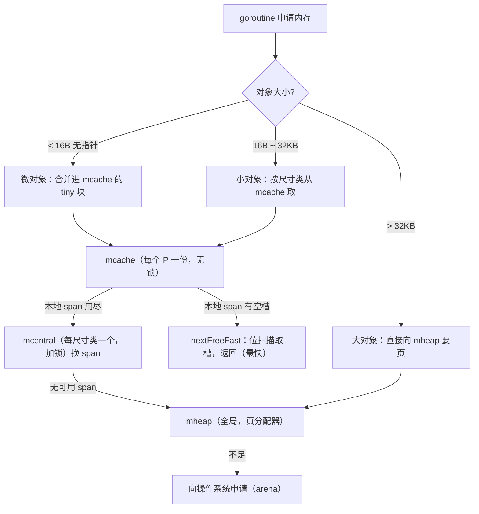

# 12.2 组件

[12.1](./basic.md) 说分配器是「快路径无锁、慢路径加锁」的分层结构。这一节给这套结构里的几个
核心组件命名、定位，并落到它们在 go1.26 中的实际形态：每个组件承载什么状态、为何如此设计、
以及它们如何串成一条补货链。读懂了这几样东西，后面的分配路径（[12.4](./largealloc.md)–
[12.6](./tinyalloc.md)）就只是「在这张图上走一遍」。

为避免落回逐字段翻译源码的窠臼，下文给出的结构体都是**裁剪后的速写**：只保留与设计相关的
字段，并在注释里说明它为何存在。完整定义可对照 `runtime/mheap.go`、`mcache.go`、`mcentral.go`。

## 12.2.1 自由表：一切的底层手法

在认识各组件之前，先认识它们共用的一个底层手法，**自由表**（free list）。运行时里大量"固定
大小对象"（mcache、mspan、各类元数据）都由一个叫 `fixalloc` 的固定大小分配器管理，它的思想
极简：把一批未分配的内存块用指针串成一条链，**每块内存的头部恰好用作指向下一块的指针**。
分配就是摘下链头，回收就是把块插回链头，都是 $O(1)$ 的指针操作：

```go
// fixalloc：固定大小对象的自由表分配器（速写）
type fixalloc struct {
    size  uintptr        // 每个对象的固定大小
    list  *mlink         // 自由表：空闲块串成的链
    chunk uintptr        // 当前向操作系统批发来的大块的游标
    nchunk uint32        // 大块中剩余的字节
}

func (f *fixalloc) alloc() unsafe.Pointer {
    if f.list != nil {        // 自由表里有可复用的块
        v := unsafe.Pointer(f.list)
        f.list = f.list.next  // 摘下链头
        return v
    }
    // 自由表空了：从批发来的 chunk 里切一块；chunk 也用尽就向操作系统再批发
    if f.nchunk < f.size {
        f.chunk = uintptr(persistentalloc(_FixAllocChunk, 0, f.stat))
        f.nchunk = _FixAllocChunk
    }
    v := unsafe.Pointer(f.chunk)
    f.chunk += f.size
    f.nchunk -= uint32(f.size)
    return v
}
```

"用空闲块自身的头部存下一块的指针"是自由表的精髓,它不需要额外的元数据数组来记录空闲位置，
空间开销为零。这个手法会在下文反复出现：mspan 内部用它串空闲对象槽，mcache 用它缓存 stack，
理解了它，分配器的许多角落就都通了。

## 12.2.2 mspan：分配的基本单位

**mspan** 是分配器的基本单位,一段连续的内存页，被切成同一尺寸类（[12.1](./basic.md)）的若干
等大槽位。它既是 mcache、mcentral 之间流转的「货物」，也是垃圾回收（[13](../ch13gc)）扫描与
清扫的单位。裁剪后的速写：

```go
// mspan：一段连续页，切成同尺寸类的等大槽位（速写）
type mspan struct {
    next, prev *mspan   // 串进 mSpanList / mcentral 的双向链表

    startAddr uintptr   // span 首字节地址
    npages    uintptr   // 占用的页数

    freeindex  uint16   // 从此处开始扫描下一个空闲槽
    nelems     uint16   // 本 span 的槽位总数
    allocCache uint64   // freeindex 处起的空闲位图缓存（取反），加速找空槽
    allocBits  *gcBits  // 哪些槽已分配
    gcmarkBits *gcBits  // GC 标记位：哪些槽存活（清扫时与 allocBits 互换，见 13.5）

    allocCount uint16    // 已分配槽数
    spanclass  spanClass // 尺寸类 + 是否含指针（noscan）
    elemsize   uintptr   // 每个槽的大小（由 spanclass 推出）
    state      mSpanStateBox // mSpanInUse / mSpanManual / mSpanFree
}
```

几个字段值得点出。`freeindex` 加 `allocCache` 是「在 span 内快速找下一个空槽」的关键：
`allocCache` 把 `freeindex` 附近的空闲位图缓存成一个 `uint64`，找空槽退化成一次
**位扫描**（找最低的 1 位），无需遍历。`allocBits` 与 `gcmarkBits` 这对位图，是分配器与 GC
**共生**（[12.1](./basic.md)）的接口,分配看前者，清扫时 GC 用后者覆盖前者，死对象的槽便
「免清扫」地重新变为可分配（[13.5](../ch13gc/sweep.md)）。可见 mspan 不只是「一段内存」，
它把分配状态与回收状态编码在了同一段元数据里。

## 12.2.3 mcache：每 P 的无锁快路径

**mcache** 是**每个 P 一份**的本地缓存（[9.3](../../part3concurrency/ch09sched/mpg.md)），分配器
高性能的根基。因为每个 P 同一时刻只被一个 M 持有，访问 mcache **无需加锁**,这正是绝大多数
分配走完即止的快路径。

```go
// mcache：每个 P 一份的本地缓存（速写）
type mcache struct {
    // 微对象分配器（< 16B 无指针，见 12.6）：把多个微对象拼进一个块
    tiny       uintptr // 当前 tiny 块起址
    tinyoffset uintptr // 块内已用偏移

    // 每个尺寸类各持有一个用于分配的 span；按 spanClass 索引
    alloc [numSpanClasses]*mspan

    stackcache [_NumStackOrders]stackfreelist // 顺带缓存 goroutine 栈（见 14.6）
}
```

`alloc` 数组是核心：每个尺寸类（区分含指针 / 不含指针两种 spanClass）各缓存一个 mspan，
分配小对象就是「按尺寸类取出对应 mspan，从中摘一个空槽」。`tiny`/`tinyoffset` 服务于微对象
合并（[12.6](./tinyalloc.md)），`stackcache` 则让栈分配（[14.6](../ch14stack)）复用同一套
每 P 缓存的思路。mcache 自身从非 GC 内存（经 `fixalloc`）分配，常驻运行时,P 在
`procresize` 中创建时拿到自己的 mcache，销毁时归还，因此 mcache 的生命周期与 P 绑定，
M 持有 P 时一并持有它。

## 12.2.4 mcentral：按尺寸类共享的中心仓库

当某个 P 的 mcache 里某尺寸类的 span 用尽，就要向 **mcentral** 换一个有空槽的 span。mcentral
**每个尺寸类一个**，被所有 P 共享，故访问需**加锁**。它的结构在 Go 1.9 后是这样：

```go
// mcentral：某一个尺寸类的中心仓库，全局共享（速写）
type mcentral struct {
    spanclass spanClass   // 本仓库服务的尺寸类
    partial   [2]spanSet  // 尚有空槽的 span 集合
    full      [2]spanSet  // 已无空槽的 span 集合
}
```

为何 `partial` 与 `full` 各是**两个**集合（`[2]spanSet`）？这是与清扫（[13.5](../ch13gc/sweep.md)）
协同的巧思：两个集合分别对应「本轮 GC 已清扫」与「尚待清扫」，用 `sweepgen`（清扫代）区分。
取 span 时优先从「已清扫且有空槽」的集合拿；拿到未清扫的就顺手清扫再用。这套「按清扫代分桶」
取代了早期单一链表加锁的设计，缓解了清扫与分配之间的锁争用,又一处「为并发而重构数据结构」
的例子（对照 [11.7](../../part3concurrency/ch11sync/map.md) 的演进）。`spanSet` 本身是一个
为并发优化的、分块的无锁集合，进一步降低了多 P 同时存取 mcentral 的开销。

## 12.2.5 mheap 与 arena：全局堆

补货链的尽头是 **mheap**,**全局唯一**的堆，管理所有页。mcentral 缺 span 时向它要；大对象
（[12.4](./largealloc.md)）直接向它按页申请。裁剪后只看几样：

```go
// mheap：全局堆（速写）
type mheap struct {
    lock  mutex
    pages pageAlloc  // 页分配器：管理「哪些页空闲」（见 12.7）

    // 地址空间按 arena（64 位上每块 64MB）组织，arenas 是其二级索引
    arenas [1 << arenaL1Bits]*[1 << arenaL2Bits]*heapArena

    // 每个尺寸类一个 mcentral，集中放在这里
    central [numSpanClasses]struct {
        mcentral mcentral
        _        [...]byte // 填充到缓存行，避免 false sharing
    }
}
```

mheap 之下有两层基础设施。**页分配器** `pages`（[12.7](./pagealloc.md)）回答「哪段连续页空闲」；
**arena** 则是地址空间的组织单位（[12.3](./init.md)）,堆按 64MB 的 arena 为粒度向操作系统
索取，每个 arena 配一份元数据（指针位图、span 索引），使运行时能从任意堆地址反查「它属于
哪个 span、是不是指针、是否存活」。注意 `central` 数组上的缓存行填充：把不同尺寸类的 mcentral
对齐到不同缓存行，避免多核同时操作不同尺寸类时的**伪共享**（false sharing）,这种对缓存行的
斤斤计较，是高并发运行时代码的常见笔法。

## 12.2.6 一次分配如何穿过这层级

把四者串起来，一次小对象分配（[12.5](./smallalloc.md)）的路径，正是 [12.1](./basic.md) 那条
补货链的演出：



最快的那一步 `nextFreeFast`，就是在当前 mspan 的 `allocCache` 上做一次位扫描：

```go
// 在 span 内找下一个空闲槽：一次位运算，无锁（速写）
func nextFreeFast(s *mspan) gclinkptr {
    bit := sys.TrailingZeros64(s.allocCache) // 找最低的空闲位
    if bit < 64 {
        result := s.freeindex + uint16(bit)
        if result < s.nelems {
            s.allocCache >>= uint(bit + 1) // 推进缓存
            s.freeindex = result + 1
            s.allocCount++
            return gclinkptr(uintptr(result)*s.elemsize + s.base())
        }
    }
    return 0 // 本 span 已无空槽，需走慢路径补货
}
```

只有这一步返回 0（本地 span 用尽），才落入加锁的慢路径：向对应 mcentral `cacheSpan` 换一个
有空槽的 span（顺带清扫），mcentral 也没有就向 mheap 要新页切出 span，mheap 不足再向操作系统
批发一个 arena。**越往下，同步代价越大、命中频率越低**,这正是分层缓存的全部意义：把最热的
路径做成几条无锁位运算，把昂贵的加锁与系统调用挡在越来越冷的后方。

## 12.2.7 设计取舍、演进与谱系

这套结构把 [12.1](./basic.md) 的设计原则落成了具体零件，每个零件都对应一处取舍：

- **每 P 无锁缓存（mcache）** 消除快路径争用,代价是每个 P 各占一份缓存内存，且对象在 P 之间
  不能直接复用（要经 mcentral 中转）。这与调度器的本地运行队列
  （[9.2](../../part3concurrency/ch09sched/steal.md)）、`sync.Pool` 的每 P 分片
  （[11.6](../../part3concurrency/ch11sync/pool.md)）是同一种「分层减争」的招式,在 Go 运行时里
  你会反复遇见它。
- **按尺寸类组织（mspan）** 让分配退化成「取一个等大槽位」的位运算,代价是尺寸不整带来的
  内部碎片（最坏约 12.5%）。
- **mcentral 按清扫代分桶（[2]spanSet）** 是为降低分配与清扫的锁争用而做的演进,Go 1.9 前
  mcentral 是单链表加一把锁，高并发下成为瓶颈，重构为 spanSet 后显著缓解。

放进谱系看，这套层级直接继承自 Google 的 **tcmalloc**（[12.1](./basic.md)）：thread cache（对应
mcache）、central free list（对应 mcentral）、page heap（对应 mheap）。jemalloc 的 arena +
tcache 也是同构的思路。Go 在其上长出的、tcmalloc 没有的东西，是为**精确垃圾回收**服务的那层
元数据,mspan 的 `gcmarkBits`、arena 的指针位图。换言之，Go 的分配器是「tcmalloc 的骨架 +
为 GC 共生而生的血肉」,这条主线会在 [13 垃圾回收](../ch13gc) 与它合流。

## 延伸阅读的文献

1. Sanjay Ghemawat, Paul Menage. *TCMalloc: Thread-Caching Malloc.*
   https://google.github.io/tcmalloc/design.html （mcache/mcentral/mheap 的思想原型）
2. Jason Evans. *A Scalable Concurrent malloc(3) Implementation for FreeBSD (jemalloc).* 2006.
   （arena + tcache 的同构设计）
3. The Go Authors. *runtime/mcache.go、mcentral.go、mheap.go、mfixalloc.go.*
   https://github.com/golang/go/tree/master/src/runtime
4. Go 1.9 mcentral 重构（spanSet）相关讨论与提交.
   https://go-review.googlesource.com/c/go/+/38150
5. 本书 [12.1 设计原则](./basic.md)、[12.5 小对象分配](./smallalloc.md)、
   [13.5 清扫与位图](../ch13gc/sweep.md).
